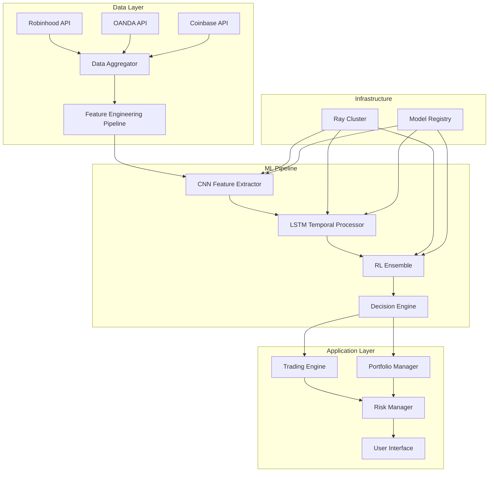

# AI Trading Platform Design Document

## Overview

The AI Trading Platform is a sophisticated machine learning system that combines Convolutional Neural Networks (CNNs) with Long Short-Term Memory (LSTM) networks for feature extraction and target prediction, feeding into an ensemble of Reinforcement Learning (RL) agents for trading decisions. The platform supports both single-stock analysis and portfolio management across multiple asset classes (stocks, forex, crypto) through integrated exchange APIs.

## Architecture

### High-Level System Architecture



### Core Components

1. **Data Ingestion & Processing Layer**
   - Multi-exchange data aggregation
   - Real-time and historical data handling
   - Feature engineering pipeline

2. **ML Model Layer**
   - CNN+LSTM hybrid architecture
   - RL ensemble with multiple agents
   - Model training and hyperparameter optimization

3. **Decision & Execution Layer**
   - Trading signal generation
   - Portfolio optimization
   - Risk management

4. **Infrastructure Layer**
   - Distributed computing with Ray
   - Model serving and versioning
   - Cloud deployment and scaling

## Components and Interfaces

### 1. Data Ingestion System

**Architecture Pattern**: Event-driven microservices with message queues

**Key Components**:

- `ExchangeConnector`: Abstract base class for exchange integrations
- `RobinhoodConnector`: Stocks, ETFs, indices, options
- `OANDAConnector`: Forex pairs and CFDs
- `CoinbaseConnector`: Cryptocurrencies and perpetual futures
- `DataAggregator`: Unified data normalization and timestamping
- `DataQualityValidator`: Advanced anomaly detection with statistical methods
- `TimestampSynchronizer`: Cross-exchange timestamp alignment
- `DataQualityReport`: Comprehensive quality metrics and confidence scoring

**Interface Design**:

```python
class ExchangeConnector(ABC):
    @abstractmethod
    async def get_historical_data(self, symbol: str, timeframe: str, start: datetime, end: datetime) -> pd.DataFrame
    
    @abstractmethod
    async def get_real_time_data(self, symbols: List[str]) -> AsyncGenerator[MarketData, None]
    
    @abstractmethod
    async def place_order(self, order: Order) -> OrderResult
```

### 2. Feature Engineering Pipeline

**Architecture Pattern**: Pipeline pattern with pluggable transformers

**Technical Indicators**:

- Price-based: SMA, EMA, Bollinger Bands, RSI, MACD
- Volume-based: OBV, VWAP, Volume Rate of Change
- Volatility: ATR, Volatility Ratio, Garman-Klass estimator
- Market microstructure: Bid-ask spread, Order flow imbalance

**Advanced Features**:

- Wavelet transforms for multi-resolution analysis
- Fourier transforms for frequency domain features
- Fractal dimension and Hurst exponent
- Cross-asset correlation features
- Sentiment indicators from news/social media

**Implementation**:

```python
class FeatureEngineer:
    def __init__(self):
        self.transformers = [
            TechnicalIndicators(),
            WaveletTransform(),
            FourierFeatures(),
            FractalFeatures(),
            CrossAssetFeatures()
        ]
    
    def transform(self, data: pd.DataFrame) -> np.ndarray:
        features = []
        for transformer in self.transformers:
            features.append(transformer.fit_transform(data))
        return np.concatenate(features, axis=1)
```

### 3. CNN+LSTM Hybrid Model

**CNN Architecture** (Spatial Feature Extraction):

- 1D Convolutional layers for pattern recognition in price/volume data
- Multiple filter sizes (3, 5, 7, 11) to capture different time scales
- Residual connections for deep networks
- Multi-head attention mechanisms for important feature selection

**LSTM Architecture** (Temporal Dependencies):

- Bidirectional LSTM for forward/backward temporal context
- Multiple LSTM layers with dropout for regularization
- Attention-based sequence modeling
- Skip connections between layers

**Feature Fusion Module**:

- Cross-attention between CNN and LSTM features
- Learnable projection layers for dimension alignment
- Layer normalization and residual connections
- Configurable fusion dimension for optimal performance

**Multi-Task Learning**:

- Simultaneous classification (Buy/Hold/Sell) and regression (price prediction)
- Weighted loss functions for balanced optimization
- Uncertainty quantification using Monte Carlo dropout
- Ensemble capabilities with learnable weights

**Hybrid Integration**:

```python
class CNNLSTMModel(nn.Module):
    def __init__(self, input_dim, cnn_filters, lstm_hidden, num_classes):
        super().__init__()
        
        # CNN Feature Extractor
        self.conv_layers = nn.ModuleList([
            nn.Conv1d(input_dim, cnn_filters, kernel_size=k, padding=k//2)
            for k in [3, 5, 7, 11]
        ])
        self.attention_cnn = MultiHeadAttention(cnn_filters * 4, 8)
        
        # LSTM Temporal Processor
        self.lstm = nn.LSTM(cnn_filters * 4, lstm_hidden, 
                           num_layers=3, bidirectional=True, 
                           dropout=0.3, batch_first=True)
        self.attention_lstm = MultiHeadAttention(lstm_hidden * 2, 8)
        
        # Output layers
        self.classifier = nn.Linear(lstm_hidden * 2, num_classes)
        self.regressor = nn.Linear(lstm_hidden * 2, 1)  # Price prediction
    
    def forward(self, x):
        # CNN feature extraction
        conv_outputs = []
        for conv in self.conv_layers:
            conv_outputs.append(F.relu(conv(x)))
        
        cnn_features = torch.cat(conv_outputs, dim=1)
        cnn_features, _ = self.attention_cnn(cnn_features, cnn_features, cnn_features)
        
        # LSTM temporal processing
        lstm_out, _ = self.lstm(cnn_features.transpose(1, 2))
        lstm_features, _ = self.attention_lstm(lstm_out, lstm_out, lstm_out)
        
        # Predictions
        classification = self.classifier(lstm_features[:, -1, :])  # Last timestep
        regression = self.regressor(lstm_features[:, -1, :])
        
        return classification, regression
```

### 4. CNN+LSTM Integration with RL Environment

**Enhanced State Representation**:
The trading environment leverages the pre-trained CNN+LSTM hybrid model as a sophisticated feature extractor, providing RL agents with rich, learned representations instead of basic technical indicators.

**Improved Architecture with Separation of Concerns**:

```python
# Abstract base for feature extraction
class FeatureExtractor(ABC):
    @abstractmethod
    def extract_features(self, data: np.ndarray) -> Dict[str, np.ndarray]:
        pass

# Pure CNN+LSTM feature extraction
class CNNLSTMExtractor(FeatureExtractor):
    def __init__(self, hybrid_model: CNNLSTMHybridModel):
        self.model = hybrid_model
        self.model.eval()
        
    def extract_features(self, market_window: np.ndarray) -> Dict[str, np.ndarray]:
        """Extract CNN+LSTM features with proper validation and error handling"""
        # Input validation
        if market_window is None or market_window.size == 0:
            raise ValueError("market_window cannot be None or empty")
        
        if not isinstance(market_window, np.ndarray):
            raise TypeError(f"Expected np.ndarray, got {type(market_window)}")
        
        try:
            with torch.no_grad():
                outputs = self.model.forward(
                    torch.FloatTensor(market_window).unsqueeze(0),
                    return_features=True,
                    use_ensemble=True
                )
                
                return {
                    'fused_features': outputs['fused_features'][:, -1, :].cpu().numpy(),
                    'cnn_features': outputs['cnn_features'][:, -1, :].cpu().numpy(),
                    'lstm_features': outputs['lstm_features'][:, -1, :].cpu().numpy(),
                    'classification_confidence': torch.max(outputs['classification_probs'], dim=1)[0].cpu().numpy(),
                    'regression_uncertainty': outputs['regression_uncertainty'].cpu().numpy(),
                    'ensemble_weights': outputs['ensemble_weights'].cpu().numpy() if outputs['ensemble_weights'] is not None else None
                }
        except (RuntimeError, torch.cuda.OutOfMemoryError) as e:
            raise FeatureExtractionError(f"CNN+LSTM feature extraction failed: {e}") from e

# Caching decorator using efficient implementation
class CachedFeatureExtractor(FeatureExtractor):
    def __init__(self, extractor: FeatureExtractor, cache_size: int = 1000, ttl_seconds: int = 60):
        self.extractor = extractor
        self.cache = TTLCache(maxsize=cache_size, ttl=ttl_seconds)
        
    def extract_features(self, data: np.ndarray) -> Dict[str, np.ndarray]:
        cache_key = hashlib.md5(data.tobytes()).hexdigest()
        
        if cache_key in self.cache:
            return self.cache[cache_key]
        
        features = self.extractor.extract_features(data)
        self.cache[cache_key] = features
        return features

# Factory for creating configured extractors
class FeatureExtractorFactory:
    @staticmethod
    def create_extractor(config: FeatureExtractionConfig) -> FeatureExtractor:
        base_extractor = CNNLSTMExtractor(config.hybrid_model)
        
        if config.enable_caching:
            base_extractor = CachedFeatureExtractor(
                base_extractor, 
                config.cache_size, 
                config.cache_ttl_seconds
            )
        
        if config.enable_fallback:
            base_extractor = FallbackFeatureExtractor(base_extractor)
            
        return base_extractor

class EnhancedTradingEnvironment(gym.Env):
    def __init__(self, data, cnn_lstm_model, config=None):
        super().__init__()
        self.feature_extractor = CNNLSTMFeatureExtractor(cnn_lstm_model)
        self.fallback_mode = False  # Use basic indicators if CNN+LSTM fails
        
    def _get_observation(self) -> np.ndarray:
        try:
            # Primary: CNN+LSTM enhanced features
            market_window = self._get_market_window()
            cnn_lstm_features = self.feature_extractor.extract_features(market_window)
            
            # Combine rich features with portfolio state
            enhanced_obs = np.concatenate([
                cnn_lstm_features['fused_features'].flatten(),      # 256-dim rich features
                cnn_lstm_features['classification_confidence'],      # Model confidence
                cnn_lstm_features['regression_uncertainty'].flatten(), # Uncertainty estimates
                self._get_portfolio_features()                       # Portfolio state
            ])
            
            self.fallback_mode = False
            return enhanced_obs
            
        except Exception as e:
            # Fallback: Basic technical indicators
            if not self.fallback_mode:
                print(f"CNN+LSTM feature extraction failed, using fallback: {e}")
                self.fallback_mode = True
            
            return self._get_basic_observation()
```

**Performance Benefits**:

- **Rich State Representation**: 256-dimensional fused features vs 15 basic indicators
- **Pattern Recognition**: CNN extracts complex spatial patterns from price/volume data
- **Temporal Context**: LSTM captures long-term dependencies beyond simple moving averages
- **Uncertainty Awareness**: Monte Carlo dropout provides confidence estimates for risk management
- **Multi-Scale Analysis**: Different CNN filter sizes capture patterns at various time scales

### 5. Reinforcement Learning Ensemble

**RL Algorithms**:

- **PPO (Proximal Policy Optimization)**: Stable policy gradient method
- **SAC (Soft Actor-Critic)**: Off-policy, maximum entropy RL
- **TD3 (Twin Delayed DDPG)**: Continuous action spaces
- **Rainbow DQN**: For discrete action spaces

**Ensemble Strategy**:

- Weighted voting based on recent performance
- Dynamic weight adjustment using Thompson sampling
- Meta-learning for ensemble weight optimization

**Enhanced Environment Design with CNN+LSTM Integration**:

```python
class EnhancedTradingEnvironment(gym.Env):
    def __init__(self, data, cnn_lstm_model, initial_balance=100000):
        self.data = data
        self.cnn_lstm_model = cnn_lstm_model  # Pre-trained CNN+LSTM feature extractor
        self.initial_balance = initial_balance
        
        # Action space: [position_size, hold_time]
        self.action_space = gym.spaces.Box(
            low=np.array([-1.0, 0.0]), 
            high=np.array([1.0, 1.0]), 
            dtype=np.float32
        )
        
        # Observation space: CNN+LSTM fused features + uncertainty + portfolio state
        # CNN+LSTM provides 256-dim fused features + uncertainty estimates
        cnn_lstm_feature_dim = 256 + 1  # fused features + uncertainty
        self.observation_space = gym.spaces.Box(
            low=-np.inf, high=np.inf, 
            shape=(cnn_lstm_feature_dim + portfolio_dim,), 
            dtype=np.float32
        )
    
    def step(self, action):
        # Execute trade, update portfolio, calculate reward
        position_size, hold_time = action
        
        # Get CNN+LSTM enhanced observation with rich feature representation
        observation = self._get_cnn_lstm_enhanced_observation()
        
        # Risk-adjusted reward function
        returns = self.calculate_returns()
        sharpe_ratio = self.calculate_sharpe_ratio()
        max_drawdown = self.calculate_max_drawdown()
        
        reward = returns * sharpe_ratio - max_drawdown * 0.1
        
        return observation, reward, done, info
    
    def _get_cnn_lstm_enhanced_observation(self):
        # Extract CNN+LSTM features from current market window
        market_window = self._get_market_window()
        cnn_lstm_features = self.feature_extractor.extract_features(market_window)
        
        # Combine with portfolio state
        portfolio_state = self._get_portfolio_state()
        enhanced_obs = np.concatenate([
            cnn_lstm_features['fused_features'].flatten(),
            cnn_lstm_features['uncertainty'].flatten(),
            portfolio_state
        ])
        
        return enhanced_obs
```

### 6. Portfolio Management System

**Modern Portfolio Theory Integration**:

- Mean-variance optimization with constraints
- Black-Litterman model for expected returns
- Risk parity and equal risk contribution
- Factor-based portfolio construction

**Dynamic Rebalancing**:

- Threshold-based rebalancing
- Time-based rebalancing
- Volatility-adjusted rebalancing
- Transaction cost optimization

### 7. Model Interpretability and Explainability

**Attention Visualization**:

- CNN attention maps showing important price patterns
- LSTM attention weights highlighting temporal dependencies
- Cross-attention visualization between CNN and LSTM features

**Feature Importance Analysis**:

- SHAP (SHapley Additive exPlanations) for local interpretability
- Permutation importance for global feature ranking
- Integrated gradients for attribution analysis

**Uncertainty Quantification**:

- Monte Carlo dropout for prediction confidence intervals
- Ensemble disagreement as uncertainty measure
- Calibrated confidence scores for decision reliability

**Decision Audit Trails**:

- Complete decision history with model versions
- Feature contributions for each trading signal
- Ensemble weight evolution over time
- Performance attribution by model component

## Data Models

### Core Data Structures

```python
@dataclass
class MarketData:
    symbol: str
    timestamp: datetime
    open: float
    high: float
    low: float
    close: float
    volume: float
    exchange: str
    
@dataclass
class TradingSignal:
    symbol: str
    action: str  # 'BUY', 'SELL', 'HOLD'
    confidence: float
    position_size: float
    target_price: Optional[float]
    stop_loss: Optional[float]
    timestamp: datetime
    model_version: str

@dataclass
class Portfolio:
    user_id: str
    positions: Dict[str, Position]
    cash_balance: float
    total_value: float
    last_updated: datetime
    
@dataclass
class Position:
    symbol: str
    quantity: float
    avg_cost: float
    current_price: float
    unrealized_pnl: float
    realized_pnl: float
```

### Database Schema

**Time Series Data** (InfluxDB/TimescaleDB):

- Market data with high-frequency timestamps
- Feature vectors with metadata
- Performance metrics and backtesting results

**Relational Data** (PostgreSQL):

- User accounts and preferences
- Model configurations and versions
- Trading history and audit logs

**Caching Layer** (Redis):

- Real-time market data
- Model predictions
- User session data

## Error Handling

### Fault Tolerance Strategies

1. **Circuit Breaker Pattern**: Prevent cascade failures in exchange connections
2. **Retry with Exponential Backoff**: Handle temporary API failures
3. **Graceful Degradation**: Fall back to cached data or simplified models
4. **Dead Letter Queues**: Handle failed message processing
5. **Health Checks**: Monitor system components and auto-recovery

### Model Robustness

1. **Input Validation**: Comprehensive data quality checks
2. **Model Monitoring**: Detect distribution drift and performance degradation
3. **Ensemble Fallbacks**: Use simpler models when complex ones fail
4. **Confidence Thresholds**: Only act on high-confidence predictions

### Specific Exception Handling

```python
# Custom exception hierarchy
class TradingPlatformError(Exception):
    """Base exception for trading platform"""
    pass

class FeatureExtractionError(TradingPlatformError):
    """Raised when feature extraction fails"""
    pass

class ModelLoadError(TradingPlatformError):
    """Raised when model loading fails"""
    pass

class DataValidationError(TradingPlatformError):
    """Raised when data validation fails"""
    pass

# Error boundary implementation
class ErrorBoundary:
    def __init__(self, fallback_handler: Callable):
        self.fallback_handler = fallback_handler
        
    def __call__(self, func):
        def wrapper(*args, **kwargs):
            try:
                return func(*args, **kwargs)
            except (RuntimeError, torch.cuda.OutOfMemoryError) as e:
                logger.warning(f"Model operation failed: {e}")
                return self.fallback_handler(*args, **kwargs)
            except Exception as e:
                logger.error(f"Unexpected error in {func.__name__}: {e}")
                raise
        return wrapper
```

### Resource Management

```python
# Context manager for model resources
class ModelManager:
    def __init__(self, model_path: str):
        self.model_path = model_path
        self.model = None
    
    def __enter__(self):
        self.model = self._load_model()
        return self.model
    
    def __exit__(self, exc_type, exc_val, exc_tb):
        if self.model is not None:
            del self.model
            if torch.cuda.is_available():
                torch.cuda.empty_cache()
```

## Testing Strategy

### Unit Testing

- Individual component testing with mocks
- Model architecture validation
- Feature engineering pipeline testing
- Exchange connector testing with simulated data

### Integration Testing

- End-to-end data flow testing
- Model training and inference pipelines
- Exchange API integration testing
- Database operations and data consistency

### Performance Testing

- Model inference latency benchmarks
- Throughput testing for real-time data processing
- Memory usage profiling
- Distributed training scalability

### Backtesting Framework

- Historical simulation with realistic market conditions
- Transaction cost modeling
- Slippage and market impact simulation
- Walk-forward analysis for model validation

### A/B Testing Infrastructure

- Model comparison framework
- Statistical significance testing
- Performance attribution analysis
- Risk-adjusted return metrics

## Security and Compliance

### Data Security

- End-to-end encryption for sensitive data
- API key management with rotation
- Secure credential storage (HashiCorp Vault)
- Data anonymization for model training

### Trading Compliance

- Audit trail for all trading decisions
- Risk limit enforcement
- Regulatory reporting capabilities
- Position size and exposure limits

### Model Governance

- Model versioning and lineage tracking
- Bias detection and fairness metrics
- Explainability and interpretability tools
- Model approval workflows

## Deployment and Scaling

### Cloud Infrastructure

- **Compute**: Auto-scaling GPU clusters for training
- **Storage**: Distributed file systems for large datasets
- **Networking**: Low-latency connections to exchanges
- **Monitoring**: Comprehensive observability stack

### Model Serving

- **Real-time Inference**: Low-latency prediction APIs
- **Batch Processing**: Scheduled model updates and retraining
- **A/B Testing**: Traffic splitting for model comparison
- **Caching**: Intelligent caching for frequently requested predictions

### Cost Optimization

- **Spot Instances**: Use preemptible instances for training
- **Model Compression**: Quantization and pruning for inference
- **Efficient Serving**: Batching and caching strategies
- **Resource Scheduling**: Optimal resource allocation across workloads

## System Optimization and Cleanup Strategy

### Code Quality Improvements

**Immediate Cleanup Tasks**:
- Remove TODO placeholders and implement missing functionality
- Complete API endpoint implementations with proper database integration
- Optimize caching strategies and memory usage
- Implement proper rate limiting and circuit breakers
- Add comprehensive error handling and logging

**Performance Optimization**:
- Profile and optimize data processing pipelines
- Implement efficient batch processing for model inference
- Optimize database queries and connection pooling
- Reduce memory footprint through better resource management
- Implement lazy loading for large datasets

**Architecture Refinements**:
- Consolidate duplicate code into reusable components
- Improve separation of concerns in service layers
- Optimize feature extraction pipeline for real-time performance
- Streamline model serving infrastructure
- Enhance monitoring and alerting systems

### Technical Debt Reduction

**Priority Areas**:
1. **API Layer**: Complete placeholder implementations in trading endpoints
2. **Data Storage**: Implement actual backup/restore functionality
3. **Real-time Processing**: Replace mock data with live streaming
4. **Rate Limiting**: Implement Redis-based rate limiting
5. **Parallel Processing**: Complete Ray-based parallel optimization
6. **Signal Performance**: Implement proper performance tracking
7. **Market Data**: Complete real-time data broadcasting system

**Code Organization**:
- Standardize error handling patterns across all modules
- Implement consistent logging strategies
- Optimize import statements and remove unused dependencies
- Improve type annotations and documentation
- Enhance test coverage for critical components
