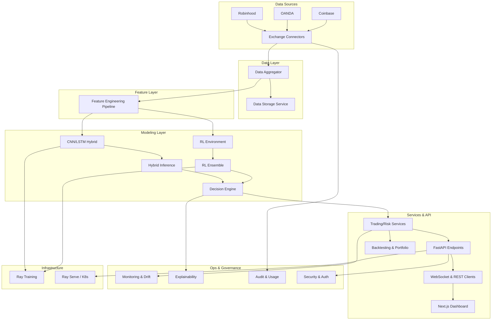

# AI Trading Platform Design Document

## Overview
The platform ingests multi-asset market data, engineers features, trains CNN+LSTM hybrids alongside reinforcement-learning agents, and serves trading decisions through a FastAPI backend and Next.js dashboard. Supporting services handle risk management, monitoring, explainability, security, and deployment automation.

## Current Architecture

## Component Summary
### Data Layer
- **Exchange adapters** (`src/exchanges/*`) abstract broker APIs, credential management, and throttling logic.
- **DataAggregator** (`src/services/data_aggregator.py`) fuses exchange streams, normalizes schemas, scores quality, and feeds downstream consumers.
- **DataStorageService** (`src/services/data_storage_service.py`) centralizes persistence, retention policies, and backup/restore hooks.

### Feature & Dataset Layer
- **FeatureEngineer** (`src/ml/feature_engineering.py`) chains technical indicators, volatility measures, wavelet/Fourier transforms, and correlation scaffolds.
- **Dataset utilities** in `src/ml/feature_extraction/` and `src/ml/data_cache.py` manage caching, batching, and reproducible splits.

### Modeling & Training Layer
- **CNN & LSTM modules** (`cnn_model.py`, `lstm_model.py`) supply configurable architectures with attention heads and dropout.
- **Hybrid fusion** (`hybrid_model.py`) produces joint classification/regression outputs with Monte Carlo uncertainty.
- **RL stack** (`trading_environment.py`, `rl_agents.py`, `rl_ensemble.py`) simulates portfolios, composes policies, and coordinates ensembles.
- **Training orchestration** uses `training_pipeline.py`, `distributed_training.py`, and `ray_tune_integration.py` for experiment tracking, distributed execution, and Ray Tune sweeps.
- **Model registry & decision auditing** (`model_registry.py`, `decision_auditor.py`) capture artefacts and explainability metadata.

### Decision & Portfolio Services
- **TradingDecisionEngine** (`src/services/trading_decision_engine.py`) merges ML signals, RL policies, and rule-based overrides into executable trades.
- **Portfolio services** (`portfolio_management_service.py`, `portfolio_optimizer.py`, `portfolio_rebalancer.py`) optimize weights, manage constraints, and surface analytics.
- **Risk management** (`risk_manager.py`, `risk_monitoring_service.py`) evaluates exposures, enforces limits, and issues alerts.
- **Backtesting & compliance** (`backtesting_engine.py`, `audit_service.py`, `compliance_service.py`) replay strategies and maintain audit trails.

### API & Integration Layer
- **FastAPI application** (`src/api/app.py`) wires authentication, dependency injection, middlewares, and routers.
- **Domain routers** (`trading_endpoints.py`, `risk_endpoints.py`, `monitoring_endpoints.py`, `model_serving.py`, `usage_endpoints.py`) expose REST/WebSocket contracts.
- **Usage tracking & auth** (`usage_middleware.py`, `auth.py`) enforce quotas and access control.
- **Frontend** (`frontend/app`, `frontend/components`) consumes REST/WebSockets, presenting dashboards for signals, portfolios, risk, and monitoring.

### Monitoring, Explainability & Governance
- **Monitoring services** (`src/services/monitoring/*`, `model_monitoring_service.py`) gather metrics, detect drift, and trigger automated retraining.
- **Explainability toolkit** (`shap_explainer.py`, `attention_visualizer.py`, `feature_importance_analyzer.py`, `uncertainty_calibrator.py`) generates artefacts delivered via API/UX.
- **Usage & audit** (`usage_tracking_service.py`, `audit_service.py`) maintain compliance-ready logs.

### Infrastructure & Deployment
- **Connection pools** (`src/connection_pool/*`) handle database and cache resources.
- **Deployment manifests** (`docker/`, `helm/`, `k8s/`, `.github/workflows/`) provide containerization, orchestration, and CI/CD automation.
- **Ray Serve A/B testing** (`src/ml/ray_serve/ab_testing.py`) manages traffic splitting and statistical comparisons.

## Data & Model Flow
1. Exchange connectors ingest historical and near-real-time data, forwarding normalized payloads to the DataAggregator.
2. Data quality checks annotate batches before they are cached, persisted, or streamed to downstream consumers.
3. The feature pipeline transforms normalized frames into tensors for CNN/LSTM training and RL environments.
4. Training pipelines orchestrate experiments via Ray/ThreadPool executors and record artefacts in the model registry.
5. The TradingDecisionEngine receives live feature tensors and RL ensemble policies to emit signals, position sizing, and risk summaries.
6. FastAPI endpoints expose the resulting signals, risk metrics, and monitoring telemetry to the dashboard and external integrations.
7. Monitoring, interpretability, and audit subsystems observe each stage, feeding alerts and governance reports.

## Model Lifecycle & Experimentation
- **Training**: `training_pipeline.py` prepares datasets, schedules epochs, and logs checkpoints. Distributed execution leverages `distributed_training.py` with optional Ray clusters.
- **Hyperparameter search**: `rl_hyperopt.py` and `ray_tune_integration.py` provide search strategies; parallel Ray execution remains a TODO.
- **Automated retraining**: `src/services/automated_retraining_service.py` monitors drift metrics, evaluates triggers, and schedules training jobs; model artefact backups are still placeholders.
- **Registry & promotion**: `model_registry.py` tracks versions, metrics, and metadata. Promotion into serving is coordinated with the A/B testing manager, though governance workflows need to be finalized.
- **Serving**: `src/api/model_serving.py` loads CNN/LSTM and hybrid models; RL ensemble loading currently uses placeholder logic pending full integration with the registry.

## API Contracts & External Integrations
- REST endpoints provide signal generation, risk inspection, monitoring dashboards, and administrative controls. Pydantic models in `src/models/*` define schemas.
- WebSocket endpoints broadcast signals and market data updates; message handlers exist but real-time streaming is stubbed until the data broadcasting loop is wired to the aggregator.
- Authentication relies on JWT-based tokens with role scopes; rate limiting middleware is defined but Redis-backed counters must be implemented.
- Integrations with broker execution flows are abstracted through exchange connectors; production deployment will require credential vaulting and sandbox validation.

## Observability & Operations
- Structured logging (`src/utils/logging.py`) standardizes context across services.
- Metrics collection utilities (`src/utils/monitoring.py`) feed counters and timers to the monitoring services and automated retraining triggers.
- Drift detectors and performance trackers in `src/services/monitoring/` feed into alert managers, which currently contain placeholder email/Slack callbacks.
- Backup, restore, and health reporting are centralized in the data storage and monitoring services but require completion of the TODO logic to be production-ready.

## Security & Compliance
- Security services manage key rotation, encryption, hashing, and token validation (`src/services/security_service.py`, `src/api/auth.py`).
- Audit trails capture user actions and model decisions (`audit_service.py`, `decision_auditor.py`).
- Compliance service templates reports and risk limit configurations, pending integration with regulatory export pipelines.
- Secrets are loaded via config management; persistence of encrypted keys currently stores placeholders and must be moved to a dedicated vault.

## Known Gaps & Next Steps
- Wire DataAggregator outputs into the WebSocket streaming loop and frontend clients; persist signal history and performance metrics via the storage service.
- Implement Redis-backed rate limiting, credential rotation workflows, and secure secret storage integration.
- Complete storage backup/restore automation and model artefact backups; document operational runbooks for recovery scenarios.
- Enable Ray-based parallel hyperparameter sweeps, finalize evaluation hooks in distributed training, and solidify governance around model promotion/A-B testing.
- Replace placeholder alert callbacks with production email/Slack integrations and expand compliance reporting exports.
- Harden RL ensemble loading in `model_serving.py`, ensuring parity with registry metadata.
- Update onboarding, UX flows, and documentation for non-technical traders once streaming and analytics endpoints are completed.
