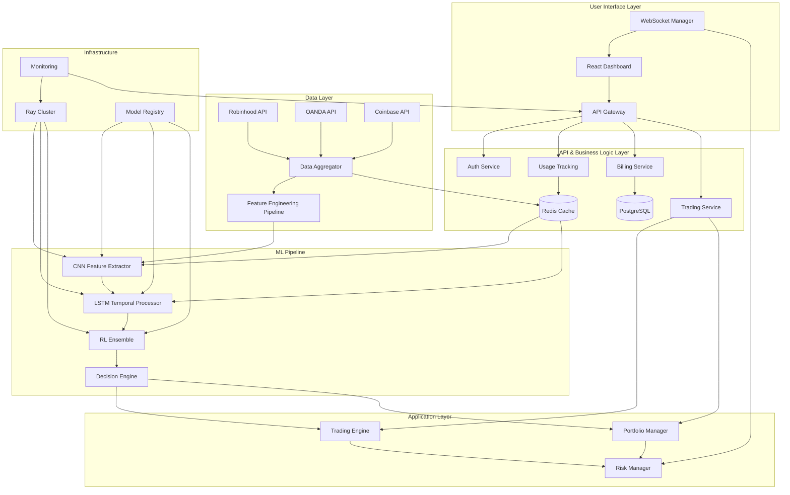

# AI Trading Platform Design Document

## Overview

The AI Trading Platform is a sophisticated machine learning system that combines Convolutional Neural Networks (CNNs) with Long Short-Term Memory (LSTM) networks for feature extraction and target prediction, feeding into an ensemble of Reinforcement Learning (RL) agents for trading decisions. The platform supports both single-stock analysis and portfolio management across multiple asset classes (stocks, forex, crypto) through integrated exchange APIs.

## Architecture

### High-Level System Architecture



### Core Components

1. **User Interface & API Layer**
   - React-based dashboard for non-technical users
   - RESTful APIs with comprehensive documentation
   - WebSocket connections for real-time data streaming
   - Usage tracking and freemium model enforcement

2. **Data Ingestion & Processing Layer**
   - Multi-exchange data aggregation with quality validation
   - Real-time and historical data handling with caching
   - Advanced feature engineering pipeline with multiple transformers

3. **ML Model Layer**
   - CNN+LSTM hybrid architecture with attention mechanisms
   - RL ensemble with multiple agents and dynamic weighting
   - Distributed model training and hyperparameter optimization
   - Model interpretability and uncertainty quantification

4. **Decision & Execution Layer**
   - AI-driven trading signal generation with confidence scoring
   - Multi-asset portfolio optimization and rebalancing
   - Comprehensive risk management with real-time monitoring

5. **Business Logic Layer**
   - Freemium usage tracking and billing integration
   - Open source core with commercial cloud services separation
   - Authentication, authorization, and user management

6. **Infrastructure Layer**
   - Distributed computing with Ray for scalability
   - Model serving and versioning with A/B testing
   - Cloud deployment with auto-scaling and cost optimization
   - Comprehensive monitoring and alerting system

## Components and Interfaces

### 1. Data Ingestion System

**Architecture Pattern**: Event-driven microservices with message queues

**Key Components**:
- `ExchangeConnector`: Abstract base class for exchange integrations
- `RobinhoodConnector`: Stocks, ETFs, indices, options
- `OANDAConnector`: Forex pairs and CFDs
- `CoinbaseConnector`: Cryptocurrencies and perpetual futures
- `DataAggregator`: Unified data normalization and timestamping
- `DataQualityValidator`: Advanced anomaly detection with statistical methods
- `TimestampSynchronizer`: Cross-exchange timestamp alignment
- `DataQualityReport`: Comprehensive quality metrics and confidence scoring

**Interface Design**:
```python
class ExchangeConnector(ABC):
    @abstractmethod
    async def get_historical_data(self, symbol: str, timeframe: str, start: datetime, end: datetime) -> pd.DataFrame
    
    @abstractmethod
    async def get_real_time_data(self, symbols: List[str]) -> AsyncGenerator[MarketData, None]
    
    @abstractmethod
    async def place_order(self, order: Order) -> OrderResult
```

### 2. Feature Engineering Pipeline

**Architecture Pattern**: Pipeline pattern with pluggable transformers

**Technical Indicators**:
- Price-based: SMA, EMA, Bollinger Bands, RSI, MACD
- Volume-based: OBV, VWAP, Volume Rate of Change
- Volatility: ATR, Volatility Ratio, Garman-Klass estimator
- Market microstructure: Bid-ask spread, Order flow imbalance

**Advanced Features**:
- Wavelet transforms for multi-resolution analysis
- Fourier transforms for frequency domain features
- Fractal dimension and Hurst exponent
- Cross-asset correlation features
- Sentiment indicators from news/social media

**Implementation**:
```python
class FeatureEngineer:
    def __init__(self):
        self.transformers = [
            TechnicalIndicators(),
            WaveletTransform(),
            FourierFeatures(),
            FractalFeatures(),
            CrossAssetFeatures()
        ]
    
    def transform(self, data: pd.DataFrame) -> np.ndarray:
        features = []
        for transformer in self.transformers:
            features.append(transformer.fit_transform(data))
        return np.concatenate(features, axis=1)
```

### 3. CNN+LSTM Hybrid Model

**CNN Architecture** (Spatial Feature Extraction):
- 1D Convolutional layers for pattern recognition in price/volume data
- Multiple filter sizes (3, 5, 7, 11) to capture different time scales
- Residual connections for deep networks
- Multi-head attention mechanisms for important feature selection

**LSTM Architecture** (Temporal Dependencies):
- Bidirectional LSTM for forward/backward temporal context
- Multiple LSTM layers with dropout for regularization
- Attention-based sequence modeling
- Skip connections between layers

**Feature Fusion Module**:
- Cross-attention between CNN and LSTM features
- Learnable projection layers for dimension alignment
- Layer normalization and residual connections
- Configurable fusion dimension for optimal performance

**Multi-Task Learning**:
- Simultaneous classification (Buy/Hold/Sell) and regression (price prediction)
- Weighted loss functions for balanced optimization
- Uncertainty quantification using Monte Carlo dropout
- Ensemble capabilities with learnable weights

**Hybrid Integration**:
```python
class CNNLSTMModel(nn.Module):
    def __init__(self, input_dim, cnn_filters, lstm_hidden, num_classes):
        super().__init__()
        
        # CNN Feature Extractor
        self.conv_layers = nn.ModuleList([
            nn.Conv1d(input_dim, cnn_filters, kernel_size=k, padding=k//2)
            for k in [3, 5, 7, 11]
        ])
        self.attention_cnn = MultiHeadAttention(cnn_filters * 4, 8)
        
        # LSTM Temporal Processor
        self.lstm = nn.LSTM(cnn_filters * 4, lstm_hidden, 
                           num_layers=3, bidirectional=True, 
                           dropout=0.3, batch_first=True)
        self.attention_lstm = MultiHeadAttention(lstm_hidden * 2, 8)
        
        # Output layers
        self.classifier = nn.Linear(lstm_hidden * 2, num_classes)
        self.regressor = nn.Linear(lstm_hidden * 2, 1)  # Price prediction
    
    def forward(self, x):
        # CNN feature extraction
        conv_outputs = []
        for conv in self.conv_layers:
            conv_outputs.append(F.relu(conv(x)))
        
        cnn_features = torch.cat(conv_outputs, dim=1)
        cnn_features, _ = self.attention_cnn(cnn_features, cnn_features, cnn_features)
        
        # LSTM temporal processing
        lstm_out, _ = self.lstm(cnn_features.transpose(1, 2))
        lstm_features, _ = self.attention_lstm(lstm_out, lstm_out, lstm_out)
        
        # Predictions
        classification = self.classifier(lstm_features[:, -1, :])  # Last timestep
        regression = self.regressor(lstm_features[:, -1, :])
        
        return classification, regression
```

### 4. CNN+LSTM Integration with RL Environment

**Enhanced State Representation**:
The trading environment leverages the pre-trained CNN+LSTM hybrid model as a sophisticated feature extractor, providing RL agents with rich, learned representations instead of basic technical indicators.

**Improved Architecture with Separation of Concerns**:
```python
# Abstract base for feature extraction
class FeatureExtractor(ABC):
    @abstractmethod
    def extract_features(self, data: np.ndarray) -> Dict[str, np.ndarray]:
        pass

# Pure CNN+LSTM feature extraction
class CNNLSTMExtractor(FeatureExtractor):
    def __init__(self, hybrid_model: CNNLSTMHybridModel):
        self.model = hybrid_model
        self.model.eval()
        
    def extract_features(self, market_window: np.ndarray) -> Dict[str, np.ndarray]:
        """Extract CNN+LSTM features with proper validation and error handling"""
        # Input validation
        if market_window is None or market_window.size == 0:
            raise ValueError("market_window cannot be None or empty")
        
        if not isinstance(market_window, np.ndarray):
            raise TypeError(f"Expected np.ndarray, got {type(market_window)}")
        
        try:
            with torch.no_grad():
                outputs = self.model.forward(
                    torch.FloatTensor(market_window).unsqueeze(0),
                    return_features=True,
                    use_ensemble=True
                )
                
                return {
                    'fused_features': outputs['fused_features'][:, -1, :].cpu().numpy(),
                    'cnn_features': outputs['cnn_features'][:, -1, :].cpu().numpy(),
                    'lstm_features': outputs['lstm_features'][:, -1, :].cpu().numpy(),
                    'classification_confidence': torch.max(outputs['classification_probs'], dim=1)[0].cpu().numpy(),
                    'regression_uncertainty': outputs['regression_uncertainty'].cpu().numpy(),
                    'ensemble_weights': outputs['ensemble_weights'].cpu().numpy() if outputs['ensemble_weights'] is not None else None
                }
        except (RuntimeError, torch.cuda.OutOfMemoryError) as e:
            raise FeatureExtractionError(f"CNN+LSTM feature extraction failed: {e}") from e

# Caching decorator using efficient implementation
class CachedFeatureExtractor(FeatureExtractor):
    def __init__(self, extractor: FeatureExtractor, cache_size: int = 1000, ttl_seconds: int = 60):
        self.extractor = extractor
        self.cache = TTLCache(maxsize=cache_size, ttl=ttl_seconds)
        
    def extract_features(self, data: np.ndarray) -> Dict[str, np.ndarray]:
        cache_key = hashlib.md5(data.tobytes()).hexdigest()
        
        if cache_key in self.cache:
            return self.cache[cache_key]
        
        features = self.extractor.extract_features(data)
        self.cache[cache_key] = features
        return features

# Factory for creating configured extractors
class FeatureExtractorFactory:
    @staticmethod
    def create_extractor(config: FeatureExtractionConfig) -> FeatureExtractor:
        base_extractor = CNNLSTMExtractor(config.hybrid_model)
        
        if config.enable_caching:
            base_extractor = CachedFeatureExtractor(
                base_extractor, 
                config.cache_size, 
                config.cache_ttl_seconds
            )
        
        if config.enable_fallback:
            base_extractor = FallbackFeatureExtractor(base_extractor)
            
        return base_extractor

class EnhancedTradingEnvironment(gym.Env):
    def __init__(self, data, cnn_lstm_model, config=None):
        super().__init__()
        self.feature_extractor = CNNLSTMFeatureExtractor(cnn_lstm_model)
        self.fallback_mode = False  # Use basic indicators if CNN+LSTM fails
        
    def _get_observation(self) -> np.ndarray:
        try:
            # Primary: CNN+LSTM enhanced features
            market_window = self._get_market_window()
            cnn_lstm_features = self.feature_extractor.extract_features(market_window)
            
            # Combine rich features with portfolio state
            enhanced_obs = np.concatenate([
                cnn_lstm_features['fused_features'].flatten(),      # 256-dim rich features
                cnn_lstm_features['classification_confidence'],      # Model confidence
                cnn_lstm_features['regression_uncertainty'].flatten(), # Uncertainty estimates
                self._get_portfolio_features()                       # Portfolio state
            ])
            
            self.fallback_mode = False
            return enhanced_obs
            
        except Exception as e:
            # Fallback: Basic technical indicators
            if not self.fallback_mode:
                print(f"CNN+LSTM feature extraction failed, using fallback: {e}")
                self.fallback_mode = True
            
            return self._get_basic_observation()
```

**Performance Benefits**:
- **Rich State Representation**: 256-dimensional fused features vs 15 basic indicators
- **Pattern Recognition**: CNN extracts complex spatial patterns from price/volume data
- **Temporal Context**: LSTM captures long-term dependencies beyond simple moving averages
- **Uncertainty Awareness**: Monte Carlo dropout provides confidence estimates for risk management
- **Multi-Scale Analysis**: Different CNN filter sizes capture patterns at various time scales

### 5. Reinforcement Learning Ensemble

**RL Algorithms**:
- **PPO (Proximal Policy Optimization)**: Stable policy gradient method
- **SAC (Soft Actor-Critic)**: Off-policy, maximum entropy RL
- **TD3 (Twin Delayed DDPG)**: Continuous action spaces
- **Rainbow DQN**: For discrete action spaces

**Ensemble Strategy**:
- Weighted voting based on recent performance
- Dynamic weight adjustment using Thompson sampling
- Meta-learning for ensemble weight optimization

**Enhanced Environment Design with CNN+LSTM Integration**:
```python
class EnhancedTradingEnvironment(gym.Env):
    def __init__(self, data, cnn_lstm_model, initial_balance=100000):
        self.data = data
        self.cnn_lstm_model = cnn_lstm_model  # Pre-trained CNN+LSTM feature extractor
        self.initial_balance = initial_balance
        
        # Action space: [position_size, hold_time]
        self.action_space = gym.spaces.Box(
            low=np.array([-1.0, 0.0]), 
            high=np.array([1.0, 1.0]), 
            dtype=np.float32
        )
        
        # Observation space: CNN+LSTM fused features + uncertainty + portfolio state
        # CNN+LSTM provides 256-dim fused features + uncertainty estimates
        cnn_lstm_feature_dim = 256 + 1  # fused features + uncertainty
        self.observation_space = gym.spaces.Box(
            low=-np.inf, high=np.inf, 
            shape=(cnn_lstm_feature_dim + portfolio_dim,), 
            dtype=np.float32
        )
    
    def step(self, action):
        # Execute trade, update portfolio, calculate reward
        position_size, hold_time = action
        
        # Get CNN+LSTM enhanced observation with rich feature representation
        observation = self._get_cnn_lstm_enhanced_observation()
        
        # Risk-adjusted reward function
        returns = self.calculate_returns()
        sharpe_ratio = self.calculate_sharpe_ratio()
        max_drawdown = self.calculate_max_drawdown()
        
        reward = returns * sharpe_ratio - max_drawdown * 0.1
        
        return observation, reward, done, info
    
    def _get_cnn_lstm_enhanced_observation(self):
        # Extract CNN+LSTM features from current market window
        market_window = self._get_market_window()
        cnn_lstm_features = self.feature_extractor.extract_features(market_window)
        
        # Combine with portfolio state
        portfolio_state = self._get_portfolio_state()
        enhanced_obs = np.concatenate([
            cnn_lstm_features['fused_features'].flatten(),
            cnn_lstm_features['uncertainty'].flatten(),
            portfolio_state
        ])
        
        return enhanced_obs
```

### 6. Portfolio Management System

**Modern Portfolio Theory Integration**:
- Mean-variance optimization with constraints
- Black-Litterman model for expected returns
- Risk parity and equal risk contribution
- Factor-based portfolio construction

**Dynamic Rebalancing**:
- Threshold-based rebalancing
- Time-based rebalancing
- Volatility-adjusted rebalancing
- Transaction cost optimization

### 7. User Interface and Dashboard System

**Architecture Pattern**: Component-based React architecture with real-time data integration

**Design Rationale**: Non-technical traders need an intuitive interface that abstracts complex AI algorithms while providing transparency into trading decisions. The dashboard prioritizes simplicity and guided workflows over technical complexity.

**Key Components**:
- `DashboardContainer`: Main application shell with navigation and layout
- `TradingSignalWidget`: Real-time display of AI-generated trading signals
- `PortfolioOverview`: Portfolio performance metrics and asset allocation
- `RiskMonitor`: Real-time risk metrics and alert notifications
- `StrategyWizard`: Guided setup for trading strategies and preferences
- `PerformanceAnalytics`: Historical performance with interpretable AI insights

**Real-time Data Integration**:
```typescript
class WebSocketManager {
    private connections: Map<string, WebSocket> = new Map();
    
    subscribeToSignals(userId: string, callback: (signal: TradingSignal) => void) {
        const ws = new WebSocket(`wss://api.platform.com/signals/${userId}`);
        
        ws.onmessage = (event) => {
            const signal = JSON.parse(event.data) as TradingSignal;
            callback(signal);
        };
        
        this.connections.set(userId, ws);
    }
    
    subscribeToPortfolio(userId: string, callback: (portfolio: Portfolio) => void) {
        // Real-time portfolio updates
    }
}
```

**Guided User Experience**:
- **Strategy Setup Wizard**: Step-by-step configuration with risk tolerance assessment
- **One-Click Deployment**: Simplified model training initiation with progress tracking
- **Interpretable Insights**: AI decision explanations in plain language
- **Multi-Channel Alerts**: Email, SMS, and push notifications for important events

### 8. API Architecture and Integration Ecosystem

**Architecture Pattern**: RESTful API with GraphQL for complex queries and WebSocket for real-time data

**Design Rationale**: A comprehensive API ecosystem enables third-party integrations, mobile applications, and custom trading strategies while maintaining security and performance standards.

**API Gateway Design**:
```python
from fastapi import FastAPI, Depends, HTTPException
from fastapi.middleware.cors import CORSMiddleware
from fastapi.security import HTTPBearer, HTTPAuthorizationCredentials

app = FastAPI(
    title="AI Trading Platform API",
    description="Comprehensive API for AI-powered trading",
    version="1.0.0"
)

# Rate limiting and authentication middleware
security = HTTPBearer()

@app.middleware("http")
async def rate_limit_middleware(request: Request, call_next):
    # Implement freemium rate limiting
    user_id = extract_user_id(request)
    usage_count = await redis_client.get(f"usage:{user_id}:daily")
    
    if is_free_tier(user_id) and usage_count >= FREE_TIER_LIMIT:
        raise HTTPException(status_code=429, detail="Free tier limit exceeded")
    
    response = await call_next(request)
    await increment_usage(user_id)
    return response
```

**Core API Endpoints**:
- **Trading Signals**: `GET /api/v1/signals/{symbol}` - AI-generated trading recommendations
- **Portfolio Management**: `POST /api/v1/portfolio/rebalance` - Portfolio optimization
- **Historical Data**: `GET /api/v1/data/{symbol}/history` - Market data with features
- **Model Training**: `POST /api/v1/models/train` - Initiate custom model training
- **Performance Analytics**: `GET /api/v1/analytics/performance` - Trading performance metrics

**WebSocket Architecture**:
```python
from fastapi import WebSocket, WebSocketDisconnect
from typing import Dict, List

class ConnectionManager:
    def __init__(self):
        self.active_connections: Dict[str, List[WebSocket]] = {}
    
    async def connect(self, websocket: WebSocket, user_id: str):
        await websocket.accept()
        if user_id not in self.active_connections:
            self.active_connections[user_id] = []
        self.active_connections[user_id].append(websocket)
    
    async def broadcast_signal(self, user_id: str, signal: TradingSignal):
        if user_id in self.active_connections:
            for connection in self.active_connections[user_id]:
                await connection.send_json(signal.dict())

manager = ConnectionManager()

@app.websocket("/ws/{user_id}")
async def websocket_endpoint(websocket: WebSocket, user_id: str):
    await manager.connect(websocket, user_id)
    try:
        while True:
            # Keep connection alive and handle client messages
            await websocket.receive_text()
    except WebSocketDisconnect:
        manager.disconnect(websocket, user_id)
```

**SDK and Plugin Architecture**:
- **Python SDK**: Complete client library with async support
- **JavaScript SDK**: Browser and Node.js compatible
- **Plugin System**: Extensible architecture for custom strategies
- **Webhook Support**: Event-driven integrations with external systems

### 9. Freemium Model and Open Source Architecture

**Architecture Pattern**: Modular separation with clear boundaries between open source core and commercial services

**Design Rationale**: The freemium model (5 free AI signals per day for 7 days) requires sophisticated usage tracking while maintaining positive unit economics. Open source core ensures community adoption while commercial cloud services provide revenue.

**Usage Tracking System**:
```python
from dataclasses import dataclass
from datetime import datetime, timedelta
import redis
from typing import Optional

@dataclass
class UsageTracker:
    redis_client: redis.Redis
    
    async def track_signal_request(self, user_id: str) -> bool:
        """Track signal request and return True if within limits"""
        today = datetime.now().strftime("%Y-%m-%d")
        key = f"usage:{user_id}:{today}"
        
        current_usage = await self.redis_client.get(key) or 0
        user_tier = await self.get_user_tier(user_id)
        
        if user_tier == "free":
            if int(current_usage) >= 5:  # Free tier limit
                return False
            
            # Set expiry for trial period tracking
            trial_key = f"trial:{user_id}"
            if not await self.redis_client.exists(trial_key):
                await self.redis_client.setex(trial_key, timedelta(days=7), "active")
        
        await self.redis_client.incr(key)
        await self.redis_client.expire(key, timedelta(days=1))
        return True
    
    async def get_usage_stats(self, user_id: str) -> dict:
        """Get current usage statistics for user"""
        today = datetime.now().strftime("%Y-%m-%d")
        daily_usage = await self.redis_client.get(f"usage:{user_id}:{today}") or 0
        trial_remaining = await self.redis_client.ttl(f"trial:{user_id}")
        
        return {
            "daily_usage": int(daily_usage),
            "trial_days_remaining": max(0, trial_remaining // 86400),
            "tier": await self.get_user_tier(user_id)
        }
```

**Open Source vs Commercial Separation**:
```python
# Open Source Core (src/core/)
class OpenSourceTradingEngine:
    """Core trading engine available under MIT license"""
    def __init__(self, config: TradingConfig):
        self.data_aggregator = DataAggregator(config)
        self.feature_engineer = FeatureEngineer(config)
        self.ml_models = MLModelRegistry(config)
    
    def generate_signal(self, symbol: str) -> TradingSignal:
        """Generate trading signal using local models"""
        # Full implementation available in open source

# Commercial Cloud Services (src/cloud/)
class CloudTradingService:
    """Enhanced cloud services with premium features"""
    def __init__(self, api_key: str):
        self.usage_tracker = UsageTracker()
        self.billing_service = BillingService()
        self.enhanced_models = EnhancedMLModels()
    
    async def generate_premium_signal(self, user_id: str, symbol: str) -> TradingSignal:
        """Generate signal with premium features and usage tracking"""
        if not await self.usage_tracker.track_signal_request(user_id):
            raise UsageLimitExceeded("Upgrade to continue using AI signals")
        
        # Enhanced signal generation with cloud-exclusive features
        return await self.enhanced_models.generate_signal(symbol)
```

**Billing Integration**:
- **Stripe Integration**: Subscription management and usage-based billing
- **Cost Optimization**: Efficient model serving to maintain positive unit economics
- **Transparent Pricing**: Clear upgrade paths from free to paid tiers
- **Usage Analytics**: Track conversion metrics and optimize free tier limits

### 10. Model Interpretability and Explainability

**Attention Visualization**:
- CNN attention maps showing important price patterns
- LSTM attention weights highlighting temporal dependencies
- Cross-attention visualization between CNN and LSTM features

**Feature Importance Analysis**:
- SHAP (SHapley Additive exPlanations) for local interpretability
- Permutation importance for global feature ranking
- Integrated gradients for attribution analysis

**Uncertainty Quantification**:
- Monte Carlo dropout for prediction confidence intervals
- Ensemble disagreement as uncertainty measure
- Calibrated confidence scores for decision reliability

**Decision Audit Trails**:
- Complete decision history with model versions
- Feature contributions for each trading signal
- Ensemble weight evolution over time
- Performance attribution by model component

### 11. Performance Architecture and Optimization

**Architecture Pattern**: Multi-layered caching with intelligent prefetching and batch processing

**Design Rationale**: Real-time trading requires sub-100ms feature extraction and model inference. The architecture prioritizes performance through strategic caching, connection pooling, and GPU optimization.

**Performance Requirements**:
- **Feature Extraction**: <100ms for real-time trading decisions
- **Model Inference**: <50ms for single predictions, <200ms for batch processing
- **API Response Time**: <200ms for 95th percentile
- **WebSocket Latency**: <10ms for real-time data updates

**Caching Architecture**:
```python
from cachetools import TTLCache
import asyncio
from typing import Dict, Any
import hashlib

class PerformanceOptimizedCache:
    def __init__(self):
        self.feature_cache = TTLCache(maxsize=1000, ttl=60)  # 1-minute TTL
        self.model_cache = TTLCache(maxsize=100, ttl=300)   # 5-minute TTL
        self.data_cache = TTLCache(maxsize=5000, ttl=30)    # 30-second TTL
    
    async def get_cached_features(self, market_data: np.ndarray) -> Optional[Dict[str, np.ndarray]]:
        cache_key = hashlib.md5(market_data.tobytes()).hexdigest()
        return self.feature_cache.get(cache_key)
    
    async def cache_features(self, market_data: np.ndarray, features: Dict[str, np.ndarray]):
        cache_key = hashlib.md5(market_data.tobytes()).hexdigest()
        self.feature_cache[cache_key] = features

class BatchProcessor:
    def __init__(self, batch_size: int = 32, max_wait_time: float = 0.1):
        self.batch_size = batch_size
        self.max_wait_time = max_wait_time
        self.pending_requests = []
    
    async def process_batch(self, request_data: Any) -> Any:
        """Batch multiple requests for efficient GPU utilization"""
        self.pending_requests.append(request_data)
        
        if len(self.pending_requests) >= self.batch_size:
            return await self._execute_batch()
        
        # Wait for more requests or timeout
        await asyncio.sleep(self.max_wait_time)
        if self.pending_requests:
            return await self._execute_batch()
```

**Connection Pooling and Resource Management**:
```python
import asyncpg
from contextlib import asynccontextmanager

class ResourceManager:
    def __init__(self):
        self.db_pool = None
        self.redis_pool = None
        self.model_instances = {}
    
    async def initialize(self):
        # Database connection pool
        self.db_pool = await asyncpg.create_pool(
            DATABASE_URL,
            min_size=10,
            max_size=50,
            command_timeout=60
        )
        
        # Redis connection pool
        self.redis_pool = redis.ConnectionPool(
            host=REDIS_HOST,
            port=REDIS_PORT,
            max_connections=100
        )
    
    @asynccontextmanager
    async def get_db_connection(self):
        async with self.db_pool.acquire() as connection:
            yield connection
    
    def get_model_instance(self, model_type: str):
        """Singleton pattern for model instances to avoid memory overhead"""
        if model_type not in self.model_instances:
            self.model_instances[model_type] = self._load_model(model_type)
        return self.model_instances[model_type]
```

### 12. Code Quality and Maintainability Architecture

**Architecture Pattern**: Layered architecture with dependency injection and factory patterns

**Design Rationale**: High code quality ensures system reliability and maintainability. The architecture follows SOLID principles with clear separation of concerns and comprehensive error handling.

**Layered Architecture Implementation**:
```python
# Domain Layer - Core business logic
from abc import ABC, abstractmethod
from typing import Protocol

class TradingSignalGenerator(Protocol):
    def generate_signal(self, market_data: MarketData) -> TradingSignal: ...

class PortfolioOptimizer(Protocol):
    def optimize_portfolio(self, portfolio: Portfolio) -> Portfolio: ...

# Application Layer - Use cases and orchestration
class TradingService:
    def __init__(
        self,
        signal_generator: TradingSignalGenerator,
        portfolio_optimizer: PortfolioOptimizer,
        risk_manager: RiskManager
    ):
        self._signal_generator = signal_generator
        self._portfolio_optimizer = portfolio_optimizer
        self._risk_manager = risk_manager
    
    async def execute_trading_strategy(self, user_id: str, symbols: List[str]) -> TradingResult:
        """High-level trading workflow with proper error handling"""
        try:
            # Generate signals for all symbols
            signals = []
            for symbol in symbols:
                market_data = await self._get_market_data(symbol)
                signal = self._signal_generator.generate_signal(market_data)
                signals.append(signal)
            
            # Optimize portfolio allocation
            current_portfolio = await self._get_user_portfolio(user_id)
            optimized_portfolio = self._portfolio_optimizer.optimize_portfolio(current_portfolio)
            
            # Apply risk management
            risk_adjusted_portfolio = self._risk_manager.apply_risk_controls(optimized_portfolio)
            
            return TradingResult(
                signals=signals,
                portfolio=risk_adjusted_portfolio,
                risk_metrics=self._risk_manager.calculate_metrics(risk_adjusted_portfolio)
            )
            
        except MarketDataError as e:
            logger.error(f"Market data error for user {user_id}: {e}")
            raise TradingServiceError(f"Unable to retrieve market data: {e}") from e
        except ModelInferenceError as e:
            logger.error(f"Model inference error for user {user_id}: {e}")
            raise TradingServiceError(f"AI model temporarily unavailable: {e}") from e
        except Exception as e:
            logger.error(f"Unexpected error in trading service for user {user_id}: {e}")
            raise TradingServiceError("Trading service temporarily unavailable") from e

# Infrastructure Layer - External dependencies
class DatabaseTradingRepository:
    def __init__(self, db_pool: asyncpg.Pool):
        self._db_pool = db_pool
    
    async def save_trading_signal(self, signal: TradingSignal) -> None:
        async with self._db_pool.acquire() as conn:
            await conn.execute(
                "INSERT INTO trading_signals (symbol, action, confidence, timestamp) VALUES ($1, $2, $3, $4)",
                signal.symbol, signal.action, signal.confidence, signal.timestamp
            )
```

**Factory Pattern for Extensibility**:
```python
class MLModelFactory:
    """Factory for creating ML models with proper configuration"""
    
    @staticmethod
    def create_cnn_lstm_model(config: CNNLSTMConfig) -> CNNLSTMModel:
        return CNNLSTMModel(
            input_dim=config.input_dim,
            cnn_filters=config.cnn_filters,
            lstm_hidden=config.lstm_hidden,
            num_classes=config.num_classes
        )
    
    @staticmethod
    def create_rl_ensemble(config: RLEnsembleConfig) -> RLEnsemble:
        agents = []
        for agent_config in config.agent_configs:
            agent = RLAgentFactory.create_agent(agent_config)
            agents.append(agent)
        
        return RLEnsemble(
            agents=agents,
            ensemble_strategy=config.ensemble_strategy
        )

class ExchangeConnectorFactory:
    """Factory for creating exchange connectors with proper authentication"""
    
    @staticmethod
    def create_connector(exchange_type: str, credentials: Dict[str, str]) -> ExchangeConnector:
        if exchange_type == "robinhood":
            return RobinhoodConnector(credentials)
        elif exchange_type == "oanda":
            return OANDAConnector(credentials)
        elif exchange_type == "coinbase":
            return CoinbaseConnector(credentials)
        else:
            raise ValueError(f"Unsupported exchange type: {exchange_type}")
```

**Comprehensive Error Handling Strategy**:
```python
# Custom exception hierarchy
class TradingPlatformError(Exception):
    """Base exception for all trading platform errors"""
    pass

class DataError(TradingPlatformError):
    """Data-related errors"""
    pass

class MarketDataError(DataError):
    """Market data retrieval errors"""
    pass

class ModelError(TradingPlatformError):
    """ML model-related errors"""
    pass

class ModelInferenceError(ModelError):
    """Model inference errors"""
    pass

class TradingServiceError(TradingPlatformError):
    """Trading service errors"""
    pass

# Error boundary decorator
def error_boundary(fallback_handler: Optional[Callable] = None):
    def decorator(func):
        @functools.wraps(func)
        async def wrapper(*args, **kwargs):
            try:
                return await func(*args, **kwargs)
            except TradingPlatformError:
                # Re-raise known errors
                raise
            except Exception as e:
                logger.error(f"Unexpected error in {func.__name__}: {e}")
                if fallback_handler:
                    return await fallback_handler(*args, **kwargs)
                raise TradingServiceError(f"Service temporarily unavailable") from e
        return wrapper
    return decorator
```

## Data Models

### Core Data Structures

```python
@dataclass
class MarketData:
    symbol: str
    timestamp: datetime
    open: float
    high: float
    low: float
    close: float
    volume: float
    exchange: str
    
@dataclass
class TradingSignal:
    symbol: str
    action: str  # 'BUY', 'SELL', 'HOLD'
    confidence: float
    position_size: float
    target_price: Optional[float]
    stop_loss: Optional[float]
    timestamp: datetime
    model_version: str

@dataclass
class Portfolio:
    user_id: str
    positions: Dict[str, Position]
    cash_balance: float
    total_value: float
    last_updated: datetime
    
@dataclass
class Position:
    symbol: str
    quantity: float
    avg_cost: float
    current_price: float
    unrealized_pnl: float
    realized_pnl: float
```

### Database Schema

**Time Series Data** (InfluxDB/TimescaleDB):
- Market data with high-frequency timestamps
- Feature vectors with metadata
- Performance metrics and backtesting results

**Relational Data** (PostgreSQL):
- User accounts and preferences
- Model configurations and versions
- Trading history and audit logs

**Caching Layer** (Redis):
- Real-time market data
- Model predictions
- User session data

## Error Handling

### Fault Tolerance Strategies

1. **Circuit Breaker Pattern**: Prevent cascade failures in exchange connections
2. **Retry with Exponential Backoff**: Handle temporary API failures
3. **Graceful Degradation**: Fall back to cached data or simplified models
4. **Dead Letter Queues**: Handle failed message processing
5. **Health Checks**: Monitor system components and auto-recovery

### Model Robustness

1. **Input Validation**: Comprehensive data quality checks
2. **Model Monitoring**: Detect distribution drift and performance degradation
3. **Ensemble Fallbacks**: Use simpler models when complex ones fail
4. **Confidence Thresholds**: Only act on high-confidence predictions

### Specific Exception Handling

```python
# Custom exception hierarchy
class TradingPlatformError(Exception):
    """Base exception for trading platform"""
    pass

class FeatureExtractionError(TradingPlatformError):
    """Raised when feature extraction fails"""
    pass

class ModelLoadError(TradingPlatformError):
    """Raised when model loading fails"""
    pass

class DataValidationError(TradingPlatformError):
    """Raised when data validation fails"""
    pass

# Error boundary implementation
class ErrorBoundary:
    def __init__(self, fallback_handler: Callable):
        self.fallback_handler = fallback_handler
        
    def __call__(self, func):
        def wrapper(*args, **kwargs):
            try:
                return func(*args, **kwargs)
            except (RuntimeError, torch.cuda.OutOfMemoryError) as e:
                logger.warning(f"Model operation failed: {e}")
                return self.fallback_handler(*args, **kwargs)
            except Exception as e:
                logger.error(f"Unexpected error in {func.__name__}: {e}")
                raise
        return wrapper
```

### Resource Management

```python
# Context manager for model resources
class ModelManager:
    def __init__(self, model_path: str):
        self.model_path = model_path
        self.model = None
    
    def __enter__(self):
        self.model = self._load_model()
        return self.model
    
    def __exit__(self, exc_type, exc_val, exc_tb):
        if self.model is not None:
            del self.model
            if torch.cuda.is_available():
                torch.cuda.empty_cache()
```

## Testing Strategy

### Unit Testing
- Individual component testing with mocks
- Model architecture validation
- Feature engineering pipeline testing
- Exchange connector testing with simulated data

### Integration Testing
- End-to-end data flow testing
- Model training and inference pipelines
- Exchange API integration testing
- Database operations and data consistency

### Performance Testing
- Model inference latency benchmarks
- Throughput testing for real-time data processing
- Memory usage profiling
- Distributed training scalability

### Backtesting Framework
- Historical simulation with realistic market conditions
- Transaction cost modeling
- Slippage and market impact simulation
- Walk-forward analysis for model validation

### A/B Testing Infrastructure
- Model comparison framework
- Statistical significance testing
- Performance attribution analysis
- Risk-adjusted return metrics

## Security and Compliance

### Data Security
- End-to-end encryption for sensitive data
- API key management with rotation
- Secure credential storage (HashiCorp Vault)
- Data anonymization for model training

### Trading Compliance
- Audit trail for all trading decisions
- Risk limit enforcement
- Regulatory reporting capabilities
- Position size and exposure limits

### Model Governance
- Model versioning and lineage tracking
- Bias detection and fairness metrics
- Explainability and interpretability tools
- Model approval workflows

## Deployment and Scaling

### Cloud Infrastructure Architecture

**Multi-Tenant SaaS Architecture**: Designed for scalability and cost efficiency to support freemium model economics

**Auto-Scaling Strategy**:
```yaml
# Kubernetes HPA configuration
apiVersion: autoscaling/v2
kind: HorizontalPodAutoscaler
metadata:
  name: trading-api-hpa
spec:
  scaleTargetRef:
    apiVersion: apps/v1
    kind: Deployment
    name: trading-api
  minReplicas: 3
  maxReplicas: 50
  metrics:
  - type: Resource
    resource:
      name: cpu
      target:
        type: Utilization
        averageUtilization: 70
  - type: Resource
    resource:
      name: memory
      target:
        type: Utilization
        averageUtilization: 80
```

**Infrastructure Components**:
- **Compute**: Auto-scaling GPU clusters (NVIDIA A100/V100) for ML training and inference
- **Storage**: 
  - Time-series databases (InfluxDB) for market data
  - Object storage (S3) for model artifacts and backups
  - Redis clusters for high-performance caching
- **Networking**: 
  - CDN for static assets and API responses
  - Direct connections to major exchanges for minimal latency
  - Load balancers with geographic distribution
- **Monitoring**: 
  - Prometheus + Grafana for metrics and alerting
  - ELK stack for centralized logging
  - Distributed tracing with Jaeger

### Model Serving Architecture

**Real-time Inference Pipeline**:
```python
from fastapi import FastAPI
from ray import serve
import torch

@serve.deployment(num_replicas=3, ray_actor_options={"num_gpus": 0.5})
class CNNLSTMPredictor:
    def __init__(self):
        self.model = torch.jit.load("models/cnn_lstm_optimized.pt")
        self.model.eval()
    
    async def predict(self, market_data: np.ndarray) -> Dict[str, float]:
        with torch.no_grad():
            prediction = self.model(torch.FloatTensor(market_data))
            return {
                "signal": prediction["classification"].item(),
                "confidence": prediction["confidence"].item(),
                "price_target": prediction["regression"].item()
            }

# Deploy with Ray Serve for auto-scaling
serve.start()
CNNLSTMPredictor.deploy()
```

**A/B Testing Framework**:
- **Traffic Splitting**: Gradual rollout of new models (5% → 25% → 50% → 100%)
- **Statistical Significance**: Automated winner selection based on Sharpe ratio improvements
- **Safety Controls**: Automatic rollback if performance degrades beyond thresholds
- **Experiment Tracking**: Complete audit trail of model versions and performance metrics

### Cost Optimization Strategy

**Freemium Economics**: Designed to maintain positive unit economics while providing generous free tier

**Cost Per Signal Analysis**:
```python
@dataclass
class CostMetrics:
    compute_cost_per_inference: float = 0.001  # $0.001 per inference
    data_cost_per_request: float = 0.0005     # $0.0005 per data request
    storage_cost_per_user_month: float = 0.10  # $0.10 per user per month
    
    def calculate_free_tier_cost(self, daily_signals: int = 5, trial_days: int = 7) -> float:
        total_signals = daily_signals * trial_days
        inference_cost = total_signals * self.compute_cost_per_inference
        data_cost = total_signals * self.data_cost_per_request
        storage_cost = (trial_days / 30) * self.storage_cost_per_user_month
        
        return inference_cost + data_cost + storage_cost  # ~$0.054 per free trial user

    def calculate_break_even_conversion_rate(self, monthly_subscription: float = 29.99) -> float:
        free_tier_cost = self.calculate_free_tier_cost()
        return free_tier_cost / monthly_subscription  # ~0.18% break-even conversion rate
```

**Resource Optimization Techniques**:
- **Spot Instances**: 70% cost reduction for training workloads with fault tolerance
- **Model Compression**: 
  - Quantization (INT8) for 4x inference speedup
  - Knowledge distillation for smaller student models
  - Pruning for 50% model size reduction
- **Intelligent Caching**: 
  - Feature caching reduces compute by 60% for repeated requests
  - Model result caching for identical market conditions
- **Resource Scheduling**: 
  - Off-peak training during low-demand hours
  - Geographic load balancing for optimal resource utilization
  - Predictive scaling based on market hours and user patterns

**Multi-Region Deployment**:
```yaml
# Terraform configuration for multi-region deployment
resource "aws_eks_cluster" "trading_platform" {
  for_each = var.regions
  
  name     = "trading-platform-${each.key}"
  role_arn = aws_iam_role.cluster.arn
  version  = "1.24"
  
  vpc_config {
    subnet_ids = data.aws_subnets.private[each.key].ids
  }
  
  # Enable logging
  enabled_cluster_log_types = ["api", "audit", "authenticator", "controllerManager", "scheduler"]
}

# Auto-scaling node groups with mixed instance types
resource "aws_eks_node_group" "trading_workers" {
  for_each = var.regions
  
  cluster_name    = aws_eks_cluster.trading_platform[each.key].name
  node_group_name = "trading-workers"
  node_role_arn   = aws_iam_role.node.arn
  subnet_ids      = data.aws_subnets.private[each.key].ids
  
  instance_types = ["c5.large", "c5.xlarge", "m5.large"]
  capacity_type  = "SPOT"  # 70% cost savings
  
  scaling_config {
    desired_size = 3
    max_size     = 20
    min_size     = 1
  }
}
```

### Monitoring and Observability

**Comprehensive Monitoring Stack**:
- **Application Metrics**: Request latency, error rates, throughput
- **Business Metrics**: Signal accuracy, user conversion rates, revenue per user
- **Infrastructure Metrics**: CPU, memory, GPU utilization, network latency
- **ML Model Metrics**: Prediction accuracy, model drift, feature importance changes

**Alerting Strategy**:
```python
# Prometheus alerting rules
groups:
- name: trading_platform_alerts
  rules:
  - alert: HighErrorRate
    expr: rate(http_requests_total{status=~"5.."}[5m]) > 0.1
    for: 2m
    annotations:
      summary: "High error rate detected"
      
  - alert: ModelDriftDetected
    expr: model_accuracy_score < 0.7
    for: 10m
    annotations:
      summary: "Model performance degradation detected"
      
  - alert: FreeTierCostSpike
    expr: free_tier_cost_per_user > 0.10
    for: 5m
    annotations:
      summary: "Free tier costs exceeding budget"
```

**Performance SLAs**:
- **API Availability**: 99.9% uptime (8.76 hours downtime per year)
- **Response Time**: 95th percentile < 200ms for API calls
- **Model Inference**: < 100ms for feature extraction and prediction
- **Data Freshness**: Market data updates within 1 second of exchange feeds