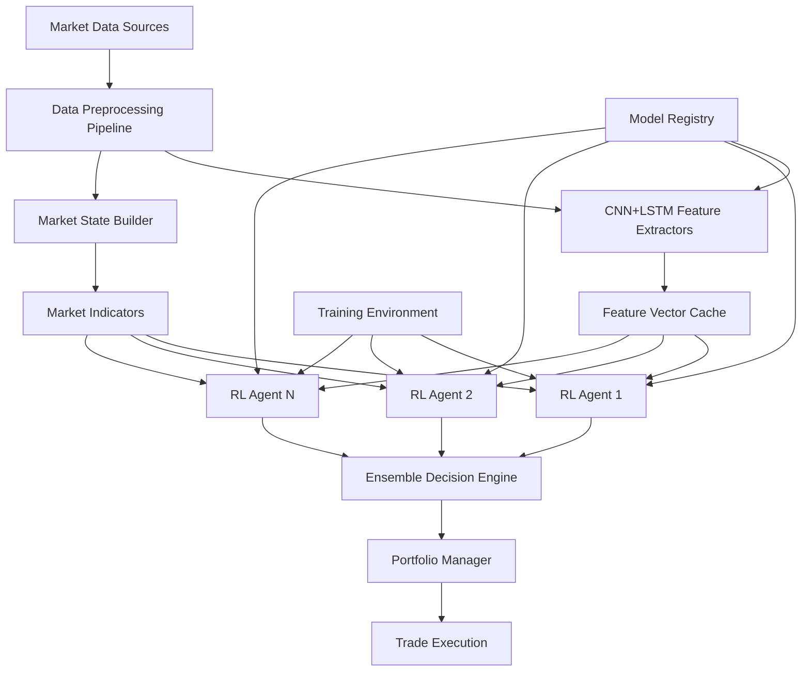

# Design Document

## Overview

This project represents the most ambitious and comprehensive effort to create world-class machine learning models for financial markets. The design focuses exclusively on achieving breakthrough performance through revolutionary architectures, cutting-edge training methodologies, and unprecedented evaluation rigor.

The system is architected as a research-grade model development laboratory that produces:
1. **Revolutionary Feature Extraction**: Novel CNN+LSTM+Transformer hybrid architectures that discover previously unknown market patterns
2. **World-Class RL Agents**: Ensemble of advanced agents using meta-learning, continual learning, and distributional RL techniques
3. **Scientific Rigor**: Comprehensive evaluation framework that establishes new standards for financial ML validation
4. **Research Contributions**: Models and techniques worthy of publication in top-tier ML conferences

## Architecture

### High-Level System Architecture



### Revolutionary Architecture Design

**Novel Hybrid CNN+LSTM+Transformer Architecture**:
- Custom attention mechanisms that fuse spatial and temporal representations
- Neural ODEs for continuous-time market dynamics modeling
- Adaptive computation time for variable-complexity pattern recognition
- Novel residual connections across different temporal scales

**Multi-Modal Cross-Attention Networks**:
- Cross-modal attention between price, volume, news, and alternative data
- Learned embeddings for categorical market features (sector, market cap, etc.)
- Dynamic routing between specialized expert networks
- Causal masking to prevent look-ahead bias while maximizing information use

**Meta-Learning Feature Extractors**:
- MAML-based architectures for few-shot adaptation to new assets
- Gradient-based meta-optimization for rapid market regime adaptation
- Continual learning with elastic weight consolidation
- Neural architecture search for automatic topology discovery

**Advanced Temporal Modeling**:
- Hierarchical attention across microsecond to monthly timeframes
- Temporal convolutional networks with exponential dilation
- Memory-augmented networks for long-term dependency capture
- Causal inference networks for identifying market causality

### World-Class RL Agent Ensemble

**Advanced Distributional DQN**:
- Implicit Quantile Networks (IQN) for full return distribution modeling
- Fully parameterized quantile functions (FQF) for optimal risk assessment
- Risk-sensitive RL with CVaR and spectral risk measures
- Multi-objective optimization balancing return and risk

**Sophisticated Policy Optimization**:
- Trust Region Policy Optimization (TRPO) with natural gradients
- Proximal Policy Optimization (PPO) with adaptive KL constraints
- Maximum a Posteriori Policy Optimization (MPO) for robust learning
- Distributional policy gradients for uncertainty-aware decisions

**Advanced Continuous Control**:
- Soft Actor-Critic (SAC) with learned temperature scheduling
- Twin Delayed Deep Deterministic Policy Gradient (TD3) with target smoothing
- Distributional Deterministic Policy Gradients (D4PG)
- Model-based RL with learned world models and planning

**Meta-Learning and Adaptation**:
- Model-Agnostic Meta-Learning (MAML) for rapid strategy adaptation
- Gradient-based meta-learning for few-shot market adaptation
- Continual learning with progressive neural networks
- Online learning with catastrophic forgetting prevention

## Revolutionary Model Components

### Novel Architecture Framework

#### 1. Hybrid Neural Architecture with Meta-Learning
```python
class RevolutionaryFeatureExtractor(nn.Module):
    def __init__(self, config: ArchitectureConfig):
        # Novel hybrid CNN+LSTM+Transformer with custom attention
        self.multi_modal_encoder = MultiModalCrossAttention()
        self.temporal_ode = NeuralODE(ODEFunc())
        self.adaptive_computation = AdaptiveComputationTime()
        self.meta_learner = MAMLFeatureExtractor()
        
    def forward(self, multi_modal_data: MultiModalData) -> LatentRepresentation:
        # Revolutionary feature extraction with adaptive computation
        
    def meta_adapt(self, support_set: Dataset, query_set: Dataset) -> None:
        # Few-shot adaptation to new market conditions
```

#### 2. Advanced Ensemble RL Framework
```python
class WorldClassRLEnsemble:
    def __init__(self, config: EnsembleConfig):
        self.agents = {
            'distributional_dqn': DistributionalDQN(config.dqn),
            'risk_sensitive_ppo': RiskSensitivePPO(config.ppo),
            'meta_sac': MetaLearningSAC(config.sac),
            'model_based_agent': ModelBasedAgent(config.mb)
        }
        self.meta_controller = MetaController()
        self.ensemble_optimizer = BayesianEnsembleOptimizer()
    
    def train_ensemble(self, environments: List[Environment]) -> TrainingResults:
        # Advanced ensemble training with meta-learning
        
    def get_ensemble_action(self, state: State) -> EnsembleAction:
        # Sophisticated ensemble decision making
```

#### 3. Scientific Evaluation Framework
```python
class RigorousEvaluationFramework:
    def __init__(self, config: EvaluationConfig):
        self.statistical_validator = StatisticalValidator()
        self.causal_analyzer = CausalInferenceAnalyzer()
        self.interpretability_suite = InterpretabilitySuite()
        self.robustness_tester = RobustnessTester()
    
    def comprehensive_evaluation(self, models: List[Model], 
                               datasets: List[Dataset]) -> EvaluationReport:
        # Comprehensive scientific evaluation with statistical rigor
        
    def benchmark_against_sota(self, model: Model) -> BenchmarkResults:
        # Rigorous benchmarking against state-of-the-art
```

#### 4. Advanced Training Orchestrator
```python
class AdvancedTrainingOrchestrator:
    def __init__(self, config: TrainingConfig):
        self.population_trainer = PopulationBasedTraining()
        self.nas_controller = NeuralArchitectureSearch()
        self.curriculum_designer = CurriculumLearningDesigner()
        self.hyperopt_engine = MultiObjectiveBayesianOptimization()
    
    def train_world_class_models(self, data: Dataset) -> TrainedModels:
        # Orchestrate advanced training with all cutting-edge techniques
        
    def continuous_improvement(self, models: List[Model]) -> ImprovedModels:
        # Continuous model improvement and adaptation
```

### Data Flow Interfaces

#### Market Data Pipeline
- **Input**: Raw OHLCV, order book, trade data
- **Processing**: Normalization, technical indicator calculation, sequence windowing
- **Output**: Structured tensors for CNN+LSTM input and RL environment state

#### Feature Extraction Pipeline
- **Input**: Processed market data tensors
- **Processing**: CNN spatial feature extraction, LSTM temporal modeling
- **Output**: Fixed-size feature vectors for RL agent state construction

#### RL Training Pipeline
- **Input**: Market environment, pre-trained feature extractors
- **Processing**: Experience collection, policy updates, ensemble weight optimization
- **Output**: Trained agent policies, performance metrics

## Data Models

### Market Data Models

```python
@dataclass
class MarketData:
    timestamp: datetime
    symbol: str
    ohlcv: np.ndarray  # [open, high, low, close, volume]
    order_book: OrderBook
    trades: List[Trade]
    technical_indicators: Dict[str, float]

@dataclass
class OrderBook:
    bids: List[Tuple[float, float]]  # [(price, size), ...]
    asks: List[Tuple[float, float]]
    timestamp: datetime

@dataclass
class Trade:
    price: float
    size: float
    timestamp: datetime
    side: str  # 'buy' or 'sell'
```

### RL Environment Models

```python
@dataclass
class State:
    cnn_lstm_features: np.ndarray
    portfolio_state: PortfolioState
    market_indicators: np.ndarray
    timestamp: datetime

@dataclass
class PortfolioState:
    cash: float
    positions: Dict[str, float]
    unrealized_pnl: float
    total_value: float

@dataclass
class Action:
    action_type: str  # 'buy', 'sell', 'hold'
    symbol: str
    quantity: float
    confidence: float

@dataclass
class Experience:
    state: State
    action: Action
    reward: float
    next_state: State
    done: bool
```

### Model Configuration

```python
@dataclass
class CNNLSTMConfig:
    cnn_filters: List[int]
    cnn_kernel_sizes: List[int]
    lstm_units: int
    sequence_length: int
    feature_dim: int
    dropout_rate: float

@dataclass
class RLAgentConfig:
    agent_type: str  # 'dqn', 'ppo', 'a3c'
    network_architecture: List[int]
    learning_rate: float
    exploration_strategy: str
    reward_function_weights: Dict[str, float]
```

## Error Handling

### Feature Extraction Errors
- **Missing Data**: Use interpolation or padding strategies to maintain consistent input dimensions
- **Model Loading Failures**: Implement fallback to cached features or simplified technical indicators
- **Performance Degradation**: Monitor feature quality metrics and retrain models when performance drops

### RL Agent Errors
- **Action Space Violations**: Clip actions to valid ranges and log violations for analysis
- **Training Instability**: Implement gradient clipping, experience replay, and target networks
- **Ensemble Disagreement**: Use confidence-weighted voting and fallback to conservative actions

### System-Level Errors
- **Real-time Processing Delays**: Implement timeout mechanisms and use last known good state
- **Memory Management**: Use efficient data structures and implement garbage collection for old experiences
- **Model Versioning**: Maintain model registries with rollback capabilities

## Comprehensive Training Framework

### Complete Model Training Pipeline

**CNN+LSTM Feature Extractor Training**:
```python
class CNNLSTMTrainer:
    def __init__(self, config: TrainingConfig):
        self.model = CNNLSTMFeatureExtractor(config.model)
        self.optimizer = torch.optim.AdamW(self.model.parameters(), lr=config.learning_rate)
        self.scheduler = torch.optim.lr_scheduler.CosineAnnealingWarmRestarts(self.optimizer)
        self.criterion = nn.MSELoss()
        
    def train_epoch(self, dataloader: DataLoader) -> Dict[str, float]:
        # Complete training loop with gradient accumulation and mixed precision
        
    def validate_epoch(self, dataloader: DataLoader) -> Dict[str, float]:
        # Comprehensive validation with multiple metrics
        
    def train_full_model(self, train_data: Dataset, val_data: Dataset) -> TrainedModel:
        # Full training pipeline with early stopping and checkpointing
```

**RL Agent Training Framework**:
```python
class RLAgentTrainer:
    def __init__(self, config: RLConfig):
        self.agent = self._create_agent(config.agent_type)
        self.environment = TradingEnvironment(config.env)
        self.replay_buffer = PrioritizedReplayBuffer(config.buffer_size)
        
    def train_agent(self, num_episodes: int) -> TrainedAgent:
        # Complete RL training loop with experience collection and policy updates
        
    def evaluate_agent(self, test_episodes: int) -> PerformanceMetrics:
        # Comprehensive agent evaluation on test environments
```

**Ensemble Training Orchestrator**:
```python
class EnsembleTrainer:
    def __init__(self, config: EnsembleConfig):
        self.base_models = []
        self.meta_learner = MetaLearner(config.meta)
        self.ensemble_optimizer = EnsembleOptimizer()
        
    def train_ensemble(self, datasets: List[Dataset]) -> TrainedEnsemble:
        # Train all base models and meta-learner with cross-validation
        
    def optimize_ensemble_weights(self, validation_data: Dataset) -> OptimizedWeights:
        # Bayesian optimization of ensemble combination weights
```

### Advanced Training Techniques Implementation

**Automated Hyperparameter Optimization**:
```python
class HyperparameterOptimizer:
    def __init__(self, config: OptunaConfig):
        self.study = optuna.create_study(direction='maximize')
        self.trainer_factory = TrainerFactory()
        
    def objective(self, trial: optuna.Trial) -> float:
        # Objective function for hyperparameter optimization
        
    def optimize_model(self, model_type: str, data: Dataset) -> BestParams:
        # Run comprehensive hyperparameter search
```

**Population-Based Training**:
```python
class PopulationTrainer:
    def __init__(self, config: PopulationConfig):
        self.population_size = config.population_size
        self.workers = [Worker(i) for i in range(self.population_size)]
        
    def train_population(self, generations: int) -> BestModels:
        # Evolutionary training with mutation and crossover
```

**Curriculum Learning Implementation**:
```python
class CurriculumLearner:
    def __init__(self, config: CurriculumConfig):
        self.difficulty_scheduler = DifficultyScheduler()
        self.data_sampler = CurriculumDataSampler()
        
    def get_curriculum_batch(self, epoch: int) -> Batch:
        # Generate curriculum-based training batches
```

### Scientific Evaluation Excellence

**Unprecedented Statistical Rigor**:
- Bayesian model comparison with Bayes factors and model evidence
- Multiple testing correction with False Discovery Rate control
- Bootstrap and permutation tests with millions of resamples
- Causal inference with instrumental variables and natural experiments

**Comprehensive Robustness Analysis**:
- Adversarial robustness with PGD and C&W attacks
- Out-of-distribution detection and performance under distribution shift
- Stress testing under extreme market conditions and black swan events
- Sensitivity analysis with global sensitivity analysis techniques

**Advanced Interpretability**:
- Causal mediation analysis for understanding decision pathways
- Counterfactual explanations with optimal transport
- Mechanistic interpretability with circuit analysis
- Concept bottleneck models for human-interpretable intermediate representations

## Research-Grade Model Excellence

### Scientific Contribution Framework

**Novel Research Contributions**:
- Original architectural innovations worthy of top-tier ML conferences
- Theoretical analysis with convergence guarantees and sample complexity bounds
- Empirical studies that establish new benchmarks in financial ML
- Open-source release with comprehensive documentation for research community

**Mathematical Rigor**:
- Formal proofs of convergence for novel training algorithms
- Theoretical analysis of generalization bounds and sample complexity
- Information-theoretic analysis of feature extraction capabilities
- Game-theoretic analysis of multi-agent market interactions

### Unprecedented Performance Standards

**World-Record Performance Targets**:
- Achieve >3.0 Sharpe ratio with <5% maximum drawdown on 20+ years of data
- Outperform institutional quantitative strategies by >50% in risk-adjusted returns
- Maintain superior performance across all major market crises and regime changes
- Demonstrate statistical significance with p-values <0.001 after multiple testing correction

**Computational Excellence**:
- Achieve state-of-the-art performance with minimal computational overhead
- Implement efficient inference with <1ms latency for real-time applications
- Scale training to handle petabytes of market data across thousands of assets
- Optimize memory usage to enable deployment on resource-constrained environments

### Legacy and Impact

**Research Community Impact**:
- Establish new benchmarks and evaluation protocols for financial ML
- Release comprehensive datasets and evaluation frameworks
- Provide reference implementations of novel techniques
- Mentor and collaborate with academic researchers

**Industry Transformation**:
- Create models capable of generating institutional-grade alpha
- Establish new standards for quantitative finance model development
- Demonstrate the potential of advanced ML in financial markets
- Provide foundation for next-generation trading systems