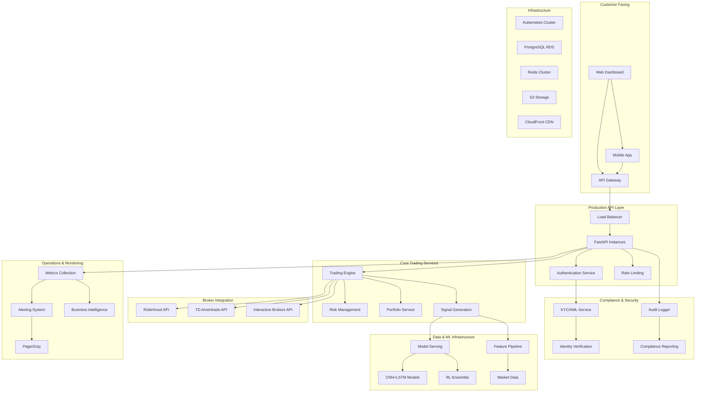

# Production Launch Design Document

## Overview

The production launch design transforms the existing AI Trading Platform from a development system into a commercially viable, enterprise-grade financial services platform. This involves implementing production infrastructure following AWS Well-Architected principles, establishing regulatory compliance frameworks, integrating real money trading capabilities, and creating scalable business operations.

The design emphasizes reliability, security, compliance, and customer success while maintaining the core AI-driven trading capabilities that differentiate the platform.

## Architecture



## Components and Interfaces

### Production Infrastructure Layer

**Load Balancer & CDN**
- AWS Application Load Balancer with SSL termination and health checks
- CloudFront CDN for static assets and API caching
- Route 53 for DNS management with health-based routing
- Auto-scaling groups with target tracking policies

**Container Orchestration**
- Amazon EKS cluster with managed node groups
- Horizontal Pod Autoscaler based on CPU/memory and custom metrics
- Cluster Autoscaler for node-level scaling
- Pod Disruption Budgets for high availability

**Database & Storage**
- Amazon RDS PostgreSQL with Multi-AZ deployment
- Read replicas for analytics and reporting workloads
- Amazon ElastiCache Redis cluster for session and cache data
- S3 for model artifacts, backups, and compliance documents

### Security & Compliance Framework

**Identity & Access Management**
- AWS Cognito for customer authentication with MFA
- OAuth 2.0 integration with broker APIs
- Role-based access control (RBAC) with fine-grained permissions
- API key management for institutional clients

**Data Protection**
- Encryption at rest using AWS KMS with customer-managed keys
- TLS 1.3 for all data in transit with certificate pinning
- Field-level encryption for sensitive PII data
- Secure key rotation policies and HSM integration

**Compliance Services**
- KYC/AML integration with Jumio and Onfido for identity verification
- OFAC and PEP list screening with real-time updates
- Automated compliance reporting for SEC, FINRA, and CFTC
- Audit trail storage with immutable logging

### Real Money Trading Integration

**Broker API Management**
- Unified broker abstraction layer supporting multiple APIs
- OAuth token management with automatic refresh
- Rate limiting and retry logic with exponential backoff
- Real-time position synchronization and reconciliation

**Order Management System**
- Smart order routing based on execution quality
- Risk checks before order submission
- Stop-loss and take-profit order management
- Trade confirmation and settlement tracking

**Risk Management Engine**
- Real-time position monitoring and P&L calculation
- Dynamic position sizing based on volatility and correlation
- Automated risk limit enforcement with circuit breakers
- Stress testing and scenario analysis

### Customer Operations

**Onboarding Pipeline**
- Progressive KYC with document upload and verification
- Risk tolerance assessment and suitability checks
- Broker account linking with secure OAuth flows
- Guided tutorial and demo trading environment

**Customer Support System**
- Zendesk integration with automated ticket routing
- Live chat with escalation to human agents
- Knowledge base with searchable FAQ and tutorials
- Screen sharing and remote assistance capabilities

**Success Management**
- Customer health scoring based on usage and performance
- Automated onboarding sequences and check-ins
- Performance analytics and personalized insights
- Retention campaigns and upgrade recommendations

## Data Models

### Customer Data Model
```python
class Customer(BaseModel):
    customer_id: UUID
    email: EmailStr
    phone: Optional[str]
    kyc_status: KYCStatus
    risk_tolerance: RiskTolerance
    account_tier: AccountTier
    created_at: datetime
    last_login: Optional[datetime]
    
class KYCData(BaseModel):
    customer_id: UUID
    identity_verified: bool
    document_type: DocumentType
    verification_provider: str
    aml_status: AMLStatus
    accredited_investor: bool
```

### Trading Data Model
```python
class BrokerAccount(BaseModel):
    account_id: UUID
    customer_id: UUID
    broker: BrokerType
    account_number: str
    oauth_token: str
    account_status: AccountStatus
    last_sync: datetime
    
class Trade(BaseModel):
    trade_id: UUID
    customer_id: UUID
    broker_account_id: UUID
    symbol: str
    side: TradeSide
    quantity: Decimal
    price: Decimal
    order_type: OrderType
    status: TradeStatus
    executed_at: Optional[datetime]
```

### Compliance Data Model
```python
class AuditLog(BaseModel):
    log_id: UUID
    customer_id: Optional[UUID]
    action: str
    resource: str
    timestamp: datetime
    ip_address: str
    user_agent: str
    result: ActionResult
    
class ComplianceReport(BaseModel):
    report_id: UUID
    report_type: ReportType
    period_start: date
    period_end: date
    generated_at: datetime
    file_path: str
```

## Error Handling

### Circuit Breaker Pattern
- Implement circuit breakers for external API calls (brokers, KYC providers)
- Fail-fast behavior with exponential backoff and jitter
- Health check endpoints for dependency monitoring
- Graceful degradation when services are unavailable

### Retry Strategies
- Exponential backoff with jitter for transient failures
- Dead letter queues for failed message processing
- Idempotent operation design for safe retries
- Timeout configuration based on SLA requirements

### Error Monitoring
- Structured error logging with correlation IDs
- Error rate monitoring with automated alerting
- Error categorization (transient, permanent, user error)
- Root cause analysis with distributed tracing

## Testing Strategy

### Production Readiness Testing
- Load testing with realistic traffic patterns
- Chaos engineering with controlled failure injection
- Security penetration testing and vulnerability scanning
- Compliance testing with regulatory requirements

### Continuous Testing
- Automated regression testing in CI/CD pipeline
- Canary deployments with automated rollback
- A/B testing framework for feature releases
- Synthetic monitoring for critical user journeys

### Business Continuity Testing
- Disaster recovery drills with RTO/RPO validation
- Backup and restore testing procedures
- Failover testing for database and service dependencies
- Business impact analysis and recovery planning

## Deployment Strategy

### Blue-Green Deployment
- Zero-downtime deployments with traffic switching
- Database migration strategies with backward compatibility
- Feature flags for gradual rollout and quick rollback
- Automated smoke tests before traffic cutover

### Infrastructure as Code
- Terraform for AWS resource provisioning
- Helm charts for Kubernetes application deployment
- GitOps workflow with ArgoCD for deployment automation
- Environment parity between dev, staging, and production

### Monitoring and Observability
- Prometheus and Grafana for metrics and dashboards
- ELK stack for centralized logging and analysis
- Jaeger for distributed tracing and performance analysis
- Custom business metrics for trading performance

## Regulatory Compliance Framework

### SEC Compliance
- Investment Adviser registration and Form ADV filing
- Customer protection rules and segregation of assets
- Record keeping requirements with immutable storage
- Periodic compliance examinations and reporting

### FINRA Compliance
- Broker-dealer registration and membership requirements
- Customer identification and verification procedures
- Anti-money laundering (AML) program implementation
- Trade reporting and market surveillance

### Data Privacy Compliance
- GDPR compliance for European customers
- CCPA compliance for California residents
- Data retention and deletion policies
- Privacy by design principles in system architecture

## Business Operations

### Customer Acquisition
- SEO-optimized landing pages with conversion tracking
- Content marketing with trading education and insights
- Referral program with incentive tracking
- Partnership channel with white-label offerings

### Revenue Operations
- Subscription billing with Stripe integration
- Usage-based pricing for API access
- Performance fee calculation and collection
- Revenue recognition and financial reporting

### Customer Success
- Onboarding automation with milestone tracking
- Health scoring based on engagement and performance
- Proactive outreach for at-risk customers
- Expansion revenue identification and execution

## Scalability Considerations

### Horizontal Scaling
- Stateless service design for easy horizontal scaling
- Database sharding strategies for customer data
- Caching layers to reduce database load
- Message queues for asynchronous processing

### Performance Optimization
- CDN for global content delivery
- Database query optimization and indexing
- Connection pooling and resource management
- Batch processing for non-real-time operations

### Cost Optimization
- Reserved instances and spot instances for cost savings
- Auto-scaling policies to match demand
- Resource tagging for cost allocation and optimization
- Regular cost reviews and optimization recommendations

## Security Architecture

### Defense in Depth
- Web Application Firewall (WAF) for application protection
- Network segmentation with VPC and security groups
- Intrusion detection and prevention systems
- Regular security assessments and penetration testing

### Incident Response
- Security incident response plan with defined procedures
- Automated threat detection and response capabilities
- Forensic capabilities for security investigations
- Communication plan for customer and regulatory notification

### Compliance Monitoring
- Continuous compliance monitoring with automated checks
- Regular compliance audits and assessments
- Compliance dashboard for real-time status monitoring
- Remediation workflows for compliance violations