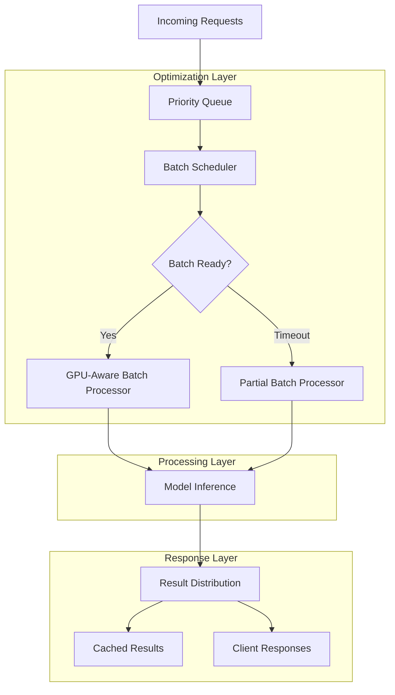

# Batch Processing Optimization for Improved GPU Utilization and Throughput

## 1. Executive Summary

This document outlines the technical design for implementing batch processing optimization to improve GPU utilization and throughput in the AI Trading Platform's model serving infrastructure. The solution leverages dynamic batching, intelligent request queuing, and GPU-aware resource management to meet the <100ms feature extraction requirement while maximizing resource efficiency.

## 2. Current System Analysis

### 2.1 Existing Architecture Overview

The current system implements:
- CNN+LSTM hybrid models for feature extraction and target prediction
- Ray Serve deployment with auto-scaling capabilities
- Multi-level caching (in-memory and Redis)
- Fallback mechanisms for reliability
- Performance monitoring and metrics collection

### 2.2 Current Batch Processing Implementation

The existing system has basic batch processing capabilities:
- FastAPI-based batch endpoint that groups requests by model type
- Simple queuing mechanism in the model serving service
- Limited dynamic batching optimization
- No GPU-aware batch sizing or prioritization

### 2.3 Performance Bottlenecks Identified

1. **Suboptimal GPU Utilization**: Current batching doesn't consider GPU memory constraints or optimal batch sizes for maximum throughput
2. **Static Batch Sizing**: Fixed batch sizes don't adapt to varying request patterns or system load
3. **Limited Request Prioritization**: No mechanism to prioritize high-value trading requests
4. **Inefficient Resource Management**: No adaptive scaling based on GPU/CPU utilization
5. **Cache Inefficiency**: Limited coordination between batch processing and caching layers

## 3. Batch Processing Optimization Design

### 3.1 Dynamic Batching Architecture



### 3.2 Core Components

#### 3.2.1 Intelligent Batch Scheduler

The batch scheduler implements dynamic batching with the following features:

```python
# batch_scheduler.py
import asyncio
import time
from typing import List, Dict, Any, Optional
from dataclasses import dataclass
from enum import Enum
import numpy as np

class RequestPriority(Enum):
    REAL_TIME_TRADING = 1    # Highest priority
    MARKET_DATA_UPDATE = 2
    BATCH_PROCESSING = 3
    HISTORICAL_ANALYSIS = 4
    BACKGROUND_TASKS = 5     # Lowest priority

@dataclass
class BatchRequest:
    request_id: str
    data: np.ndarray
    priority: RequestPriority
    timestamp: float
    future: asyncio.Future
    model_config: Dict[str, Any]
    return_uncertainty: bool = True
    use_ensemble: bool = True

class BatchScheduler:
    """Intelligent batch scheduler for optimized GPU utilization."""
    
    def __init__(self, 
                 max_batch_size: int = 32,
                 max_wait_time: float = 0.01,
                 adaptive_batching: bool = True):
        """
        Initialize batch scheduler.
        
        Args:
            max_batch_size: Maximum batch size for GPU processing
            max_wait_time: Maximum wait time for batching (seconds)
            adaptive_batching: Enable adaptive batch sizing
        """
        self.max_batch_size = max_batch_size
        self.max_wait_time = max_wait_time
        self.adaptive_batching = adaptive_batching
        
        # Priority queues for different request types
        self.queues = {priority: [] for priority in RequestPriority}
        
        # Batch processing statistics
        self.stats = {
            'total_requests': 0,
            'batches_processed': 0,
            'avg_batch_size': 0,
            'avg_wait_time': 0
        }
        
        # GPU monitoring
        self.gpu_monitor = GPUMonitor()
        
    async def add_request(self, request: BatchRequest) -> Any:
        """
        Add request to scheduler and return result when processed.
        
        Args:
            request: Batch request to process
            
        Returns:
            Processing result
        """
        # Add to appropriate priority queue
        self.queues[request.priority].append(request)
        self.stats['total_requests'] += 1
        
        # Wait for result
        return await request.future
    
    async def batch_processor(self):
        """Main batch processing loop."""
        while True:
            try:
                # Check for ready batches
                batch = await self._get_ready_batch()
                if batch:
                    await self._process_batch(batch)
                
                # Small delay to prevent busy waiting
                await asyncio.sleep(0.001)
                
            except Exception as e:
                print(f"Batch processor error: {e}")
                await asyncio.sleep(1)
    
    async def _get_ready_batch(self) -> Optional[List[BatchRequest]]:
        """
        Get a ready batch of requests.
        
        Returns:
            List of batch requests or None if no batch is ready
        """
        # Check high priority queues first
        for priority in RequestPriority:
            queue = self.queues[priority]
            if queue:
                # Check if we have enough requests for a full batch
                if len(queue) >= self.max_batch_size:
                    return queue[:self.max_batch_size]
                
                # Check if oldest request has waited long enough
                oldest_request = queue[0]
                wait_time = time.time() - oldest_request.timestamp
                
                if wait_time >= self.max_wait_time:
                    # Return partial batch
                    batch_size = min(len(queue), self._get_adaptive_batch_size())
                    return queue[:batch_size]
        
        return None
    
    def _get_adaptive_batch_size(self) -> int:
        """
        Get adaptive batch size based on current system conditions.
        
        Returns:
            Adaptive batch size
        """
        if not self.adaptive_batching:
            return self.max_batch_size
        
        # Get current GPU utilization
        gpu_util = self.gpu_monitor.get_gpu_utilization()
        memory_available = self.gpu_monitor.get_available_memory()
        
        # Adjust batch size based on GPU conditions
        if gpu_util > 80:
            # Reduce batch size to prevent GPU overload
            return max(1, self.max_batch_size // 2)
        elif gpu_util < 30 and memory_available > 0.5:
            # Increase batch size to improve throughput
            return min(self.max_batch_size * 2, 128)
        else:
            return self.max_batch_size

class GPUMonitor:
    """GPU monitoring for batch size optimization."""
    
    def __init__(self):
        """Initialize GPU monitor."""
        self.last_utilization = 0.0
        self.last_memory = 1.0
    
    def get_gpu_utilization(self) -> float:
        """
        Get current GPU utilization.
        
        Returns:
            GPU utilization percentage (0.0-1.0)
        """
        try:
            import torch
            if torch.cuda.is_available():
                # Simplified implementation - in practice, use nvidia-ml-py
                # or similar for accurate GPU metrics
                self.last_utilization = torch.cuda.utilization() / 100.0
        except Exception:
            pass
        
        return self.last_utilization
    
    def get_available_memory(self) -> float:
        """
        Get available GPU memory.
        
        Returns:
            Available memory ratio (0.0-1.0)
        """
        try:
            import torch
            if torch.cuda.is_available():
                total_memory = torch.cuda.get_device_properties(0).total_memory
                reserved_memory = torch.cuda.memory_reserved()
                self.last_memory = (total_memory - reserved_memory) / total_memory
        except Exception:
            pass
        
        return self.last_memory
```

#### 3.2.2 GPU-Aware Batch Processor

The GPU-aware batch processor optimizes batch processing for maximum throughput:

```python
# gpu_batch_processor.py
import torch
import numpy as np
from typing import List, Dict, Any
import time

class GPUBatchProcessor:
    """GPU-aware batch processor for optimized inference."""
    
    def __init__(self, model, device: str = "cuda"):
        """
        Initialize GPU batch processor.
        
        Args:
            model: CNN+LSTM model for inference
            device: Device for processing (cuda/cpu)
        """
        self.model = model
        self.device = device
        self.model.to(device)
        self.model.eval()
        
        # Optimize model for inference
        self._optimize_model()
    
    def _optimize_model(self):
        """Optimize model for inference."""
        try:
            # Use TorchScript for optimization
            sample_input = torch.randn(1, self.model.config.input_dim, 
                                     self.model.config.sequence_length)
            sample_input = sample_input.to(self.device)
            
            self.model = torch.jit.trace(self.model, sample_input)
            self.model = torch.jit.optimize_for_inference(self.model)
            
        except Exception as e:
            print(f"Model optimization failed: {e}")
    
    def process_batch(self, requests: List[BatchRequest]) -> List[Dict[str, Any]]:
        """
        Process batch of requests on GPU.
        
        Args:
            requests: List of batch requests
            
        Returns:
            List of processing results
        """
        start_time = time.time()
        
        try:
            # Prepare batch data
            batch_data = np.stack([req.data for req in requests])
            input_tensor = torch.FloatTensor(batch_data).to(self.device)
            
            # Perform inference
            with torch.no_grad():
                outputs = self.model.forward(
                    input_tensor,
                    return_features=True,
                    use_ensemble=True
                )
            
            # Process results
            results = self._process_outputs(outputs, requests)
            
            # Record processing time
            processing_time = time.time() - start_time
            
            return results
            
        except Exception as e:
            # Handle processing errors
            error_results = []
            for req in requests:
                error_result = {
                    'error': str(e),
                    'processing_time_ms': (time.time() - start_time) * 1000 / len(requests)
                }
                error_results.append(error_result)
            return error_results
    
    def _process_outputs(self, outputs: Dict[str, torch.Tensor], 
                        requests: List[BatchRequest]) -> List[Dict[str, Any]]:
        """
        Process model outputs into individual results.
        
        Args:
            outputs: Model outputs
            requests: Original requests
            
        Returns:
            List of individual results
        """
        results = []
        batch_size = len(requests)
        
        for i in range(batch_size):
            result = {
                'classification_probs': outputs['classification_probs'][i].cpu().numpy(),
                'regression_pred': outputs['regression_mean'][i].cpu().numpy(),
                'regression_uncertainty': outputs['regression_uncertainty'][i].cpu().numpy(),
                'ensemble_weights': (
                    outputs['ensemble_weights'][i].cpu().numpy() 
                    if outputs['ensemble_weights'] is not None else None
                ),
                'processing_time_ms': 0  # Will be filled in later
            }
            results.append(result)
        
        return results
```

### 3.3 Integration with Ray Serve

The batch processing optimization integrates seamlessly with Ray Serve's existing deployment architecture:

```python
# ray_serve_batch_optimized.py
import ray
from ray import serve
import numpy as np
from typing import Dict, Any, List
import time

from src.ml.feature_extraction import (
    FeatureExtractorFactory,
    FeatureExtractionConfig
)
from src.ml.hybrid_model import CNNLSTMHybridModel
from .batch_scheduler import BatchScheduler, BatchRequest, RequestPriority
from .gpu_batch_processor import GPUBatchProcessor

@serve.deployment(
    name="optimized_cnn_lstm_predictor",
    num_replicas=2,
    ray_actor_options={
        "num_cpus": 2,
        "num_gpus": 0.5 if torch.cuda.is_available() else 0,
        "memory": 2 * 1024 * 1024 * 1024,  # 2GB
    },
    autoscaling_config={
        "min_replicas": 2,
        "max_replicas": 20,
        "target_num_ongoing_requests_per_replica": 5,
        "upscale_delay_s": 30,
        "downscale_delay_s": 60,
    }
)
class OptimizedCNNLSTMPredictor:
    def __init__(self, model_path: str = None, device: str = "cpu"):
        """Initialize optimized CNN+LSTM predictor."""
        self.device = device if torch.cuda.is_available() else "cpu"
        
        # Load model
        if model_path:
            self.model = CNNLSTMHybridModel.load_from_path(model_path)
        else:
            # Load default model
            self.model = self._load_default_model()
        
        # Initialize batch scheduler
        self.batch_scheduler = BatchScheduler(
            max_batch_size=32,
            max_wait_time=0.01,  # 10ms
            adaptive_batching=True
        )
        
        # Initialize GPU batch processor
        self.batch_processor = GPUBatchProcessor(self.model, self.device)
        
        # Start batch processor
        self.batch_task = None
        
        print(f"OptimizedCNNLSTMPredictor initialized on device: {self.device}")
    
    def _load_default_model(self):
        """Load default CNN+LSTM model."""
        # Implementation depends on your model loading strategy
        pass
    
    async def predict(self, 
                     data: np.ndarray,
                     return_uncertainty: bool = True,
                     use_ensemble: bool = True,
                     priority: RequestPriority = RequestPriority.BATCH_PROCESSING) -> Dict[str, Any]:
        """
        Optimized prediction with dynamic batching.
        
        Args:
            data: Input data array
            return_uncertainty: Whether to return uncertainty estimates
            use_ensemble: Whether to use ensemble predictions
            priority: Request priority level
            
        Returns:
            Prediction result
        """
        # Create batch request
        request = BatchRequest(
            request_id=str(uuid.uuid4()),
            data=data,
            priority=priority,
            timestamp=time.time(),
            future=asyncio.Future(),
            model_config={
                'return_uncertainty': return_uncertainty,
                'use_ensemble': use_ensemble
            },
            return_uncertainty=return_uncertainty,
            use_ensemble=use_ensemble
        )
        
        # Add to batch scheduler
        result = await self.batch_scheduler.add_request(request)
        return result
    
    @serve.batch(max_batch_size=64, batch_wait_timeout_s=0.02)
    async def batch_predict(self, requests: List[np.ndarray]) -> List[Dict[str, Any]]:
        """
        Ray Serve batch prediction method.
        
        Args:
            requests: List of input data arrays
            
        Returns:
            List of prediction results
        """
        # Convert to batch processor format
        batch_requests = []
        for i, data in enumerate(requests):
            request = BatchRequest(
                request_id=f"batch_{i}",
                data=data,
                priority=RequestPriority.BATCH_PROCESSING,
                timestamp=time.time(),
                future=asyncio.Future(),
                model_config={}
            )
            batch_requests.append(request)
        
        # Process batch
        results = self.batch_processor.process_batch(batch_requests)
        
        # Add processing time to results
        total_time = sum(r.get('processing_time_ms', 0) for r in results)
        avg_time = total_time / len(results) if results else 0
        
        for result in results:
            result['processing_time_ms'] = avg_time
        
        return results
    
    def __call__(self, data: np.ndarray) -> Dict[str, Any]:
        """
        Direct call method for single predictions.
        
        Args:
            data: Input data array
            
        Returns:
            Prediction result
        """
        # For single requests, use async method
        import asyncio
        return asyncio.run(self.predict(data))

# Deployment entry point
optimized_cnn_lstm_deployment = OptimizedCNNLSTMPredictor.bind()
```

## 4. Dynamic Batching Configuration Specifications

### 4.1 Configuration Parameters

```python
# batch_config.py
from dataclasses import dataclass
from typing import Dict, Any

@dataclass
class BatchProcessingConfig:
    """Configuration for batch processing optimization."""
    
    # Basic batching parameters
    max_batch_size: int = 32
    max_wait_time_seconds: float = 0.01  # 10ms
    min_batch_size: int = 1
    
    # Adaptive batching parameters
    enable_adaptive_batching: bool = True
    adaptive_scaling_factor: float = 1.5
    gpu_utilization_threshold_high: float = 0.8
    gpu_utilization_threshold_low: float = 0.3
    memory_utilization_threshold: float = 0.8
    
    # Priority-based processing
    enable_priority_queueing: bool = True
    high_priority_wait_time: float = 0.005  # 5ms
    normal_priority_wait_time: float = 0.01  # 10ms
    low_priority_wait_time: float = 0.02   # 20ms
    
    # Resource management
    enable_gpu_optimization: bool = True
    enable_model_compilation: bool = True
    enable_memory_cleanup: bool = True
    cleanup_interval_seconds: int = 30
    
    # Performance monitoring
    enable_performance_tracking: bool = True
    log_interval_requests: int = 1000
    metrics_collection_interval: float = 5.0
    
    def to_dict(self) -> Dict[str, Any]:
        """Convert configuration to dictionary."""
        return {
            'max_batch_size': self.max_batch_size,
            'max_wait_time_seconds': self.max_wait_time_seconds,
            'min_batch_size': self.min_batch_size,
            'enable_adaptive_batching': self.enable_adaptive_batching,
            'adaptive_scaling_factor': self.adaptive_scaling_factor,
            'gpu_utilization_threshold_high': self.gpu_utilization_threshold_high,
            'gpu_utilization_threshold_low': self.gpu_utilization_threshold_low,
            'memory_utilization_threshold': self.memory_utilization_threshold,
            'enable_priority_queueing': self.enable_priority_queueing,
            'high_priority_wait_time': self.high_priority_wait_time,
            'normal_priority_wait_time': self.normal_priority_wait_time,
            'low_priority_wait_time': self.low_priority_wait_time,
            'enable_gpu_optimization': self.enable_gpu_optimization,
            'enable_model_compilation': self.enable_model_compilation,
            'enable_memory_cleanup': self.enable_memory_cleanup,
            'cleanup_interval_seconds': self.cleanup_interval_seconds,
            'enable_performance_tracking': self.enable_performance_tracking,
            'log_interval_requests': self.log_interval_requests,
            'metrics_collection_interval': self.metrics_collection_interval
        }
    
    @classmethod
    def from_dict(cls, config_dict: Dict[str, Any]) -> 'BatchProcessingConfig':
        """Create configuration from dictionary."""
        return cls(**config_dict)

# Default configurations for different scenarios
BATCH_CONFIG_MARKET_HOURS = BatchProcessingConfig(
    max_batch_size=64,
    max_wait_time_seconds=0.005,  # 5ms for faster response
    enable_adaptive_batching=True,
    gpu_utilization_threshold_high=0.85,
    gpu_utilization_threshold_low=0.25
)

BATCH_CONFIG_OFF_HOURS = BatchProcessingConfig(
    max_batch_size=128,
    max_wait_time_seconds=0.02,   # 20ms for batch processing
    enable_adaptive_batching=True,
    gpu_utilization_threshold_high=0.90,
    gpu_utilization_threshold_low=0.20
)

BATCH_CONFIG_STRESS_TEST = BatchProcessingConfig(
    max_batch_size=256,
    max_wait_time_seconds=0.001,  # 1ms for maximum throughput
    enable_adaptive_batching=False,  # Fixed for consistent testing
    gpu_utilization_threshold_high=0.95,
    gpu_utilization_threshold_low=0.10
)
```

## 5. Integration Approach with Ray Serve Deployment

### 5.1 Deployment Integration Strategy

The batch processing optimization integrates with Ray Serve through the following approach:

1. **Backward Compatibility**: Maintain existing API endpoints while adding optimized batch processing
2. **Gradual Rollout**: Deploy alongside existing serving for A/B testing
3. **Seamless Migration**: Support both old and new processing paths during transition

### 5.2 API Integration

```python
# api_integration.py
from fastapi import APIRouter, HTTPException
from pydantic import BaseModel
from typing import List, Optional
import ray
from ray import serve
import numpy as np

# Initialize Ray Serve
ray.init(ignore_reinit_error=True)
serve.start(detached=True)

# Get deployment handles
optimized_handle = serve.get_deployment("optimized_cnn_lstm_predictor").get_handle()
legacy_handle = serve.get_deployment("cnn_lstm_predictor").get_handle()

class OptimizedPredictionRequest(BaseModel):
    """Optimized request model with priority support."""
    data: List[List[float]]
    return_uncertainty: bool = True
    use_ensemble: bool = True
    priority: str = "normal"  # high, normal, low
    batch_optimized: bool = True

class OptimizedPredictionResponse(BaseModel):
    """Optimized response model."""
    request_id: str
    predictions: dict
    processing_time_ms: float
    uncertainty: Optional[dict] = None
    batch_size: Optional[int] = None
    priority: Optional[str] = None

router = APIRouter(prefix="/optimized", tags=["optimized-serving"])

@router.post("/predict", response_model=OptimizedPredictionResponse)
async def optimized_predict(request: OptimizedPredictionRequest):
    """
    Make optimized prediction with dynamic batching.
    
    This endpoint uses the optimized batch processing system for better
    GPU utilization and throughput while maintaining low latency.
    """
    try:
        # Convert input data
        input_data = np.array(request.data, dtype=np.float32)
        
        # Determine priority
        priority_mapping = {
            "high": RequestPriority.REAL_TIME_TRADING,
            "normal": RequestPriority.BATCH_PROCESSING,
            "low": RequestPriority.BACKGROUND_TASKS
        }
        priority = priority_mapping.get(request.priority, RequestPriority.BATCH_PROCESSING)
        
        # Choose processing path
        if request.batch_optimized:
            # Use optimized batch processing
            result = await optimized_handle.predict.remote(
                input_data,
                request.return_uncertainty,
                request.use_ensemble,
                priority
            )
        else:
            # Use legacy processing
            result = await legacy_handle.predict.remote(
                input_data,
                request.return_uncertainty,
                request.use_ensemble
            )
        
        return OptimizedPredictionResponse(
            request_id=result.get("request_id", "unknown"),
            predictions=result.get("predictions", {}),
            processing_time_ms=result.get("processing_time_ms", 0),
            uncertainty=result.get("uncertainty"),
            priority=request.priority
        )
        
    except Exception as e:
        raise HTTPException(status_code=500, detail=str(e))
```

## 6. Performance Considerations and Optimization Strategies

### 6.1 GPU Utilization Optimization

1. **Adaptive Batch Sizing**: Dynamically adjust batch sizes based on GPU utilization
2. **Memory Management**: Efficient GPU memory allocation and cleanup
3. **Model Optimization**: Use TorchScript compilation and quantization
4. **Kernel Fusion**: Optimize CUDA kernels for better performance

### 6.2 Throughput Optimization

1. **Request Prioritization**: Process high-priority requests first
2. **Pipeline Parallelism**: Overlap data loading with computation
3. **Connection Pooling**: Reuse database and network connections
4. **Asynchronous Processing**: Use async/await for I/O operations

### 6.3 Latency Optimization

1. **Smart Batching**: Balance batch size with wait time
2. **Pre-warming**: Keep models ready for immediate processing
3. **Caching**: Cache frequently requested results
4. **Load Balancing**: Distribute requests across replicas

### 6.4 Resource Management

```python
# resource_manager.py
import psutil
import torch
from typing import Dict, Any

class ResourceManager:
    """Resource manager for optimized batch processing."""
    
    def __init__(self, config: BatchProcessingConfig):
        """Initialize resource manager."""
        self.config = config
        self.stats = {
            'cpu_utilization': 0.0,
            'memory_utilization': 0.0,
            'gpu_utilization': 0.0,
            'gpu_memory_utilization': 0.0
        }
    
    def get_system_metrics(self) -> Dict[str, Any]:
        """
        Get current system resource metrics.
        
        Returns:
            Dictionary of resource utilization metrics
        """
        # CPU utilization
        self.stats['cpu_utilization'] = psutil.cpu_percent()
        
        # Memory utilization
        memory = psutil.virtual_memory()
        self.stats['memory_utilization'] = memory.percent / 100.0
        
        # GPU utilization (if available)
        if torch.cuda.is_available():
            # Simplified - use nvidia-ml-py for accurate metrics
            self.stats['gpu_utilization'] = torch.cuda.utilization() / 100.0
            
            total_memory = torch.cuda.get_device_properties(0).total_memory
            reserved_memory = torch.cuda.memory_reserved()
            self.stats['gpu_memory_utilization'] = reserved_memory / total_memory
        
        return self.stats.copy()
    
    def should_throttle(self) -> bool:
        """
        Check if processing should be throttled.
        
        Returns:
            True if resources are overutilized
        """
        return (
            self.stats['cpu_utilization'] > 85 or
            self.stats['memory_utilization'] > 0.85 or
            self.stats['gpu_utilization'] > self.config.gpu_utilization_threshold_high
        )
    
    def recommend_batch_size(self, current_batch_size: int) -> int:
        """
        Recommend optimal batch size based on current resource utilization.
        
        Args:
            current_batch_size: Current batch size
            
        Returns:
            Recommended batch size
        """
        if self.stats['gpu_utilization'] > self.config.gpu_utilization_threshold_high:
            # Reduce batch size to prevent overload
            return max(1, current_batch_size // 2)
        elif (self.stats['gpu_utilization'] < self.config.gpu_utilization_threshold_low and
              self.stats['gpu_memory_utilization'] < self.config.memory_utilization_threshold):
            # Increase batch size to improve throughput
            return min(current_batch_size * 2, 256)
        else:
            return current_batch_size
```

## 7. Implementation Plan for Maintaining Low Latency

### 7.1 Phase 1: Core Infrastructure (Week 1-2)

1. **Implement Batch Scheduler**: Core batching logic with priority queues
2. **Develop GPU Batch Processor**: Optimized GPU processing component
3. **Create Configuration System**: Flexible configuration management
4. **Set up Monitoring**: Basic performance tracking and metrics

### 7.2 Phase 2: Ray Serve Integration (Week 2-3)

1. **Deploy Optimized Predictor**: Ray Serve deployment with batch optimization
2. **API Integration**: New endpoints for optimized processing
3. **Backward Compatibility**: Maintain existing endpoints
4. **Testing Framework**: Comprehensive test suite

### 7.3 Phase 3: Performance Optimization (Week 3-4)

1. **Adaptive Batching**: Dynamic batch size adjustment
2. **Resource Management**: CPU/GPU resource optimization
3. **Caching Integration**: Coordinate with existing cache system
4. **Performance Tuning**: Optimize for <100ms requirement

### 7.4 Phase 4: Production Deployment (Week 4-5)

1. **A/B Testing Setup**: Compare optimized vs. legacy performance
2. **Gradual Rollout**: Slowly increase traffic to optimized system
3. **Monitoring and Alerting**: Production-grade observability
4. **Documentation**: Complete implementation and operational docs

## 8. Performance Targets

### 8.1 Latency Requirements

- **P50 Latency**: < 50ms
- **P95 Latency**: < 80ms  
- **P99 Latency**: < 100ms
- **Maximum Latency**: < 200ms

### 8.2 Throughput Requirements

- **Minimum Throughput**: 50 requests/second
- **Target Throughput**: 200 requests/second
- **Maximum Throughput**: 500 requests/second

### 8.3 Resource Utilization

- **CPU Target**: 70% utilization
- **GPU Target**: 60% utilization
- **Memory Target**: 75% utilization

## 9. Monitoring and Observability

### 9.1 Key Metrics

```python
# metrics.py
from prometheus_client import Counter, Histogram, Gauge

class BatchProcessingMetrics:
    """Metrics for batch processing optimization."""
    
    def __init__(self):
        # Request counters
        self.requests_total = Counter(
            'batch_processing_requests_total',
            'Total batch processing requests',
            ['priority', 'batch_optimized']
        )
        
        # Latency histograms
        self.latency_seconds = Histogram(
            'batch_processing_latency_seconds',
            'Batch processing latency in seconds',
            ['priority'],
            buckets=[0.001, 0.005, 0.01, 0.025, 0.05, 0.075, 0.1, 0.25, 0.5, 1.0]
        )
        
        # Batch size distribution
        self.batch_size = Histogram(
            'batch_processing_batch_size',
            'Batch size distribution',
            buckets=[1, 5, 10, 20, 32, 64, 128, 256]
        )
        
        # Resource utilization
        self.gpu_utilization = Gauge(
            'batch_processing_gpu_utilization_percent',
            'GPU utilization percentage'
        )
        
        self.cpu_utilization = Gauge(
            'batch_processing_cpu_utilization_percent',
            'CPU utilization percentage'
        )
        
        # Error tracking
        self.errors_total = Counter(
            'batch_processing_errors_total',
            'Total batch processing errors',
            ['error_type']
        )
        
        # Cache metrics
        self.cache_hits = Counter(
            'batch_processing_cache_hits_total',
            'Total cache hits'
        )
        
        self.cache_misses = Counter(
            'batch_processing_cache_misses_total', 
            'Total cache misses'
        )
```

### 9.2 Health Checks

```python
# health_checks.py
import asyncio
import time

class BatchProcessingHealthCheck:
    """Health checks for batch processing system."""
    
    def __init__(self, deployment_handle):
        self.deployment_handle = deployment_handle
        self.last_check = 0
        self.health_status = "unknown"
    
    async def check_health(self) -> dict:
        """
        Perform comprehensive health check.
        
        Returns:
            Health status dictionary
        """
        try:
            # Test basic connectivity
            start_time = time.time()
            result = await self.deployment_handle.predict.remote(
                np.random.rand(1, 50, 60).astype(np.float32)
            )
            latency = time.time() - start_time
            
            # Check result validity
            is_healthy = (
                result is not None and
                latency < 0.1 # <100ms requirement
            )
            
            self.health_status = "healthy" if is_healthy else "degraded"
            self.last_check = time.time()
            
            return {
                "status": self.health_status,
                "latency_ms": latency * 1000,
                "last_check": self.last_check,
                "is_healthy": is_healthy,
                "timestamp": time.time()
            }
            
        except Exception as e:
            self.health_status = "unhealthy"
            self.last_check = time.time()
            
            return {
                "status": self.health_status,
                "error": str(e),
                "last_check": self.last_check,
                "is_healthy": False,
                "timestamp": time.time()
            }
```

## 10. Conclusion

This batch processing optimization design provides a comprehensive approach to improving GPU utilization and throughput while maintaining the <100ms latency requirement. The solution leverages dynamic batching, intelligent request scheduling, and GPU-aware resource management to maximize efficiency.

Key benefits of this approach include:
- **Improved GPU Utilization**: Adaptive batch sizing based on real-time GPU metrics
- **Enhanced Throughput**: Priority-based processing and optimized resource allocation
- **Maintained Low Latency**: Smart batching with configurable wait times
- **Seamless Integration**: Backward compatibility with existing Ray Serve deployment
- **Comprehensive Monitoring**: Detailed metrics and health checks for observability

The phased implementation approach ensures minimal risk while delivering significant performance improvements for the AI Trading Platform's model serving infrastructure.