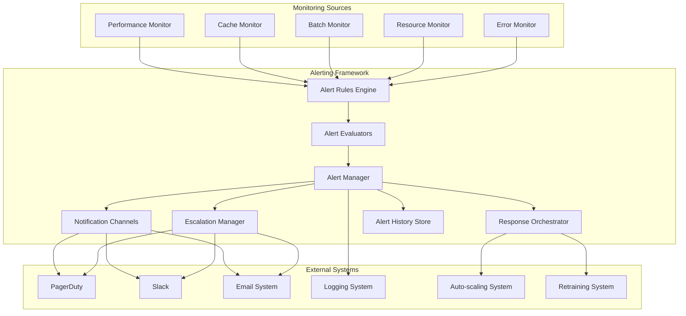

# Feature Extraction Alerting Strategies and Escalation Procedures

## 1. Overview

This document defines comprehensive alerting strategies and escalation procedures for the feature extraction performance monitoring system. These strategies ensure that performance violations are detected, communicated, and responded to appropriately while minimizing alert fatigue and maximizing operational efficiency.

## 2. Alerting Framework Architecture

### 2.1 Alerting System Components



### 2.2 Core Alerting Classes

```python
# src/services/monitoring/alerting_framework.py
from dataclasses import dataclass, field
from typing import Dict, List, Any, Callable, Optional
from enum import Enum
from datetime import datetime, timedelta
import uuid
import asyncio

class AlertSeverity(Enum):
    """Alert severity levels"""
    LOW = "low"
    MEDIUM = "medium"
    HIGH = "high"
    CRITICAL = "critical"

class AlertStatus(Enum):
    """Alert status states"""
    ACTIVE = "active"
    ACKNOWLEDGED = "acknowledged"
    RESOLVED = "resolved"
    SILENCED = "silenced"

@dataclass
class Alert:
    """Core alert data structure"""
    id: str
    name: str
    severity: AlertSeverity
    message: str
    timestamp: datetime
    source_component: str
    source_metrics: Dict[str, Any] = field(default_factory=dict)
    tags: Dict[str, str] = field(default_factory=dict)
    status: AlertStatus = AlertStatus.ACTIVE
    acknowledged_by: Optional[str] = None
    acknowledged_at: Optional[datetime] = None
    resolved_at: Optional[datetime] = None
    escalation_level: int = 1
    notification_history: List[Dict[str, Any]] = field(default_factory=list)

@dataclass
class AlertRule:
    """Configuration for an alert rule"""
    name: str
    severity: AlertSeverity
    condition: Callable[[], bool]
    message_template: str
    evaluation_interval_seconds: int = 15
    cooldown_seconds: int = 300
    auto_resolve: bool = True
    escalation_required: bool = False
    escalation_delay_seconds: int = 600
    max_escalation_levels: int = 3
    enabled: bool = True
    tags: Dict[str, str] = field(default_factory=dict)

class AlertEvaluator:
    """Evaluates alert conditions and generates alerts"""
    
    def __init__(self, name: str):
        self.name = name
        self.alert_rules: List[AlertRule] = []
        self.active_alerts: Dict[str, Alert] = {}
        self.cooldown_end_times: Dict[str, datetime] = {}
        self.evaluation_history: List[Dict[str, Any]] = []
    
    def add_alert_rule(self, rule: AlertRule) -> None:
        """Add an alert rule to the evaluator"""
        self.alert_rules.append(rule)
    
    def evaluate_alerts(self) -> List[Alert]:
        """Evaluate all alert rules and return new alerts"""
        new_alerts = []
        current_time = datetime.now()
        
        for rule in self.alert_rules:
            if not rule.enabled:
                continue
            
            # Check if rule is in cooldown
            if rule.name in self.cooldown_end_times:
                cooldown_end = self.cooldown_end_times[rule.name]
                if current_time < cooldown_end:
                    continue
            
            # Evaluate condition
            try:
                condition_result = rule.condition()
                if condition_result:
                    # Generate alert
                    alert = self._generate_alert(rule, condition_result)
                    new_alerts.append(alert)
                    self.active_alerts[alert.id] = alert
                    
                    # Set cooldown
                    self.cooldown_end_times[rule.name] = (
                        current_time + timedelta(seconds=rule.cooldown_seconds)
                    )
                    
                    # Record evaluation
                    self.evaluation_history.append({
                        "rule_name": rule.name,
                        "timestamp": current_time,
                        "result": "triggered",
                        "alert_id": alert.id
                    })
                else:
                    # Record evaluation
                    self.evaluation_history.append({
                        "rule_name": rule.name,
                        "timestamp": current_time,
                        "result": "not_triggered"
                    })
            except Exception as e:
                # Log evaluation error
                self.evaluation_history.append({
                    "rule_name": rule.name,
                    "timestamp": current_time,
                    "result": "error",
                    "error": str(e)
                })
                logger.error(f"Error evaluating alert rule {rule.name}: {e}")
        
        # Keep evaluation history limited
        if len(self.evaluation_history) > 1000:
            self.evaluation_history = self.evaluation_history[-1000:]
        
        return new_alerts
    
    def _generate_alert(self, rule: AlertRule, condition_result: Any) -> Alert:
        """Generate an alert from a triggered rule"""
        # Format message with condition result
        message = rule.message_template.format(**{"value": condition_result})
        
        alert = Alert(
            id=str(uuid.uuid4()),
            name=rule.name,
            severity=rule.severity,
            message=message,
            timestamp=datetime.now(),
            source_component=self.name,
            tags=rule.tags
        )
        
        return alert
    
    def acknowledge_alert(self, alert_id: str, acknowledged_by: str) -> bool:
        """Acknowledge an alert"""
        if alert_id in self.active_alerts:
            alert = self.active_alerts[alert_id]
            alert.status = AlertStatus.ACKNOWLEDGED
            alert.acknowledged_by = acknowledged_by
            alert.acknowledged_at = datetime.now()
            return True
        return False
    
    def resolve_alert(self, alert_id: str) -> bool:
        """Resolve an alert"""
        if alert_id in self.active_alerts:
            alert = self.active_alerts[alert_id]
            alert.status = AlertStatus.RESOLVED
            alert.resolved_at = datetime.now()
            del self.active_alerts[alert_id]
            return True
        return False
    
    def get_active_alerts(self) -> List[Alert]:
        """Get all active alerts"""
        return list(self.active_alerts.values())
    
    def get_alert_history(self, hours: int = 24) -> List[Alert]:
        """Get alert history for the specified time period"""
        cutoff_time = datetime.now() - timedelta(hours=hours)
        return [
            alert for alert in self.active_alerts.values()
            if alert.timestamp > cutoff_time
        ]
```

## 3. Feature Extraction Specific Alerting

### 3.1 Performance Alert Rules

```python
# src/services/monitoring/feature_extraction_alert_rules.py
from typing import Dict, Any
from datetime import datetime, timedelta

class FeatureExtractionAlertRules:
    """Alert rules specific to feature extraction performance"""
    
    def __init__(self, performance_monitor: FeatureExtractorPerformanceMonitor):
        self.performance_monitor = performance_monitor
        self.alert_evaluator = AlertEvaluator("feature_extraction")
        self._initialize_alert_rules()
    
    def _initialize_alert_rules(self) -> None:
        """Initialize feature extraction specific alert rules"""
        # Latency violation rules
        self.alert_evaluator.add_alert_rule(AlertRule(
            name="latency_violation_critical",
            severity=AlertSeverity.CRITICAL,
            condition=self._latency_violation_critical_condition,
            message_template="Feature extraction 95th percentile latency ({value}ms) exceeds critical threshold of 150ms",
            cooldown_seconds=120,
            escalation_required=True,
            escalation_delay_seconds=300,
            tags={"category": "performance", "type": "latency"}
        ))
        
        self.alert_evaluator.add_alert_rule(AlertRule(
            name="latency_violation_high",
            severity=AlertSeverity.HIGH,
            condition=self._latency_violation_high_condition,
            message_template="Feature extraction 95th percentile latency ({value}ms) exceeds requirement of 100ms",
            cooldown_seconds=300,
            tags={"category": "performance", "type": "latency"}
        ))
        
        # Cache performance rules
        self.alert_evaluator.add_alert_rule(AlertRule(
            name="cache_hit_rate_violation",
            severity=AlertSeverity.MEDIUM,
            condition=self._cache_hit_rate_violation_condition,
            message_template="Cache hit rate ({value:.2%}) below threshold of 85%",
            cooldown_seconds=600,
            tags={"category": "cache", "type": "performance"}
        ))
        
        # Resource utilization rules
        self.alert_evaluator.add_alert_rule(AlertRule(
            name="resource_utilization_critical",
            severity=AlertSeverity.CRITICAL,
            condition=self._resource_utilization_critical_condition,
            message_template="Resource utilization critical: CPU {cpu_percent}%, Memory {memory_percent}%",
            cooldown_seconds=180,
            escalation_required=True,
            tags={"category": "resources", "type": "utilization"}
        ))
        
        # Error rate rules
        self.alert_evaluator.add_alert_rule(AlertRule(
            name="error_rate_violation",
            severity=AlertSeverity.HIGH,
            condition=self._error_rate_violation_condition,
            message_template="Feature extraction error rate ({value:.2%}) exceeds threshold of 0.1%",
            cooldown_seconds=300,
            escalation_required=True,
            tags={"category": "errors", "type": "rate"}
        ))
        
        # Fallback usage rules
        self.alert_evaluator.add_alert_rule(AlertRule(
            name="fallback_usage_violation",
            severity=AlertSeverity.MEDIUM,
            condition=self._fallback_usage_violation_condition,
            message_template="Fallback usage ({value:.2%}) exceeds threshold of 5%",
            cooldown_seconds=900,
            tags={"category": "fallback", "type": "usage"}
        ))
    
    def _latency_violation_critical_condition(self) -> float:
        """Check for critical latency violation"""
        metrics = self.performance_monitor.get_current_metrics()
        if metrics.p95_time_ms > 150:
            return metrics.p95_time_ms
        return 0
    
    def _latency_violation_high_condition(self) -> float:
        """Check for high latency violation"""
        metrics = self.performance_monitor.get_current_metrics()
        if metrics.p95_time_ms > 100:
            return metrics.p95_time_ms
        return 0
    
    def _cache_hit_rate_violation_condition(self) -> float:
        """Check for cache hit rate violation"""
        metrics = self.performance_monitor.get_current_metrics()
        if metrics.cache_hit_rate < 0.85:
            return metrics.cache_hit_rate
        return 0
    
    def _resource_utilization_critical_condition(self) -> Dict[str, float]:
        """Check for critical resource utilization"""
        metrics = self.performance_monitor.get_current_metrics()
        violations = {}
        
        if metrics.cpu_percent > 90:
            violations["cpu_percent"] = metrics.cpu_percent
        if metrics.memory_percent > 95:
            violations["memory_percent"] = metrics.memory_percent
            
        return violations if violations else {}
    
    def _error_rate_violation_condition(self) -> float:
        """Check for error rate violation"""
        metrics = self.performance_monitor.get_current_metrics()
        if metrics.error_rate > 0.001:
            return metrics.error_rate
        return 0
    
    def _fallback_usage_violation_condition(self) -> float:
        """Check for fallback usage violation"""
        metrics = self.performance_monitor.get_current_metrics()
        if metrics.fallback_rate > 0.05:
            return metrics.fallback_rate
        return 0
    
    def evaluate_alerts(self) -> List[Alert]:
        """Evaluate feature extraction alerts"""
        return self.alert_evaluator.evaluate_alerts()
    
    def get_active_alerts(self) -> List[Alert]:
        """Get active feature extraction alerts"""
        return self.alert_evaluator.get_active_alerts()
```

### 3.2 Alert Correlation and Deduplication

```python
# src/services/monitoring/alert_correlation.py
from typing import List, Dict, Any
from collections import defaultdict

class AlertCorrelationEngine:
    """Correlates and deduplicates alerts to reduce noise"""
    
    def __init__(self):
        self.alert_groups: Dict[str, List[Alert]] = defaultdict(list)
        self.correlation_rules: List[Dict[str, Any]] = []
        self._initialize_correlation_rules()
    
    def _initialize_correlation_rules(self) -> None:
        """Initialize alert correlation rules"""
        self.correlation_rules = [
            {
                "name": "latency_cascade",
                "conditions": [
                    {"category": "performance", "type": "latency"},
                    {"category": "cache", "type": "performance"},
                    {"category": "resources", "type": "utilization"}
                ],
                "correlation_window_seconds": 300,  # 5 minutes
                "group_name_template": "latency_performance_cascade_{timestamp}"
            },
            {
                "name": "error_storm",
                "conditions": [
                    {"category": "errors", "type": "rate"},
                    {"category": "fallback", "type": "usage"}
                ],
                "correlation_window_seconds": 120,  # 2 minutes
                "group_name_template": "error_storm_{timestamp}"
            }
        ]
    
    def correlate_alerts(self, alerts: List[Alert]) -> List[Alert]:
        """Correlate alerts based on defined rules"""
        correlated_alerts = []
        processed_alerts = set()
        
        for rule in self.correlation_rules:
            # Find alerts matching correlation conditions
            matching_alerts = self._find_matching_alerts(alerts, rule["conditions"])
            
            if len(matching_alerts) >= 2:  # Need at least 2 alerts to correlate
                # Check if alerts are within correlation window
                if self._within_correlation_window(matching_alerts, rule["correlation_window_seconds"]):
                    # Create correlated alert
                    correlated_alert = self._create_correlated_alert(matching_alerts, rule)
                    correlated_alerts.append(correlated_alert)
                    
                    # Mark original alerts as processed
                    for alert in matching_alerts:
                        processed_alerts.add(alert.id)
        
        # Add uncorrelated alerts
        for alert in alerts:
            if alert.id not in processed_alerts:
                correlated_alerts.append(alert)
        
        return correlated_alerts
    
    def _find_matching_alerts(self, alerts: List[Alert], conditions: List[Dict[str, str]]) -> List[Alert]:
        """Find alerts matching correlation conditions"""
        matching_alerts = []
        
        for alert in alerts:
            for condition in conditions:
                match = True
                for key, value in condition.items():
                    if alert.tags.get(key) != value:
                        match = False
                        break
                
                if match:
                    matching_alerts.append(alert)
                    break
        
        return matching_alerts
    
    def _within_correlation_window(self, alerts: List[Alert], window_seconds: int) -> bool:
        """Check if alerts are within correlation window"""
        if len(alerts) < 2:
            return True
        
        timestamps = [alert.timestamp for alert in alerts]
        time_span = max(timestamps) - min(timestamps)
        return time_span.total_seconds() <= window_seconds
    
    def _create_correlated_alert(self, alerts: List[Alert], rule: Dict[str, Any]) -> Alert:
        """Create a correlated alert from multiple alerts"""
        # Determine highest severity
        severities = [alert.severity for alert in alerts]
        highest_severity = max(severities, key=lambda s: ["low", "medium", "high", "critical"].index(s.value))
        
        # Create combined message
        alert_messages = [f"{alert.name}: {alert.message}" for alert in alerts]
        combined_message = f"Correlated alerts ({rule['name']}): " + "; ".join(alert_messages)
        
        # Combine source metrics
        combined_metrics = {}
        for alert in alerts:
            combined_metrics.update(alert.source_metrics)
        
        # Create correlated alert
        correlated_alert = Alert(
            id=str(uuid.uuid4()),
            name=f"correlated_{rule['name']}",
            severity=highest_severity,
            message=combined_message,
            timestamp=max(alert.timestamp for alert in alerts),
            source_component="alert_correlation_engine",
            source_metrics=combined_metrics,
            tags={"correlated": "true", "correlation_rule": rule["name"]}
        )
        
        return correlated_alert
    
    def deduplicate_alerts(self, alerts: List[Alert]) -> List[Alert]:
        """Deduplicate alerts based on similarity"""
        unique_alerts = []
        seen_signatures = set()
        
        for alert in alerts:
            # Create signature based on alert characteristics
            signature = f"{alert.name}_{alert.severity.value}_{alert.source_component}"
            
            # Add key metrics to signature for more precise deduplication
            if alert.source_metrics:
                key_metrics = []
                for key in sorted(alert.source_metrics.keys()):
                    key_metrics.append(f"{key}:{alert.source_metrics[key]}")
                signature += "_" + "_".join(key_metrics)
            
            if signature not in seen_signatures:
                unique_alerts.append(alert)
                seen_signatures.add(signature)
        
        return unique_alerts
```

## 4. Escalation Procedures

### 4.1 Escalation Engine

```python
# src/services/monitoring/escalation_engine.py
from typing import Dict, List, Any
import asyncio
from datetime import datetime, timedelta

class EscalationEngine:
    """Manages alert escalation procedures"""
    
    def __init__(self):
        self.escalation_policies: Dict[str, Dict[str, Any]] = {}
        self.escalation_history: List[Dict[str, Any]] = []
        self.active_escalations: Dict[str, Dict[str, Any]] = {}
        self._initialize_escalation_policies()
    
    def _initialize_escalation_policies(self) -> None:
        """Initialize escalation policies"""
        self.escalation_policies = {
            "latency_violation": {
                "levels": [
                    {
                        "level": 1,
                        "delay_seconds": 0,
                        "channels": ["dashboard", "email"],
                        "recipients": ["monitoring_team"],
                        "response_time": "immediate"
                    },
                    {
                        "level": 2,
                        "delay_seconds": 300,  # 5 minutes
                        "channels": ["dashboard", "email", "slack"],
                        "recipients": ["on_call_engineer", "monitoring_team"],
                        "response_time": "within_15_minutes"
                    },
                    {
                        "level": 3,
                        "delay_seconds": 600,  # 10 minutes
                        "channels": ["dashboard", "email", "slack", "pagerduty"],
                        "recipients": ["on_call_engineer", "engineering_manager"],
                        "response_time": "within_5_minutes"
                    }
                ]
            },
            "resource_critical": {
                "levels": [
                    {
                        "level": 1,
                        "delay_seconds": 0,
                        "channels": ["dashboard", "email", "slack"],
                        "recipients": ["on_call_engineer"],
                        "response_time": "immediate"
                    },
                    {
                        "level": 2,
                        "delay_seconds": 120,  # 2 minutes
                        "channels": ["dashboard", "email", "slack", "pagerduty"],
                        "recipients": ["on_call_engineer", "engineering_manager"],
                        "response_time": "within_5_minutes"
                    }
                ]
            },
            "error_rate_spike": {
                "levels": [
                    {
                        "level": 1,
                        "delay_seconds": 0,
                        "channels": ["dashboard", "email"],
                        "recipients": ["monitoring_team"],
                        "response_time": "within_30_minutes"
                    },
                    {
                        "level": 2,
                        "delay_seconds": 600,  # 10 minutes
                        "channels": ["dashboard", "email", "slack"],
                        "recipients": ["on_call_engineer", "monitoring_team"],
                        "response_time": "within_1_hour"
                    }
                ]
            }
        }
    
    async def start_escalation(self, alert: Alert) -> None:
        """Start escalation procedure for an alert"""
        # Determine escalation policy based on alert characteristics
        policy_name = self._determine_escalation_policy(alert)
        if not policy_name:
            logger.warning(f"No escalation policy found for alert {alert.id}")
            return
        
        policy = self.escalation_policies[policy_name]
        
        # Create escalation context
        escalation_id = str(uuid.uuid4())
        escalation_context = {
            "id": escalation_id,
            "alert_id": alert.id,
            "policy_name": policy_name,
            "started_at": datetime.now(),
            "current_level": 0,
            "completed_levels": [],
            "status": "active"
        }
        
        self.active_escalations[escalation_id] = escalation_context
        
        # Start escalation levels
        for level_config in policy["levels"]:
            await self._execute_escalation_level(alert, level_config, escalation_context)
    
    async def _execute_escalation_level(self, alert: Alert, level_config: Dict[str, Any], 
                                      escalation_context: Dict[str, Any]) -> None:
        """Execute a specific escalation level"""
        # Apply delay if specified
        delay_seconds = level_config.get("delay_seconds", 0)
        if delay_seconds > 0:
            await asyncio.sleep(delay_seconds)
        
        # Check if escalation is still active
        if escalation_context["status"] != "active":
            return
        
        # Execute notification for this level
        await self._send_escalation_notifications(alert, level_config)
        
        # Record completed level
        escalation_context["completed_levels"].append(level_config["level"])
        escalation_context["current_level"] = level_config["level"]
        
        # Record escalation event
        escalation_event = {
            "escalation_id": escalation_context["id"],
            "alert_id": alert.id,
            "level": level_config["level"],
            "timestamp": datetime.now(),
            "channels": level_config["channels"],
            "recipients": level_config["recipients"]
        }
        
        self.escalation_history.append(escalation_event)
        
        # Keep escalation history limited
        if len(self.escalation_history) > 1000:
            self.escalation_history = self.escalation_history[-1000:]
    
    async def _send_escalation_notifications(self, alert: Alert, level_config: Dict[str, Any]) -> None:
        """Send notifications for an escalation level"""
        notification_tasks = []
        
        for channel in level_config["channels"]:
            if channel == "dashboard":
                notification_tasks.append(self._notify_dashboard(alert))
            elif channel == "email":
                notification_tasks.append(self._notify_email(alert, level_config["recipients"]))
            elif channel == "slack":
                notification_tasks.append(self._notify_slack(alert, level_config["recipients"]))
            elif channel == "pagerduty":
                notification_tasks.append(self._notify_pagerduty(alert, level_config["recipients"]))
        
        # Execute all notifications concurrently
        if notification_tasks:
            await asyncio.gather(*notification_tasks, return_exceptions=True)
    
    async def _notify_dashboard(self, alert: Alert) -> None:
        """Notify dashboard of alert"""
        # This would update the monitoring dashboard
        logger.info(f"Dashboard notification: {alert.message}")
    
    async def _notify_email(self, alert: Alert, recipients: List[str]) -> None:
        """Send email notification"""
        # This would send email through email service
        logger.info(f"Email notification to {recipients}: {alert.message}")
    
    async def _notify_slack(self, alert: Alert, recipients: List[str]) -> None:
        """Send Slack notification"""
        # This would send message to Slack channels
        logger.info(f"Slack notification to {recipients}: {alert.message}")
    
    async def _notify_pagerduty(self, alert: Alert, recipients: List[str]) -> None:
        """Send PagerDuty notification"""
        # This would create incident in PagerDuty
        logger.info(f"PagerDuty notification to {recipients}: {alert.message}")
    
    def _determine_escalation_policy(self, alert: Alert) -> Optional[str]:
        """Determine appropriate escalation policy for an alert"""
        # Map alert characteristics to escalation policies
        alert_mapping = {
            "latency_violation": ["latency_violation_critical", "latency_violation_high"],
            "resource_critical": ["resource_utilization_critical"],
            "error_rate_spike": ["error_rate_violation"]
        }
        
        for policy_name, alert_names in alert_mapping.items():
            if alert.name in alert_names:
                return policy_name
        
        return None
    
    def acknowledge_escalation(self, escalation_id: str, acknowledged_by: str) -> bool:
        """Acknowledge an escalation"""
        if escalation_id in self.active_escalations:
            escalation_context = self.active_escalations[escalation_id]
            escalation_context["status"] = "acknowledged"
            escalation_context["acknowledged_by"] = acknowledged_by
            escalation_context["acknowledged_at"] = datetime.now()
            return True
        return False
    
    def resolve_escalation(self, escalation_id: str) -> bool:
        """Resolve an escalation"""
        if escalation_id in self.active_escalations:
            escalation_context = self.active_escalations[escalation_id]
            escalation_context["status"] = "resolved"
            escalation_context["resolved_at"] = datetime.now()
            del self.active_escalations[escalation_id]
            return True
        return False
    
    def get_active_escalations(self) -> List[Dict[str, Any]]:
        """Get all active escalations"""
        return list(self.active_escalations.values())
```

## 5. Automated Response Procedures

### 5.1 Response Orchestrator

```python
# src/services/monitoring/response_orchestrator.py
from typing import Dict, Any, List
import asyncio

class ResponseOrchestrator:
    """Orchestrates automated responses to alerts"""
    
    def __init__(self):
        self.response_actions: Dict[str, Callable] = {}
        self.response_history: List[Dict[str, Any]] = []
        self._initialize_response_actions()
    
    def _initialize_response_actions(self) -> None:
        """Initialize automated response actions"""
        self.response_actions = {
            "scale_up_deployment": self._scale_up_deployment,
            "scale_down_deployment": self._scale_down_deployment,
            "restart_deployment": self._restart_deployment,
            "clear_cache": self._clear_cache,
            "trigger_retraining": self._trigger_retraining,
            "optimize_resources": self._optimize_resources
        }
    
    async def execute_response(self, alert: Alert, action_name: str, 
                             parameters: Dict[str, Any] = None) -> bool:
        """Execute an automated response action"""
        if action_name not in self.response_actions:
            logger.error(f"Unknown response action: {action_name}")
            return False
        
        try:
            # Execute the response action
            result = await self.response_actions[action_name](alert, parameters or {})
            
            # Record response execution
            response_record = {
                "id": str(uuid.uuid4()),
                "alert_id": alert.id,
                "action_name": action_name,
                "parameters": parameters,
                "executed_at": datetime.now(),
                "result": result,
                "status": "success" if result else "failed"
            }
            
            self.response_history.append(response_record)
            
            # Keep response history limited
            if len(self.response_history) > 1000:
                self.response_history = self.response_history[-1000:]
            
            return result
            
        except Exception as e:
            logger.error(f"Error executing response action {action_name}: {e}")
            
            # Record failed response execution
            response_record = {
                "id": str(uuid.uuid4()),
                "alert_id": alert.id,
                "action_name": action_name,
                "parameters": parameters,
                "executed_at": datetime.now(),
                "result": False,
                "status": "failed",
                "error": str(e)
            }
            
            self.response_history.append(response_record)
            return False
    
    async def _scale_up_deployment(self, alert: Alert, parameters: Dict[str, Any]) -> bool:
        """Scale up the feature extraction deployment"""
        try:
            # This would interface with Ray Serve or Kubernetes
            deployment_name = parameters.get("deployment_name", "feature_extractor")
            scale_amount = parameters.get("scale_amount", 1)
            
            logger.info(f"Scaling up deployment {deployment_name} by {scale_amount}")
            
            # Implementation would depend on deployment platform
            # For Ray Serve:
            # serve_handle = serve.get_deployment(deployment_name)
            # current_replicas = serve_handle.num_replicas
            # serve_handle.options(num_replicas=current_replicas + scale_amount)
            
            return True
        except Exception as e:
            logger.error(f"Failed to scale up deployment: {e}")
            return False
    
    async def _scale_down_deployment(self, alert: Alert, parameters: Dict[str, Any]) -> bool:
        """Scale down the feature extraction deployment"""
        try:
            deployment_name = parameters.get("deployment_name", "feature_extractor")
            scale_amount = parameters.get("scale_amount", 1)
            
            logger.info(f"Scaling down deployment {deployment_name} by {scale_amount}")
            
            # Implementation would depend on deployment platform
            return True
        except Exception as e:
            logger.error(f"Failed to scale down deployment: {e}")
            return False
    
    async def _restart_deployment(self, alert: Alert, parameters: Dict[str, Any]) -> bool:
        """Restart the feature extraction deployment"""
        try:
            deployment_name = parameters.get("deployment_name", "feature_extractor")
            
            logger.info(f"Restarting deployment {deployment_name}")
            
            # Implementation would depend on deployment platform
            return True
        except Exception as e:
            logger.error(f"Failed to restart deployment: {e}")
            return False
    
    async def _clear_cache(self, alert: Alert, parameters: Dict[str, Any]) -> bool:
        """Clear the feature extraction cache"""
        try:
            cache_name = parameters.get("cache_name", "feature_cache")
            
            logger.info(f"Clearing cache {cache_name}")
            
            # Implementation would depend on cache system
            # For example, with Redis:
            # redis_client.flushdb()
            
            return True
        except Exception as e:
            logger.error(f"Failed to clear cache: {e}")
            return False
    
    async def _trigger_retraining(self, alert: Alert, parameters: Dict[str, Any]) -> bool:
        """Trigger model retraining"""
        try:
            model_name = parameters.get("model_name", "cnn_lstm_model")
            
            logger.info(f"Triggering retraining for model {model_name}")
            
            # Implementation would interface with retraining system
            return True
        except Exception as e:
            logger.error(f"Failed to trigger retraining: {e}")
            return False
    
    async def _optimize_resources(self, alert: Alert, parameters: Dict[str, Any]) -> bool:
        """Optimize resource allocation"""
        try:
            logger.info("Optimizing resource allocation")
            
            # Implementation would adjust CPU, memory, GPU allocations
            return True
        except Exception as e:
            logger.error(f"Failed to optimize resources: {e}")
            return False
    
    def get_response_history(self, hours: int = 24) -> List[Dict[str, Any]]:
        """Get response execution history"""
        cutoff_time = datetime.now() - timedelta(hours=hours)
        return [
            record for record in self.response_history
            if record["executed_at"] > cutoff_time
        ]
```

## 6. Notification Channels

### 6.1 Notification Channel Implementations

```python
# src/services/monitoring/notification_channels.py
from typing import Dict, Any, List
import smtplib
import requests
from email.mime.text import MIMEText
from email.mime.multipart import MIMEMultipart

class NotificationChannel:
    """Base class for notification channels"""
    
    def __init__(self, name: str):
        self.name = name
    
    async def send_notification(self, alert: Alert, recipients: List[str]) -> bool:
        """Send notification through this channel"""
        raise NotImplementedError

class EmailNotificationChannel(NotificationChannel):
    """Email notification channel"""
    
    def __init__(self, smtp_config: Dict[str, Any]):
        super().__init__("email")
        self.smtp_config = smtp_config
    
    async def send_notification(self, alert: Alert, recipients: List[str]) -> bool:
        """Send email notification"""
        try:
            # Create message
            msg = MIMEMultipart()
            msg['From'] = self.smtp_config.get('from_address', 'monitoring@company.com')
            msg['To'] = ', '.join(recipients)
            msg['Subject'] = f"[{alert.severity.value.upper()}] {alert.name}"
            
            # Create message body
            body = f"""
            Alert: {alert.message}
            
            Severity: {alert.severity.value}
            Component: {alert.source_component}
            Timestamp: {alert.timestamp}
            
            Metrics:
            {alert.source_metrics}
            
            Please investigate this issue promptly.
            """
            
            msg.attach(MIMEText(body, 'plain'))
            
            # Send email
            server = smtplib.SMTP(
                self.smtp_config.get('host', 'localhost'),
                self.smtp_config.get('port', 587)
            )
            server.starttls()
            server.login(
                self.smtp_config.get('username', ''),
                self.smtp_config.get('password', '')
            )
            server.send_message(msg)
            server.quit()
            
            logger.info(f"Email notification sent to {recipients}")
            return True
            
        except Exception as e:
            logger.error(f"Failed to send email notification: {e}")
            return False

class SlackNotificationChannel(NotificationChannel):
    """Slack notification channel"""
    
    def __init__(self, webhook_url: str):
        super().__init__("slack")
        self.webhook_url = webhook_url
    
    async def send_notification(self, alert: Alert, recipients: List[str]) -> bool:
        """Send Slack notification"""
        try:
            # Create message payload
            severity_emoji = {
                "low": "🟢",
                "medium": "🟡",
                "high": "🟠",
                "critical": "🔴"
            }
            
            payload = {
                "text": f"{severity_emoji.get(alert.severity.value, '⚪')} {alert.name}",
                "attachments": [
                    {
                        "color": {
                            "low": "good",
                            "medium": "warning",
                            "high": "danger",
                            "critical": "danger"
                        }.get(alert.severity.value, "good"),
                        "fields": [
                            {
                                "title": "Alert Message",
                                "value": alert.message,
                                "short": False
                            },
                            {
                                "title": "Severity",
                                "value": alert.severity.value,
                                "short": True
                            },
                            {
                                "title": "Component",
                                "value": alert.source_component,
                                "short": True
                            },
                            {
                                "title": "Timestamp",
                                "value": str(alert.timestamp),
                                "short": True
                            }
                        ]
                    }
                ]
            }
            
            # Send to Slack
            response = requests.post(self.webhook_url, json=payload)
            response.raise_for_status()
            
            logger.info(f"Slack notification sent")
            return True
            
        except Exception as e:
            logger.error(f"Failed to send Slack notification: {e}")
            return False

class PagerDutyNotificationChannel(NotificationChannel):
    """PagerDuty notification channel"""
    
    def __init__(self, integration_key: str):
        super().__init__("pagerduty")
        self.integration_key = integration_key
    
    async def send_notification(self, alert: Alert, recipients: List[str]) -> bool:
        """Send PagerDuty notification"""
        try:
            # Create incident payload
            payload = {
                "routing_key": self.integration_key,
                "event_action": "trigger",
                "dedup_key": f"alert-{alert.id}",
                "payload": {
                    "summary": f"{alert.severity.value.upper()}: {alert.message}",
                    "source": alert.source_component,
                    "severity": alert.severity.value,
                    "custom_details": {
                        "alert_id": alert.id,
                        "alert_name": alert.name,
                        "metrics": alert.source_metrics,
                        "tags": alert.tags
                    }
                },
                "links": [
                    {
                        "href": "https://monitoring.company.com/alerts",
                        "text": "View in Monitoring Dashboard"
                    }
                ]
            }
            
            # Send to PagerDuty
            response = requests.post(
                "https://events.pagerduty.com/v2/enqueue",
                json=payload
            )
            response.raise_for_status()
            
            logger.info(f"PagerDuty notification sent")
            return True
            
        except Exception as e:
            logger.error(f"Failed to send PagerDuty notification: {e}")
            return False

class DashboardNotificationChannel(NotificationChannel):
    """Dashboard notification channel"""
    
    def __init__(self):
        super().__init__("dashboard")
        self.alert_history: List[Alert] = []
    
    async def send_notification(self, alert: Alert, recipients: List[str]) -> bool:
        """Send dashboard notification"""
        try:
            # Add to alert history
            self.alert_history.append(alert)
            
            # Keep history limited
            if len(self.alert_history) > 1000:
                self.alert_history = self.alert_history[-1000:]
            
            logger.info(f"Dashboard notification recorded: {alert.message}")
            return True
            
        except Exception as e:
            logger.error(f"Failed to record dashboard notification: {e}")
            return False
    
    def get_recent_alerts(self, count: int = 50) -> List[Alert]:
        """Get recent alerts for dashboard display"""
        return self.alert_history[-count:]
```

## 7. Alert Management Dashboard

### 7.1 Alert Dashboard Service

```python
# src/services/monitoring/alert_dashboard_service.py
from typing import Dict, Any, List
from datetime import datetime, timedelta

class AlertDashboardService:
    """Service for managing alert dashboard functionality"""
    
    def __init__(self, alert_evaluators: List[AlertEvaluator]):
        self.alert_evaluators = alert_evaluators
        self.dashboard_notifications = DashboardNotificationChannel()
    
    def get_dashboard_summary(self) -> Dict[str, Any]:
        """Get alert dashboard summary"""
        active_alerts = []
        for evaluator in self.alert_evaluators:
            active_alerts.extend(evaluator.get_active_alerts())
        
        # Group alerts by severity
        severity_counts = {severity.value: 0 for severity in AlertSeverity}
        for alert in active_alerts:
            severity_counts[alert.severity.value] += 1
        
        # Get recent notifications
        recent_notifications = self.dashboard_notifications.get_recent_alerts(20)
        
        return {
            "timestamp": datetime.now().isoformat(),
            "total_active_alerts": len(active_alerts),
            "severity_breakdown": severity_counts,
            "recent_alerts": [
                {
                    "id": alert.id,
                    "name": alert.name,
                    "severity": alert.severity.value,
                    "message": alert.message,
                    "timestamp": alert.timestamp.isoformat(),
                    "source_component": alert.source_component,
                    "status": alert.status.value
                }
                for alert in active_alerts
            ],
            "recent_notifications": [
                {
                    "id": alert.id,
                    "name": alert.name,
                    "severity": alert.severity.value,
                    "message": alert.message,
                    "timestamp": alert.timestamp.isoformat(),
                    "source_component": alert.source_component
                }
                for alert in recent_notifications
            ]
        }
    
    def get_alert_details(self, alert_id: str) -> Optional[Dict[str, Any]]:
        """Get detailed information about a specific alert"""
        for evaluator in self.alert_evaluators:
            active_alerts = evaluator.get_active_alerts()
            for alert in active_alerts:
                if alert.id == alert_id:
                    return {
                        "id": alert.id,
                        "name": alert.name,
                        "severity": alert.severity.value,
                        "message": alert.message,
                        "timestamp": alert.timestamp.isoformat(),
                        "source_component": alert.source_component,
                        "source_metrics": alert.source_metrics,
                        "tags": alert.tags,
                        "status": alert.status.value,
                        "acknowledged_by": alert.acknowledged_by,
                        "acknowledged_at": alert.acknowledged_at.isoformat() if alert.acknowledged_at else None,
                        "resolved_at": alert.resolved_at.isoformat() if alert.resolved_at else None,
                        "escalation_level": alert.escalation_level,
                        "notification_history": alert.notification_history
                    }
        return None
    
    def acknowledge_alert(self, alert_id: str, user: str) -> bool:
        """Acknowledge an alert"""
        for evaluator in self.alert_evaluators:
            if evaluator.acknowledge_alert(alert_id, user):
                return True
        return False
    
    def resolve_alert(self, alert_id: str) -> bool:
        """Resolve an alert"""
        for evaluator in self.alert_evaluators:
            if evaluator.resolve_alert(alert_id):
                return True
        return False
    
    def get_alert_history(self, hours: int = 24) -> List[Dict[str, Any]]:
        """Get alert history for the specified time period"""
        all_history = []
        cutoff_time = datetime.now() - timedelta(hours=hours)
        
        for evaluator in self.alert_evaluators:
            history = evaluator.get_alert_history(hours)
            all_history.extend(history)
        
        # Sort by timestamp
        all_history.sort(key=lambda x: x.timestamp, reverse=True)
        
        return [
            {
                "id": alert.id,
                "name": alert.name,
                "severity": alert.severity.value,
                "message": alert.message,
                "timestamp": alert.timestamp.isoformat(),
                "source_component": alert.source_component,
                "status": alert.status.value
            }
            for alert in all_history
        ]
```

## 8. Alert Testing and Validation

### 8.1 Alert Testing Framework

```python
# tests/test_alerting_system.py
import pytest
import asyncio
from unittest.mock import Mock, patch
from datetime import datetime, timedelta

from src.services.monitoring.alerting_framework import (
    Alert, AlertRule, AlertEvaluator, AlertSeverity, AlertStatus
)
from src.services.monitoring.feature_extraction_alert_rules import FeatureExtractionAlertRules
from src.services.monitoring.escalation_engine import EscalationEngine
from src.services.monitoring.response_orchestrator import ResponseOrchestrator
from src.services.monitoring.notification_channels import (
    EmailNotificationChannel, SlackNotificationChannel, PagerDutyNotificationChannel
)

class TestAlertingSystem:
    """Tests for the alerting system components"""
    
    def setup_method(self):
        """Set up test environment"""
        self.alert_evaluator = AlertEvaluator("test_evaluator")
        self.escalation_engine = EscalationEngine()
        self.response_orchestrator = ResponseOrchestrator()
    
    def test_alert_rule_evaluation(self):
        """Test alert rule evaluation"""
        # Create a simple alert rule
        def always_true_condition():
            return True
        
        rule = AlertRule(
            name="test_rule",
            severity=AlertSeverity.HIGH,
            condition=always_true_condition,
            message_template="Test alert triggered",
            cooldown_seconds=1
        )
        
        self.alert_evaluator.add_alert_rule(rule)
        
        # Evaluate alerts
        alerts = self.alert_evaluator.evaluate_alerts()
        
        # Verify alert was generated
        assert len(alerts) == 1
        assert alerts[0].name == "test_rule"
        assert alerts[0].severity == AlertSeverity.HIGH
        assert alerts[0].message == "Test alert triggered"
    
    def test_alert_cooldown(self):
        """Test alert cooldown functionality"""
        def always_true_condition():
            return True
        
        rule = AlertRule(
            name="cooldown_test_rule",
            severity=AlertSeverity.MEDIUM,
            condition=always_true_condition,
            message_template="Cooldown test alert",
            cooldown_seconds=2
        )
        
        self.alert_evaluator.add_alert_rule(rule)
        
        # First evaluation should trigger alert
        alerts1 = self.alert_evaluator.evaluate_alerts()
        assert len(alerts1) == 1
        
        # Second evaluation should not trigger due to cooldown
        alerts2 = self.alert_evaluator.evaluate_alerts()
        assert len(alerts2) == 0
        
        # Wait for cooldown to expire
        import time
        time.sleep(3)
        
        # Third evaluation should trigger alert again
        alerts3 = self.alert_evaluator.evaluate_alerts()
        assert len(alerts3) == 1
    
    def test_alert_acknowledgment(self):
        """Test alert acknowledgment"""
        def always_true_condition():
            return True
        
        rule = AlertRule(
            name="ack_test_rule",
            severity=AlertSeverity.LOW,
            condition=always_true_condition,
            message_template="Acknowledgment test alert"
        )
        
        self.alert_evaluator.add_alert_rule(rule)
        alerts = self.alert_evaluator.evaluate_alerts()
        
        assert len(alerts) == 1
        alert_id = alerts[0].id
        
        # Acknowledge the alert
        result = self.alert_evaluator.acknowledge_alert(alert_id, "test_user")
        assert result is True
        
        # Verify alert status
        active_alerts = self.alert_evaluator.get_active_alerts()
        assert len(active_alerts) == 1
        assert active_alerts[0].status == AlertStatus.ACKNOWLEDGED
        assert active_alerts[0].acknowledged_by == "test_user"
    
    def test_escalation_procedure(self):
        """Test escalation procedure"""
        # Create test alert
        alert = Alert(
            id="test_alert_1",
            name="test_alert",
            severity=AlertSeverity.CRITICAL,
            message="Test critical alert",
            timestamp=datetime.now(),
            source_component="test_component"
        )
        
        # Start escalation
        asyncio.run(self.escalation_engine.start_escalation(alert))
        
        # Verify escalation was started
        active_escalations = self.escalation_engine.get_active_escalations()
        assert len(active_escalations) == 1
        assert active_escalations[0]["alert_id"] == "test_alert_1"
    
    def test_response_execution(self):
        """Test automated response execution"""
        # Create test alert
        alert = Alert(
            id="test_alert_2",
            name="test_alert",
            severity=AlertSeverity.HIGH,
            message="Test alert for response",
            timestamp=datetime.now(),
            source_component="test_component"
        )
        
        # Execute response action
        result = asyncio.run(
            self.response_orchestrator.execute_response(
                alert, 
                "scale_up_deployment",
                {"deployment_name": "test_deployment", "scale_amount": 2}
            )
        )
        
        # Verify response was executed (mock implementation returns True)
        assert result is True
    
    def test_notification_channels(self):
        """Test notification channel functionality"""
        # Create test alert
        alert = Alert(
            id="test_alert_3",
            name="test_notification_alert",
            severity=AlertSeverity.MEDIUM,
            message="Test notification alert",
            timestamp=datetime.now(),
            source_component="test_component"
        )
        
        # Test email notification (mocked)
        with patch('smtplib.SMTP') as mock_smtp:
            email_channel = EmailNotificationChannel({
                'host': 'localhost',
                'port': 587,
                'from_address': 'test@example.com'
            })
            
            result = asyncio.run(email_channel.send_notification(alert, ['recipient@example.com']))
            assert result is True
            mock_smtp.assert_called()
    
    def test_feature_extraction_alert_rules(self):
        """Test feature extraction specific alert rules"""
        # Create mock performance monitor
        mock_monitor = Mock()
        mock_metrics = Mock()
        mock_metrics.p95_time_ms = 150  # Trigger critical latency alert
        mock_metrics.cache_hit_rate = 0.80  # Trigger cache hit rate alert
        mock_metrics.error_rate = 0.0015  # Trigger error rate alert
        mock_metrics.fallback_rate = 0.06  # Trigger fallback usage alert
        mock_metrics.cpu_percent = 95  # Trigger resource alert
        mock_metrics.memory_percent = 96  # Trigger resource alert
        
        mock_monitor.get_current_metrics.return_value = mock_metrics
        
        # Create feature extraction alert rules
        alert_rules = FeatureExtractionAlertRules(mock_monitor)
        
        # Evaluate alerts
        alerts = alert_rules.evaluate_alerts()
        
        # Verify expected alerts were generated
        alert_names = [alert.name for alert in alerts]
        assert "latency_violation_critical" in alert_names
        assert "cache_hit_rate_violation" in alert_names
        assert "error_rate_violation" in alert_names
        assert "fallback_usage_violation" in alert_names
        assert "resource_utilization_critical" in alert_names

# Run the tests
if __name__ == "__main__":
    pytest.main([__file__])
```

## 9. Alerting Configuration

### 9.1 Alerting Configuration Management

```python
# src/config/alerting_config.py
from dataclasses import dataclass, field
from typing import Dict, Any, List

@dataclass
class AlertingConfig:
    """Configuration for the alerting system"""
    
    # Global alerting settings
    enabled: bool = True
    evaluation_interval_seconds: int = 15
    max_alert_history_days: int = 30
    
    # Notification settings
    notification_channels: Dict[str, Dict[str, Any]] = field(default_factory=dict)
    
    # Escalation settings
    escalation_enabled: bool = True
    default_escalation_delay_seconds: int = 300
    
    # Automated response settings
    automated_responses_enabled: bool = True
    response_execution_timeout_seconds: int = 300
    
    # Alert correlation settings
    correlation_enabled: bool = True
    correlation_window_seconds: int = 300
    
    def __post_init__(self):
        if not self.notification_channels:
            self.notification_channels = {
                "email": {
                    "enabled": True,
                    "smtp_host": "localhost",
                    "smtp_port": 587,
                    "from_address": "monitoring@company.com"
                },
                "slack": {
                    "enabled": True,
                    "webhook_url": "https://hooks.slack.com/services/YOUR/SLACK/WEBHOOK"
                },
                "pagerduty": {
                    "enabled": True,
                    "integration_key": "YOUR_PAGERDUTY_INTEGRATION_KEY"
                },
                "dashboard": {
                    "enabled": True
                }
            }

# Global alerting configuration
alerting_config = AlertingConfig()
```

## 10. Conclusion

This comprehensive alerting strategy and escalation procedures framework provides:

1. **Multi-tiered Alerting**: Different severity levels with appropriate response mechanisms
2. **Intelligent Escalation**: Progressive escalation based on alert severity and duration
3. **Automated Response**: Immediate automated actions for common issues
4. **Multiple Notification Channels**: Redundant communication paths to ensure alert delivery
5. **Alert Correlation**: Reduction of alert noise through intelligent correlation
6. **Comprehensive Testing**: Thorough testing framework to ensure reliability
7. **Flexible Configuration**: Easily configurable alerting rules and thresholds
8. **Rich Dashboard Integration**: Real-time visibility into alert status and history

The framework is designed to ensure that performance violations are detected and responded to quickly while minimizing false positives and alert fatigue. The escalation procedures provide a clear path from initial detection to critical incident response, ensuring that issues are resolved before they impact system performance or availability.