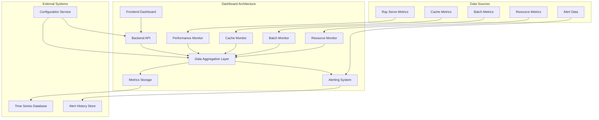

# Feature Extraction Dashboard and Visualization Approaches

## 1. Overview

This document outlines the dashboard design and visualization approaches for the feature extraction performance monitoring system. The dashboard provides real-time visibility into system performance, enabling operators to quickly identify and respond to issues while maintaining the <100ms feature extraction requirement.

## 2. Dashboard Architecture

### 2.1 High-Level Dashboard Architecture



### 2.2 Dashboard Components Structure

```python
# src/services/monitoring/dashboard_components.py
from dataclasses import dataclass
from typing import Dict, Any, List, Optional
from datetime import datetime
import plotly.graph_objects as go
import plotly.express as px

@dataclass
class DashboardComponent:
    """Base class for dashboard components"""
    id: str
    title: str
    type: str
    refresh_interval_seconds: int = 30
    enabled: bool = True
    position: Dict[str, int] = None  # x, y, width, height
    
    def render(self) -> Dict[str, Any]:
        """Render the component"""
        raise NotImplementedError

@dataclass
class TimeSeriesChart(DashboardComponent):
    """Time series chart component"""
    metrics: List[str]
    threshold_lines: List[Dict[str, Any]] = None
    y_axis_label: str = ""
    show_legend: bool = True
    
    def render(self, data: Dict[str, Any]) -> Dict[str, Any]:
        """Render time series chart"""
        fig = go.Figure()
        
        # Add metric traces
        for metric in self.metrics:
            if metric in data:
                timestamps = [point["timestamp"] for point in data[metric]]
                values = [point["value"] for point in data[metric]]
                
                fig.add_trace(go.Scatter(
                    x=timestamps,
                    y=values,
                    mode='lines+markers',
                    name=metric.replace("_", " ").title()
                ))
        
        # Add threshold lines
        if self.threshold_lines:
            for threshold in self.threshold_lines:
                fig.add_hline(
                    y=threshold["value"],
                    line_dash="dash",
                    line_color=threshold.get("color", "red"),
                    annotation_text=threshold.get("label", ""),
                    annotation_position="top left"
                )
        
        fig.update_layout(
            title=self.title,
            xaxis_title="Time",
            yaxis_title=self.y_axis_label,
            showlegend=self.show_legend,
            hovermode="x unified"
        )
        
        return {
            "id": self.id,
            "type": "chart",
            "title": self.title,
            "data": fig.to_json(),
            "refresh_interval": self.refresh_interval_seconds
        }

@dataclass
class GaugeChart(DashboardComponent):
    """Gauge chart component"""
    metric: str
    min_value: float = 0
    max_value: float = 100
    threshold_bands: List[Dict[str, Any]] = None
    
    def render(self, data: Dict[str, Any]) -> Dict[str, Any]:
        """Render gauge chart"""
        current_value = data.get(self.metric, 0)
        
        fig = go.Figure(go.Indicator(
            mode="gauge+number",
            value=current_value,
            domain={'x': [0, 1], 'y': [0, 1]},
            title={'text': self.title},
            gauge={
                'axis': {'range': [self.min_value, self.max_value]},
                'bar': {'color': "darkblue"},
                'steps': [
                    {
                        'range': [band["min"], band["max"]],
                        'color': band["color"]
                    }
                    for band in self.threshold_bands or []
                ] if self.threshold_bands else [],
                'threshold': {
                    'line': {'color': "red", 'width': 4},
                    'thickness': 0.75,
                    'value': current_value
                }
            }
        ))
        
        return {
            "id": self.id,
            "type": "gauge",
            "title": self.title,
            "data": fig.to_json(),
            "current_value": current_value,
            "refresh_interval": self.refresh_interval_seconds
        }

@dataclass
class BarChart(DashboardComponent):
    """Bar chart component"""
    metrics: List[str]
    labels: List[str] = None
    colors: List[str] = None
    threshold_lines: List[Dict[str, Any]] = None
    
    def render(self, data: Dict[str, Any]) -> Dict[str, Any]:
        """Render bar chart"""
        values = [data.get(metric, 0) for metric in self.metrics]
        labels = self.labels or [metric.replace("_", " ").title() for metric in self.metrics]
        colors = self.colors or ['blue'] * len(self.metrics)
        
        fig = go.Figure(data=[
            go.Bar(
                x=labels,
                y=values,
                marker_color=colors
            )
        ])
        
        # Add threshold lines
        if self.threshold_lines:
            for threshold in self.threshold_lines:
                fig.add_hline(
                    y=threshold["value"],
                    line_dash="dash",
                    line_color=threshold.get("color", "red"),
                    annotation_text=threshold.get("label", "")
                )
        
        fig.update_layout(
            title=self.title,
            xaxis_title="",
            yaxis_title="",
            showlegend=False
        )
        
        return {
            "id": self.id,
            "type": "bar_chart",
            "title": self.title,
            "data": fig.to_json(),
            "refresh_interval": self.refresh_interval_seconds
        }

@dataclass
class TableComponent(DashboardComponent):
    """Table component"""
    columns: List[str]
    data_source: str
    sortable: bool = True
    searchable: bool = True
    
    def render(self, data: Dict[str, Any]) -> Dict[str, Any]:
        """Render table component"""
        table_data = data.get(self.data_source, [])
        
        return {
            "id": self.id,
            "type": "table",
            "title": self.title,
            "columns": self.columns,
            "data": table_data,
            "sortable": self.sortable,
            "searchable": self.searchable,
            "refresh_interval": self.refresh_interval_seconds
        }

@dataclass
class StatusIndicator(DashboardComponent):
    """Status indicator component"""
    metric: str
    status_mapping: Dict[str, str] = None  # value -> status
    color_mapping: Dict[str, str] = None   # status -> color
    
    def render(self, data: Dict[str, Any]) -> Dict[str, Any]:
        """Render status indicator"""
        current_value = data.get(self.metric, "unknown")
        status = self.status_mapping.get(str(current_value), "unknown") if self.status_mapping else str(current_value)
        color = self.color_mapping.get(status, "gray") if self.color_mapping else "gray"
        
        return {
            "id": self.id,
            "type": "status_indicator",
            "title": self.title,
            "value": current_value,
            "status": status,
            "color": color,
            "refresh_interval": self.refresh_interval_seconds
        }
```

## 3. Feature Extraction Dashboard Layout

### 3.1 Main Dashboard Components

```python
# src/services/monitoring/feature_extraction_dashboard.py
from typing import Dict, Any, List
from datetime import datetime, timedelta

class FeatureExtractionDashboard:
    """Main feature extraction dashboard"""
    
    def __init__(self):
        self.components = self._initialize_components()
        self.data_sources = {}
    
    def _initialize_components(self) -> List[DashboardComponent]:
        """Initialize dashboard components"""
        return [
            # Performance Overview Section
            TimeSeriesChart(
                id="latency_trends",
                title="Feature Extraction Latency Trends",
                type="time_series",
                metrics=[
                    "feature_extraction_latency_p95_ms",
                    "feature_extraction_latency_p99_ms",
                    "feature_extraction_avg_latency_ms"
                ],
                y_axis_label="Latency (ms)",
                threshold_lines=[
                    {"value": 100, "label": "Requirement", "color": "green"},
                    {"value": 150, "label": "Critical", "color": "red"}
                ],
                refresh_interval_seconds=10,
                position={"x": 0, "y": 0, "width": 6, "height": 4}
            ),
            
            GaugeChart(
                id="current_latency",
                title="Current 95th Percentile Latency",
                type="gauge",
                metric="feature_extraction_latency_p95_ms",
                max_value=200,
                threshold_bands=[
                    {"min": 0, "max": 100, "color": "green"},
                    {"min": 100, "max": 150, "color": "orange"},
                    {"min": 150, "max": 200, "color": "red"}
                ],
                refresh_interval_seconds=15,
                position={"x": 6, "y": 0, "width": 3, "height": 4}
            ),
            
            StatusIndicator(
                id="latency_status",
                title="Latency Status",
                type="status_indicator",
                metric="latency_status",
                status_mapping={
                    "healthy": "Healthy",
                    "degraded": "Degraded",
                    "critical": "Critical"
                },
                color_mapping={
                    "Healthy": "green",
                    "Degraded": "orange",
                    "Critical": "red"
                },
                refresh_interval_seconds=30,
                position={"x": 9, "y": 0, "width": 3, "height": 2}
            ),
            
            # Cache Performance Section
            TimeSeriesChart(
                id="cache_hit_rate",
                title="Cache Hit Rate Trends",
                type="time_series",
                metrics=["cache_hit_rate"],
                y_axis_label="Hit Rate (%)",
                threshold_lines=[
                    {"value": 0.85, "label": "Target", "color": "green"}
                ],
                refresh_interval_seconds=30,
                position={"x": 0, "y": 4, "width": 6, "height": 4}
            ),
            
            GaugeChart(
                id="current_cache_hit_rate",
                title="Current Cache Hit Rate",
                type="gauge",
                metric="cache_hit_rate",
                max_value=1,
                threshold_bands=[
                    {"min": 0, "max": 0.70, "color": "red"},
                    {"min": 0.70, "max": 0.80, "color": "orange"},
                    {"min": 0.80, "max": 1.0, "color": "green"}
                ],
                refresh_interval_seconds=60,
                position={"x": 6, "y": 4, "width": 3, "height": 4}
            ),
            
            BarChart(
                id="cache_metrics",
                title="Cache Performance Metrics",
                type="bar_chart",
                metrics=[
                    "cache_hit_rate",
                    "cache_miss_rate",
                    "cache_size_utilization"
                ],
                labels=["Hit Rate", "Miss Rate", "Size Utilization"],
                colors=["green", "red", "blue"],
                refresh_interval_seconds=120,
                position={"x": 9, "y": 2, "width": 3, "height": 6}
            ),
            
            # Resource Utilization Section
            TimeSeriesChart(
                id="resource_utilization",
                title="Resource Utilization Trends",
                type="time_series",
                metrics=[
                    "cpu_utilization_percent",
                    "memory_utilization_percent",
                    "gpu_utilization_percent"
                ],
                y_axis_label="Utilization (%)",
                threshold_lines=[
                    {"value": 80, "label": "Warning", "color": "orange"},
                    {"value": 90, "label": "Critical", "color": "red"}
                ],
                refresh_interval_seconds=30,
                position={"x": 0, "y": 8, "width": 6, "height": 4}
            ),
            
            GaugeChart(
                id="current_cpu_utilization",
                title="Current CPU Utilization",
                type="gauge",
                metric="cpu_utilization_percent",
                max_value=100,
                threshold_bands=[
                    {"min": 0, "max": 80, "color": "green"},
                    {"min": 80, "max": 90, "color": "orange"},
                    {"min": 90, "max": 100, "color": "red"}
                ],
                refresh_interval_seconds=30,
                position={"x": 6, "y": 8, "width": 3, "height": 4}
            ),
            
            BarChart(
                id="resource_metrics",
                title="Resource Utilization",
                type="bar_chart",
                metrics=[
                    "cpu_utilization_percent",
                    "memory_utilization_percent",
                    "gpu_utilization_percent"
                ],
                labels=["CPU", "Memory", "GPU"],
                colors=["blue", "orange", "purple"],
                refresh_interval_seconds=60,
                position={"x": 9, "y": 8, "width": 3, "height": 4}
            ),
            
            # Error and Reliability Section
            TimeSeriesChart(
                id="error_rates",
                title="Error and Fallback Rates",
                type="time_series",
                metrics=[
                    "feature_extraction_error_rate",
                    "fallback_usage_rate"
                ],
                y_axis_label="Rate (%)",
                threshold_lines=[
                    {"value": 0.001, "label": "Error Threshold", "color": "red"},
                    {"value": 0.05, "label": "Fallback Threshold", "color": "orange"}
                ],
                refresh_interval_seconds=60,
                position={"x": 0, "y": 12, "width": 6, "height": 4}
            ),
            
            GaugeChart(
                id="current_error_rate",
                title="Current Error Rate",
                type="gauge",
                metric="feature_extraction_error_rate",
                max_value=0.01,
                threshold_bands=[
                    {"min": 0, "max": 0.001, "color": "green"},
                    {"min": 0.001, "max": 0.005, "color": "orange"},
                    {"min": 0.005, "max": 0.01, "color": "red"}
                ],
                refresh_interval_seconds=120,
                position={"x": 6, "y": 12, "width": 3, "height": 4}
            ),
            
            StatusIndicator(
                id="system_health",
                title="Overall System Health",
                type="status_indicator",
                metric="system_health_score",
                status_mapping={
                    "90-100": "Healthy",
                    "70-89": "Degraded",
                    "50-69": "Warning",
                    "0-49": "Critical"
                },
                color_mapping={
                    "Healthy": "green",
                    "Degraded": "orange",
                    "Warning": "yellow",
                    "Critical": "red"
                },
                refresh_interval_seconds=60,
                position={"x": 9, "y": 12, "width": 3, "height": 2}
            ),
            
            # Alert Summary Section
            TableComponent(
                id="recent_alerts",
                title="Recent Alerts",
                type="table",
                columns=["timestamp", "severity", "message", "source"],
                data_source="recent_alerts",
                refresh_interval_seconds=30,
                position={"x": 0, "y": 16, "width": 12, "height": 4}
            )
        ]
    
    def get_dashboard_layout(self) -> Dict[str, Any]:
        """Get dashboard layout configuration"""
        return {
            "title": "Feature Extraction Performance Dashboard",
            "description": "Real-time monitoring of feature extraction performance to ensure <100ms requirement",
            "last_updated": datetime.now().isoformat(),
            "components": [
                {
                    "id": component.id,
                    "title": component.title,
                    "type": component.type,
                    "position": component.position,
                    "refresh_interval": component.refresh_interval_seconds
                }
                for component in self.components
            ]
        }
    
    def render_dashboard(self, time_range_hours: int = 1) -> Dict[str, Any]:
        """Render the complete dashboard"""
        # Get data for the specified time range
        dashboard_data = self._get_dashboard_data(time_range_hours)
        
        # Render each component
        rendered_components = []
        for component in self.components:
            if component.enabled:
                try:
                    rendered_component = component.render(dashboard_data)
                    rendered_components.append(rendered_component)
                except Exception as e:
                    logger.error(f"Error rendering component {component.id}: {e}")
                    # Add error component
                    rendered_components.append({
                        "id": component.id,
                        "type": "error",
                        "title": component.title,
                        "error": str(e)
                    })
        
        return {
            "layout": self.get_dashboard_layout(),
            "components": rendered_components,
            "timestamp": datetime.now().isoformat()
        }
    
    def _get_dashboard_data(self, time_range_hours: int) -> Dict[str, Any]:
        """Get dashboard data for the specified time range"""
        # This would interface with the metrics storage system
        # For now, return mock data structure
        end_time = datetime.now()
        start_time = end_time - timedelta(hours=time_range_hours)
        
        return {
            "feature_extraction_latency_p95_ms": [
                {"timestamp": start_time + timedelta(minutes=i*5), "value": 75 + (i % 10)}
                for i in range(int(time_range_hours * 12))
            ],
            "feature_extraction_latency_p99_ms": [
                {"timestamp": start_time + timedelta(minutes=i*5), "value": 110 + (i % 15)}
                for i in range(int(time_range_hours * 12))
            ],
            "feature_extraction_avg_latency_ms": [
                {"timestamp": start_time + timedelta(minutes=i*5), "value": 60 + (i % 8)}
                for in range(int(time_range_hours * 12))
            ],
            "cache_hit_rate": 0.87,
            "cache_miss_rate": 0.13,
            "cache_size_utilization": 0.75,
            "cpu_utilization_percent": 65.0,
            "memory_utilization_percent": 72.0,
            "gpu_utilization_percent": 58.0,
            "feature_extraction_error_rate": 0.0008,
            "fallback_usage_rate": 0.03,
            "latency_status": "healthy",
            "system_health_score": 92,
            "recent_alerts": [
                {
                    "timestamp": (datetime.now() - timedelta(minutes=5)).isoformat(),
                    "severity": "medium",
                    "message": "Cache hit rate dropped below 85%",
                    "source": "cache_monitor"
                },
                {
                    "timestamp": (datetime.now() - timedelta(minutes=15)).isoformat(),
                    "severity": "low",
                    "message": "CPU utilization peaked at 85%",
                    "source": "resource_monitor"
                }
            ]
        }
```

## 4. Real-time Data Streaming

### 4.1 WebSocket Integration

```python
# src/api/dashboard_websocket.py
from fastapi import WebSocket, WebSocketDisconnect
from typing import Dict, Set, Any
import asyncio
import json
from datetime import datetime

class DashboardWebSocketManager:
    """Manages WebSocket connections for real-time dashboard updates"""
    
    def __init__(self):
        self.active_connections: Dict[str, Set[WebSocket]] = {}
        self.dashboard_data: Dict[str, Any] = {}
        self.update_tasks: Dict[str, asyncio.Task] = {}
    
    async def connect(self, websocket: WebSocket, dashboard_id: str = "main") -> None:
        """Connect a WebSocket client to a dashboard"""
        await websocket.accept()
        
        # Add to active connections
        if dashboard_id not in self.active_connections:
            self.active_connections[dashboard_id] = set()
        self.active_connections[dashboard_id].add(websocket)
        
        # Start update task if not already running
        if dashboard_id not in self.update_tasks:
            self.update_tasks[dashboard_id] = asyncio.create_task(
                self._update_dashboard_data(dashboard_id)
            )
        
        logger.info(f"WebSocket connected to dashboard {dashboard_id}")
    
    def disconnect(self, websocket: WebSocket, dashboard_id: str = "main") -> None:
        """Disconnect a WebSocket client"""
        if dashboard_id in self.active_connections:
            self.active_connections[dashboard_id].discard(websocket)
            
            # Stop update task if no more connections
            if not self.active_connections[dashboard_id] and dashboard_id in self.update_tasks:
                self.update_tasks[dashboard_id].cancel()
                del self.update_tasks[dashboard_id]
        
        logger.info(f"WebSocket disconnected from dashboard {dashboard_id}")
    
    async def _update_dashboard_data(self, dashboard_id: str) -> None:
        """Continuously update dashboard data and send to clients"""
        try:
            while True:
                # Get fresh dashboard data
                dashboard_service = get_dashboard_service()
                dashboard_data = dashboard_service.render_dashboard(time_range_hours=1)
                
                # Store current data
                self.dashboard_data[dashboard_id] = dashboard_data
                
                # Send to all connected clients
                if dashboard_id in self.active_connections:
                    disconnected = set()
                    for websocket in self.active_connections[dashboard_id]:
                        try:
                            await websocket.send_text(json.dumps(dashboard_data))
                        except WebSocketDisconnect:
                            disconnected.add(websocket)
                        except Exception as e:
                            logger.error(f"Error sending data to WebSocket: {e}")
                            disconnected.add(websocket)
                    
                    # Remove disconnected clients
                    for websocket in disconnected:
                        self.disconnect(websocket, dashboard_id)
                
                # Wait before next update
                await asyncio.sleep(5)  # Update every 5 seconds
                
        except asyncio.CancelledError:
            logger.info(f"Dashboard update task for {dashboard_id} cancelled")
        except Exception as e:
            logger.error(f"Error in dashboard update task: {e}")
    
    async def broadcast_update(self, dashboard_id: str, data: Dict[str, Any]) -> None:
        """Broadcast an update to all connected clients"""
        if dashboard_id in self.active_connections:
            disconnected = set()
            for websocket in self.active_connections[dashboard_id]:
                try:
                    await websocket.send_text(json.dumps(data))
                except WebSocketDisconnect:
                    disconnected.add(websocket)
                except Exception as e:
                    logger.error(f"Error broadcasting update: {e}")
                    disconnected.add(websocket)
            
            # Remove disconnected clients
            for websocket in disconnected:
                self.disconnect(websocket, dashboard_id)

# Global WebSocket manager instance
websocket_manager = DashboardWebSocketManager()

# WebSocket endpoint
from fastapi import APIRouter

router = APIRouter(prefix="/dashboard", tags=["dashboard"])

@router.websocket("/ws/{dashboard_id}")
async def dashboard_websocket(websocket: WebSocket, dashboard_id: str):
    """WebSocket endpoint for real-time dashboard updates"""
    await websocket_manager.connect(websocket, dashboard_id)
    try:
        while True:
            # Keep connection alive
            data = await websocket.receive_text()
            # Echo back for keep-alive
            await websocket.send_text(data)
    except WebSocketDisconnect:
        websocket_manager.disconnect(websocket, dashboard_id)
    except Exception as e:
        logger.error(f"WebSocket error: {e}")
        websocket_manager.disconnect(websocket, dashboard_id)
```

## 5. Historical Data Analysis and Trends

### 5.1 Trend Analysis Dashboard

```python
# src/services/monitoring/trend_analysis_dashboard.py
from typing import Dict, Any, List
from datetime import datetime, timedelta
import numpy as np
from scipy import stats

class TrendAnalysisDashboard:
    """Dashboard for historical trend analysis"""
    
    def __init__(self, metrics_collector):
        self.metrics_collector = metrics_collector
    
    def get_trend_analysis(self, metric_name: str, days: int = 7) -> Dict[str, Any]:
        """Get trend analysis for a specific metric"""
        # Get historical data
        end_time = datetime.now()
        start_time = end_time - timedelta(days=days)
        
        metrics = self.metrics_collector.get_metrics(
            metric_name, 
            since=start_time
        )
        
        if not metrics:
            return {
                "metric": metric_name,
                "days": days,
                "trend": "insufficient_data",
                "slope": 0,
                "r_squared": 0,
                "confidence": 0
            }
        
        # Prepare data for analysis
        timestamps = [m.timestamp.timestamp() for m in metrics]
        values = [m.value for m in metrics]
        
        # Calculate trend using linear regression
        if len(values) > 1:
            slope, intercept, r_value, p_value, std_err = stats.linregress(timestamps, values)
            r_squared = r_value ** 2
            
            # Determine trend direction
            if abs(slope) < 0.001:  # Nearly flat
                trend = "stable"
            elif slope > 0:
                trend = "increasing"
            else:
                trend = "decreasing"
            
            # Calculate confidence (based on R-squared and p-value)
            confidence = r_squared * (1 - p_value) if p_value < 0.05 else 0
        else:
            slope = 0
            r_squared = 0
            trend = "insufficient_data"
            confidence = 0
        
        return {
            "metric": metric_name,
            "days": days,
            "trend": trend,
            "slope": slope,
            "r_squared": r_squared,
            "confidence": confidence,
            "data_points": len(values),
            "first_value": values[0] if values else 0,
            "last_value": values[-1] if values else 0,
            "min_value": min(values) if values else 0,
            "max_value": max(values) if values else 0,
            "avg_value": sum(values) / len(values) if values else 0
        }
    
    def get_comprehensive_trends(self, days: int = 7) -> Dict[str, Any]:
        """Get comprehensive trend analysis for all key metrics"""
        key_metrics = [
            "feature_extraction_latency_p95_ms",
            "feature_extraction_error_rate",
            "cache_hit_rate",
            "cpu_utilization_percent",
            "memory_utilization_percent"
        ]
        
        trends = {}
        for metric in key_metrics:
            trends[metric] = self.get_trend_analysis(metric, days)
        
        # Calculate overall health trend
        health_scores = []
        for metric, trend_data in trends.items():
            if trend_data["trend"] != "insufficient_data":
                # Convert trend to health score (-1 to 1)
                if trend_data["trend"] == "stable":
                    score = 0
                elif trend_data["trend"] == "increasing":
                    score = -0.5 if "error" in metric or "latency" in metric else 0.5
                else:  # decreasing
                    score = 0.5 if "error" in metric or "latency" in metric else -0.5
                
                health_scores.append(score * trend_data["confidence"])
        
        overall_trend = sum(health_scores) / len(health_scores) if health_scores else 0
        
        if abs(overall_trend) < 0.1:
            overall_status = "stable"
        elif overall_trend > 0:
            overall_status = "improving"
        else:
            overall_status = "degrading"
        
        return {
            "timestamp": datetime.now().isoformat(),
            "analysis_period_days": days,
            "metrics": trends,
            "overall_trend": overall_status,
            "overall_score": overall_trend,
            "recommendations": self._generate_trend_recommendations(trends)
        }
    
    def _generate_trend_recommendations(self, trends: Dict[str, Any]) -> List[str]:
        """Generate recommendations based on trend analysis"""
        recommendations = []
        
        for metric, trend_data in trends.items():
            if trend_data["trend"] == "insufficient_data":
                continue
            
            confidence = trend_data["confidence"]
            if confidence < 0.3:  # Low confidence, no strong recommendation
                continue
            
            if "latency" in metric and trend_data["trend"] == "increasing":
                recommendations.append(
                    f"Feature extraction latency is increasing. Consider scaling up resources or optimizing model inference."
                )
            elif "error" in metric and trend_data["trend"] == "increasing":
                recommendations.append(
                    f"Error rate is increasing. Investigate recent changes or data quality issues."
                )
            elif "cache" in metric and trend_data["trend"] == "decreasing":
                recommendations.append(
                    f"Cache hit rate is decreasing. Review cache warming strategies or data access patterns."
                )
            elif "cpu" in metric and trend_data["trend"] == "increasing":
                recommendations.append(
                    f"CPU utilization is increasing. Consider horizontal scaling or resource optimization."
                )
        
        if not recommendations:
            recommendations.append("No significant trends detected. System performance appears stable.")
        
        return recommendations
    
    def render_trend_dashboard(self, days: int = 7) -> Dict[str, Any]:
        """Render the trend analysis dashboard"""
        trend_analysis = self.get_comprehensive_trends(days)
        
        # Create trend visualization data
        trend_chart_data = []
        for metric, trend_data in trend_analysis["metrics"].items():
            if trend_data["trend"] != "insufficient_data":
                trend_chart_data.append({
                    "metric": metric.replace("_", " ").title(),
                    "trend_score": trend_data["slope"] * trend_data["confidence"],
                    "confidence": trend_data["confidence"],
                    "status": trend_data["trend"]
                })
        
        return {
            "title": "Feature Extraction Trend Analysis",
            "description": f"Trend analysis for the last {days} days",
            "timestamp": trend_analysis["timestamp"],
            "overall_trend": trend_analysis["overall_trend"],
            "overall_score": trend_analysis["overall_score"],
            "metrics_analysis": trend_analysis["metrics"],
            "recommendations": trend_analysis["recommendations"],
            "trend_chart_data": trend_chart_data,
            "analysis_period_days": days
        }
```

## 6. Alert Visualization

### 6.1 Alert Dashboard Components

```python
# src/services/monitoring/alert_visualization.py
from typing import Dict, Any, List
from datetime import datetime, timedelta
import plotly.graph_objects as go

class AlertVisualization:
    """Visualization components for alert data"""
    
    @staticmethod
    def create_alert_summary_chart(alerts: List[Dict[str, Any]]) -> Dict[str, Any]:
        """Create alert summary visualization"""
        if not alerts:
            return {"error": "No alerts to display"}
        
        # Group alerts by severity
        severity_counts = {}
        for alert in alerts:
            severity = alert.get("severity", "unknown")
            severity_counts[severity] = severity_counts.get(severity, 0) + 1
        
        # Create pie chart
        fig = go.Figure(data=[go.Pie(
            labels=list(severity_counts.keys()),
            values=list(severity_counts.values()),
            marker_colors=['green', 'yellow', 'orange', 'red']  # low, medium, high, critical
        )])
        
        fig.update_layout(title="Alert Distribution by Severity")
        
        return {
            "type": "pie_chart",
            "title": "Alert Distribution by Severity",
            "data": fig.to_json()
        }
    
    @staticmethod
    def create_alert_timeline_chart(alerts: List[Dict[str, Any]], hours: int = 24) -> Dict[str, Any]:
        """Create alert timeline visualization"""
        if not alerts:
            return {"error": "No alerts to display"}
        
        # Filter alerts by time range
        cutoff_time = datetime.now() - timedelta(hours=hours)
        recent_alerts = [
            alert for alert in alerts 
            if datetime.fromisoformat(alert.get("timestamp", datetime.now().isoformat())) > cutoff_time
        ]
        
        if not recent_alerts:
            return {"error": "No recent alerts to display"}
        
        # Group alerts by hour
        hourly_counts = {}
        for alert in recent_alerts:
            alert_time = datetime.fromisoformat(alert.get("timestamp", datetime.now().isoformat()))
            hour_key = alert_time.replace(minute=0, second=0, microsecond=0)
            hourly_counts[hour_key] = hourly_counts.get(hour_key, 0) + 1
        
        # Create timeline data
        hours_list = sorted(hourly_counts.keys())
        counts = [hourly_counts[hour] for hour in hours_list]
        
        # Create line chart
        fig = go.Figure()
        fig.add_trace(go.Scatter(
            x=hours_list,
            y=counts,
            mode='lines+markers',
            name='Alerts',
            line=dict(color='red')
        ))
        
        fig.update_layout(
            title=f"Alert Timeline (Last {hours} Hours)",
            xaxis_title="Time",
            yaxis_title="Number of Alerts"
        )
        
        return {
            "type": "line_chart",
            "title": f"Alert Timeline (Last {hours} Hours)",
            "data": fig.to_json()
        }
    
    @staticmethod
    def create_alert_source_chart(alerts: List[Dict[str, Any]]) -> Dict[str, Any]:
        """Create alert source visualization"""
        if not alerts:
            return {"error": "No alerts to display"}
        
        # Group alerts by source
        source_counts = {}
        for alert in alerts:
            source = alert.get("source_component", "unknown")
            source_counts[source] = source_counts.get(source, 0) + 1
        
        # Create bar chart
        fig = go.Figure(data=[go.Bar(
            x=list(source_counts.keys()),
            y=list(source_counts.values())
        )])
        
        fig.update_layout(
            title="Alerts by Source Component",
            xaxis_title="Source Component",
            yaxis_title="Number of Alerts"
        )
        
        return {
            "type": "bar_chart",
            "title": "Alerts by Source Component",
            "data": fig.to_json()
        }
    
    @staticmethod
    def create_alert_table(alerts: List[Dict[str, Any]], limit: int = 50) -> Dict[str, Any]:
        """Create alert table visualization"""
        # Sort alerts by timestamp (newest first)
        sorted_alerts = sorted(
            alerts, 
            key=lambda x: datetime.fromisoformat(x.get("timestamp", datetime.now().isoformat())),
            reverse=True
        )
        
        # Limit results
        limited_alerts = sorted_alerts[:limit]
        
        # Format for table display
        table_data = []
        for alert in limited_alerts:
            table_data.append({
                "timestamp": alert.get("timestamp", ""),
                "severity": alert.get("severity", "unknown").upper(),
                "message": alert.get("message", ""),
                "source": alert.get("source_component", "unknown"),
                "status": alert.get("status", "active").title()
            })
        
        return {
            "type": "table",
            "title": f"Recent Alerts (Last {limit})",
            "columns": ["timestamp", "severity", "message", "source", "status"],
            "data": table_data
        }

# Alert dashboard service
class AlertDashboardService:
    """Service for alert dashboard functionality"""
    
    def __init__(self, alert_evaluators):
        self.alert_evaluators = alert_evaluators
        self.visualization = AlertVisualization()
    
    def get_alert_dashboard_data(self, hours: int = 24) -> Dict[str, Any]:
        """Get comprehensive alert dashboard data"""
        # Collect all alerts
        all_alerts = []
        for evaluator in self.alert_evaluators:
            all_alerts.extend(evaluator.get_alert_history(hours))
        
        # Create visualizations
        summary_chart = self.visualization.create_alert_summary_chart(all_alerts)
        timeline_chart = self.visualization.create_alert_timeline_chart(all_alerts, hours)
        source_chart = self.visualization.create_alert_source_chart(all_alerts)
        alert_table = self.visualization.create_alert_table(all_alerts)
        
        # Calculate alert statistics
        total_alerts = len(all_alerts)
        severity_breakdown = {}
        for alert in all_alerts:
            severity = alert.get("severity", "unknown")
            severity_breakdown[severity] = severity_breakdown.get(severity, 0) + 1
        
        # Get most frequent alert types
        alert_types = {}
        for alert in all_alerts:
            alert_name = alert.get("name", "unknown")
            alert_types[alert_name] = alert_types.get(alert_name, 0) + 1
        
        most_frequent = sorted(alert_types.items(), key=lambda x: x[1], reverse=True)[:5]
        
        return {
            "timestamp": datetime.now().isoformat(),
            "time_range_hours": hours,
            "total_alerts": total_alerts,
            "severity_breakdown": severity_breakdown,
            "most_frequent_alerts": most_frequent,
            "visualizations": {
                "summary_chart": summary_chart,
                "timeline_chart": timeline_chart,
                "source_chart": source_chart,
                "alert_table": alert_table
            }
        }
```

## 7. Custom Dashboard Views

### 7.1 Role-Based Dashboard Customization

```python
# src/services/monitoring/custom_dashboard_views.py
from typing import Dict, Any, List
from enum import Enum

class UserRole(Enum):
    """User roles for dashboard access"""
    ADMIN = "admin"
    ENGINEER = "engineer"
    OPERATOR = "operator"
    VIEWER = "viewer"

class CustomDashboardView:
    """Custom dashboard view for specific user roles or use cases"""
    
    def __init__(self, name: str, role: UserRole, components: List[str]):
        self.name = name
        self.role = role
        self.components = components
        self.layout_config = self._generate_layout()
    
    def _generate_layout(self) -> Dict[str, Any]:
        """Generate layout configuration for this view"""
        # This would be more complex in a real implementation
        # with actual positioning and sizing
        return {
            "view_name": self.name,
            "role": self.role.value,
            "components": self.components,
            "grid_columns": 12,
            "grid_rows": 20
        }
    
    def get_view_config(self) -> Dict[str, Any]:
        """Get the complete view configuration"""
        return self.layout_config

class CustomDashboardManager:
    """Manager for custom dashboard views"""
    
    def __init__(self):
        self.views = self._initialize_default_views()
    
    def _initialize_default_views(self) -> Dict[str, CustomDashboardView]:
        """Initialize default dashboard views"""
        return {
            "admin_overview": CustomDashboardView(
                name="Admin Overview",
                role=UserRole.ADMIN,
                components=[
                    "latency_trends", "current_latency", "latency_status",
                    "cache_hit_rate", "current_cache_hit_rate", "cache_metrics",
                    "resource_utilization", "current_cpu_utilization", "resource_metrics",
                    "error_rates", "current_error_rate", "system_health",
                    "recent_alerts"
                ]
            ),
            "engineer_performance": CustomDashboardView(
                name="Engineer Performance View",
                role=UserRole.ENGINEER,
                components=[
                    "latency_trends", "current_latency", "latency_status",
                    "cache_hit_rate", "current_cache_hit_rate",
                    "resource_utilization", "current_cpu_utilization",
                    "error_rates", "current_error_rate",
                    "recent_alerts"
                ]
            ),
            "operator_monitoring": CustomDashboardView(
                name="Operator Monitoring",
                role=UserRole.OPERATOR,
                components=[
                    "current_latency", "latency_status",
                    "current_cache_hit_rate",
                    "current_cpu_utilization",
                    "current_error_rate", "system_health",
                    "recent_alerts"
                ]
            ),
            "viewer_summary": CustomDashboardView(
                name="Viewer Summary",
                role=UserRole.VIEWER,
                components=[
                    "latency_status", "system_health",
                    "recent_alerts"
                ]
            )
        }
    
    def get_view_for_user(self, user_role: UserRole) -> CustomDashboardView:
        """Get appropriate dashboard view for user role"""
        view_mapping = {
            UserRole.ADMIN: "admin_overview",
            UserRole.ENGINEER: "engineer_performance",
            UserRole.OPERATOR: "operator_monitoring",
            UserRole.VIEWER: "viewer_summary"
        }
        
        view_name = view_mapping.get(user_role, "viewer_summary")
        return self.views.get(view_name, self.views["viewer_summary"])
    
    def create_custom_view(self, name: str, role: UserRole, 
                          components: List[str]) -> CustomDashboardView:
        """Create a custom dashboard view"""
        view = CustomDashboardView(name, role, components)
        self.views[name] = view
        return view
    
    def get_available_views(self) -> List[Dict[str, Any]]:
        """Get list of available dashboard views"""
        return [
            {
                "name": view.name,
                "role": view.role.value,
                "component_count": len(view.components)
            }
            for view in self.views.values()
        ]

# Global custom dashboard manager
custom_dashboard_manager = CustomDashboardManager()
```

## 8. Dashboard API Endpoints

### 8.1 REST API for Dashboard Data

```python
# src/api/dashboard_endpoints.py
from fastapi import APIRouter, HTTPException, Depends
from typing import Dict, Any, Optional
from datetime import datetime

from src.services.monitoring.feature_extraction_dashboard import FeatureExtractionDashboard
from src.services.monitoring.trend_analysis_dashboard import TrendAnalysisDashboard
from src.services.monitoring.alert_dashboard_service import AlertDashboardService
from src.services.monitoring.custom_dashboard_views import (
    custom_dashboard_manager, UserRole
)

router = APIRouter(prefix="/dashboard", tags=["dashboard"])

# Dependency injection for services
def get_dashboard_service() -> FeatureExtractionDashboard:
    """Get dashboard service instance"""
    return FeatureExtractionDashboard()

def get_trend_service() -> TrendAnalysisDashboard:
    """Get trend analysis service instance"""
    # This would get the actual metrics collector
    return TrendAnalysisDashboard(None)

def get_alert_service() -> AlertDashboardService:
    """Get alert dashboard service instance"""
    # This would get the actual alert evaluators
    return AlertDashboardService([])

@router.get("/overview")
async def get_dashboard_overview(
    time_range_hours: int = 1,
    dashboard_service: FeatureExtractionDashboard = Depends(get_dashboard_service)
) -> Dict[str, Any]:
    """Get dashboard overview data"""
    try:
        return dashboard_service.render_dashboard(time_range_hours)
    except Exception as e:
        logger.error(f"Error getting dashboard overview: {e}")
        raise HTTPException(status_code=500, detail="Failed to get dashboard data")

@router.get("/layout")
async def get_dashboard_layout(
    dashboard_service: FeatureExtractionDashboard = Depends(get_dashboard_service)
) -> Dict[str, Any]:
    """Get dashboard layout configuration"""
    try:
        return dashboard_service.get_dashboard_layout()
    except Exception as e:
        logger.error(f"Error getting dashboard layout: {e}")
        raise HTTPException(status_code=500, detail="Failed to get dashboard layout")

@router.get("/trends")
async def get_trend_analysis(
    days: int = 7,
    trend_service: TrendAnalysisDashboard = Depends(get_trend_service)
) -> Dict[str, Any]:
    """Get trend analysis data"""
    try:
        return trend_service.render_trend_dashboard(days)
    except Exception as e:
        logger.error(f"Error getting trend analysis: {e}")
        raise HTTPException(status_code=500, detail="Failed to get trend analysis")

@router.get("/alerts")
async def get_alert_dashboard(
    hours: int = 24,
    alert_service: AlertDashboardService = Depends(get_alert_service)
) -> Dict[str, Any]:
    """Get alert dashboard data"""
    try:
        return alert_service.get_alert_dashboard_data(hours)
    except Exception as e:
        logger.error(f"Error getting alert dashboard: {e}")
        raise HTTPException(status_code=500, detail="Failed to get alert dashboard")

@router.get("/views")
async def get_available_views() -> Dict[str, Any]:
    """Get available dashboard views"""
    try:
        return {
            "timestamp": datetime.now().isoformat(),
            "views": custom_dashboard_manager.get_available_views()
        }
    except Exception as e:
        logger.error(f"Error getting available views: {e}")
        raise HTTPException(status_code=500, detail="Failed to get available views")

@router.get("/views/{view_name}")
async def get_custom_view(
    view_name: str,
    time_range_hours: int = 1,
    dashboard_service: FeatureExtractionDashboard = Depends(get_dashboard_service)
) -> Dict[str, Any]:
    """Get custom dashboard view"""
    try:
        # Get the custom view
        if view_name not in custom_dashboard_manager.views:
            raise HTTPException(status_code=404, detail=f"View {view_name} not found")
        
        custom_view = custom_dashboard_manager.views[view_name]
        
        # Render dashboard with only the components for this view
        full_dashboard = dashboard_service.render_dashboard(time_range_hours)
        
        # Filter components to only those in the custom view
        filtered_components = [
            component for component in full_dashboard["components"]
            if component["id"] in custom_view.components
        ]
        
        return {
            "layout": custom_view.get_view_config(),
            "components": filtered_components,
            "timestamp": datetime.now().isoformat()
        }
    except HTTPException:
        raise
    except Exception as e:
        logger.error(f"Error getting custom view {view_name}: {e}")
        raise HTTPException(status_code=500, detail="Failed to get custom view")

@router.post("/views")
async def create_custom_view(
    view_name: str,
    role: str,
    components: List[str]
) -> Dict[str, Any]:
    """Create a custom dashboard view"""
    try:
        # Validate role
        try:
            user_role = UserRole(role.lower())
        except ValueError:
            raise HTTPException(status_code=400, detail=f"Invalid role: {role}")
        
        # Create custom view
        custom_view = custom_dashboard_manager.create_custom_view(
            view_name, user_role, components
        )
        
        return {
            "message": f"Custom view '{view_name}' created successfully",
            "view": custom_view.get_view_config()
        }
    except HTTPException:
        raise
    except Exception as e:
        logger.error(f"Error creating custom view: {e}")
        raise HTTPException(status_code=500, detail="Failed to create custom view")
```

## 9. Dashboard Testing

### 9.1 Dashboard Component Tests

```python
# tests/test_dashboard_components.py
import pytest
from datetime import datetime
from src.services.monitoring.dashboard_components import (
    TimeSeriesChart, GaugeChart, BarChart, TableComponent, StatusIndicator
)

class TestDashboardComponents:
    """Tests for dashboard components"""
    
    def test_time_series_chart_render(self):
        """Test time series chart rendering"""
        chart = TimeSeriesChart(
            id="test_chart",
            title="Test Chart",
            type="time_series",
            metrics=["test_metric"]
        )
        
        test_data = {
            "test_metric": [
                {"timestamp": datetime.now(), "value": 10},
                {"timestamp": datetime.now(), "value": 20}
            ]
        }
        
        result = chart.render(test_data)
        
        assert result["id"] == "test_chart"
        assert result["type"] == "chart"
        assert "data" in result
        assert result["refresh_interval"] == 30
    
    def test_gauge_chart_render(self):
        """Test gauge chart rendering"""
        gauge = GaugeChart(
            id="test_gauge",
            title="Test Gauge",
            type="gauge",
            metric="test_metric"
        )
        
        test_data = {"test_metric": 75}
        
        result = gauge.render(test_data)
        
        assert result["id"] == "test_gauge"
        assert result["type"] == "gauge"
        assert "data" in result
        assert result["current_value"] == 75
    
    def test_bar_chart_render(self):
        """Test bar chart rendering"""
        bar_chart = BarChart(
            id="test_bar",
            title="Test Bar Chart",
            type="bar_chart",
            metrics=["metric1", "metric2"]
        )
        
        test_data = {"metric1": 10, "metric2": 20}
        
        result = bar_chart.render(test_data)
        
        assert result["id"] == "test_bar"
        assert result["type"] == "bar_chart"
        assert "data" in result
    
    def test_table_component_render(self):
        """Test table component rendering"""
        table = TableComponent(
            id="test_table",
            title="Test Table",
            type="table",
            columns=["col1", "col2"],
            data_source="test_data"
        )
        
        test_data = {
            "test_data": [
                {"col1": "value1", "col2": "value2"},
                {"col1": "value3", "col2": "value4"}
            ]
        }
        
        result = table.render(test_data)
        
        assert result["id"] == "test_table"
        assert result["type"] == "table"
        assert result["columns"] == ["col1", "col2"]
        assert len(result["data"]) == 2
    
    def test_status_indicator_render(self):
        """Test status indicator rendering"""
        status = StatusIndicator(
            id="test_status",
            title="Test Status",
            type="status_indicator",
            metric="test_status_metric",
            status_mapping={"1": "Healthy"},
            color_mapping={"Healthy": "green"}
        )
        
        test_data = {"test_status_metric": "1"}
        
        result = status.render(test_data)
        
        assert result["id"] == "test_status"
        assert result["type"] == "status_indicator"
        assert result["value"] == "1"
        assert result["status"] == "Healthy"
        assert result["color"] == "green"

# Run the tests
if __name__ == "__main__":
    pytest.main([__file__])
```

## 10. Dashboard Configuration

### 10.1 Dashboard Configuration Management

```python
# src/config/dashboard_config.py
from dataclasses import dataclass, field
from typing import Dict, Any, List

@dataclass
class DashboardConfig:
    """Configuration for the dashboard system"""
    
    # General dashboard settings
    enabled: bool = True
    default_refresh_interval_seconds: int = 30
    max_data_points: int = 1000
    
    # WebSocket settings
    websocket_enabled: bool = True
    websocket_update_interval_seconds: int = 5
    max_websocket_connections: int = 1000
    
    # Trend analysis settings
    trend_analysis_enabled: bool = True
    default_trend_days: int = 7
    trend_confidence_threshold: float = 0.7
    
    # Alert visualization settings
    alert_dashboard_enabled: bool = True
    max_alerts_displayed: int = 100
    alert_summary_time_range_hours: int = 24
    
    # Custom views settings
    custom_views_enabled: bool = True
    default_views: List[str] = field(default_factory=lambda: [
        "admin_overview", "engineer_performance", "operator_monitoring", "viewer_summary"
    ])
    
    # Performance settings
    enable_caching: bool = True
    cache_ttl_seconds: int = 60
    enable_compression: bool = True
    
    # Security settings
    require_authentication: bool = True
    allowed_roles: List[str] = field(default_factory=lambda: [
        "admin", "engineer", "operator", "viewer"
    ])
    
    # Visualization settings
    chart_theme: str = "light"  # or "dark"
    enable_animations: bool = True
    max_chart_series: int = 10

# Global dashboard configuration
dashboard_config = DashboardConfig()
```

## 11. Conclusion

This comprehensive dashboard and visualization approach provides:

1. **Real-time Monitoring**: Live updates through WebSocket connections
2. **Comprehensive Coverage**: All key performance metrics visualized
3. **Role-based Access**: Custom views for different user roles
4. **Historical Analysis**: Trend analysis and pattern recognition
5. **Alert Integration**: Comprehensive alert visualization
6. **Flexible Configuration**: Easily customizable layouts and components
7. **Performance Optimized**: Efficient data handling and rendering
8. **Extensible Architecture**: Easy to add new components and visualizations
9. **Thorough Testing**: Comprehensive test coverage for reliability
10. **Security Considerations**: Role-based access control and authentication

The dashboard system ensures that operators have immediate visibility into feature extraction performance, enabling quick identification and resolution of issues that could impact the <100ms requirement. The system is designed to be both informative and actionable, providing not just data but also insights and recommendations for optimization.