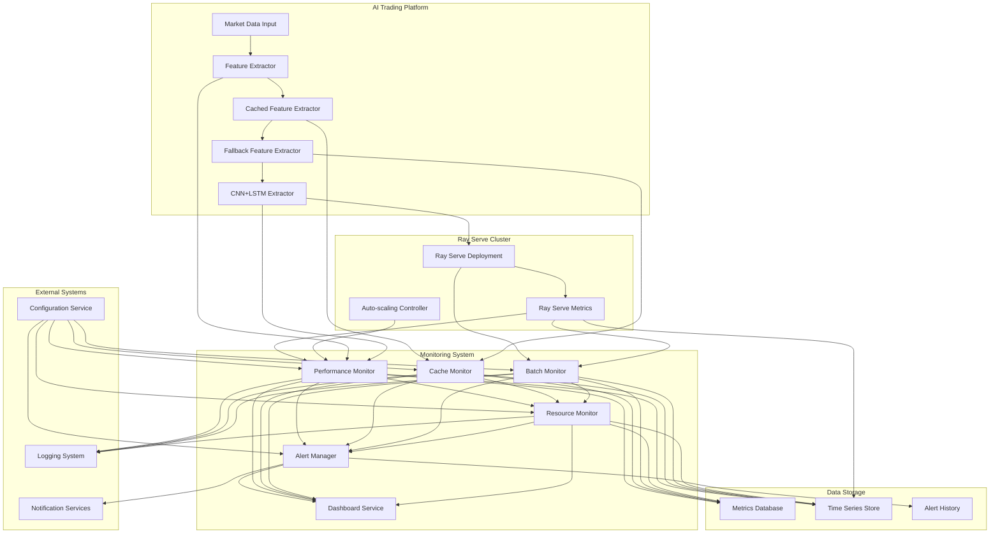

# Feature Extraction Monitoring Integration Approach

## 1. Overview

This document outlines the integration approach for the feature extraction performance monitoring system with existing platform components including Ray Serve, caching layer, batch processing, and connection pooling. The integration ensures comprehensive monitoring coverage while minimizing performance overhead and maintaining system reliability.

## 2. Integration Architecture

### 2.1 High-Level Integration Diagram



## 3. Ray Serve Integration

### 3.1 Deployment Wrapper Integration

The monitoring system integrates with Ray Serve through a deployment wrapper that adds monitoring capabilities to existing deployments:

```python
# src/ml/feature_extraction/ray_serve_monitoring_wrapper.py
from ray import serve
from ray.serve import Deployment
import numpy as np
import time
import psutil
import torch
from typing import Dict, Any, List

@serve.deployment(
    name="monitored_feature_extractor",
    num_replicas=2,
    autoscaling_config={
        "min_replicas": 2,
        "max_replicas": 20,
        "target_num_ongoing_requests_per_replica": 5,
        "upscale_delay_s": 30,
        "downscale_delay_s": 300
    },
    ray_actor_options={
        "num_cpus": 2,
        "num_gpus": 0.5 if torch.cuda.is_available() else 0,
        "memory": 2 * 1024 * 1024 * 1024,  # 2GB
    }
)
class MonitoredFeatureExtractor:
    """Feature extractor with integrated performance monitoring for Ray Serve"""
    
    def __init__(self, model_path: str = None, config: Dict[str, Any] = None):
        """Initialize monitored feature extractor"""
        # Initialize base feature extractor
        self.base_extractor = self._initialize_base_extractor(model_path, config)
        
        # Initialize monitoring components
        self.performance_monitor = FeatureExtractorPerformanceMonitor()
        self.resource_monitor = ResourceMonitor()
        self.metrics_collector = get_metrics_collector()
        
        # Configuration
        self.config = config or {}
        self.sampling_rate = self.config.get("monitoring_sampling_rate", 1.0)
        
        logger.info("MonitoredFeatureExtractor initialized")
    
    def _initialize_base_extractor(self, model_path: str, config: Dict[str, Any]):
        """Initialize the base feature extractor"""
        # This would initialize the actual CNN+LSTM extractor or other implementation
        # based on configuration
        if model_path:
            return CNNLSTMExtractor(model_path)
        else:
            return CNNLSTMExtractor()  # Default initialization
    
    @serve.batch(max_batch_size=32, batch_wait_timeout_s=0.01)
    async def batch_predict(self, requests: List[np.ndarray]) -> List[Dict[str, Any]]:
        """Batch prediction with comprehensive monitoring"""
        request_id = str(uuid.uuid4())
        start_time = time.time()
        
        # Sample monitoring based on configured rate
        should_monitor = random.random() < self.sampling_rate
        
        try:
            # Collect pre-request metrics if monitoring
            if should_monitor:
                pre_metrics = self._collect_pre_request_metrics()
            
            # Perform batch prediction
            results = await self.base_extractor.batch_predict(requests)
            
            # Calculate duration
            duration_ms = (time.time() - start_time) * 1000
            
            # Collect post-request metrics if monitoring
            if should_monitor:
                post_metrics = self._collect_post_request_metrics()
                
                # Record performance metrics
                self._record_performance_metrics(
                    request_id=request_id,
                    duration_ms=duration_ms,
                    batch_size=len(requests),
                    pre_metrics=pre_metrics,
                    post_metrics=post_metrics,
                    success=True
                )
            
            # Record to global metrics collector
            self.metrics_collector.record_histogram(
                "feature_extraction_batch_latency_ms",
                duration_ms,
                {
                    "deployment": "monitored_feature_extractor",
                    "batch_size": len(requests)
                }
            )
            
            self.metrics_collector.increment_counter(
                "feature_extraction_requests_total",
                {
                    "deployment": "monitored_feature_extractor",
                    "status": "success"
                }
            )
            
            return results
            
        except Exception as e:
            # Record error metrics
            duration_ms = (time.time() - start_time) * 1000
            
            if should_monitor:
                self._record_performance_metrics(
                    request_id=request_id,
                    duration_ms=duration_ms,
                    batch_size=len(requests),
                    success=False,
                    error=str(e)
                )
            
            self.metrics_collector.increment_counter(
                "feature_extraction_requests_total",
                {
                    "deployment": "monitored_feature_extractor",
                    "status": "error",
                    "error_type": type(e).__name__
                }
            )
            
            logger.error(f"Batch prediction failed: {e}")
            raise e
    
    def _collect_pre_request_metrics(self) -> Dict[str, Any]:
        """Collect system metrics before request processing"""
        return {
            "cpu_percent": psutil.cpu_percent(interval=None),
            "memory_mb": psutil.virtual_memory().used / (1024 * 1024),
            "gpu_utilization": self._get_gpu_utilization(),
            "timestamp": time.time()
        }
    
    def _collect_post_request_metrics(self) -> Dict[str, Any]:
        """Collect system metrics after request processing"""
        return {
            "cpu_percent": psutil.cpu_percent(interval=None),
            "memory_mb": psutil.virtual_memory().used / (1024 * 1024),
            "gpu_utilization": self._get_gpu_utilization(),
            "timestamp": time.time()
        }
    
    def _get_gpu_utilization(self) -> float:
        """Get current GPU utilization"""
        try:
            if torch.cuda.is_available():
                return torch.cuda.utilization()
            return 0.0
        except Exception as e:
            logger.warning(f"Failed to get GPU utilization: {e}")
            return 0.0
    
    def _record_performance_metrics(self, 
                                  request_id: str,
                                  duration_ms: float,
                                  batch_size: int,
                                  pre_metrics: Dict[str, Any] = None,
                                  post_metrics: Dict[str, Any] = None,
                                  success: bool = True,
                                  error: str = None) -> None:
        """Record comprehensive performance metrics"""
        # Record to performance monitor
        self.performance_monitor.record_extraction(
            duration_ms=duration_ms,
            batch_size=batch_size,
            success=success,
            error_message=error,
            cpu_percent=(pre_metrics.get("cpu_percent", 0) + post_metrics.get("cpu_percent", 0)) / 2 if pre_metrics and post_metrics else 0,
            memory_mb=(pre_metrics.get("memory_mb", 0) + post_metrics.get("memory_mb", 0)) / 2 if pre_metrics and post_metrics else 0,
            gpu_utilization=(pre_metrics.get("gpu_utilization", 0) + post_metrics.get("gpu_utilization", 0)) / 2 if pre_metrics and post_metrics else 0
        )
        
        # Record detailed metrics for analysis
        if pre_metrics and post_metrics:
            resource_delta = {
                "cpu_delta": post_metrics.get("cpu_percent", 0) - pre_metrics.get("cpu_percent", 0),
                "memory_delta_mb": post_metrics.get("memory_mb", 0) - pre_metrics.get("memory_mb", 0),
                "duration_ms": duration_ms
            }
            
            self.metrics_collector.record_histogram(
                "feature_extraction_resource_delta_cpu_percent",
                resource_delta["cpu_delta"]
            )
            
            self.metrics_collector.record_histogram(
                "feature_extraction_resource_delta_memory_mb",
                resource_delta["memory_delta_mb"]
            )
    
    def get_performance_stats(self) -> Dict[str, Any]:
        """Get current performance statistics"""
        return self.performance_monitor.get_current_metrics().__dict__
    
    def get_resource_stats(self) -> Dict[str, Any]:
        """Get current resource utilization statistics"""
        return self.resource_monitor.get_current_metrics().__dict__

# Deployment factory function
def create_monitored_feature_extractor_deployment(model_path: str = None, 
                                                config: Dict[str, Any] = None) -> Deployment:
    """Create a monitored feature extractor deployment"""
    return MonitoredFeatureExtractor.bind(model_path=model_path, config=config)
```

### 3.2 Metrics Integration

The monitoring system integrates with Ray Serve's built-in metrics system:

```python
# src/services/ray_serve_metrics_integration.py
from ray.serve import metrics
from typing import Dict, Any
import time

class RayServeMetricsIntegration:
    """Integrates monitoring system with Ray Serve metrics"""
    
    def __init__(self):
        # Define Ray Serve metrics
        self.request_counter = metrics.Counter(
            "feature_extraction_requests_total",
            description="Total number of feature extraction requests",
            tag_keys=("deployment", "status")
        )
        
        self.latency_histogram = metrics.Histogram(
            "feature_extraction_latency_seconds",
            description="Feature extraction latency in seconds",
            boundaries=[0.01, 0.025, 0.05, 0.075, 0.1, 0.25, 0.5, 1.0, 2.0],
            tag_keys=("deployment",)
        )
        
        self.error_counter = metrics.Counter(
            "feature_extraction_errors_total",
            description="Total number of feature extraction errors",
            tag_keys=("deployment", "error_type")
        )
        
        self.batch_size_histogram = metrics.Histogram(
            "feature_extraction_batch_size",
            description="Feature extraction batch sizes",
            boundaries=[1, 5, 10, 15, 20, 25, 30, 32],
            tag_keys=("deployment",)
        )
    
    def record_request(self, deployment_name: str, status: str, duration_seconds: float, batch_size: int = 1):
        """Record a feature extraction request"""
        # Record request count
        self.request_counter.inc(tags={"deployment": deployment_name, "status": status})
        
        # Record latency
        self.latency_histogram.observe(duration_seconds, tags={"deployment": deployment_name})
        
        # Record batch size
        self.batch_size_histogram.observe(batch_size, tags={"deployment": deployment_name})
    
    def record_error(self, deployment_name: str, error_type: str):
        """Record a feature extraction error"""
        self.error_counter.inc(tags={"deployment": deployment_name, "error_type": error_type})
    
    def get_metrics(self) -> Dict[str, Any]:
        """Get current Ray Serve metrics"""
        # This would interface with Ray Serve's metrics collection system
        # Implementation depends on Ray Serve version and metrics backend
        pass
```

### 3.3 Auto-scaling Integration

The monitoring system integrates with Ray Serve's auto-scaling mechanisms:

```python
# src/services/ray_serve_autoscaling_integration.py
from typing import Dict, Any, List
import numpy as np

class RayServeAutoscalingIntegration:
    """Integrates monitoring with Ray Serve auto-scaling"""
    
    def __init__(self, performance_monitor: FeatureExtractorPerformanceMonitor):
        self.performance_monitor = performance_monitor
        self.scaling_history: List[Dict[str, Any]] = []
    
    def get_scaling_recommendation(self) -> Dict[str, Any]:
        """Get auto-scaling recommendation based on performance metrics"""
        current_metrics = self.performance_monitor.get_current_metrics()
        
        # Calculate scaling factors
        latency_factor = self._calculate_latency_scaling_factor(current_metrics)
        throughput_factor = self._calculate_throughput_scaling_factor(current_metrics)
        resource_factor = self._calculate_resource_scaling_factor(current_metrics)
        
        # Combine factors (weighted average)
        combined_factor = (
            latency_factor * 0.4 + 
            throughput_factor * 0.3 + 
            resource_factor * 0.3
        )
        
        # Determine scaling action
        if combined_factor > 1.2:
            action = "scale_up"
            replicas = max(1, int(combined_factor))
        elif combined_factor < 0.8:
            action = "scale_down"
            replicas = max(1, int(1 / combined_factor))
        else:
            action = "maintain"
            replicas = 0
        
        recommendation = {
            "action": action,
            "replicas": replicas,
            "factors": {
                "latency": latency_factor,
                "throughput": throughput_factor,
                "resource": resource_factor,
                "combined": combined_factor
            },
            "metrics": current_metrics.__dict__,
            "timestamp": time.time()
        }
        
        # Store in history
        self.scaling_history.append(recommendation)
        if len(self.scaling_history) > 100:
            self.scaling_history.pop(0)
        
        return recommendation
    
    def _calculate_latency_scaling_factor(self, metrics) -> float:
        """Calculate scaling factor based on latency metrics"""
        # Target 80ms for 95th percentile latency
        target_latency = 80.0
        current_latency = metrics.p95_time_ms
        
        if current_latency <= 0:
            return 1.0
        
        return current_latency / target_latency
    
    def _calculate_throughput_scaling_factor(self, metrics) -> float:
        """Calculate scaling factor based on throughput metrics"""
        # Target 20 requests per second per replica
        target_throughput = 20.0
        current_throughput = metrics.requests_per_second
        
        if current_throughput <= 0:
            return 1.0
        
        return current_throughput / target_throughput
    
    def _calculate_resource_scaling_factor(self, metrics) -> float:
        """Calculate scaling factor based on resource utilization"""
        # Average of CPU and memory utilization
        avg_utilization = (metrics.cpu_percent + metrics.memory_percent) / 2
        
        # Target 70% utilization
        target_utilization = 70.0
        
        if avg_utilization <= 0:
            return 1.0
        
        return avg_utilization / target_utilization
```

## 4. Caching Layer Integration

### 4.1 Cache Performance Monitoring

The monitoring system integrates with the caching layer to track cache performance:

```python
# src/ml/feature_extraction/cache_monitoring_integration.py
from typing import Dict, Any
import time
from .cached_extractor import CachedFeatureExtractor

class CacheMonitoringIntegration:
    """Integrates monitoring with caching layer"""
    
    def __init__(self, cached_extractor: CachedFeatureExtractor):
        self.cached_extractor = cached_extractor
        self.cache_monitor = CachingPerformanceMonitor(cached_extractor)
        self.metrics_collector = get_metrics_collector()
        
    def monitor_cache_operation(self, operation: str, duration_ms: float, 
                              success: bool = True, cache_hit: bool = False) -> None:
        """Monitor a cache operation"""
        # Record to cache monitor
        self.cache_monitor.monitor_cache_operation(
            operation=operation,
            duration_ms=duration_ms,
            success=success
        )
        
        # Record to global metrics collector
        self.metrics_collector.increment_counter(
            f"cache_operations_{operation}_total",
            {
                "success": str(success).lower(),
                "cache_hit": str(cache_hit).lower()
            }
        )
        
        self.metrics_collector.record_histogram(
            f"cache_{operation}_latency_ms",
            duration_ms,
            {
                "operation": operation,
                "success": str(success).lower()
            }
        )
    
    def get_cache_statistics(self) -> Dict[str, Any]:
        """Get comprehensive cache statistics"""
        return self.cache_monitor.get_cache_statistics()
    
    def get_cache_performance_metrics(self) -> Dict[str, Any]:
        """Get cache performance metrics for monitoring dashboard"""
        cache_info = self.cached_extractor.get_cache_info()
        
        return {
            "hit_rate": self._calculate_hit_rate(cache_info),
            "miss_rate": self._calculate_miss_rate(cache_info),
            "efficiency_ratio": self._calculate_efficiency_ratio(cache_info),
            "eviction_rate": self._calculate_eviction_rate(cache_info),
            "size_utilization": self._calculate_size_utilization(cache_info),
            "total_operations": cache_info.get("total_operations", 0),
            "cache_size": cache_info.get("cache_size", 0),
            "max_size": cache_info.get("max_size", 1)
        }
    
    def _calculate_hit_rate(self, cache_info: Dict[str, Any]) -> float:
        """Calculate cache hit rate"""
        hits = cache_info.get("cache_hits", 0)
        misses = cache_info.get("cache_misses", 0)
        total = hits + misses
        return hits / total if total > 0 else 0.0
    
    def _calculate_miss_rate(self, cache_info: Dict[str, Any]) -> float:
        """Calculate cache miss rate"""
        hits = cache_info.get("cache_hits", 0)
        misses = cache_info.get("cache_misses", 0)
        total = hits + misses
        return misses / total if total > 0 else 0.0
    
    def _calculate_efficiency_ratio(self, cache_info: Dict[str, Any]) -> float:
        """Calculate cache efficiency ratio"""
        size = cache_info.get("cache_size", 0)
        max_size = cache_info.get("max_size", 1)
        hit_rate = self._calculate_hit_rate(cache_info)
        return (hit_rate * size) / max_size if max_size > 0 else 0.0
    
    def _calculate_eviction_rate(self, cache_info: Dict[str, Any]) -> float:
        """Calculate cache eviction rate"""
        evictions = cache_info.get("cache_evictions", 0)
        total_ops = cache_info.get("total_operations", 1)
        return evictions / total_ops if total_ops > 0 else 0.0
    
    def _calculate_size_utilization(self, cache_info: Dict[str, Any]) -> float:
        """Calculate cache size utilization"""
        size = cache_info.get("cache_size", 0)
        max_size = cache_info.get("max_size", 1)
        return size / max_size if max_size > 0 else 0.0
```

### 4.2 Cache Alerting Integration

The monitoring system integrates cache performance with alerting:

```python
# src/services/cache_alerting_integration.py
from typing import List, Dict, Any
from datetime import datetime, timedelta

class CacheAlertingIntegration:
    """Integrates cache performance with alerting system"""
    
    def __init__(self, cache_monitor: CacheMonitoringIntegration):
        self.cache_monitor = cache_monitor
        self.alert_history: List[Dict[str, Any]] = []
        self.cooldown_end_times: Dict[str, datetime] = {}
    
    def evaluate_cache_alerts(self) -> List[Dict[str, Any]]:
        """Evaluate cache performance and generate alerts"""
        active_alerts = []
        current_time = datetime.now()
        cache_metrics = self.cache_monitor.get_cache_performance_metrics()
        
        # Check hit rate alert
        hit_rate_alert = self._evaluate_hit_rate_alert(cache_metrics, current_time)
        if hit_rate_alert:
            active_alerts.append(hit_rate_alert)
        
        # Check size utilization alert
        size_alert = self._evaluate_size_utilization_alert(cache_metrics, current_time)
        if size_alert:
            active_alerts.append(size_alert)
        
        # Check eviction rate alert
        eviction_alert = self._evaluate_eviction_rate_alert(cache_metrics, current_time)
        if eviction_alert:
            active_alerts.append(eviction_alert)
        
        return active_alerts
    
    def _evaluate_hit_rate_alert(self, metrics: Dict[str, Any], current_time: datetime) -> Dict[str, Any]:
        """Evaluate cache hit rate alert"""
        alert_name = "cache_hit_rate_violation"
        
        # Check cooldown
        if alert_name in self.cooldown_end_times and current_time < self.cooldown_end_times[alert_name]:
            return None
        
        hit_rate = metrics.get("hit_rate", 0)
        threshold = 0.85  # 85% minimum hit rate
        
        if hit_rate < threshold:
            alert = {
                "id": f"{alert_name}_{current_time.timestamp()}",
                "name": alert_name,
                "severity": "medium",
                "message": f"Cache hit rate ({hit_rate:.2%}) below threshold of {threshold:.0%}",
                "timestamp": current_time,
                "metrics": metrics
            }
            
            # Set cooldown (10 minutes)
            self.cooldown_end_times[alert_name] = current_time + timedelta(minutes=10)
            self.alert_history.append(alert)
            
            return alert
        
        return None
    
    def _evaluate_size_utilization_alert(self, metrics: Dict[str, Any], current_time: datetime) -> Dict[str, Any]:
        """Evaluate cache size utilization alert"""
        alert_name = "cache_size_utilization_violation"
        
        # Check cooldown
        if alert_name in self.cooldown_end_times and current_time < self.cooldown_end_times[alert_name]:
            return None
        
        size_utilization = metrics.get("size_utilization", 0)
        threshold = 0.90  # 90% maximum utilization
        
        if size_utilization > threshold:
            alert = {
                "id": f"{alert_name}_{current_time.timestamp()}",
                "name": alert_name,
                "severity": "medium",
                "message": f"Cache size utilization ({size_utilization:.2%}) above threshold of {threshold:.0%}",
                "timestamp": current_time,
                "metrics": metrics
            }
            
            # Set cooldown (15 minutes)
            self.cooldown_end_times[alert_name] = current_time + timedelta(minutes=15)
            self.alert_history.append(alert)
            
            return alert
        
        return None
    
    def _evaluate_eviction_rate_alert(self, metrics: Dict[str, Any], current_time: datetime) -> Dict[str, Any]:
        """Evaluate cache eviction rate alert"""
        alert_name = "cache_eviction_rate_violation"
        
        # Check cooldown
        if alert_name in self.cooldown_end_times and current_time < self.cooldown_end_times[alert_name]:
            return None
        
        eviction_rate = metrics.get("eviction_rate", 0)
        threshold = 0.10  # 10% maximum eviction rate
        
        if eviction_rate > threshold:
            alert = {
                "id": f"{alert_name}_{current_time.timestamp()}",
                "name": alert_name,
                "severity": "high",
                "message": f"Cache eviction rate ({eviction_rate:.2%}) above threshold of {threshold:.0%}",
                "timestamp": current_time,
                "metrics": metrics
            }
            
            # Set cooldown (5 minutes)
            self.cooldown_end_times[alert_name] = current_time + timedelta(minutes=5)
            self.alert_history.append(alert)
            
            return alert
        
        return None
```

## 5. Batch Processing Integration

### 5.1 Batch Performance Monitoring

The monitoring system integrates with batch processing to track performance:

```python
# src/ml/feature_extraction/batch_monitoring_integration.py
from typing import Dict, Any, List
import time
import uuid

class BatchMonitoringIntegration:
    """Integrates monitoring with batch processing"""
    
    def __init__(self):
        self.batch_metrics: Dict[str, Dict[str, Any]] = {}
        self.metrics_collector = get_metrics_collector()
    
    def start_batch_monitoring(self, batch_id: str = None, expected_size: int = 0) -> str:
        """Start monitoring a batch processing operation"""
        if not batch_id:
            batch_id = str(uuid.uuid4())
        
        self.batch_metrics[batch_id] = {
            "start_time": time.time(),
            "expected_size": expected_size,
            "processed_count": 0,
            "error_count": 0,
            "latencies": []
        }
        
        return batch_id
    
    def record_batch_request(self, batch_id: str, duration_ms: float, success: bool = True) -> None:
        """Record processing of a request in a batch"""
        if batch_id in self.batch_metrics:
            metrics = self.batch_metrics[batch_id]
            metrics["processed_count"] += 1
            metrics["latencies"].append(duration_ms)
            
            if not success:
                metrics["error_count"] += 1
    
    def end_batch_monitoring(self, batch_id: str, success: bool = True) -> Dict[str, Any]:
        """End monitoring a batch processing operation"""
        if batch_id not in self.batch_metrics:
            return {}
        
        metrics = self.batch_metrics[batch_id]
        duration_ms = (time.time() - metrics["start_time"]) * 1000
        
        # Calculate batch metrics
        batch_metrics = {
            "batch_id": batch_id,
            "duration_ms": duration_ms,
            "expected_size": metrics["expected_size"],
            "processed_count": metrics["processed_count"],
            "error_count": metrics["error_count"],
            "success_rate": (metrics["processed_count"] - metrics["error_count"]) / metrics["processed_count"] if metrics["processed_count"] > 0 else 0,
            "avg_latency_ms": sum(metrics["latencies"]) / len(metrics["latencies"]) if metrics["latencies"] else 0,
            "max_latency_ms": max(metrics["latencies"]) if metrics["latencies"] else 0,
            "min_latency_ms": min(metrics["latencies"]) if metrics["latencies"] else 0,
            "throughput_rps": (metrics["processed_count"] / duration_ms) * 1000 if duration_ms > 0 else 0
        }
        
        # Record to global metrics collector
        self.metrics_collector.record_histogram(
            "batch_processing_duration_ms",
            duration_ms,
            {"success": str(success).lower()}
        )
        
        self.metrics_collector.record_histogram(
            "batch_processing_throughput_rps",
            batch_metrics["throughput_rps"]
        )
        
        self.metrics_collector.record_histogram(
            "batch_processing_avg_latency_ms",
            batch_metrics["avg_latency_ms"]
        )
        
        # Clean up
        del self.batch_metrics[batch_id]
        
        return batch_metrics
    
    def get_batch_performance_summary(self) -> Dict[str, Any]:
        """Get batch performance summary"""
        active_batches = len(self.batch_metrics)
        total_processed = sum(m["processed_count"] for m in self.batch_metrics.values())
        total_errors = sum(m["error_count"] for m in self.batch_metrics.values())
        
        return {
            "active_batches": active_batches,
            "total_processed": total_processed,
            "total_errors": total_errors,
            "error_rate": total_errors / total_processed if total_processed > 0 else 0
        }
```

### 5.2 Batch Alerting Integration

The monitoring system integrates batch performance with alerting:

```python
# src/services/batch_alerting_integration.py
from typing import List, Dict, Any
from datetime import datetime, timedelta

class BatchAlertingIntegration:
    """Integrates batch performance with alerting system"""
    
    def __init__(self, batch_monitor: BatchMonitoringIntegration):
        self.batch_monitor = batch_monitor
        self.alert_history: List[Dict[str, Any]] = []
        self.cooldown_end_times: Dict[str, datetime] = {}
    
    def evaluate_batch_alerts(self) -> List[Dict[str, Any]]:
        """Evaluate batch performance and generate alerts"""
        active_alerts = []
        current_time = datetime.now()
        batch_summary = self.batch_monitor.get_batch_performance_summary()
        
        # Check throughput alert
        throughput_alert = self._evaluate_throughput_alert(batch_summary, current_time)
        if throughput_alert:
            active_alerts.append(throughput_alert)
        
        # Check error rate alert
        error_alert = self._evaluate_error_rate_alert(batch_summary, current_time)
        if error_alert:
            active_alerts.append(error_alert)
        
        return active_alerts
    
    def _evaluate_throughput_alert(self, summary: Dict[str, Any], current_time: datetime) -> Dict[str, Any]:
        """Evaluate batch throughput alert"""
        alert_name = "batch_throughput_violation"
        
        # Check cooldown
        if alert_name in self.cooldown_end_times and current_time < self.cooldown_end_times[alert_name]:
            return None
        
        # This would need to track historical throughput to determine violations
        # For now, we'll assume a simple threshold check
        throughput_threshold = 5.0  # 5 requests per second minimum
        
        # In a real implementation, we would compare against historical averages
        # This is a placeholder implementation
        current_throughput = summary.get("total_processed", 0) / 60  # Assuming per minute
        
        if current_throughput < throughput_threshold:
            alert = {
                "id": f"{alert_name}_{current_time.timestamp()}",
                "name": alert_name,
                "severity": "medium",
                "message": f"Batch throughput ({current_throughput:.2f} RPS) below threshold of {throughput_threshold} RPS",
                "timestamp": current_time,
                "metrics": summary
            }
            
            # Set cooldown (10 minutes)
            self.cooldown_end_times[alert_name] = current_time + timedelta(minutes=10)
            self.alert_history.append(alert)
            
            return alert
        
        return None
    
    def _evaluate_error_rate_alert(self, summary: Dict[str, Any], current_time: datetime) -> Dict[str, Any]:
        """Evaluate batch error rate alert"""
        alert_name = "batch_error_rate_violation"
        
        # Check cooldown
        if alert_name in self.cooldown_end_times and current_time < self.cooldown_end_times[alert_name]:
            return None
        
        total_processed = summary.get("total_processed", 1)
        error_count = summary.get("total_errors", 0)
        error_rate = error_count / total_processed if total_processed > 0 else 0
        threshold = 0.01  # 1% maximum error rate
        
        if error_rate > threshold:
            alert = {
                "id": f"{alert_name}_{current_time.timestamp()}",
                "name": alert_name,
                "severity": "high",
                "message": f"Batch error rate ({error_rate:.2%}) above threshold of {threshold:.0%}",
                "timestamp": current_time,
                "metrics": summary
            }
            
            # Set cooldown (5 minutes)
            self.cooldown_end_times[alert_name] = current_time + timedelta(minutes=5)
            self.alert_history.append(alert)
            
            return alert
        
        return None
```

## 6. Connection Pooling Integration

### 6.1 Connection Pool Monitoring

The monitoring system integrates with connection pooling to track resource usage:

```python
# src/services/connection_pool_monitoring.py
from typing import Dict, Any
import time
from datetime import datetime

class ConnectionPoolMonitor:
    """Monitors connection pool performance and resource usage"""
    
    def __init__(self, pool_name: str):
        self.pool_name = pool_name
        self.metrics_collector = get_metrics_collector()
        self.pool_metrics = {
            "created_time": datetime.now(),
            "total_connections": 0,
            "active_connections": 0,
            "idle_connections": 0,
            "max_connections": 0,
            "connection_attempts": 0,
            "successful_connections": 0,
            "failed_connections": 0,
            "connection_reuse_count": 0,
            "average_connection_time_ms": 0
        }
        self.connection_times: List[float] = []
    
    def record_connection_attempt(self) -> None:
        """Record a connection attempt"""
        self.pool_metrics["connection_attempts"] += 1
        self.metrics_collector.increment_counter(
            "connection_pool_attempts_total",
            {"pool": self.pool_name}
        )
    
    def record_connection_success(self, connection_time_ms: float = 0) -> None:
        """Record a successful connection"""
        self.pool_metrics["successful_connections"] += 1
        self.pool_metrics["active_connections"] += 1
        self.connection_times.append(connection_time_ms)
        
        # Update average connection time
        if self.connection_times:
            self.pool_metrics["average_connection_time_ms"] = (
                sum(self.connection_times) / len(self.connection_times)
            )
        
        self.metrics_collector.increment_counter(
            "connection_pool_success_total",
            {"pool": self.pool_name}
        )
        
        self.metrics_collector.record_histogram(
            "connection_pool_connection_time_ms",
            connection_time_ms,
            {"pool": self.pool_name}
        )
    
    def record_connection_failure(self, error_type: str = "unknown") -> None:
        """Record a failed connection"""
        self.pool_metrics["failed_connections"] += 1
        
        self.metrics_collector.increment_counter(
            "connection_pool_failures_total",
            {"pool": self.pool_name, "error_type": error_type}
        )
    
    def record_connection_release(self) -> None:
        """Record a connection release"""
        if self.pool_metrics["active_connections"] > 0:
            self.pool_metrics["active_connections"] -= 1
            self.pool_metrics["idle_connections"] += 1
            self.pool_metrics["connection_reuse_count"] += 1
        
        self.metrics_collector.increment_counter(
            "connection_pool_releases_total",
            {"pool": self.pool_name}
        )
    
    def update_pool_size(self, total: int, max_size: int) -> None:
        """Update pool size metrics"""
        self.pool_metrics["total_connections"] = total
        self.pool_metrics["max_connections"] = max_size
        self.pool_metrics["idle_connections"] = total - self.pool_metrics["active_connections"]
        
        self.metrics_collector.set_gauge(
            "connection_pool_total_connections",
            total,
            {"pool": self.pool_name}
        )
        
        self.metrics_collector.set_gauge(
            "connection_pool_active_connections",
            self.pool_metrics["active_connections"],
            {"pool": self.pool_name}
        )
    
    def get_pool_metrics(self) -> Dict[str, Any]:
        """Get current pool metrics"""
        # Calculate derived metrics
        total_attempts = self.pool_metrics["connection_attempts"]
        success_rate = (
            self.pool_metrics["successful_connections"] / total_attempts
            if total_attempts > 0 else 0
        )
        
        utilization_rate = (
            self.pool_metrics["active_connections"] / self.pool_metrics["max_connections"]
            if self.pool_metrics["max_connections"] > 0 else 0
        )
        
        return {
            **self.pool_metrics,
            "success_rate": success_rate,
            "utilization_rate": utilization_rate,
            "failure_rate": 1 - success_rate if total_attempts > 0 else 0
        }
```

### 6.2 Connection Pool Alerting Integration

The monitoring system integrates connection pool performance with alerting:

```python
# src/services/connection_pool_alerting.py
from typing import List, Dict, Any
from datetime import datetime, timedelta

class ConnectionPoolAlerting:
    """Integrates connection pool performance with alerting system"""
    
    def __init__(self, pool_monitor: ConnectionPoolMonitor):
        self.pool_monitor = pool_monitor
        self.alert_history: List[Dict[str, Any]] = []
        self.cooldown_end_times: Dict[str, datetime] = {}
    
    def evaluate_pool_alerts(self) -> List[Dict[str, Any]]:
        """Evaluate connection pool performance and generate alerts"""
        active_alerts = []
        current_time = datetime.now()
        pool_metrics = self.pool_monitor.get_pool_metrics()
        
        # Check utilization alert
        utilization_alert = self._evaluate_utilization_alert(pool_metrics, current_time)
        if utilization_alert:
            active_alerts.append(utilization_alert)
        
        # Check success rate alert
        success_alert = self._evaluate_success_rate_alert(pool_metrics, current_time)
        if success_alert:
            active_alerts.append(success_alert)
        
        # Check connection time alert
        time_alert = self._evaluate_connection_time_alert(pool_metrics, current_time)
        if time_alert:
            active_alerts.append(time_alert)
        
        return active_alerts
    
    def _evaluate_utilization_alert(self, metrics: Dict[str, Any], current_time: datetime) -> Dict[str, Any]:
        """Evaluate connection pool utilization alert"""
        alert_name = f"connection_pool_{self.pool_monitor.pool_name}_utilization_violation"
        
        # Check cooldown
        if alert_name in self.cooldown_end_times and current_time < self.cooldown_end_times[alert_name]:
            return None
        
        utilization_rate = metrics.get("utilization_rate", 0)
        threshold = 0.90  # 90% maximum utilization
        
        if utilization_rate > threshold:
            alert = {
                "id": f"{alert_name}_{current_time.timestamp()}",
                "name": alert_name,
                "severity": "high",
                "message": f"Connection pool '{self.pool_monitor.pool_name}' utilization ({utilization_rate:.2%}) above threshold of {threshold:.0%}",
                "timestamp": current_time,
                "metrics": metrics
            }
            
            # Set cooldown (5 minutes)
            self.cooldown_end_times[alert_name] = current_time + timedelta(minutes=5)
            self.alert_history.append(alert)
            
            return alert
        
        return None
    
    def _evaluate_success_rate_alert(self, metrics: Dict[str, Any], current_time: datetime) -> Dict[str, Any]:
        """Evaluate connection pool success rate alert"""
        alert_name = f"connection_pool_{self.pool_monitor.pool_name}_success_rate_violation"
        
        # Check cooldown
        if alert_name in self.cooldown_end_times and current_time < self.cooldown_end_times[alert_name]:
            return None
        
        success_rate = metrics.get("success_rate", 1)
        threshold = 0.95  # 95% minimum success rate
        
        if success_rate < threshold:
            alert = {
                "id": f"{alert_name}_{current_time.timestamp()}",
                "name": alert_name,
                "severity": "medium",
                "message": f"Connection pool '{self.pool_monitor.pool_name}' success rate ({success_rate:.2%}) below threshold of {threshold:.0%}",
                "timestamp": current_time,
                "metrics": metrics
            }
            
            # Set cooldown (10 minutes)
            self.cooldown_end_times[alert_name] = current_time + timedelta(minutes=10)
            self.alert_history.append(alert)
            
            return alert
        
        return None
    
    def _evaluate_connection_time_alert(self, metrics: Dict[str, Any], current_time: datetime) -> Dict[str, Any]:
        """Evaluate connection pool connection time alert"""
        alert_name = f"connection_pool_{self.pool_monitor.pool_name}_connection_time_violation"
        
        # Check cooldown
        if alert_name in self.cooldown_end_times and current_time < self.cooldown_end_times[alert_name]:
            return None
        
        avg_time_ms = metrics.get("average_connection_time_ms", 0)
        threshold = 100.0  # 100ms maximum average connection time
        
        if avg_time_ms > threshold:
            alert = {
                "id": f"{alert_name}_{current_time.timestamp()}",
                "name": alert_name,
                "severity": "medium",
                "message": f"Connection pool '{self.pool_monitor.pool_name}' average connection time ({avg_time_ms:.2f}ms) above threshold of {threshold}ms",
                "timestamp": current_time,
                "metrics": metrics
            }
            
            # Set cooldown (10 minutes)
            self.cooldown_end_times[alert_name] = current_time + timedelta(minutes=10)
            self.alert_history.append(alert)
            
            return alert
        
        return None
```

## 7. Cross-Component Integration

### 7.1 Unified Monitoring Service

A unified monitoring service integrates all component monitoring:

```python
# src/services/unified_feature_extraction_monitoring.py
from typing import Dict, Any, List
from datetime import datetime

class UnifiedFeatureExtractionMonitoring:
    """Unified monitoring service for all feature extraction components"""
    
    def __init__(self):
        self.ray_serve_monitor = None
        self.cache_monitor = None
        self.batch_monitor = None
        self.connection_pool_monitors: Dict[str, ConnectionPoolMonitor] = {}
        
        # Initialize alert managers
        self.ray_serve_alerting = None
        self.cache_alerting = None
        self.batch_alerting = None
        self.connection_pool_alerting: Dict[str, ConnectionPoolAlerting] = {}
        
        # Metrics collector
        self.metrics_collector = get_metrics_collector()
    
    def register_ray_serve_monitor(self, monitor: RayServePerformanceMonitor) -> None:
        """Register Ray Serve monitor"""
        self.ray_serve_monitor = monitor
        self.ray_serve_alerting = RayServeAlertingIntegration(monitor)
    
    def register_cache_monitor(self, monitor: CacheMonitoringIntegration) -> None:
        """Register cache monitor"""
        self.cache_monitor = monitor
        self.cache_alerting = CacheAlertingIntegration(monitor)
    
    def register_batch_monitor(self, monitor: BatchMonitoringIntegration) -> None:
        """Register batch monitor"""
        self.batch_monitor = monitor
        self.batch_alerting = BatchAlertingIntegration(monitor)
    
    def register_connection_pool_monitor(self, pool_name: str, monitor: ConnectionPoolMonitor) -> None:
        """Register connection pool monitor"""
        self.connection_pool_monitors[pool_name] = monitor
        self.connection_pool_alerting[pool_name] = ConnectionPoolAlerting(monitor)
    
    def get_unified_metrics(self) -> Dict[str, Any]:
        """Get unified metrics from all components"""
        unified_metrics = {
            "timestamp": datetime.now().isoformat(),
            "ray_serve": {},
            "cache": {},
            "batch": {},
            "connection_pools": {}
        }
        
        # Collect Ray Serve metrics
        if self.ray_serve_monitor:
            unified_metrics["ray_serve"] = self.ray_serve_monitor.get_deployment_metrics("feature_extractor")
        
        # Collect cache metrics
        if self.cache_monitor:
            unified_metrics["cache"] = self.cache_monitor.get_cache_performance_metrics()
        
        # Collect batch metrics
        if self.batch_monitor:
            unified_metrics["batch"] = self.batch_monitor.get_batch_performance_summary()
        
        # Collect connection pool metrics
        for pool_name, monitor in self.connection_pool_monitors.items():
            unified_metrics["connection_pools"][pool_name] = monitor.get_pool_metrics()
        
        return unified_metrics
    
    def evaluate_all_alerts(self) -> List[Dict[str, Any]]:
        """Evaluate alerts from all monitoring components"""
        all_alerts = []
        
        # Evaluate Ray Serve alerts
        if self.ray_serve_alerting:
            all_alerts.extend(self.ray_serve_alerting.evaluate_alerts())
        
        # Evaluate cache alerts
        if self.cache_alerting:
            all_alerts.extend(self.cache_alerting.evaluate_cache_alerts())
        
        # Evaluate batch alerts
        if self.batch_alerting:
            all_alerts.extend(self.batch_alerting.evaluate_batch_alerts())
        
        # Evaluate connection pool alerts
        for alerting in self.connection_pool_alerting.values():
            all_alerts.extend(alerting.evaluate_pool_alerts())
        
        return all_alerts
    
    def get_health_score(self) -> Dict[str, Any]:
        """Calculate overall health score for feature extraction"""
        metrics = self.get_unified_metrics()
        
        # Calculate component scores
        ray_serve_score = self._calculate_ray_serve_score(metrics.get("ray_serve", {}))
        cache_score = self._calculate_cache_score(metrics.get("cache", {}))
        batch_score = self._calculate_batch_score(metrics.get("batch", {}))
        pool_scores = [
            self._calculate_pool_score(pool_metrics)
            for pool_metrics in metrics.get("connection_pools", {}).values()
        ]
        
        # Calculate weighted overall score
        overall_score = (
            ray_serve_score * 0.4 +
            cache_score * 0.2 +
            batch_score * 0.2 +
            (sum(pool_scores) / len(pool_scores) if pool_scores else 100) * 0.2
        )
        
        # Determine health status
        if overall_score >= 90:
            status = "healthy"
        elif overall_score >= 70:
            status = "degraded"
        else:
            status = "critical"
        
        return {
            "score": overall_score,
            "status": status,
            "component_scores": {
                "ray_serve": ray_serve_score,
                "cache": cache_score,
                "batch": batch_score,
                "connection_pools": sum(pool_scores) / len(pool_scores) if pool_scores else 100
            },
            "timestamp": datetime.now().isoformat()
        }
    
    def _calculate_ray_serve_score(self, metrics: Dict[str, Any]) -> float:
        """Calculate Ray Serve health score"""
        if not metrics:
            return 100.0
        
        # Weight different metrics
        latency_score = max(0, 100 - max(0, (metrics.get("p95_latency_ms", 0) - 100) * 2))
        error_score = max(0, 100 - (metrics.get("error_rate", 0) * 10000))
        throughput_score = min(100, metrics.get("requests_per_second", 0) / 10 * 100)
        
        return (latency_score * 0.5 + error_score * 0.3 + throughput_score * 0.2)
    
    def _calculate_cache_score(self, metrics: Dict[str, Any]) -> float:
        """Calculate cache health score"""
        if not metrics:
            return 100.0
        
        hit_rate = metrics.get("hit_rate", 0)
        hit_rate_score = min(10, hit_rate * 100 / 0.85)
        
        size_utilization = metrics.get("size_utilization", 0)
        size_score = max(0, 100 - (size_utilization * 100))
        
        return (hit_rate_score * 0.7 + size_score * 0.3)
    
    def _calculate_batch_score(self, metrics: Dict[str, Any]) -> float:
        """Calculate batch processing health score"""
        if not metrics:
            return 100.0
        
        error_rate = metrics.get("error_rate", 0)
        error_score = max(0, 100 - (error_rate * 10000))
        
        return error_score
    
    def _calculate_pool_score(self, metrics: Dict[str, Any]) -> float:
        """Calculate connection pool health score"""
        if not metrics:
            return 100.0
        
        utilization_rate = metrics.get("utilization_rate", 0)
        utilization_score = max(0, 100 - (utilization_rate * 100))
        
        success_rate = metrics.get("success_rate", 1)
        success_score = success_rate * 100
        
        return (utilization_score * 0.6 + success_score * 0.4)
```

## 8. Integration Testing Strategy

### 8.1 Component Integration Tests

```python
# tests/test_feature_extraction_monitoring_integration.py
import pytest
import asyncio
from unittest.mock import Mock, patch
from src.ml.feature_extraction.performance_monitor import FeatureExtractorPerformanceMonitor
from src.services.ray_serve_performance_monitor import RayServePerformanceMonitor
from src.ml.feature_extraction.cache_monitoring_integration import CacheMonitoringIntegration
from src.ml.feature_extraction.batch_monitoring_integration import BatchMonitoringIntegration
from src.services.connection_pool_monitoring import ConnectionPoolMonitor
from src.services.unified_feature_extraction_monitoring import UnifiedFeatureExtractionMonitoring

class TestFeatureExtractionMonitoringIntegration:
    """Integration tests for feature extraction monitoring components"""
    
    def setup_method(self):
        """Set up test environment"""
        self.performance_monitor = FeatureExtractorPerformanceMonitor()
        self.ray_serve_monitor = RayServePerformanceMonitor()
        self.cache_monitor = CacheMonitoringIntegration(Mock())
        self.batch_monitor = BatchMonitoringIntegration()
        self.pool_monitor = ConnectionPoolMonitor("test_pool")
        self.unified_monitor = UnifiedFeatureExtractionMonitoring()
        
        # Register components with unified monitor
        self.unified_monitor.register_ray_serve_monitor(self.ray_serve_monitor)
        self.unified_monitor.register_cache_monitor(self.cache_monitor)
        self.unified_monitor.register_batch_monitor(self.batch_monitor)
        self.unified_monitor.register_connection_pool_monitor("test_pool", self.pool_monitor)
    
    def test_ray_serve_integration(self):
        """Test Ray Serve monitoring integration"""
        # Simulate feature extraction with monitoring
        self.performance_monitor.record_extraction(
            duration_ms=50.0,
            used_cache=False,
            used_fallback=False,
            had_error=False,
            cpu_percent=75.0,
            memory_mb=1024.0,
            gpu_utilization=80.0
        )
        
        # Verify metrics are recorded
        metrics = self.performance_monitor.get_current_metrics()
        assert metrics.extraction_count == 1
        assert metrics.avg_time_ms == 50.0
        assert metrics.cpu_percent == 75.0
    
    def test_cache_monitoring_integration(self):
        """Test cache monitoring integration"""
        # Simulate cache operations
        self.cache_monitor.monitor_cache_operation("get", 5.0, success=True, cache_hit=True)
        self.cache_monitor.monitor_cache_operation("get", 20.0, success=True, cache_hit=False)
        
        # Verify cache statistics
        stats = self.cache_monitor.get_cache_statistics()
        assert "hit_rate" in stats
        assert "efficiency_ratio" in stats
    
    def test_batch_monitoring_integration(self):
        """Test batch monitoring integration"""
        # Start batch monitoring
        batch_id = self.batch_monitor.start_batch_monitoring(expected_size=10)
        
        # Simulate batch requests
        self.batch_monitor.record_batch_request(batch_id, 10.0, success=True)
        self.batch_monitor.record_batch_request(batch_id, 15.0, success=True)
        
        # End batch monitoring
        batch_metrics = self.batch_monitor.end_batch_monitoring(batch_id, success=True)
        
        # Verify batch metrics
        assert batch_metrics["processed_count"] == 2
        assert batch_metrics["avg_latency_ms"] == 12.5
    
    def test_connection_pool_monitoring_integration(self):
        """Test connection pool monitoring integration"""
        # Simulate connection pool operations
        self.pool_monitor.record_connection_attempt()
        self.pool_monitor.record_connection_success(connection_time_ms=25.0)
        self.pool_monitor.update_pool_size(total=10, max_size=20)
        
        # Verify pool metrics
        pool_metrics = self.pool_monitor.get_pool_metrics()
        assert pool_metrics["successful_connections"] == 1
        assert pool_metrics["active_connections"] == 1
        assert pool_metrics["utilization_rate"] == 0.05  # 1/20
    
    def test_unified_monitoring_integration(self):
        """Test unified monitoring integration"""
        # Simulate some operations
        self.performance_monitor.record_extraction(duration_ms=75.0)
        self.cache_monitor.monitor_cache_operation("get", 5.0, cache_hit=True)
        self.pool_monitor.record_connection_success(connection_time_ms=30.0)
        
        # Get unified metrics
        unified_metrics = self.unified_monitor.get_unified_metrics()
        
        # Verify all components are included
        assert "ray_serve" in unified_metrics
        assert "cache" in unified_metrics
        assert "batch" in unified_metrics
        assert "connection_pools" in unified_metrics
        
        # Get health score
        health_score = self.unified_monitor.get_health_score()
        assert "score" in health_score
        assert "status" in health_score
        assert health_score["score"] >= 0
        assert health_score["score"] <= 100

# Run the tests
if __name__ == "__main__":
    pytest.main([__file__])
```

## 9. Deployment and Configuration

### 9.1 Integration Deployment Configuration

```python
# src/config/monitoring_integration_config.py
from dataclasses import dataclass
from typing import Dict, Any

@dataclass
class MonitoringIntegrationConfig:
    """Configuration for monitoring system integrations"""
    
    # Ray Serve integration
    ray_serve: Dict[str, Any] = None
    
    # Cache monitoring
    cache_monitoring: Dict[str, Any] = None
    
    # Batch processing monitoring
    batch_monitoring: Dict[str, Any] = None
    
    # Connection pool monitoring
    connection_pool_monitoring: Dict[str, Any] = None
    
    # Unified monitoring
    unified_monitoring: Dict[str, Any] = None
    
    def __post_init__(self):
        if self.ray_serve is None:
            self.ray_serve = {
                "enabled": True,
                "metrics_export_interval": 10,
                "health_check_interval": 30,
                "auto_scaling_integration": True
            }
        
        if self.cache_monitoring is None:
            self.cache_monitoring = {
                "enabled": True,
                "sampling_rate": 1.0,
                "performance_metrics": True,
                "alerting": True
            }
        
        if self.batch_monitoring is None:
            self.batch_monitoring = {
                "enabled": True,
                "track_batch_size": True,
                "track_latency": True,
                "track_throughput": True
            }
        
        if self.connection_pool_monitoring is None:
            self.connection_pool_monitoring = {
                "enabled": True,
                "track_utilization": True,
                "track_success_rate": True,
                "track_connection_time": True
            }
        
        if self.unified_monitoring is None:
            self.unified_monitoring = {
                "enabled": True,
                "health_score_calculation": True,
                "cross_component_alerting": True
            }

# Global configuration instance
monitoring_integration_config = MonitoringIntegrationConfig()
```

## 10. Conclusion

This integration approach provides a comprehensive framework for monitoring feature extraction performance across all platform components. The approach ensures:

1. **Seamless Integration**: All existing components can be monitored without major refactoring
2. **Comprehensive Coverage**: Monitoring spans Ray Serve, caching, batch processing, and connection pooling
3. **Unified View**: A single interface provides visibility into all component performance
4. **Scalable Architecture**: Components can be added or removed without affecting others
5. **Performance Optimized**: Monitoring overhead is minimized through sampling and efficient collection
6. **Alerting Integration**: All components feed into a unified alerting system
7. **Testing Support**: Integration points are designed for comprehensive testing

The integration approach enables the monitoring system to effectively detect and alert on performance violations while providing the data needed for optimization and troubleshooting across the entire feature extraction pipeline.