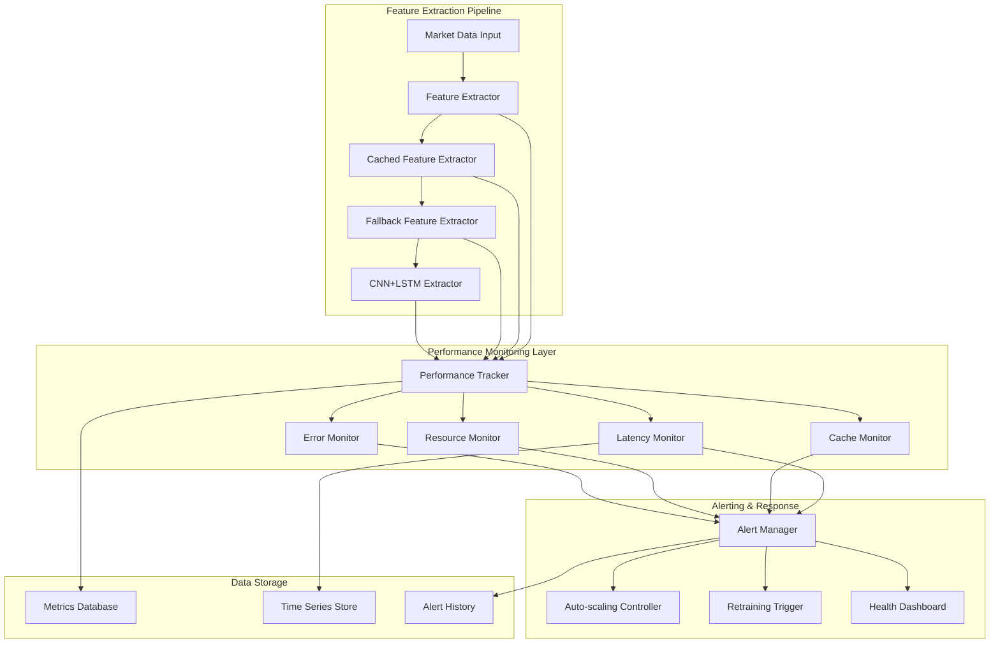

# Feature Extraction Performance Monitoring System Design

## 1. Executive Summary

This document outlines the technical design for a comprehensive performance monitoring system specifically tailored to ensure the <100ms feature extraction requirement is met across all components of the AI Trading Platform. The system builds upon the existing monitoring infrastructure while introducing specialized capabilities for real-time feature extraction performance tracking, alerting, and optimization recommendations.

## 2. System Overview

### 2.1 Current Architecture Context

The AI Trading Platform currently implements:
- CNN+LSTM hybrid models for feature extraction and target prediction
- Ray Serve for distributed model serving with auto-scaling capabilities
- Comprehensive monitoring system with drift detection, performance tracking, and automated retraining
- Caching layer with TTL and LRU eviction policies
- Batch processing optimization for improved throughput

### 2.2 Performance Requirements

- **Primary Requirement**: Feature extraction latency must be <100ms for 95th percentile of requests
- **Secondary Requirements**:
  - Cache hit rate > 85%
  - Fallback usage < 5%
  - Error rate < 0.1%
  - System uptime > 99.9%

## 3. Performance Monitoring Architecture

### 3.1 High-Level Architecture



### 3.2 Core Components

#### 3.2.1 FeatureExtractorPerformanceMonitor

The central component responsible for monitoring all aspects of feature extraction performance:

```python
# src/ml/feature_extraction/performance_monitor.py
from dataclasses import dataclass
from typing import Dict, List, Optional
from datetime import datetime, timedelta
import numpy as np

@dataclass
class FeatureExtractionMetrics:
    """Comprehensive metrics for feature extraction performance"""
    timestamp: datetime
    extraction_count: int = 0
    total_time_ms: float = 0.0
    avg_time_ms: float = 0.0
    p95_time_ms: float = 0.0
    p99_time_ms: float = 0.0
    max_time_ms: float = 0.0
    min_time_ms: float = 0.0
    
    # Cache metrics
    cache_hits: int = 0
    cache_misses: int = 0
    cache_hit_rate: float = 0.0
    
    # Fallback metrics
    fallback_count: int = 0
    fallback_rate: float = 0.0
    
    # Error metrics
    error_count: int = 0
    error_rate: float = 0.0
    
    # Resource metrics
    cpu_percent: float = 0.0
    memory_mb: float = 0.0
    gpu_utilization: float = 0.0
    
    # Throughput metrics
    requests_per_second: float = 0.0

class FeatureExtractorPerformanceMonitor:
    """Monitors and tracks feature extraction performance"""
    
    def __init__(self, window_size: int = 1000):
        self.window_size = window_size
        self.metrics_history: List[FeatureExtractionMetrics] = []
        self.current_metrics = FeatureExtractionMetrics(datetime.now())
        self.latency_samples: List[float] = []
        
    def record_extraction(self, 
                         duration_ms: float,
                         used_cache: bool = False,
                         used_fallback: bool = False,
                         had_error: bool = False,
                         cpu_percent: float = 0.0,
                         memory_mb: float = 0.0,
                         gpu_utilization: float = 0.0) -> None:
        """Record a feature extraction operation"""
        self.current_metrics.extraction_count += 1
        self.current_metrics.total_time_ms += duration_ms
        self.latency_samples.append(duration_ms)
        
        if used_cache:
            self.current_metrics.cache_hits += 1
        else:
            self.current_metrics.cache_misses += 1
            
        if used_fallback:
            self.current_metrics.fallback_count += 1
            
        if had_error:
            self.current_metrics.error_count += 1
            
        self.current_metrics.cpu_percent = cpu_percent
        self.current_metrics.memory_mb = memory_mb
        self.current_metrics.gpu_utilization = gpu_utilization
        
        # Update calculated metrics periodically
        if self.current_metrics.extraction_count % 10 == 0:
            self._update_calculated_metrics()
    
    def _update_calculated_metrics(self) -> None:
        """Update calculated metrics based on current data"""
        if self.current_metrics.extraction_count > 0:
            self.current_metrics.avg_time_ms = (
                self.current_metrics.total_time_ms / self.current_metrics.extraction_count
            )
            
        total_requests = self.current_metrics.cache_hits + self.current_metrics.cache_misses
        if total_requests > 0:
            self.current_metrics.cache_hit_rate = (
                self.current_metrics.cache_hits / total_requests
            )
            
        if self.current_metrics.extraction_count > 0:
            self.current_metrics.fallback_rate = (
                self.current_metrics.fallback_count / self.current_metrics.extraction_count
            )
            self.current_metrics.error_rate = (
                self.current_metrics.error_count / self.current_metrics.extraction_count
            )
            
        # Calculate percentiles from samples
        if self.latency_samples:
            self.current_metrics.p95_time_ms = np.percentile(self.latency_samples, 95)
            self.current_metrics.p99_time_ms = np.percentile(self.latency_samples, 99)
            self.current_metrics.max_time_ms = np.max(self.latency_samples)
            self.current_metrics.min_time_ms = np.min(self.latency_samples)
    
    def get_current_metrics(self) -> FeatureExtractionMetrics:
        """Get current performance metrics"""
        self._update_calculated_metrics()
        return self.current_metrics
    
    def get_historical_metrics(self, hours: int = 1) -> List[FeatureExtractionMetrics]:
        """Get historical metrics for the specified time period"""
        cutoff_time = datetime.now() - timedelta(hours=hours)
        return [m for m in self.metrics_history if m.timestamp > cutoff_time]
    
    def check_performance_violations(self) -> List[Dict[str, Any]]:
        """Check for performance violations against thresholds"""
        violations = []
        metrics = self.get_current_metrics()
        
        # Check latency violation
        if metrics.p95_time_ms > 100:
            violations.append({
                'type': 'latency_violation',
                'severity': 'critical' if metrics.p95_time_ms > 150 else 'high',
                'message': f'95th percentile latency ({metrics.p95_time_ms:.2f}ms) exceeds 100ms threshold',
                'value': metrics.p95_time_ms,
                'threshold': 100
            })
        
        # Check cache hit rate violation
        if metrics.cache_hit_rate < 0.85:
            violations.append({
                'type': 'cache_hit_rate_violation',
                'severity': 'medium',
                'message': f'Cache hit rate ({metrics.cache_hit_rate:.2%}) below 85% threshold',
                'value': metrics.cache_hit_rate,
                'threshold': 0.85
            })
        
        # Check fallback rate violation
        if metrics.fallback_rate > 0.05:
            violations.append({
                'type': 'fallback_rate_violation',
                'severity': 'medium',
                'message': f'Fallback rate ({metrics.fallback_rate:.2%}) above 5% threshold',
                'value': metrics.fallback_rate,
                'threshold': 0.05
            })
        
        # Check error rate violation
        if metrics.error_rate > 0.001:
            violations.append({
                'type': 'error_rate_violation',
                'severity': 'high',
                'message': f'Error rate ({metrics.error_rate:.2%}) above 0.1% threshold',
                'value': metrics.error_rate,
                'threshold': 0.001
            })
        
        return violations
```

#### 3.2.2 RayServePerformanceMonitor

Specialized monitoring for Ray Serve deployments:

```python
# src/services/ray_serve_performance_monitor.py
from typing import Dict, List, Optional
import ray
from ray.serve import get_deployment
from ray.serve.deployment import Deployment

class RayServePerformanceMonitor:
    """Monitors Ray Serve deployment performance"""
    
    def __init__(self):
        self.metrics_collector = get_metrics_collector()
    
    async def get_deployment_metrics(self, deployment_name: str) -> Dict[str, Any]:
        """Get comprehensive metrics for a Ray Serve deployment"""
        try:
            # Get deployment handle
            deployment = get_deployment(deployment_name)
            
            # Get Ray Serve built-in metrics
            serve_metrics = await self._get_serve_metrics(deployment_name)
            
            # Get custom performance metrics
            custom_metrics = await self._get_custom_metrics(deployment_name)
            
            return {
                **serve_metrics,
                **custom_metrics
            }
        except Exception as e:
            logger.error(f"Error getting deployment metrics for {deployment_name}: {e}")
            return {}
    
    async def _get_serve_metrics(self, deployment_name: str) -> Dict[str, Any]:
        """Get Ray Serve built-in metrics"""
        # This would interface with Ray Serve's metrics system
        # Implementation depends on Ray Serve version and metrics backend
        pass
    
    async def _get_custom_metrics(self, deployment_name: str) -> Dict[str, Any]:
        """Get custom application metrics"""
        # Get feature extraction specific metrics
        feature_metrics = self.metrics_collector.get_metrics("feature_extraction")
        
        # Get system resource metrics
        system_metrics = self.metrics_collector.get_system_metrics()
        
        return {
            'feature_extraction': feature_metrics,
            'system_resources': system_metrics
        }
    
    def get_replica_info(self, deployment_name: str) -> List[Dict[str, Any]]:
        """Get information about deployment replicas"""
        try:
            # Get replica information from Ray Serve
            deployment = get_deployment(deployment_name)
            # Implementation depends on Ray Serve API
            pass
        except Exception as e:
            logger.error(f"Error getting replica info for {deployment_name}: {e}")
            return []
```

## 4. Monitoring Configuration Specifications

### 4.1 Performance Thresholds

```python
# src/config/feature_extraction_monitoring_config.py
from dataclasses import dataclass
from typing import Dict

@dataclass
class FeatureExtractionThresholds:
    """Performance thresholds for feature extraction monitoring"""
    
    # Latency thresholds (in milliseconds)
    latency_p95_threshold: float = 100.0 # Primary requirement
    latency_p99_threshold: float = 150.0
    latency_max_threshold: float = 200.0
    
    # Cache performance thresholds
    cache_hit_rate_threshold: float = 0.85
    cache_size_threshold: float = 0.90  # 90% of max cache size
    
    # Fallback usage thresholds
    fallback_rate_threshold: float = 0.05
    
    # Error rate thresholds
    error_rate_threshold: float = 0.001  # 0.1%
    
    # Resource utilization thresholds
    cpu_utilization_threshold: float = 80.0
    memory_utilization_threshold: float = 85.0
    gpu_utilization_threshold: float = 90.0
    
    # Throughput thresholds
    min_requests_per_second: float = 10.0

@dataclass
class MonitoringIntervals:
    """Monitoring interval configurations"""
    
    # Metrics collection intervals
    metrics_collection_interval_seconds: int = 10
    detailed_metrics_interval_seconds: int = 60
    
    # Health check intervals
    health_check_interval_seconds: int = 30
    deep_health_check_interval_seconds: int = 300
    
    # Alert evaluation intervals
    alert_evaluation_interval_seconds: int = 15
    critical_alert_evaluation_interval_seconds: int = 5

@dataclass
class FeatureExtractionMonitoringConfig:
    """Complete configuration for feature extraction monitoring"""
    
    thresholds: FeatureExtractionThresholds = FeatureExtractionThresholds()
    intervals: MonitoringIntervals = MonitoringIntervals()
    
    # Enable/disable specific monitoring components
    enable_latency_monitoring: bool = True
    enable_cache_monitoring: bool = True
    enable_resource_monitoring: bool = True
    enable_error_monitoring: bool = True
    
    # Alerting configuration
    enable_alerting: bool = True
    alert_cooldown_seconds: int = 300  # 5 minutes
```

### 4.2 Metrics Collection Strategy

The monitoring system collects metrics at multiple levels:

1. **Real-time Metrics** (collected every request):
   - Request duration
   - Cache hit/miss
   - Fallback usage
   - Error occurrence

2. **Periodic Metrics** (collected at configured intervals):
   - System resource utilization (CPU, memory, GPU)
   - Cache statistics
   - Throughput metrics
   - Performance trends

3. **Aggregated Metrics** (calculated from historical data):
   - Percentile latencies (p95, p99)
   - Moving averages
   - Trend analysis
   - Violation detection

## 5. Integration Approach

### 5.1 Integration with Ray Serve

The performance monitoring system integrates with Ray Serve through:

1. **Deployment Wrapper**: Each Ray Serve deployment is wrapped with monitoring capabilities
2. **Metrics Export**: Ray Serve metrics are exported to the central monitoring system
3. **Auto-scaling Integration**: Performance metrics drive auto-scaling decisions
4. **Health Checks**: Ray Serve health status is incorporated into overall system health

```python
# src/ml/feature_extraction/ray_serve_integration.py
from ray import serve
from ray.serve import Deployment
import numpy as np
from typing import Dict, Any

@serve.deployment(
    name="monitored_cnn_lstm_predictor",
    num_replicas=2,
    autoscaling_config={
        "min_replicas": 2,
        "max_replicas": 20,
        "target_num_ongoing_requests_per_replica": 5,
    }
)
class MonitoredCNNLSTMPredictor:
    """CNN+LSTM predictor with integrated performance monitoring"""
    
    def __init__(self, model_path: str = None):
        # Initialize base predictor
        self.base_predictor = CNNLSTMPredictor(model_path)
        
        # Initialize performance monitor
        self.performance_monitor = FeatureExtractorPerformanceMonitor()
        
        # Get metrics collector
        self.metrics_collector = get_metrics_collector()
        
    @serve.batch(max_batch_size=32, batch_wait_timeout_s=0.01)
    async def batch_predict(self, requests: List[np.ndarray]) -> List[Dict[str, Any]]:
        """Batch prediction with performance monitoring"""
        start_time = time.time()
        
        try:
            # Collect system metrics at start
            start_cpu = psutil.cpu_percent()
            start_memory = psutil.virtual_memory().used / (1024 * 1024)  # MB
            start_gpu = self._get_gpu_utilization()
            
            # Perform batch prediction
            results = await self.base_predictor.batch_predict(requests)
            
            # Calculate duration
            duration_ms = (time.time() - start_time) * 1000
            
            # Collect system metrics at end
            end_cpu = psutil.cpu_percent()
            end_memory = psutil.virtual_memory().used / (1024 * 1024)  # MB
            end_gpu = self._get_gpu_utilization()
            
            # Record performance metrics
            self.performance_monitor.record_extraction(
                duration_ms=duration_ms,
                used_cache=False,  # Would be determined by implementation
                used_fallback=False,  # Would be determined by implementation
                had_error=False,
                cpu_percent=(start_cpu + end_cpu) / 2,
                memory_mb=(start_memory + end_memory) / 2,
                gpu_utilization=(start_gpu + end_gpu) / 2
            )
            
            # Record to global metrics collector
            self.metrics_collector.record_histogram(
                "feature_extraction_latency_ms", 
                duration_ms,
                {"deployment": "cnn_lstm_predictor"}
            )
            
            return results
            
        except Exception as e:
            # Record error
            duration_ms = (time.time() - start_time) * 1000
            self.performance_monitor.record_extraction(
                duration_ms=duration_ms,
                had_error=True
            )
            
            self.metrics_collector.increment_counter(
                "feature_extraction_errors_total",
                {"deployment": "cnn_lstm_predictor", "error_type": type(e).__name__}
            )
            
            raise e
    
    def _get_gpu_utilization(self) -> float:
        """Get current GPU utilization"""
        try:
            if torch.cuda.is_available():
                return torch.cuda.utilization()
            return 0.0
        except:
            return 0.0
    
    def get_performance_stats(self) -> Dict[str, Any]:
        """Get current performance statistics"""
        return self.performance_monitor.get_current_metrics().__dict__
```

### 5.2 Integration with Caching Layer

The monitoring system integrates with the caching layer to track:

1. **Cache Hit Rate**: Percentage of requests served from cache
2. **Cache Efficiency**: Memory utilization vs. performance gain
3. **Cache Eviction**: Frequency and patterns of cache evictions
4. **Cache Warming**: Effectiveness of cache warming strategies

```python
# src/ml/feature_extraction/caching_monitor.py
from typing import Dict, Any
from .cached_extractor import CachedFeatureExtractor

class CachingPerformanceMonitor:
    """Monitors caching layer performance"""
    
    def __init__(self, cached_extractor: CachedFeatureExtractor):
        self.cached_extractor = cached_extractor
        self.metrics_collector = get_metrics_collector()
        
    def monitor_cache_operation(self, operation: str, duration_ms: float, 
                              success: bool = True) -> None:
        """Monitor a cache operation"""
        self.metrics_collector.increment_counter(
            f"cache_operations_{operation}_total",
            {"success": str(success)}
        )
        
        self.metrics_collector.record_histogram(
            f"cache_{operation}_latency_ms",
            duration_ms
        )
    
    def get_cache_statistics(self) -> Dict[str, Any]:
        """Get comprehensive cache statistics"""
        cache_info = self.cached_extractor.get_cache_info()
        
        # Add monitoring-specific metrics
        cache_stats = {
            **cache_info,
            "hit_rate": self._calculate_hit_rate(cache_info),
            "efficiency_ratio": self._calculate_efficiency_ratio(cache_info)
        }
        
        return cache_stats
    
    def _calculate_hit_rate(self, cache_info: Dict[str, Any]) -> float:
        """Calculate cache hit rate"""
        hits = cache_info.get("cache_hits", 0)
        misses = cache_info.get("cache_misses", 0)
        total = hits + misses
        return hits / total if total > 0 else 0.0
    
    def _calculate_efficiency_ratio(self, cache_info: Dict[str, Any]) -> float:
        """Calculate cache efficiency ratio"""
        size = cache_info.get("cache_size", 0)
        max_size = cache_info.get("max_size", 1)
        hit_rate = self._calculate_hit_rate(cache_info)
        return (hit_rate * size) / max_size if max_size > 0 else 0.0
```

### 5.3 Integration with Batch Processing

The monitoring system integrates with batch processing to track:

1. **Batch Size Efficiency**: Optimal batch sizes for latency vs. throughput
2. **Batch Wait Times**: Time spent waiting for batch completion
3. **Batch Processing Efficiency**: Resource utilization during batch processing
4. **Batch Error Handling**: Error rates and patterns in batch processing

```python
# src/ml/feature_extraction/batch_monitor.py
from typing import List, Dict, Any
import time

class BatchProcessingMonitor:
    """Monitors batch processing performance"""
    
    def __init__(self):
        self.metrics_collector = get_metrics_collector()
        self.batch_metrics = {}
    
    def start_batch_monitoring(self, batch_id: str, batch_size: int) -> None:
        """Start monitoring a batch processing operation"""
        self.batch_metrics[batch_id] = {
            "start_time": time.time(),
            "batch_size": batch_size,
            "requests_processed": 0
        }
    
    def record_batch_request(self, batch_id: str) -> None:
        """Record processing of a request in a batch"""
        if batch_id in self.batch_metrics:
            self.batch_metrics[batch_id]["requests_processed"] += 1
    
    def end_batch_monitoring(self, batch_id: str, success: bool = True) -> None:
        """End monitoring a batch processing operation"""
        if batch_id in self.batch_metrics:
            metrics = self.batch_metrics[batch_id]
            duration_ms = (time.time() - metrics["start_time"]) * 1000
            
            # Record batch metrics
            self.metrics_collector.record_histogram(
                "batch_processing_latency_ms",
                duration_ms,
                {"success": str(success)}
            )
            
            self.metrics_collector.record_histogram(
                "batch_size",
                metrics["batch_size"]
            )
            
            # Calculate throughput
            if duration_ms > 0:
                throughput = (metrics["requests_processed"] / duration_ms) * 1000
                self.metrics_collector.record_histogram(
                    "batch_throughput_rps",
                    throughput
                )
            
            # Clean up
            del self.batch_metrics[batch_id]
```

## 6. Alerting Strategies and Escalation Procedures

### 6.1 Alert Types and Severity Levels

The monitoring system defines the following alert types with corresponding severity levels:

| Alert Type | Severity | Threshold | Description |
|------------|----------|-----------|-------------|
| Latency Violation (p95) | Critical | > 150ms | 95th percentile latency exceeds critical threshold |
| Latency Violation (p95) | High | > 100ms | 95th percentile latency exceeds requirement |
| Cache Hit Rate | Medium | < 85% | Cache hit rate below optimal threshold |
| Fallback Usage | Medium | > 5% | Excessive use of fallback mechanisms |
| Error Rate | High | > 0.1% | Error rate above acceptable threshold |
| Resource Utilization | Medium | > 85% | High resource utilization detected |
| System Health | Critical | < 70 | Overall system health score critically low |

### 6.2 Alerting Rules Configuration

```python
# src/services/monitoring/alerting_rules.py
from dataclasses import dataclass
from typing import Dict, List, Callable
from enum import Enum

class AlertSeverity(Enum):
    LOW = "low"
    MEDIUM = "medium"
    HIGH = "high"
    CRITICAL = "critical"

@dataclass
class AlertRule:
    """Configuration for an alert rule"""
    name: str
    severity: AlertSeverity
    condition: Callable[[], bool]
    message_template: str
    cooldown_seconds: int = 300
    auto_resolve: bool = True
    escalation_required: bool = False

class FeatureExtractionAlertManager:
    """Manages alerts for feature extraction performance"""
    
    def __init__(self, performance_monitor: FeatureExtractorPerformanceMonitor):
        self.performance_monitor = performance_monitor
        self.alert_rules: List[AlertRule] = self._initialize_alert_rules()
        self.active_alerts: Dict[str, datetime] = {}
        self.alert_history: List[Dict[str, Any]] = []
        
    def _initialize_alert_rules(self) -> List[AlertRule]:
        """Initialize alert rules for feature extraction monitoring"""
        return [
            AlertRule(
                name="latency_violation_critical",
                severity=AlertSeverity.CRITICAL,
                condition=self._latency_violation_critical_condition,
                message_template="Feature extraction latency (p95={latency_ms}ms) exceeds critical threshold of 150ms",
                cooldown_seconds=300,
                escalation_required=True
            ),
            AlertRule(
                name="latency_violation_high",
                severity=AlertSeverity.HIGH,
                condition=self._latency_violation_high_condition,
                message_template="Feature extraction latency (p95={latency_ms}ms) exceeds requirement of 100ms",
                cooldown_seconds=600
            ),
            AlertRule(
                name="cache_hit_rate_violation",
                severity=AlertSeverity.MEDIUM,
                condition=self._cache_hit_rate_violation_condition,
                message_template="Cache hit rate ({hit_rate:.2%}) below threshold of 85%",
                cooldown_seconds=900
            ),
            AlertRule(
                name="fallback_usage_violation",
                severity=AlertSeverity.MEDIUM,
                condition=self._fallback_usage_violation_condition,
                message_template="Fallback usage ({fallback_rate:.2%}) exceeds threshold of 5%",
                cooldown_seconds=900
            ),
            AlertRule(
                name="error_rate_violation",
                severity=AlertSeverity.HIGH,
                condition=self._error_rate_violation_condition,
                message_template="Error rate ({error_rate:.2%}) exceeds threshold of 0.1%",
                cooldown_seconds=600,
                escalation_required=True
            )
        ]
    
    def _latency_violation_critical_condition(self) -> bool:
        """Check for critical latency violation"""
        metrics = self.performance_monitor.get_current_metrics()
        return metrics.p95_time_ms > 150
    
    def _latency_violation_high_condition(self) -> bool:
        """Check for high latency violation"""
        metrics = self.performance_monitor.get_current_metrics()
        return metrics.p95_time_ms > 100
    
    def _cache_hit_rate_violation_condition(self) -> bool:
        """Check for cache hit rate violation"""
        metrics = self.performance_monitor.get_current_metrics()
        return metrics.cache_hit_rate < 0.85
    
    def _fallback_usage_violation_condition(self) -> bool:
        """Check for fallback usage violation"""
        metrics = self.performance_monitor.get_current_metrics()
        return metrics.fallback_rate > 0.05
    
    def _error_rate_violation_condition(self) -> bool:
        """Check for error rate violation"""
        metrics = self.performance_monitor.get_current_metrics()
        return metrics.error_rate > 0.001
    
    def evaluate_alerts(self) -> List[Dict[str, Any]]:
        """Evaluate all alert rules and return active alerts"""
        active_alerts = []
        current_time = datetime.now()
        
        for rule in self.alert_rules:
            # Check if alert is in cooldown
            if rule.name in self.active_alerts:
                cooldown_end = self.active_alerts[rule.name]
                if current_time < cooldown_end:
                    continue
            
            # Evaluate condition
            if rule.condition():
                # Generate alert
                metrics = self.performance_monitor.get_current_metrics()
                alert_message = rule.message_template.format(
                    latency_ms=metrics.p95_time_ms,
                    hit_rate=metrics.cache_hit_rate,
                    fallback_rate=metrics.fallback_rate,
                    error_rate=metrics.error_rate
                )
                
                alert = {
                    "id": f"{rule.name}_{current_time.timestamp()}",
                    "name": rule.name,
                    "severity": rule.severity.value,
                    "message": alert_message,
                    "timestamp": current_time,
                    "metrics": metrics.__dict__
                }
                
                active_alerts.append(alert)
                
                # Set cooldown
                self.active_alerts[rule.name] = current_time + timedelta(seconds=rule.cooldown_seconds)
                
                # Add to history
                self.alert_history.append(alert)
                
                # Keep only recent history
                self.alert_history = self.alert_history[-1000:]
        
        return active_alerts
```

### 6.3 Escalation Procedures

The alerting system implements the following escalation procedures:

1. **Level 1 - Monitoring Dashboard**: All alerts appear in the monitoring dashboard
2. **Level 2 - Email Notifications**: Medium+ severity alerts trigger email notifications
3. **Level 3 - Slack Alerts**: High+ severity alerts trigger Slack notifications
4. **Level 4 - PagerDuty Integration**: Critical alerts trigger PagerDuty incidents
5. **Level 5 - Automated Response**: Critical alerts may trigger automated remediation

```python
# src/services/monitoring/escalation_manager.py
from typing import List, Dict, Any
import asyncio

class EscalationManager:
    """Manages alert escalation procedures"""
    
    def __init__(self):
        self.notification_channels = {
            "email": EmailAlertChannel(),
            "slack": SlackAlertChannel(),
            "pagerduty": PagerDutyAlertChannel()
        }
    
    async def escalate_alert(self, alert: Dict[str, Any]) -> None:
        """Escalate an alert based on its severity"""
        severity = alert["severity"]
        
        if severity == "critical":
            await self._escalate_critical(alert)
        elif severity == "high":
            await self._escalate_high(alert)
        elif severity == "medium":
            await self._escalate_medium(alert)
        else:
            await self._escalate_low(alert)
    
    async def _escalate_critical(self, alert: Dict[str, Any]) -> None:
        """Escalate critical alert"""
        # Send to all channels
        tasks = [
            self.notification_channels["pagerduty"].send_alert(alert),
            self.notification_channels["slack"].send_alert(alert),
            self.notification_channels["email"].send_alert(alert)
        ]
        
        await asyncio.gather(*tasks, return_exceptions=True)
        
        # Trigger automated response
        await self._trigger_automated_response(alert)
    
    async def _escalate_high(self, alert: Dict[str, Any]) -> None:
        """Escalate high severity alert"""
        # Send to Slack and email
        tasks = [
            self.notification_channels["slack"].send_alert(alert),
            self.notification_channels["email"].send_alert(alert)
        ]
        
        await asyncio.gather(*tasks, return_exceptions=True)
    
    async def _escalate_medium(self, alert: Dict[str, Any]) -> None:
        """Escalate medium severity alert"""
        # Send to email only
        await self.notification_channels["email"].send_alert(alert)
    
    async def _escalate_low(self, alert: Dict[str, Any]) -> None:
        """Escalate low severity alert"""
        # Log only
        logger.info(f"Low severity alert: {alert['message']}")
    
    async def _trigger_automated_response(self, alert: Dict[str, Any]) -> None:
        """Trigger automated response to critical alerts"""
        alert_type = alert["name"]
        
        if "latency_violation" in alert_type:
            await self._scale_up_deployment()
        elif "error_rate_violation" in alert_type:
            await self._restart_deployment()
        elif "resource_utilization" in alert_type:
            await self._optimize_resources()
    
    async def _scale_up_deployment(self) -> None:
        """Scale up the feature extraction deployment"""
        # Implementation would interface with Kubernetes/Ray Serve
        pass
    
    async def _restart_deployment(self) -> None:
        """Restart the feature extraction deployment"""
        # Implementation would interface with Kubernetes/Ray Serve
        pass
    
    async def _optimize_resources(self) -> None:
        """Optimize resource allocation"""
        # Implementation would adjust resource limits
        pass
```

## 7. Dashboard and Visualization Approaches

### 7.1 Dashboard Components

The monitoring dashboard provides the following key components:

1. **Real-time Performance Overview**: Current latency, throughput, and error rates
2. **Historical Trends**: Performance trends over time with statistical analysis
3. **Component Health**: Health status of individual components (cache, fallback, etc.)
4. **Resource Utilization**: CPU, memory, and GPU utilization
5. **Alert Summary**: Active alerts and recent alert history
6. **Recommendations**: Performance optimization recommendations

### 7.2 Visualization Design

```python
# src/services/monitoring/dashboard_visualization.py
from typing import Dict, List, Any
import plotly.graph_objects as go
import plotly.express as px
from datetime import datetime, timedelta

class FeatureExtractionDashboard:
    """Generates visualizations for feature extraction monitoring"""
    
    def __init__(self, performance_monitor: FeatureExtractorPerformanceMonitor):
        self.performance_monitor = performance_monitor
    
    def generate_latency_dashboard(self) -> Dict[str, Any]:
        """Generate latency-focused dashboard visualizations"""
        # Get historical metrics
        metrics_history = self.performance_monitor.get_historical_metrics(hours=1)
        
        # Create time series data
        timestamps = [m.timestamp for m in metrics_history]
        p95_latencies = [m.p95_time_ms for m in metrics_history]
        avg_latencies = [m.avg_time_ms for m in metrics_history]
        
        # Create latency trend chart
        fig = go.Figure()
        fig.add_trace(go.Scatter(
            x=timestamps,
            y=p95_latencies,
            mode='lines+markers',
            name='95th Percentile Latency',
            line=dict(color='red')
        ))
        fig.add_trace(go.Scatter(
            x=timestamps,
            y=avg_latencies,
            mode='lines',
            name='Average Latency',
            line=dict(color='blue')
        ))
        fig.add_hline(
            y=100,
            line_dash="dash",
            line_color="green",
            annotation_text="Requirement Threshold"
        )
        
        fig.update_layout(
            title="Feature Extraction Latency Trends",
            xaxis_title="Time",
            yaxis_title="Latency (ms)",
            hovermode="x unified"
        )
        
        return {
            "chart": fig.to_json(),
            "current_p95": p95_latencies[-1] if p95_latencies else 0,
            "current_avg": avg_latencies[-1] if avg_latencies else 0,
            "violations": len([l for l in p95_latencies if l > 100])
        }
    
    def generate_cache_dashboard(self) -> Dict[str, Any]:
        """Generate cache-focused dashboard visualizations"""
        # Get historical metrics
        metrics_history = self.performance_monitor.get_historical_metrics(hours=1)
        
        # Create time series data
        timestamps = [m.timestamp for m in metrics_history]
        hit_rates = [m.cache_hit_rate for m in metrics_history]
        
        # Create cache hit rate chart
        fig = go.Figure()
        fig.add_trace(go.Scatter(
            x=timestamps,
            y=hit_rates,
            mode='lines+markers',
            name='Cache Hit Rate',
            line=dict(color='green')
        ))
        fig.add_hline(
            y=0.85,
            line_dash="dash",
            line_color="red",
            annotation_text="Target Hit Rate"
        )
        
        fig.update_layout(
            title="Cache Hit Rate Trends",
            xaxis_title="Time",
            yaxis_title="Hit Rate (%)",
            yaxis_tickformat='.0%',
            hovermode="x unified"
        )
        
        current_hit_rate = hit_rates[-1] if hit_rates else 0
        
        return {
            "chart": fig.to_json(),
            "current_hit_rate": current_hit_rate,
            "below_threshold": current_hit_rate < 0.85
        }
    
    def generate_error_dashboard(self) -> Dict[str, Any]:
        """Generate error-focused dashboard visualizations"""
        # Get historical metrics
        metrics_history = self.performance_monitor.get_historical_metrics(hours=1)
        
        # Create time series data
        timestamps = [m.timestamp for m in metrics_history]
        error_rates = [m.error_rate for m in metrics_history]
        
        # Create error rate chart
        fig = go.Figure()
        fig.add_trace(go.Scatter(
            x=timestamps,
            y=error_rates,
            mode='lines+markers',
            name='Error Rate',
            line=dict(color='red')
        ))
        fig.add_hline(
            y=0.001,
            line_dash="dash",
            line_color="green",
            annotation_text="Target Error Rate"
        )
        
        fig.update_layout(
            title="Error Rate Trends",
            xaxis_title="Time",
            yaxis_title="Error Rate (%)",
            yaxis_tickformat='.2%',
            hovermode="x unified"
        )
        
        current_error_rate = error_rates[-1] if error_rates else 0
        
        return {
            "chart": fig.to_json(),
            "current_error_rate": current_error_rate,
            "above_threshold": current_error_rate > 0.001
        }
    
    def generate_resource_dashboard(self) -> Dict[str, Any]:
        """Generate resource utilization dashboard visualizations"""
        # Get historical metrics
        metrics_history = self.performance_monitor.get_historical_metrics(hours=1)
        
        # Create time series data
        timestamps = [m.timestamp for m in metrics_history]
        cpu_util = [m.cpu_percent for m in metrics_history]
        memory_util = [m.memory_mb for m in metrics_history]
        
        # Create resource utilization chart
        fig = go.Figure()
        fig.add_trace(go.Scatter(
            x=timestamps,
            y=cpu_util,
            mode='lines',
            name='CPU Utilization (%)',
            line=dict(color='blue')
        ))
        fig.add_trace(go.Scatter(
            x=timestamps,
            y=memory_util,
            mode='lines',
            name='Memory Usage (MB)',
            line=dict(color='orange'),
            yaxis="y2"
        ))
        
        fig.update_layout(
            title="Resource Utilization",
            xaxis_title="Time",
            yaxis_title="CPU Utilization (%)",
            yaxis2=dict(
                title="Memory Usage (MB)",
                overlaying="y",
                side="right"
            ),
            hovermode="x unified"
        )
        
        return {
            "chart": fig.to_json(),
            "current_cpu": cpu_util[-1] if cpu_util else 0,
            "current_memory": memory_util[-1] if memory_util else 0
        }
```

### 7.3 API Endpoints for Dashboard Data

```python
# src/api/feature_extraction_monitoring_endpoints.py
from fastapi import APIRouter, HTTPException
from typing import Dict, Any
import json

router = APIRouter(prefix="/monitoring/feature-extraction", tags=["feature-extraction-monitoring"])

@router.get("/dashboard/performance")
async def get_performance_dashboard():
    """Get feature extraction performance dashboard data"""
    try:
        # Get performance monitor instance
        monitor = get_feature_extraction_performance_monitor()
        dashboard = FeatureExtractionDashboard(monitor)
        
        # Generate dashboard components
        latency_data = dashboard.generate_latency_dashboard()
        cache_data = dashboard.generate_cache_dashboard()
        error_data = dashboard.generate_error_dashboard()
        resource_data = dashboard.generate_resource_dashboard()
        
        return {
            "timestamp": datetime.now().isoformat(),
            "latency": latency_data,
            "cache": cache_data,
            "errors": error_data,
            "resources": resource_data,
            "overall_health": await _calculate_overall_health(monitor)
        }
    except Exception as e:
        logger.error(f"Error generating performance dashboard: {e}")
        raise HTTPException(status_code=500, detail="Failed to generate dashboard")

@router.get("/metrics/current")
async def get_current_metrics():
    """Get current feature extraction metrics"""
    try:
        monitor = get_feature_extraction_performance_monitor()
        metrics = monitor.get_current_metrics()
        return metrics.__dict__
    except Exception as e:
        logger.error(f"Error getting current metrics: {e}")
        raise HTTPException(status_code=500, detail="Failed to get metrics")

@router.get("/metrics/historical")
async def get_historical_metrics(hours: int = 1):
    """Get historical feature extraction metrics"""
    try:
        monitor = get_feature_extraction_performance_monitor()
        metrics = monitor.get_historical_metrics(hours=hours)
        return [m.__dict__ for m in metrics]
    except Exception as e:
        logger.error(f"Error getting historical metrics: {e}")
        raise HTTPException(status_code=500, detail="Failed to get historical metrics")

@router.get("/alerts/active")
async def get_active_alerts():
    """Get currently active alerts"""
    try:
        alert_manager = get_feature_extraction_alert_manager()
        alerts = alert_manager.evaluate_alerts()
        return alerts
    except Exception as e:
        logger.error(f"Error getting active alerts: {e}")
        raise HTTPException(status_code=500, detail="Failed to get alerts")

async def _calculate_overall_health(monitor) -> Dict[str, Any]:
    """Calculate overall health score for feature extraction"""
    metrics = monitor.get_current_metrics()
    
    # Calculate weighted health score
    latency_score = max(0, 100 - max(0, (metrics.p95_time_ms - 100) * 2))
    cache_score = min(100, metrics.cache_hit_rate * 100 / 0.85)
    error_score = max(0, 100 - (metrics.error_rate * 100000))  # Scale error rate
    
    overall_score = (latency_score * 0.5 + cache_score * 0.3 + error_score * 0.2)
    
    # Determine health status
    if overall_score >= 90:
        status = "healthy"
    elif overall_score >= 70:
        status = "degraded"
    else:
        status = "critical"
    
    return {
        "score": overall_score,
        "status": status,
        "latency_score": latency_score,
        "cache_score": cache_score,
        "error_score": error_score
    }
```

## 8. Implementation Plan

### 8.1 Phase 1: Core Monitoring Infrastructure (Week 1-2)

1. Implement `FeatureExtractorPerformanceMonitor` class
2. Create performance metrics data structures
3. Implement metrics collection and aggregation logic
4. Set up integration with existing metrics collector

### 8.2 Phase 2: Alerting System (Week 2-3)

1. Implement `FeatureExtractionAlertManager` class
2. Create alert rules and conditions
3. Implement escalation procedures
4. Set up notification channels

### 8.3 Phase 3: Dashboard and Visualization (Week 3-4)

1. Implement dashboard visualization components
2. Create API endpoints for dashboard data
3. Build frontend dashboard interface
4. Implement historical data analysis

### 8.4 Phase 4: Integration and Testing (Week 4-5)

1. Integrate monitoring with Ray Serve deployments
2. Integrate with caching and batch processing layers
3. Conduct performance testing
4. Validate alerting and escalation procedures

### 8.5 Phase 5: Optimization and Production Deployment (Week 5-6)

1. Optimize monitoring overhead
2. Fine-tune alert thresholds
3. Implement production deployment
4. Set up monitoring for the monitoring system

## 9. Performance Considerations

### 9.1 Monitoring Overhead

The monitoring system is designed to minimize overhead:

1. **Efficient Metrics Collection**: Metrics are collected asynchronously
2. **Sampling Strategy**: High-frequency metrics are sampled, low-frequency metrics collected periodically
3. **Batch Processing**: Multiple metrics are processed together to reduce system calls
4. **Memory Management**: Circular buffers prevent unbounded memory growth

### 9.2 Scalability

The monitoring system scales with the application:

1. **Distributed Metrics Collection**: Each Ray Serve replica collects its own metrics
2. **Centralized Aggregation**: Metrics are aggregated in a central store
3. **Horizontal Scaling**: Monitoring components can be scaled independently
4. **Resource Isolation**: Monitoring does not compete with feature extraction for resources

## 10. Security Considerations

### 10.1 Data Protection

1. **Metric Data Encryption**: Sensitive metric data is encrypted at rest
2. **Access Control**: Dashboard access is controlled through authentication
3. **Audit Logging**: All monitoring activities are logged for audit purposes
4. **Data Retention**: Metric data is retained according to compliance requirements

### 10.2 System Integrity

1. **Tamper Detection**: Monitoring system detects and alerts on tampering attempts
2. **Input Validation**: All monitoring inputs are validated to prevent injection attacks
3. **Rate Limiting**: Monitoring API endpoints are rate-limited to prevent abuse
4. **Secure Communication**: All monitoring communication uses encrypted channels

## 1. Testing Strategy

### 11.1 Unit Testing

1. **Metrics Collection**: Test accuracy of metrics collection and calculation
2. **Alert Evaluation**: Test alert condition evaluation logic
3. **Escalation Procedures**: Test alert escalation workflows
4. **Dashboard Generation**: Test dashboard visualization generation

### 11.2 Integration Testing

1. **Ray Serve Integration**: Test monitoring integration with Ray Serve deployments
2. **Cache Integration**: Test monitoring integration with caching layer
3. **Batch Processing Integration**: Test monitoring integration with batch processing
4. **Alerting Integration**: Test end-to-end alerting workflows

### 11.3 Performance Testing

1. **Monitoring Overhead**: Measure impact of monitoring on feature extraction performance
2. **Scalability Testing**: Test monitoring system scalability under load
3. **Latency Testing**: Validate that monitoring can detect latency violations
4. **Stress Testing**: Test monitoring system under extreme conditions

## 12. Monitoring and Maintenance

### 12.1 System Health Monitoring

The monitoring system includes self-monitoring capabilities:

1. **Monitoring System Health**: Track health of the monitoring system itself
2. **Performance of Monitoring**: Measure overhead and performance of monitoring components
3. **Data Integrity**: Validate integrity of collected metrics
4. **Alerting System Health**: Monitor alerting system for failures

### 12.2 Maintenance Procedures

1. **Regular Calibration**: Periodically calibrate monitoring thresholds
2. **Data Archiving**: Archive old metric data according to retention policies
3. **System Updates**: Update monitoring system with new metrics and alerts
4. **Performance Tuning**: Continuously optimize monitoring system performance

## 13. Conclusion

This technical design provides a comprehensive approach to implementing a performance monitoring system that ensures the <100ms feature extraction requirement is met. The system builds upon existing infrastructure while introducing specialized capabilities for real-time monitoring, alerting, and optimization.

Key benefits of this approach include:

- Real-time visibility into feature extraction performance
- Proactive alerting for performance violations
- Integration with existing Ray Serve and caching infrastructure
- Comprehensive dashboard for system operators
- Automated escalation and response procedures
- Scalable architecture that grows with the platform

The implementation plan provides a structured approach to deploying the monitoring system with minimal disruption to existing operations while ensuring the performance requirements are continuously met.