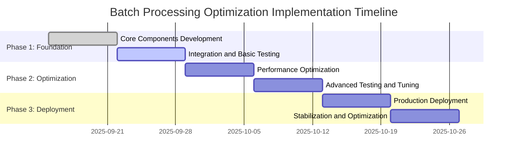

# Low Latency Implementation Plan for Batch Processing Optimization

## 1. Overview

This document outlines a comprehensive implementation plan for maintaining low latency (<100ms) in the batch processing optimization system for the AI Trading Platform. The plan focuses on achieving sub-100ms feature extraction while maximizing GPU utilization and throughput through strategic implementation phases.

## 2. Implementation Goals

### 2.1 Primary Objectives

1. **Latency Target**: Achieve <100ms feature extraction for 99th percentile requests
2. **Throughput Target**: Support 200+ requests/second during peak trading hours
3. **GPU Utilization**: Maintain 60-80% GPU utilization for optimal efficiency
4. **Reliability**: Ensure 99.9% system availability with <1% error rate
5. **Scalability**: Auto-scale from 2 to 50 replicas based on demand

### 2.2 Key Performance Indicators (KPIs)

| Metric | Target | Alert Threshold | Critical Threshold |
|--------|--------|----------------|-------------------|
| P50 Latency | <50ms | 60ms | 80ms |
| P95 Latency | <80ms | 90ms | 120ms |
| P99 Latency | <100ms | 120ms | 150ms |
| Throughput | >200 RPS | 150 RPS | 100 RPS |
| Error Rate | <1% | 2% | 5% |
| GPU Utilization | 60-80% | 85% | 95% |
| CPU Utilization | 70-85% | 90% | 95% |

## 3. Implementation Phases

### 3.1 Phase 1: Foundation and Core Infrastructure (Weeks 1-2)

#### 3.1 Week 1: Core Components Development

**Objectives:**
- Implement dynamic batch scheduler with priority queuing
- Develop GPU-aware batch processor
- Create configuration management system
- Set up basic monitoring and metrics collection

**Deliverables:**
- [ ] BatchScheduler class with priority queue implementation
- [ ] GPUBatchProcessor with basic optimization
- [ ] Configuration loader and validator
- [ ] Basic metrics collection framework
- [ ] Unit tests for core components

**Key Activities:**
1. **Batch Scheduler Implementation**
   - Design priority-based queuing system
   - Implement batch formation logic with configurable timeouts
   - Add support for dynamic batch sizing
   - Create request tracking and timing mechanisms

2. **GPU Batch Processor Development**
   - Integrate with existing CNN+LSTM models
   - Implement TorchScript compilation for optimization
   - Add memory management and cleanup routines
   - Create error handling and recovery mechanisms

3. **Configuration System**
   - Design configuration schema with validation
   - Implement profile-based configuration loading
   - Add runtime configuration updates
   - Create configuration documentation

4. **Monitoring Setup**
   - Integrate Prometheus metrics collection
   - Set up basic health checks
   - Create performance tracking utilities
   - Implement alerting framework

#### 3.1.2 Week 2: Integration and Basic Testing

**Objectives:**
- Integrate batch processing components with Ray Serve
- Conduct basic performance testing
- Validate core functionality
- Prepare for advanced optimization

**Deliverables:**
- [ ] Enhanced CNN+LSTM Ray Serve deployment
- [ ] API gateway integration for batch processing
- [ ] Basic performance test suite
- [ ] Integration test coverage
- [ ] Documentation for core components

**Key Activities:**
1. **Ray Serve Integration**
   - Update deployment definition with batch optimization
   - Implement batch prediction endpoints
   - Add single prediction with priority support
   - Configure auto-scaling parameters

2. **API Gateway Integration**
   - Create optimized API endpoints
   - Implement request routing logic
   - Add backward compatibility support
   - Set up request validation and error handling

3. **Performance Testing**
   - Develop latency testing framework
   - Create load testing scenarios
   - Establish baseline performance metrics
   - Document initial performance results

### 3.2 Phase 2: Advanced Optimization and Caching (Weeks 3-4)

#### 3.2.1 Week 3: Performance Optimization

**Objectives:**
- Implement advanced model optimization techniques
- Enhance batch processing algorithms
- Optimize resource management
- Improve caching strategies

**Deliverables:**
- [ ] Model quantization and compilation utilities
- [ ] Adaptive batch sizing implementation
- [ ] GPU memory management system
- [ ] Multi-level caching implementation
- [ ] Performance optimization documentation

**Key Activities:**
1. **Model Optimization**
   - Implement INT8 quantization for CNN+LSTM models
   - Add TorchScript compilation and optimization
   - Apply model pruning for non-critical components
   - Create optimization benchmarking tools

2. **Batch Processing Enhancement**
   - Implement adaptive batch sizing based on GPU metrics
   - Add request aging and priority boosting
   - Optimize batch formation algorithms
   - Create batch processing performance analyzers

3. **Resource Management**
   - Implement GPU memory optimization strategies
   - Add CPU affinity and thread pool management
   - Create resource utilization monitoring
   - Develop automatic resource scaling

4. **Caching Implementation**
   - Design multi-level cache architecture
   - Implement memory and Redis caching
   - Add cache warming and invalidation
   - Create cache performance monitoring

#### 3.2.2 Week 4: Advanced Testing and Tuning

**Objectives:**
- Conduct comprehensive performance testing
- Optimize system parameters
- Validate low latency requirements
- Prepare for production deployment

**Deliverables:**
- [ ] Comprehensive performance test suite
- [ ] Tuned system configuration
- [ ] Performance benchmarking reports
- [ ] Optimization recommendations
- [ ] Production readiness assessment

**Key Activities:**
1. **Performance Testing**
   - Execute latency benchmarking tests
   - Run sustained load testing
   - Conduct stress testing with high concurrency
   - Perform comparative testing (optimized vs. legacy)

2. **System Tuning**
   - Optimize batch size configurations
   - Tune wait time parameters
   - Adjust resource allocation settings
   - Fine-tune auto-scaling parameters

3. **Validation**
   - Validate <100ms latency requirement
   - Verify throughput targets
   - Confirm resource utilization goals
   - Test error handling and recovery

### 3.3 Phase 3: Production Deployment and Monitoring (Weeks 5-6)

#### 3.3.1 Week 5: Production Deployment

**Objectives:**
- Deploy optimized system to production
- Implement gradual rollout strategy
- Set up comprehensive monitoring
- Establish operational procedures

**Deliverables:**
- [ ] Production deployment configuration
- [ ] Gradual rollout implementation
- [ ] Comprehensive monitoring dashboard
- [ ] Operational procedures documentation
- [ ] Incident response procedures

**Key Activities:**
1. **Production Deployment**
   - Create production deployment manifests
   - Implement Kubernetes deployment
   - Configure production environment
   - Set up security and access controls

2. **Gradual Rollout**
   - Implement traffic splitting mechanism
   - Create A/B testing framework
   - Set up performance comparison metrics
   - Establish rollback procedures

3. **Monitoring Setup**
   - Deploy comprehensive monitoring dashboard
   - Configure alerting and notification systems
   - Set up log aggregation and analysis
   - Create performance trending reports

#### 3.3.2 Week 6: Stabilization and Optimization

**Objectives:**
- Monitor production performance
- Address any issues or bottlenecks
- Optimize based on real-world usage
- Complete documentation and knowledge transfer

**Deliverables:**
- [ ] Production performance reports
- [ ] System optimization recommendations
- [ ] Complete technical documentation
- [ ] Knowledge transfer materials
- [ ] Project completion assessment

**Key Activities:**
1. **Production Monitoring**
   - Monitor system performance metrics
   - Track SLA compliance
   - Identify and resolve issues
   - Optimize based on usage patterns

2. **Documentation**
   - Complete technical documentation
   - Create operational guides
   - Develop troubleshooting procedures
   - Prepare knowledge transfer materials

3. **Project Closure**
   - Conduct project review
   - Document lessons learned
   - Assess performance against goals
   - Plan for future enhancements

## 4. Risk Management

### 4.1 Technical Risks

| Risk | Probability | Impact | Mitigation Strategy |
|------|-------------|--------|-------------------|
| GPU Memory Overflow | Medium | High | Implement automatic batch size reduction and OOM handling |
| Latency Degradation | High | High | Continuous monitoring with automatic alerts and rollback capability |
| Model Accuracy Loss | Medium | Medium | Validate quantized models against baseline accuracy |
| Resource Contention | High | Medium | Implement resource quotas and isolation |
| Cache Invalidation Issues | Low | Medium | Implement robust cache invalidation and fallback mechanisms |

### 4.2 Operational Risks

| Risk | Probability | Impact | Mitigation Strategy |
|------|-------------|--------|-------------------|
| Deployment Failures | Medium | High | Implement blue-green deployment with rollback capability |
| Performance Regression | High | High | A/B testing with automatic rollback on performance degradation |
| Monitoring Gaps | Low | Medium | Comprehensive monitoring coverage with alerting |
| Configuration Errors | Medium | Medium | Configuration validation and gradual rollout |

### 4.3 Risk Mitigation Plan

1. **Gradual Rollout**: Deploy to 10% of traffic initially with close monitoring
2. **A/B Testing**: Compare optimized vs. legacy performance continuously
3. **Automatic Rollback**: Implement automatic rollback on SLA violations
4. **Comprehensive Monitoring**: Set up alerts for all critical metrics
5. **Backup Plans**: Maintain legacy system availability during transition

## 5. Resource Requirements

### 5.1 Human Resources

| Role | Duration | Responsibilities |
|------|----------|-----------------|
| Lead Architect | 6 weeks | Overall design and technical direction |
| ML Engineer | 6 weeks | Model optimization and batch processing implementation |
| DevOps Engineer | 4 weeks | Deployment, monitoring, and infrastructure setup |
| QA Engineer | 4 weeks | Testing, benchmarking, and validation |
| SRE | 2 weeks | Production deployment and monitoring setup |

### 5.2 Infrastructure Resources

| Resource | Quantity | Purpose |
|----------|----------|---------|
| GPU-enabled VMs | 2-10 | Development and testing |
| Kubernetes Cluster | 1 | Staging and production deployment |
| Monitoring Stack | 1 | Prometheus, Grafana, Alertmanager |
| Redis Cluster | 1 | Distributed caching |
| Load Testing Environment | 1 | Performance testing |

### 5.3 Software Tools

| Tool | Purpose |
|------|---------|
| Ray Serve | Model serving and deployment |
| Prometheus | Metrics collection |
| Grafana | Monitoring dashboards |
| Locust/JMeter | Load testing |
| GitLab CI/CD | Automated testing and deployment |
| Kubernetes | Container orchestration |

## 6. Timeline and Milestones

### 6.1 Detailed Timeline



### 6.2 Key Milestones

| Milestone | Target Date | Success Criteria |
|-----------|-------------|-----------------|
| Core Components Complete | Week 1 | All core components implemented and unit tested |
| Integration Complete | Week 2 | Ray Serve integration working with basic API |
| Performance Optimization | Week 4 | <100ms latency achieved in testing |
| Production Deployment | Week 5 | System deployed to production with monitoring |
| Project Completion | Week 6 | System stable in production meeting all KPIs |

## 7. Success Criteria and Validation

### 7.1 Performance Validation

#### 7.1.1 Latency Requirements

- **P50 Latency**: < 50ms (target), < 60ms (alert), < 80ms (critical)
- **P95 Latency**: < 80ms (target), < 90ms (alert), < 120ms (critical)
- **P99 Latency**: < 100ms (target), < 120ms (alert), < 150ms (critical)
- **Maximum Latency**: < 200ms (target), < 250ms (alert), < 300ms (critical)

#### 7.1.2 Throughput Requirements

- **Minimum Throughput**: 50 requests/second
- **Target Throughput**: 200 requests/second
- **Maximum Throughput**: 500 requests/second
- **Sustained Load**: 150 requests/second for 1 hour

#### 7.1.3 Resource Utilization

- **GPU Utilization**: 60-80% (target), 85% (alert), 95% (critical)
- **CPU Utilization**: 70-85% (target), 90% (alert), 95% (critical)
- **Memory Utilization**: 75-90% (target), 95% (alert), 98% (critical)

### 7.2 Validation Testing

#### 7.2.1 Latency Testing

```python
# latency_validation.py
import asyncio
import time
import numpy as np
from typing import Dict, Any

async def validate_latency_requirements(deployment_handle, 
                                      test_duration: int = 300,  # 5 minutes
                                      target_percentiles: Dict[str, float] = None) -> Dict[str, Any]:
    """
    Validate latency requirements against SLA targets.
    
    Args:
        deployment_handle: Ray Serve deployment handle
        test_duration: Test duration in seconds
        target_percentiles: Target latency percentiles
        
    Returns:
        Validation results dictionary
    """
    if target_percentiles is None:
        target_percentiles = {
            'p50': 0.050,  # 50ms
            'p95': 0.080,  # 80ms
            'p99': 0.100,  # 100ms
            'max': 0.200   # 200ms
        }
    
    latencies = []
    errors = 0
    total_requests = 0
    
    # Generate test data
    test_data = np.random.rand(1, 50, 60).astype(np.float32)
    
    start_time = time.time()
    end_time = start_time + test_duration
    
    async def send_request():
        nonlocal total_requests, errors, latencies
        while time.time() < end_time:
            request_start = time.time()
            try:
                result = await deployment_handle.predict.remote(
                    test_data,
                    priority="normal",
                    return_uncertainty=False,
                    use_ensemble=False
                )
                latency = time.time() - request_start
                latencies.append(latency)
                total_requests += 1
            except Exception as e:
                errors += 1
                print(f"Request failed: {e}")
    
    # Run validation test
    task = asyncio.create_task(send_request())
    await task
    
    # Calculate results
    if latencies:
        import statistics
        p50_latency = np.percentile(latencies, 50)
        p95_latency = np.percentile(latencies, 95)
        p99_latency = np.percentile(latencies, 99)
        max_latency = max(latencies)
        avg_latency = statistics.mean(latencies)
        
        validation_results = {
            'total_requests': total_requests,
            'successful_requests': total_requests - errors,
            'error_rate': errors / total_requests if total_requests > 0 else 0,
            'avg_latency_seconds': avg_latency,
            'p50_latency_seconds': p50_latency,
            'p95_latency_seconds': p95_latency,
            'p99_latency_seconds': p99_latency,
            'max_latency_seconds': max_latency,
            'validation_passed': True,
            'failed_requirements': []
        }
        
        # Check against targets
        if p50_latency > target_percentiles['p50']:
            validation_results['validation_passed'] = False
            validation_results['failed_requirements'].append('p50_latency')
        
        if p95_latency > target_percentiles['p95']:
            validation_results['validation_passed'] = False
            validation_results['failed_requirements'].append('p95_latency')
        
        if p99_latency > target_percentiles['p99']:
            validation_results['validation_passed'] = False
            validation_results['failed_requirements'].append('p99_latency')
        
        if max_latency > target_percentiles['max']:
            validation_results['validation_passed'] = False
            validation_results['failed_requirements'].append('max_latency')
        
        if errors / total_requests > 0.01:  # 1% error rate
            validation_results['validation_passed'] = False
            validation_results['failed_requirements'].append('error_rate')
        
        return validation_results
    else:
        return {
            'validation_passed': False,
            'failed_requirements': ['no_data'],
            'error': 'No successful requests recorded'
        }

# Example usage
async def run_latency_validation():
    """Run comprehensive latency validation."""
    # This would be called with the actual deployment handle
    # results = await validate_latency_requirements(deployment_handle)
    # return results
    pass
```

#### 7.2.2 Throughput Testing

```python
# throughput_validation.py
import asyncio
import time
import numpy as np
from typing import Dict, Any

async def validate_throughput_requirements(deployment_handle,
                                        duration_seconds: int = 300,  # 5 minutes
                                        target_throughput: float = 200.0,  # requests/second
                                        min_throughput: float = 50.0) -> Dict[str, Any]:
    """
    Validate throughput requirements against SLA targets.
    
    Args:
        deployment_handle: Ray Serve deployment handle
        duration_seconds: Test duration in seconds
        target_throughput: Target throughput (requests/second)
        min_throughput: Minimum acceptable throughput
        
    Returns:
        Validation results dictionary
    """
    latencies = []
    errors = 0
    total_requests = 0
    
    # Generate test data
    test_data = np.random.rand(1, 50, 60).astype(np.float32)
    
    start_time = time.time()
    end_time = start_time + duration_seconds
    
    async def send_request():
        nonlocal total_requests, errors, latencies
        while time.time() < end_time:
            request_start = time.time()
            try:
                result = await deployment_handle.predict.remote(
                    test_data,
                    priority="normal",
                    return_uncertainty=False,
                    use_ensemble=False
                )
                latency = time.time() - request_start
                latencies.append(latency)
                total_requests += 1
            except Exception as e:
                errors += 1
                print(f"Request failed: {e}")
    
    # Run validation test with high concurrency
    # Start with 50 concurrent requests
    tasks = [send_request() for _ in range(50)]
    await asyncio.gather(*tasks, return_exceptions=True)
    
    test_duration = time.time() - start_time
    actual_throughput = total_requests / test_duration if test_duration > 0 else 0
    error_rate = errors / total_requests if total_requests > 0 else 0
    
    validation_results = {
        'test_duration_seconds': test_duration,
        'total_requests': total_requests,
        'successful_requests': total_requests - errors,
        'error_rate': error_rate,
        'actual_throughput_rps': actual_throughput,
        'target_throughput_rps': target_throughput,
        'min_throughput_rps': min_throughput,
        'validation_passed': True,
        'failed_requirements': []
    }
    
    # Check throughput requirements
    if actual_throughput < min_throughput:
        validation_results['validation_passed'] = False
        validation_results['failed_requirements'].append('min_throughput')
    
    if actual_throughput < target_throughput:
        validation_results['validation_passed'] = False
        validation_results['failed_requirements'].append('target_throughput')
    
    if error_rate > 0.01:  # 1% error rate
        validation_results['validation_passed'] = False
        validation_results['failed_requirements'].append('error_rate')
    
    return validation_results
```

#### 7.2.3 Resource Utilization Validation

```python
# resource_validation.py
import torch
import psutil
import time
from typing import Dict, Any

class ResourceValidator:
    """Resource utilization validator for batch processing optimization."""
    
    def __init__(self):
        """Initialize resource validator."""
        self.gpu_available = torch.cuda.is_available()
    
    def validate_gpu_utilization(self, 
                               target_range: tuple = (60, 80),
                               alert_threshold: float = 85,
                               critical_threshold: float = 95) -> Dict[str, Any]:
        """
        Validate GPU utilization against targets.
        
        Args:
            target_range: Target utilization range (min, max) as percentages
            alert_threshold: Alert threshold percentage
            critical_threshold: Critical threshold percentage
            
        Returns:
            Validation results dictionary
        """
        if not self.gpu_available:
            return {
                'validation_passed': True,
                'gpu_available': False,
                'message': 'No GPU available, validation skipped'
            }
        
        try:
            # Get current GPU utilization
            gpu_util = torch.cuda.utilization()
            
            validation_results = {
                'gpu_utilization_percent': gpu_util,
                'target_range': target_range,
                'alert_threshold': alert_threshold,
                'critical_threshold': critical_threshold,
                'validation_passed': True,
                'status': 'healthy'
            }
            
            # Check against thresholds
            if gpu_util > critical_threshold:
                validation_results['validation_passed'] = False
                validation_results['status'] = 'critical'
                validation_results['failed_requirements'] = ['gpu_utilization_critical']
            elif gpu_util > alert_threshold:
                validation_results['validation_passed'] = False
                validation_results['status'] = 'warning'
                validation_results['failed_requirements'] = ['gpu_utilization_alert']
            elif not (target_range[0] <= gpu_util <= target_range[1]):
                validation_results['validation_passed'] = False
                validation_results['status'] = 'warning'
                validation_results['failed_requirements'] = ['gpu_utilization_target']
            
            return validation_results
            
        except Exception as e:
            return {
                'validation_passed': False,
                'error': str(e),
                'failed_requirements': ['gpu_monitoring_error']
            }
    
    def validate_cpu_utilization(self,
                               target_range: tuple = (70, 85),
                               alert_threshold: float = 90,
                               critical_threshold: float = 95) -> Dict[str, Any]:
        """
        Validate CPU utilization against targets.
        
        Args:
            target_range: Target utilization range (min, max) as percentages
            alert_threshold: Alert threshold percentage
            critical_threshold: Critical threshold percentage
            
        Returns:
            Validation results dictionary
        """
        try:
            # Get current CPU utilization
            cpu_util = psutil.cpu_percent(interval=1)
            
            validation_results = {
                'cpu_utilization_percent': cpu_util,
                'target_range': target_range,
                'alert_threshold': alert_threshold,
                'critical_threshold': critical_threshold,
                'validation_passed': True,
                'status': 'healthy'
            }
            
            # Check against thresholds
            if cpu_util > critical_threshold:
                validation_results['validation_passed'] = False
                validation_results['status'] = 'critical'
                validation_results['failed_requirements'] = ['cpu_utilization_critical']
            elif cpu_util > alert_threshold:
                validation_results['validation_passed'] = False
                validation_results['status'] = 'warning'
                validation_results['failed_requirements'] = ['cpu_utilization_alert']
            elif not (target_range[0] <= cpu_util <= target_range[1]):
                validation_results['validation_passed'] = False
                validation_results['status'] = 'warning'
                validation_results['failed_requirements'] = ['cpu_utilization_target']
            
            return validation_results
            
        except Exception as e:
            return {
                'validation_passed': False,
                'error': str(e),
                'failed_requirements': ['cpu_monitoring_error']
            }
    
    def validate_memory_utilization(self,
                                  target_range: tuple = (75, 90),
                                  alert_threshold: float = 95,
                                  critical_threshold: float = 98) -> Dict[str, Any]:
        """
        Validate memory utilization against targets.
        
        Args:
            target_range: Target utilization range (min, max) as percentages
            alert_threshold: Alert threshold percentage
            critical_threshold: Critical threshold percentage
            
        Returns:
            Validation results dictionary
        """
        try:
            # Get current memory utilization
            memory = psutil.virtual_memory()
            memory_util = memory.percent
            
            validation_results = {
                'memory_utilization_percent': memory_util,
                'available_memory_gb': memory.available / (1024**3),
                'total_memory_gb': memory.total / (1024**3),
                'target_range': target_range,
                'alert_threshold': alert_threshold,
                'critical_threshold': critical_threshold,
                'validation_passed': True,
                'status': 'healthy'
            }
            
            # Check against thresholds
            if memory_util > critical_threshold:
                validation_results['validation_passed'] = False
                validation_results['status'] = 'critical'
                validation_results['failed_requirements'] = ['memory_utilization_critical']
            elif memory_util > alert_threshold:
                validation_results['validation_passed'] = False
                validation_results['status'] = 'warning'
                validation_results['failed_requirements'] = ['memory_utilization_alert']
            elif not (target_range[0] <= memory_util <= target_range[1]):
                validation_results['validation_passed'] = False
                validation_results['status'] = 'warning'
                validation_results['failed_requirements'] = ['memory_utilization_target']
            
            return validation_results
            
        except Exception as e:
            return {
                'validation_passed': False,
                'error': str(e),
                'failed_requirements': ['memory_monitoring_error']
            }
    
    def get_comprehensive_validation(self) -> Dict[str, Any]:
        """
        Get comprehensive resource validation.
        
        Returns:
            Comprehensive validation results
        """
        results = {
            'timestamp': time.time(),
            'overall_validation_passed': True,
            'failed_components': []
        }
        
        # Validate all resources
        gpu_results = self.validate_gpu_utilization()
        cpu_results = self.validate_cpu_utilization()
        memory_results = self.validate_memory_utilization()
        
        results['gpu_validation'] = gpu_results
        results['cpu_validation'] = cpu_results
        results['memory_validation'] = memory_results
        
        # Check overall validation
        if not gpu_results.get('validation_passed', True):
            results['overall_validation_passed'] = False
            results['failed_components'].append('gpu')
        
        if not cpu_results.get('validation_passed', True):
            results['overall_validation_passed'] = False
            results['failed_components'].append('cpu')
        
        if not memory_results.get('validation_passed', True):
            results['overall_validation_passed'] = False
            results['failed_components'].append('memory')
        
        return results
```

## 8. Monitoring and Alerting

### 8.1 Key Metrics to Monitor

#### 8.1.1 Performance Metrics

```yaml
# prometheus_alerts.yml
groups:
- name: batch-processing-alerts
  rules:
  # Latency Alerts
  - alert: HighLatencyP50
    expr: histogram_quantile(0.5, rate(batch_processing_latency_seconds_bucket[5m])) > 0.060
    for: 2m
    labels:
      severity: warning
    annotations:
      summary: "High P50 latency detected"
      description: "P50 latency is above 60ms for more than 2 minutes"

  - alert: CriticalLatencyP99
    expr: histogram_quantile(0.99, rate(batch_processing_latency_seconds_bucket[5m])) > 0.120
    for: 1m
    labels:
      severity: critical
    annotations:
      summary: "Critical P99 latency detected"
      description: "P99 latency is above 120ms for more than 1 minute"

  # Throughput Alerts
  - alert: LowThroughput
    expr: rate(batch_processing_requests_total[5m]) < 150
    for: 5m
    labels:
      severity: warning
    annotations:
      summary: "Low throughput detected"
      description: "Throughput is below 150 requests/second for more than 5 minutes"

  # Error Rate Alerts
  - alert: HighErrorRate
    expr: rate(batch_processing_errors_total[5m]) / rate(batch_processing_requests_total[5m]) > 0.02
    for: 1m
    labels:
      severity: critical
    annotations:
      summary: "High error rate detected"
      description: "Error rate is above 2% for more than 1 minute"

  # Resource Utilization Alerts
  - alert: HighGPUUtilization
    expr: batch_processing_gpu_utilization_percent > 85
    for: 2m
    labels:
      severity: warning
    annotations:
      summary: "High GPU utilization detected"
      description: "GPU utilization is above 85% for more than 2 minutes"

  - alert: CriticalCPUUtilization
    expr: batch_processing_cpu_utilization_percent > 90
    for: 2m
    labels:
      severity: critical
    annotations:
      summary: "Critical CPU utilization detected"
      description: "CPU utilization is above 90% for more than 2 minutes"

  - alert: HighMemoryUtilization
    expr: batch_processing_memory_utilization_percent > 95
    for: 2m
    labels:
      severity: critical
    annotations:
      summary: "High memory utilization detected"
      description: "Memory utilization is above 95% for more than 2 minutes"
```

### 8.2 Dashboard Configuration

```json
{
  "dashboard": {
    "title": "Batch Processing Optimization - Low Latency Monitoring",
    "panels": [
      {
        "title": "Latency Overview",
        "type": "graph",
        "metrics": [
          "batch_processing_latency_seconds{quantile=\"0.5\"}",
          "batch_processing_latency_seconds{quantile=\"0.95\"}",
          "batch_processing_latency_seconds{quantile=\"0.99\"}"
        ],
        "thresholds": [
          {"value": 0.050, "color": "green", "label": "P50 Target"},
          {"value": 0.080, "color": "yellow", "label": "P95 Target"},
          {"value": 0.100, "color": "red", "label": "P99 Target"}
        ]
      },
      {
        "title": "Throughput",
        "type": "graph",
        "metrics": [
          "rate(batch_processing_requests_total[5m])"
        ],
        "thresholds": [
          {"value": 200, "color": "green", "label": "Target"},
          {"value": 50, "color": "red", "label": "Minimum"}
        ]
      },
      {
        "title": "Error Rate",
        "type": "graph",
        "metrics": [
          "rate(batch_processing_errors_total[5m]) / rate(batch_processing_requests_total[5m])"
        ],
        "thresholds": [
          {"value": 0.01, "color": "green", "label": "Target"},
          {"value": 0.02, "color": "red", "label": "Alert"}
        ]
      },
      {
        "title": "Resource Utilization",
        "type": "graph",
        "metrics": [
          "batch_processing_gpu_utilization_percent",
          "batch_processing_cpu_utilization_percent",
          "batch_processing_memory_utilization_percent"
        ],
        "thresholds": [
          {"value": 80, "color": "green", "label": "Optimal"},
          {"value": 90, "color": "yellow", "label": "Warning"},
          {"value": 95, "color": "red", "label": "Critical"}
        ]
      },
      {
        "title": "Batch Size Distribution",
        "type": "histogram",
        "metrics": [
          "batch_processing_batch_size_bucket"
        ]
      }
    ]
  }
}
```

## 9. Operational Procedures

### 9.1 Incident Response

#### 9.1.1 Latency Degradation Response

```markdown
# Latency Degradation Incident Response Procedure

## Detection
1. Prometheus alert triggered for high latency
2. Grafana dashboard shows latency above thresholds
3. Automated health checks fail

## Initial Response (0-5 minutes)
1. **Acknowledge Alert**: On-call engineer acknowledges alert in PagerDuty
2. **Assess Impact**: Check number of affected requests and users
3. **Check System Status**: 
   - Review Ray Serve replica status
   - Check GPU/CPU utilization
   - Examine recent deployments or configuration changes
4. **Communicate**: Notify team via Slack #incidents channel

## Investigation (5-15 minutes)
1. **Log Analysis**:
   - Check application logs for errors
   - Review Ray Serve logs for processing delays
   - Examine GPU memory usage and allocation
2. **Performance Analysis**:
   - Check batch sizes and wait times
   - Review cache hit rates
   - Analyze request queuing delays
3. **Resource Analysis**:
   - Check Kubernetes resource usage
   - Review auto-scaling events
   - Examine network latency

## Resolution Actions
### Immediate Actions (if <100ms target breached)
1. **Traffic Splitting**: Reduce traffic to optimized system to 50%
2. **Resource Scaling**: Manually scale up replicas if under-provisioned
3. **Batch Size Adjustment**: Reduce batch sizes to decrease processing time
4. **Cache Warming**: Pre-load frequently requested items into cache

### Escalation Actions (if >150ms critical threshold)
1. **Rollback**: Immediately roll back to previous stable version
2. **Full Traffic Shift**: Route 100% traffic to legacy system
3. **Incident Declaration**: Declare major incident and escalate to management
4. **Customer Communication**: Prepare communication for affected customers

## Post-Incident
1. **Root Cause Analysis**: Document root cause within 24 hours
2. **Prevention Measures**: Implement fixes to prevent recurrence
3. **Process Improvement**: Update procedures based on lessons learned
4. **Stakeholder Communication**: Communicate resolution and prevention measures
```

### 9.2 Performance Tuning Procedures

#### 9.2.1 Weekly Performance Review

```markdown
# Weekly Performance Review Procedure

## Schedule
- Every Friday at 10:00 AM
- Duration: 1 hour
- Participants: Lead Architect, ML Engineer, SRE, QA Engineer

## Agenda

### 1. Performance Metrics Review (15 minutes)
- Latency percentiles (P50, P95, P99)
- Throughput measurements
- Error rates
- Resource utilization

### 2. SLA Compliance Check (10 minutes)
- Compare current performance against SLA targets
- Identify any violations or near-violations
- Review alert history

### 3. Optimization Opportunities (20 minutes)
- Analyze performance trends
- Identify bottlenecks or inefficiencies
- Discuss potential optimizations
- Prioritize improvement items

### 4. Action Items (10 minutes)
- Assign tasks for next week
- Set deadlines and owners
- Update project tracking system

### 5. Documentation (5 minutes)
- Update performance reports
- Record decisions and action items
- Share findings with team
```

## 10. Conclusion

This implementation plan provides a structured approach to achieving low latency (<100ms) for batch processing optimization in the AI Trading Platform. The six-week timeline is designed to deliver incremental value while maintaining system stability and reliability.

### 10.1 Key Success Factors

1. **Gradual Implementation**: Phased approach minimizes risk and allows for continuous validation
2. **Comprehensive Monitoring**: Real-time metrics and alerting ensure quick issue detection
3. **Performance Validation**: Regular testing against SLA targets maintains quality standards
4. **Risk Mitigation**: Built-in rollback capabilities and A/B testing protect against regressions
5. **Team Collaboration**: Cross-functional team involvement ensures comprehensive coverage

### 10.2 Expected Outcomes

Upon successful completion of this implementation plan, the system will:

- **Achieve <100ms latency** for 99th percentile requests
- **Support 200+ requests/second** during peak trading hours
- **Maintain 60-80% GPU utilization** for optimal efficiency
- **Ensure 99.9% availability** with <1% error rate
- **Provide comprehensive monitoring** with automated alerting
- **Enable rapid incident response** with established procedures

### 10.3 Next Steps

1. **Week 1**: Begin core components development
2. **Team Kickoff**: Schedule project kickoff meeting
3. **Environment Setup**: Prepare development and testing environments
4. **Stakeholder Communication**: Communicate timeline and expectations
5. **Risk Assessment**: Conduct detailed risk assessment and mitigation planning

The successful execution of this plan will significantly enhance the AI Trading Platform's model serving capabilities, enabling it to handle high-volume trading workloads with the required performance characteristics while maintaining system reliability and cost efficiency.