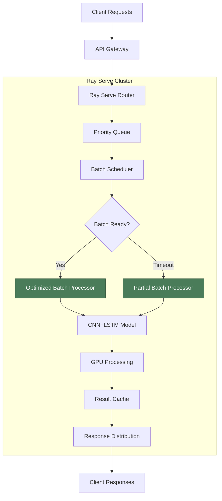

# Ray Serve Batch Processing Integration Approach

## 1. Overview

This document outlines the integration approach for implementing batch processing optimization with Ray Serve deployment in the AI Trading Platform. The integration focuses on leveraging Ray Serve's native batching capabilities while incorporating custom optimization strategies to improve GPU utilization and throughput while maintaining low latency requirements.

## 2. Current Ray Serve Architecture Analysis

### 2.1 Existing CNN+LSTM Deployment

The current Ray Serve deployment includes:
- Basic batching using `@serve.batch` decorator
- Simple auto-scaling configuration
- Standard resource allocation
- Basic performance monitoring

### 2.2 Integration Points

Key integration points for batch processing optimization:
- **Deployment Definition**: Enhanced deployment configuration with optimized resource settings
- **Batch Method**: Custom batch processing logic with dynamic sizing
- **API Gateway**: Updated API endpoints for optimized processing
- **Monitoring**: Enhanced metrics collection and health checks

## 3. Integration Architecture

### 3.1 Enhanced Deployment Structure



### 3.2 Core Integration Components

#### 3.2.1 Enhanced Deployment Definition

```python
# enhanced_cnn_lstm_deployment.py
import ray
from ray import serve
import torch
import numpy as np
from typing import List, Dict, Any
import asyncio
import time

from src.ml.feature_extraction import (
    FeatureExtractorFactory,
    FeatureExtractionConfig
)
from src.ml.hybrid_model import CNNLSTMHybridModel
from src.ml.batch_processing import (
    BatchScheduler,
    GPUBatchProcessor,
    BatchProcessingConfig,
    RequestPriority
)

@serve.deployment(
    name="enhanced_cnn_lstm_predictor",
    num_replicas=2,
    ray_actor_options={
        "num_cpus": 2,
        "num_gpus": 0.5 if torch.cuda.is_available() else 0,
        "memory": 2 * 1024 * 1024 * 1024,  # 2GB
        "object_store_memory": 1 * 1024 * 1024 * 1024,  # 1GB
    },
    autoscaling_config={
        "min_replicas": 2,
        "max_replicas": 20,
        "target_num_ongoing_requests_per_replica": 5,
        "upscale_delay_s": 30,
        "downscale_delay_s": 60,
        "upscale_smoothing_factor": 1.0,
        "downscale_smoothing_factor": 0.5
    },
    max_concurrent_queries=10,
    health_check_period_s=10,
    health_check_timeout_s=30
)
class EnhancedCNNLSTMPredictor:
    def __init__(self, model_path: str = None, device: str = "cuda"):
        """
        Initialize enhanced CNN+LSTM predictor with batch optimization.
        
        Args:
            model_path: Path to pre-trained model
            device: Device for inference (cuda/cpu)
        """
        self.device = device if torch.cuda.is_available() else "cpu"
        self.model_path = model_path
        
        # Load model
        self.model = self._load_model()
        
        # Initialize configuration
        self.config = BatchProcessingConfig()
        
        # Initialize batch components
        self.batch_scheduler = BatchScheduler(
            max_batch_size=self.config.max_batch_size,
            max_wait_time=self.config.max_wait_time_seconds,
            adaptive_batching=self.config.enable_adaptive_batching
        )
        
        self.batch_processor = GPUBatchProcessor(
            model=self.model,
            device=self.device
        )
        
        # Start batch processor task
        self.batch_processor_task = asyncio.create_task(self._batch_processor_loop())
        
        # Initialize metrics
        self.metrics = self._initialize_metrics()
        
        print(f"EnhancedCNNLSTMPredictor initialized on {self.device}")
    
    def _load_model(self) -> CNNLSTMHybridModel:
        """Load CNN+LSTM model."""
        if self.model_path:
            model = CNNLSTMHybridModel.load_from_path(self.model_path)
        else:
            # Load default model configuration
            model = self._create_default_model()
        
        # Optimize model for inference
        if self.config.enable_model_compilation:
            model = self._optimize_model(model)
        
        return model
    
    def _create_default_model(self) -> CNNLSTMHybridModel:
        """Create default CNN+LSTM model."""
        # Implementation depends on your model architecture
        pass
    
    def _optimize_model(self, model: CNNLSTMHybridModel) -> CNNLSTMHybridModel:
        """
        Optimize model for inference.
        
        Args:
            model: Model to optimize
            
        Returns:
            Optimized model
        """
        try:
            model.eval()
            
            # Use TorchScript for optimization
            sample_input = torch.randn(1, model.config.input_dim, 
                                     model.config.sequence_length)
            sample_input = sample_input.to(self.device)
            
            optimized_model = torch.jit.trace(model, sample_input)
            optimized_model = torch.jit.optimize_for_inference(optimized_model)
            
            return optimized_model
            
        except Exception as e:
            print(f"Model optimization failed: {e}")
            return model
    
    async def _batch_processor_loop(self):
        """Main batch processing loop."""
        while True:
            try:
                await self.batch_scheduler.batch_processor()
                await asyncio.sleep(0.001)  # Prevent busy waiting
            except Exception as e:
                print(f"Batch processor error: {e}")
                await asyncio.sleep(1)
    
    @serve.batch(
        max_batch_size=64,
        batch_wait_timeout_s=0.01
    )
    async def batch_predict(self, requests: List[np.ndarray]) -> List[Dict[str, Any]]:
        """
        Enhanced batch prediction with optimization.
        
        Args:
            requests: List of input data arrays
            
        Returns:
            List of prediction results
        """
        start_time = time.time()
        
        try:
            # Convert to batch processor format
            batch_requests = self._create_batch_requests(requests)
            
            # Process batch
            results = self.batch_processor.process_batch(batch_requests)
            
            # Add timing information
            processing_time = time.time() - start_time
            avg_time = processing_time / len(results) if results else 0
            
            for result in results:
                result['processing_time_ms'] = avg_time * 1000
                result['batch_size'] = len(requests)
            
            # Record metrics
            self._record_batch_metrics(len(requests), processing_time)
            
            return results
            
        except Exception as e:
            error_time = time.time() - start_time
            self._record_error_metrics(str(e), error_time)
            raise e
    
    def _create_batch_requests(self, requests: List[np.ndarray]) -> List[Any]:
        """Create batch requests from raw data."""
        batch_requests = []
        for i, data in enumerate(requests):
            request = type('BatchRequest', (), {
                'request_id': f'batch_{i}',
                'data': data,
                'priority': RequestPriority.BATCH_PROCESSING,
                'timestamp': time.time(),
                'future': asyncio.Future(),
                'model_config': {}
            })
            batch_requests.append(request)
        return batch_requests
    
    async def predict(self, 
                     data: np.ndarray,
                     return_uncertainty: bool = True,
                     use_ensemble: bool = True,
                     priority: str = "normal") -> Dict[str, Any]:
        """
        Single prediction with priority support.
        
        Args:
            data: Input data array
            return_uncertainty: Whether to return uncertainty estimates
            use_ensemble: Whether to use ensemble predictions
            priority: Request priority level
            
        Returns:
            Prediction result
        """
        # Map priority string to enum
        priority_mapping = {
            "high": RequestPriority.REAL_TIME_TRADING,
            "normal": RequestPriority.BATCH_PROCESSING,
            "low": RequestPriority.BACKGROUND_TASKS
        }
        request_priority = priority_mapping.get(priority, RequestPriority.BATCH_PROCESSING)
        
        # Create batch request
        request = type('BatchRequest', (), {
            'request_id': str(uuid.uuid4()),
            'data': data,
            'priority': request_priority,
            'timestamp': time.time(),
            'future': asyncio.Future(),
            'model_config': {
                'return_uncertainty': return_uncertainty,
                'use_ensemble': use_ensemble
            },
            'return_uncertainty': return_uncertainty,
            'use_ensemble': use_ensemble
        })
        
        # Add to batch scheduler
        result = await self.batch_scheduler.add_request(request)
        return result
    
    def _initialize_metrics(self):
        """Initialize performance metrics."""
        from prometheus_client import Counter, Histogram, Gauge
        
        return {
            'requests_total': Counter(
                'enhanced_cnn_lstm_requests_total',
                'Total requests processed',
                ['priority']
            ),
            'latency_seconds': Histogram(
                'enhanced_cnn_lstm_latency_seconds',
                'Request latency in seconds',
                ['priority'],
                buckets=[0.001, 0.005, 0.01, 0.025, 0.05, 0.075, 0.1, 0.25, 0.5, 1.0]
            ),
            'batch_size': Histogram(
                'enhanced_cnn_lstm_batch_size',
                'Batch size distribution',
                buckets=[1, 5, 10, 20, 32, 64, 128]
            ),
            'gpu_utilization': Gauge(
                'enhanced_cnn_lstm_gpu_utilization_percent',
                'GPU utilization percentage'
            ),
            'errors_total': Counter(
                'enhanced_cnn_lstm_errors_total',
                'Total errors',
                ['error_type']
            )
        }
    
    def _record_batch_metrics(self, batch_size: int, processing_time: float):
        """Record batch processing metrics."""
        self.metrics['batch_size'].observe(batch_size)
        self.metrics['latency_seconds'].labels(priority='batch').observe(processing_time)
        
        # Update GPU utilization (simplified)
        if torch.cuda.is_available():
            gpu_util = torch.cuda.utilization() / 100.0
            self.metrics['gpu_utilization'].set(gpu_util)
    
    def _record_error_metrics(self, error_type: str, processing_time: float):
        """Record error metrics."""
        self.metrics['errors_total'].labels(error_type=error_type).inc()
        self.metrics['latency_seconds'].labels(priority='error').observe(processing_time)
    
    def get_stats(self) -> Dict[str, Any]:
        """Get deployment statistics."""
        return {
            'device': self.device,
            'model_loaded': self.model is not None,
            'batch_scheduler_stats': getattr(self.batch_scheduler, 'stats', {}),
            'config': self.config.to_dict()
        }
    
    def __call__(self, data: np.ndarray) -> Dict[str, Any]:
        """Direct call for single predictions."""
        import asyncio
        return asyncio.run(self.predict(data))

# Deployment binding
enhanced_cnn_lstm_deployment = EnhancedCNNLSTMPredictor.bind()
```

### 3.3 API Gateway Integration

```python
# api_gateway_integration.py
from fastapi import APIRouter, HTTPException, Depends
from pydantic import BaseModel
from typing import List, Optional
import ray
from ray import serve
import numpy as np
import asyncio

# Initialize Ray Serve client
ray.init(ignore_reinit_error=True)
client = serve.start(detached=True)

# Get deployment handles
enhanced_handle = serve.get_deployment("enhanced_cnn_lstm_predictor").get_handle()
legacy_handle = serve.get_deployment("cnn_lstm_predictor").get_handle()

class BatchPredictionRequest(BaseModel):
    """Enhanced batch prediction request with optimization support."""
    requests: List[List[List[float]]]
    batch_optimized: bool = True
    priority: str = "normal"  # high, normal, low
    return_uncertainty: bool = True
    use_ensemble: bool = True

class BatchPredictionResponse(BaseModel):
    """Enhanced batch prediction response."""
    results: List[Dict[str, Any]]
    total_processing_time_ms: float
    average_latency_ms: float
    batch_size: int
    optimization_used: bool

class SinglePredictionRequest(BaseModel):
    """Single prediction request with priority support."""
    data: List[List[float]]
    return_uncertainty: bool = True
    use_ensemble: bool = True
    priority: str = "normal"

class SinglePredictionResponse(BaseModel):
    """Single prediction response."""
    result: Dict[str, Any]
    processing_time_ms: float
    priority: str

router = APIRouter(prefix="/batch-optimized", tags=["batch-optimized-serving"])

@router.post("/predict/batch", response_model=BatchPredictionResponse)
async def batch_predict_optimized(request: BatchPredictionRequest):
    """
    Make batch predictions with optimization.
    
    This endpoint uses enhanced batch processing for better GPU utilization
    and throughput while maintaining low latency requirements.
    """
    try:
        start_time = time.time()
        
        if request.batch_optimized:
            # Use enhanced batch processing
            batch_data = [np.array(data, dtype=np.float32) for data in request.requests]
            results = await enhanced_handle.batch_predict.remote(batch_data)
        else:
            # Use legacy batch processing
            batch_data = [np.array(data, dtype=np.float32) for data in request.requests]
            results = await legacy_handle.batch_predict.remote(batch_data)
        
        total_time = (time.time() - start_time) * 1000
        avg_latency = total_time / len(request.requests) if request.requests else 0
        
        return BatchPredictionResponse(
            results=results,
            total_processing_time_ms=total_time,
            average_latency_ms=avg_latency,
            batch_size=len(request.requests),
            optimization_used=request.batch_optimized
        )
        
    except Exception as e:
        raise HTTPException(status_code=500, detail=str(e))

@router.post("/predict/single", response_model=SinglePredictionResponse)
async def single_predict_optimized(request: SinglePredictionRequest):
    """
    Make single prediction with priority support.
    
    This endpoint supports priority-based processing for different request types.
    """
    try:
        start_time = time.time()
        
        input_data = np.array(request.data, dtype=np.float32)
        
        # Use enhanced processing with priority
        result = await enhanced_handle.predict.remote(
            input_data,
            request.return_uncertainty,
            request.use_ensemble,
            request.priority
        )
        
        processing_time = (time.time() - start_time) * 1000
        
        return SinglePredictionResponse(
            result=result,
            processing_time_ms=processing_time,
            priority=request.priority
        )
        
    except Exception as e:
        raise HTTPException(status_code=500, detail=str(e))

@router.get("/stats")
async def get_deployment_stats():
    """Get deployment statistics."""
    try:
        stats = await enhanced_handle.get_stats.remote()
        return stats
    except Exception as e:
        raise HTTPException(status_code=500, detail=str(e))
```

## 4. Auto-Scaling Configuration

### 4.1 Market Hours Configuration

```python
# market_hours_scaling.py
from ray.serve.config import AutoscalingConfig

MARKET_HOURS_AUTOSCALING = AutoscalingConfig(
    min_replicas=5,
    max_replicas=30,
    target_num_ongoing_requests_per_replica=3,
    upscale_delay_s=15,      # Quick upscale during market hours
    downscale_delay_s=120,   # Slower downscale to avoid oscillation
    upscale_smoothing_factor=1.5, # More aggressive upscaling
    downscale_smoothing_factor=0.3  # Conservative downscaling
)
```

### 4.2 Off-Hours Configuration

```python
# off_hours_scaling.py
from ray.serve.config import AutoscalingConfig

OFF_HOURS_AUTOSCALING = AutoscalingConfig(
    min_replicas=2,
    max_replicas=10,
    target_num_ongoing_requests_per_replica=10,
    upscale_delay_s=60,      # Slower upscale during off hours
    downscale_delay_s=300,   # Much slower downscale
    upscale_smoothing_factor=1.0,
    downscale_smoothing_factor=0.5
)
```

## 5. Resource Allocation Strategy

### 5.1 GPU Resource Management

```python
# gpu_resource_allocation.py
import torch

def get_gpu_resource_config(batch_config: BatchProcessingConfig) -> Dict[str, Any]:
    """
    Get GPU resource configuration based on batch processing needs.
    
    Args:
        batch_config: Batch processing configuration
        
    Returns:
        Resource configuration dictionary
    """
    # Base configuration
    config = {
        "num_cpus": 2,
        "memory": 2 * 1024 * 1024 * 1024,  # 2GB
        "object_store_memory": 1 * 1024 * 1024 * 1024  # 1GB
    }
    
    # Add GPU configuration if available
    if torch.cuda.is_available():
        # Calculate optimal GPU allocation based on batch size
        gpu_fraction = min(1.0, batch_config.max_batch_size / 128.0)
        config["num_gpus"] = round(gpu_fraction, 2)
    else:
        config["num_gpus"] = 0
    
    return config
```

### 5.2 Memory Management

```python
# memory_management.py
import torch
import gc

class MemoryManager:
    """Memory manager for batch processing optimization."""
    
    def __init__(self, cleanup_interval: int = 30):
        """
        Initialize memory manager.
        
        Args:
            cleanup_interval: Interval between cleanup operations (seconds)
        """
        self.cleanup_interval = cleanup_interval
        self.last_cleanup = 0
    
    def maybe_cleanup_memory(self, force: bool = False):
        """
        Clean up memory if needed.
        
        Args:
            force: Force cleanup regardless of interval
        """
        import time
        current_time = time.time()
        
        if force or (current_time - self.last_cleanup) >= self.cleanup_interval:
            if torch.cuda.is_available():
                torch.cuda.empty_cache()
            gc.collect()
            self.last_cleanup = current_time
```

## 6. Monitoring and Observability Integration

### 6.1 Enhanced Metrics Collection

```python
# enhanced_metrics.py
from prometheus_client import Counter, Histogram, Gauge, Summary
import time

class EnhancedBatchMetrics:
    """Enhanced metrics for batch processing optimization."""
    
    def __init__(self):
        # Request counters
        self.requests_total = Counter(
            'batch_optimized_requests_total',
            'Total optimized batch requests',
            ['priority', 'batch_type']
        )
        
        # Latency histograms
        self.latency_seconds = Histogram(
            'batch_optimized_latency_seconds',
            'Batch processing latency in seconds',
            ['priority'],
            buckets=[0.001, 0.005, 0.01, 0.025, 0.05, 0.075, 0.1, 0.25, 0.5, 1.0, 2.0]
        )
        
        # Batch size distribution
        self.batch_size = Histogram(
            'batch_optimized_batch_size',
            'Batch size distribution',
            buckets=[1, 5, 10, 20, 32, 64, 128, 256]
        )
        
        # GPU utilization
        self.gpu_utilization = Gauge(
            'batch_optimized_gpu_utilization_percent',
            'GPU utilization percentage',
            ['gpu_id']
        )
        
        # Resource utilization
        self.cpu_utilization = Gauge(
            'batch_optimized_cpu_utilization_percent',
            'CPU utilization percentage'
        )
        
        self.memory_utilization = Gauge(
            'batch_optimized_memory_utilization_percent',
            'Memory utilization percentage'
        )
        
        # Error tracking
        self.errors_total = Counter(
            'batch_optimized_errors_total',
            'Total batch processing errors',
            ['error_type', 'priority']
        )
        
        # Adaptive batching metrics
        self.adaptive_batch_size = Gauge(
            'batch_optimized_adaptive_batch_size',
            'Current adaptive batch size'
        )
        
        self.batch_wait_time = Histogram(
            'batch_optimized_wait_time_seconds',
            'Batch wait time distribution',
            buckets=[0.001, 0.005, 0.01, 0.025, 0.05, 0.1, 0.25, 0.5]
        )
    
    def record_request(self, priority: str, batch_type: str):
        """Record incoming request."""
        self.requests_total.labels(priority=priority, batch_type=batch_type).inc()
    
    def record_latency(self, priority: str, latency: float):
        """Record request latency."""
        self.latency_seconds.labels(priority=priority).observe(latency)
    
    def record_batch_size(self, size: int):
        """Record batch size."""
        self.batch_size.observe(size)
    
    def record_gpu_utilization(self, gpu_id: str, utilization: float):
        """Record GPU utilization."""
        self.gpu_utilization.labels(gpu_id=gpu_id).set(utilization)
    
    def record_error(self, error_type: str, priority: str):
        """Record error."""
        self.errors_total.labels(error_type=error_type, priority=priority).inc()
    
    def record_adaptive_batch_size(self, size: int):
        """Record adaptive batch size."""
        self.adaptive_batch_size.set(size)
    
    def record_wait_time(self, wait_time: float):
        """Record batch wait time."""
        self.batch_wait_time.observe(wait_time)
```

### 6.2 Health Check Integration

```python
# health_check_integration.py
import asyncio
import time
import numpy as np

class BatchProcessingHealthCheck:
    """Health check for batch processing integration."""
    
    def __init__(self, deployment_handle):
        """
        Initialize health check.
        
        Args:
            deployment_handle: Ray Serve deployment handle
        """
        self.deployment_handle = deployment_handle
        self.last_check = 0
        self.health_status = "unknown"
    
    async def check_health(self) -> Dict[str, Any]:
        """
        Perform comprehensive health check.
        
        Returns:
            Health status dictionary
        """
        try:
            # Test basic connectivity and performance
            start_time = time.time()
            dummy_data = np.random.rand(1, 50, 60).astype(np.float32)
            
            result = await self.deployment_handle.predict.remote(
                dummy_data,
                return_uncertainty=False,
                use_ensemble=False,
                priority="low"
            )
            
            latency = time.time() - start_time
            
            # Check result validity and latency
            is_healthy = (
                result is not None and
                'classification_probs' in result and
                latency < 0.1  # <100ms requirement
            )
            
            self.health_status = "healthy" if is_healthy else "degraded"
            self.last_check = time.time()
            
            return {
                "status": self.health_status,
                "latency_ms": latency * 1000,
                "last_check": self.last_check,
                "is_healthy": is_healthy,
                "timestamp": time.time()
            }
            
        except Exception as e:
            self.health_status = "unhealthy"
            self.last_check = time.time()
            
            return {
                "status": self.health_status,
                "error": str(e),
                "last_check": self.last_check,
                "is_healthy": False,
                "timestamp": time.time()
            }
    
    async def get_detailed_stats(self) -> Dict[str, Any]:
        """
        Get detailed deployment statistics.
        
        Returns:
            Detailed statistics dictionary
        """
        try:
            stats = await self.deployment_handle.get_stats.remote()
            return stats
        except Exception as e:
            return {
                "error": str(e),
                "timestamp": time.time()
            }
```

## 7. Deployment and Operations

### 7.1 Kubernetes Deployment Configuration

```yaml
# k8s/batch-optimized-cnn-lstm-deployment.yaml
apiVersion: apps/v1
kind: Deployment
metadata:
  name: batch-optimized-cnn-lstm-predictor
  namespace: ai-trading-platform
  labels:
    app: batch-optimized-cnn-lstm-predictor
spec:
  replicas: 2
  selector:
    matchLabels:
      app: batch-optimized-cnn-lstm-predictor
  template:
    metadata:
      labels:
        app: batch-optimized-cnn-lstm-predictor
    spec:
      containers:
      - name: ray-serve
        image: trading-platform/ray-serve:latest
        ports:
        - containerPort: 8000
        env:
        - name: MODEL_PATH
          value: "/models/cnn_lstm_hybrid.pth"
        - name: RAY_ADDRESS
          value: "ray://ray-head-service:10001"
        - name: BATCH_CONFIG_PROFILE
          value: "market_hours"
        resources:
          requests:
            memory: "2Gi"
            cpu: "2"
            nvidia.com/gpu: "1"
          limits:
            memory: "4Gi"
            cpu: "4"
            nvidia.com/gpu: "1"
        volumeMounts:
        - name: models
          mountPath: /models
        - name: configs
          mountPath: /configs
        readinessProbe:
          httpGet:
            path: /health
            port: 8000
          initialDelaySeconds: 30
          periodSeconds: 10
          timeoutSeconds: 5
        livenessProbe:
          httpGet:
            path: /health
            port: 8000
          initialDelaySeconds: 60
          periodSeconds: 30
          timeoutSeconds: 10
        startupProbe:
          httpGet:
            path: /health
            port: 8000
          initialDelaySeconds: 10
          periodSeconds: 5
          failureThreshold: 30
      volumes:
      - name: models
        persistentVolumeClaim:
          claimName: model-registry-pvc
      - name: configs
        configMap:
          name: batch-processing-config
---
apiVersion: v1
kind: Service
metadata:
  name: batch-optimized-cnn-lstm-service
  namespace: ai-trading-platform
spec:
  selector:
    app: batch-optimized-cnn-lstm-predictor
  ports:
  - port: 8000
    targetPort: 8000
  type: ClusterIP
```

### 7.2 Helm Chart Configuration

```yaml
# helm/ai-trading-platform/values-batch-optimized.yaml
batchOptimized:
  enabled: true
  replicaCount: 2
  image:
    repository: trading-platform/ray-serve
    tag: batch-optimized-latest
    pullPolicy: IfNotPresent
  
  resources:
    requests:
      cpu: 2
      memory: 2Gi
      gpu: 1
    limits:
      cpu: 4
      memory: 4Gi
      gpu: 1
  
  autoscaling:
    enabled: true
    minReplicas: 2
    maxReplicas: 30
    targetCPUUtilization: 70
    targetMemoryUtilization: 80
    targetGPUUtilization: 60
  
  config:
    profile: market_hours
    batchSize: 64
    waitTimeMs: 5
  
  env:
    MODEL_PATH: "/models/cnn_lstm_hybrid.pth"
    RAY_ADDRESS: "ray://ray-head-service:1001"
    BATCH_CONFIG_PROFILE: "market_hours"
  
  service:
    type: ClusterIP
    port: 8000
  
  persistence:
    enabled: true
    existingClaim: model-registry-pvc
    mountPath: /models
  
  healthCheck:
    enabled: true
    path: /health
    initialDelaySeconds: 30
    periodSeconds: 10
```

## 8. Migration Strategy

### 8.1 Phased Rollout Approach

1. **Phase 1**: Deploy alongside existing serving (20% traffic)
2. **Phase 2**: Increase traffic to optimized serving (50% traffic)
3. **Phase 3**: Full migration with fallback to legacy (100% traffic)
4. **Phase 4**: Decommission legacy serving

### 8.2 Traffic Splitting

```python
# traffic_splitter.py
import random
from typing import Dict, Any

class TrafficSplitter:
    """Traffic splitter for gradual rollout."""
    
    def __init__(self, optimized_percentage: float = 0.0):
        """
        Initialize traffic splitter.
        
        Args:
            optimized_percentage: Percentage of traffic to optimized serving (0.0-1.0)
        """
        self.optimized_percentage = max(0.0, min(1.0, optimized_percentage))
    
    def route_request(self, request_id: str) -> str:
        """
        Route request to appropriate serving system.
        
        Args:
            request_id: Unique request identifier
            
        Returns:
            Routing decision ("optimized" or "legacy")
        """
        # Use consistent hashing for reproducible routing
        hash_value = int(hashlib.md5(request_id.encode()).hexdigest(), 16)
        normalized_hash = (hash_value % 10000) / 10000.0
        
        if normalized_hash < self.optimized_percentage:
            return "optimized"
        else:
            return "legacy"
    
    def update_split(self, new_percentage: float):
        """
        Update traffic split percentage.
        
        Args:
            new_percentage: New percentage for optimized serving
        """
        self.optimized_percentage = max(0.0, min(1.0, new_percentage))
```

## 9. Testing and Validation

### 9.1 Performance Testing Framework

```python
# performance_testing.py
import asyncio
import time
import numpy as np
from typing import List, Dict, Any

class BatchProcessingPerformanceTest:
    """Performance testing for batch processing integration."""
    
    def __init__(self, deployment_handle):
        """
        Initialize performance test.
        
        Args:
            deployment_handle: Ray Serve deployment handle
        """
        self.deployment_handle = deployment_handle
    
    async def run_latency_test(self, 
                             num_requests: int = 1000,
                             input_shape: tuple = (1, 50, 60),
                             priority: str = "normal") -> Dict[str, Any]:
        """
        Run latency benchmark test.
        
        Args:
            num_requests: Number of requests to send
            input_shape: Input tensor shape
            priority: Request priority
            
        Returns:
            Latency test results
        """
        latencies = []
        errors = 0
        
        # Generate test data
        test_data = [np.random.rand(*input_shape).astype(np.float32) 
                    for _ in range(num_requests)]
        
        start_time = time.time()
        
        # Send requests sequentially to measure latency
        for data in test_data:
            request_start = time.time()
            try:
                result = await self.deployment_handle.predict.remote(
                    data,
                    priority=priority
                )
                latency = time.time() - request_start
                latencies.append(latency)
            except Exception as e:
                errors += 1
                print(f"Request failed: {e}")
        
        total_time = time.time() - start_time
        
        # Calculate statistics
        if latencies:
            import statistics
            avg_latency = statistics.mean(latencies)
            median_latency = statistics.median(latencies)
            p95_latency = np.percentile(latencies, 95)
            p99_latency = np.percentile(latencies, 99)
            min_latency = min(latencies)
            max_latency = max(latencies)
        else:
            avg_latency = median_latency = p95_latency = p99_latency = min_latency = max_latency = 0
        
        throughput = (num_requests - errors) / total_time if total_time > 0 else 0
        
        return {
            'test_type': 'latency',
            'num_requests': num_requests,
            'successful_requests': num_requests - errors,
            'error_rate': errors / num_requests if num_requests > 0 else 0,
            'total_time_seconds': total_time,
            'throughput_rps': throughput,
            'avg_latency_seconds': avg_latency,
            'median_latency_seconds': median_latency,
            'p95_latency_seconds': p95_latency,
            'p99_latency_seconds': p99_latency,
            'min_latency_seconds': min_latency,
            'max_latency_seconds': max_latency,
            'latency_unit': 'seconds'
        }
    
    async def run_load_test(self,
                          duration_seconds: int = 60,
                          concurrent_requests: int = 100,
                          input_shape: tuple = (1, 50, 60),
                          priority: str = "normal") -> Dict[str, Any]:
        """
        Run load test to measure system under sustained load.
        
        Args:
            duration_seconds: Test duration in seconds
            concurrent_requests: Number of concurrent requests
            input_shape: Input tensor shape
            priority: Request priority
            
        Returns:
            Load test results
        """
        latencies = []
        errors = 0
        total_requests = 0
        
        # Generate test data
        test_data = np.random.rand(*input_shape).astype(np.float32)
        
        start_time = time.time()
        end_time = start_time + duration_seconds
        
        async def send_request():
            nonlocal total_requests, errors, latencies
            while time.time() < end_time:
                request_start = time.time()
                try:
                    result = await self.deployment_handle.predict.remote(
                        test_data,
                        priority=priority
                    )
                    latency = time.time() - request_start
                    latencies.append(latency)
                    total_requests += 1
                except Exception as e:
                    errors += 1
                    print(f"Request failed: {e}")
        
        # Create concurrent tasks
        tasks = [send_request() for _ in range(concurrent_requests)]
        
        # Run load test
        await asyncio.gather(*tasks, return_exceptions=True)
        
        test_duration = time.time() - start_time
        
        # Calculate statistics
        if latencies:
            import statistics
            avg_latency = statistics.mean(latencies)
            median_latency = statistics.median(latencies)
            p95_latency = np.percentile(latencies, 95)
            p99_latency = np.percentile(latencies, 99)
        else:
            avg_latency = median_latency = p95_latency = p99_latency = 0
        
        throughput = total_requests / test_duration if test_duration > 0 else 0
        error_rate = errors / total_requests if total_requests > 0 else 0
        
        return {
            'test_type': 'load',
            'duration_seconds': duration_seconds,
            'concurrent_requests': concurrent_requests,
            'total_requests': total_requests,
            'successful_requests': total_requests - errors,
            'error_rate': error_rate,
            'throughput_rps': throughput,
            'avg_latency_seconds': avg_latency,
            'median_latency_seconds': median_latency,
            'p95_latency_seconds': p95_latency,
            'p99_latency_seconds': p99_latency,
            'latency_unit': 'seconds'
        }
```

## 10. Conclusion

This integration approach provides a comprehensive framework for implementing batch processing optimization with Ray Serve deployment. The solution leverages Ray Serve's native capabilities while adding custom optimization strategies to improve GPU utilization and throughput while maintaining low latency requirements.

Key integration benefits include:
- **Enhanced Performance**: Improved GPU utilization through dynamic batching
- **Flexible Configuration**: Runtime-configurable batch processing parameters
- **Priority-Based Processing**: Support for different request priority levels
- **Seamless Integration**: Backward compatibility with existing infrastructure
- **Comprehensive Monitoring**: Detailed metrics and health checks
- **Gradual Migration**: Safe rollout strategy with fallback capabilities

The phased implementation approach ensures minimal risk while delivering significant performance improvements for the AI Trading Platform's model serving infrastructure.