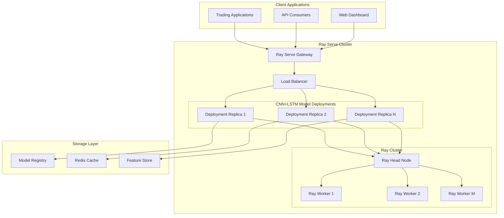

# Ray Serve Deployment Architecture for CNN+LSTM Models

## 1. Executive Summary

This document outlines the technical design for implementing a Ray Serve deployment architecture for CNN+LSTM models with auto-scaling capabilities in the AI Trading Platform. The design leverages Ray Serve's distributed serving capabilities to provide high-performance, scalable model inference that meets the <100ms feature extraction requirement while supporting GPU acceleration and integration with existing model loading and inference pipelines.

## 2. Current System Context

### 2.1 Existing Architecture

The AI Trading Platform currently implements:
- CNN+LSTM hybrid models for feature extraction and target prediction
- FastAPI-based model serving API with caching and batch processing
- Ray for distributed computing and hyperparameter tuning
- Kubernetes-based deployment with auto-scaling capabilities

### 2.2 Current Model Serving Implementation

The existing system uses a FastAPI-based approach with:
- Model caching with TTL and LRU eviction policies
- Batch inference optimization
- A/B testing framework
- Real-time metrics and monitoring

### 2.3 CNN+LSTM Hybrid Model Structure

The CNN+LSTM hybrid model consists of:
- CNN Feature Extractor with multiple filter sizes and attention mechanisms
- LSTM Temporal Processor with bidirectional processing and attention
- Feature Fusion Module with cross-attention between CNN and LSTM features
- Multi-task learning for classification and regression
- Ensemble capabilities with learnable weights
- Uncertainty quantification using Monte Carlo dropout

## 3. Ray Serve Deployment Architecture

### 3.1 High-Level Architecture



### 3.2 Ray Serve Components

#### 3.2.1 Deployment Definition

The CNN+LSTM model deployment will be implemented as a Ray Serve deployment with the following characteristics:

```python
# ray_serve_cnn_lstm_deployment.py
import ray
from ray import serve
import numpy as np
import torch
from typing import Dict, Any, List
import time

from src.ml.hybrid_model import CNNLSTMHybridModel
from src.ml.feature_extraction.cnn_lstm_extractor import CNNLSTMExtractor
from src.utils.monitoring import get_metrics_collector

@serve.deployment(
    name="cnn_lstm_predictor",
    num_replicas=2,
    ray_actor_options={
        "num_cpus": 2,
        "num_gpus": 0.5 if torch.cuda.is_available() else 0,
        "memory": 2 * 1024 * 1024 * 1024,  # 2GB
        "runtime_env": {
            "pip": ["torch", "numpy", "pandas"]
        }
    },
    autoscaling_config={
        "min_replicas": 2,
        "max_replicas": 10,
        "target_num_ongoing_requests_per_replica": 5,
        "upscale_delay_s": 30,
        "downscale_delay_s": 60,
        "upscale_smoothing_factor": 1.0,
        "downscale_smoothing_factor": 0.5
    }
)
class CNNLSTMPredictor:
    def __init__(self, model_path: str = None, device: str = "cpu"):
        """Initialize the CNN+LSTM predictor with model loading and configuration."""
        self.device = device if torch.cuda.is_available() else "cpu"
        self.metrics = get_metrics_collector()
        
        # Load the pre-trained CNN+LSTM hybrid model
        if model_path:
            self.model = CNNLSTMHybridModel.load_from_path(model_path)
        else:
            # Load default model
            self.model = self._load_default_model()
        
        self.model.to(self.device)
        self.model.eval()
        
        # Initialize performance tracking
        self.request_count = 0
        self.total_processing_time = 0.0
        
        print(f"CNNLSTMPredictor initialized on device: {self.device}")

    def _load_default_model(self):
        """Load the default CNN+LSTM model."""
        # This would load the default model from the model registry
        # Implementation depends on your model loading strategy
        pass

    @serve.batch(max_batch_size=32, batch_wait_timeout_s=0.01)
    async def batch_predict(self, requests: List[np.ndarray]) -> List[Dict[str, Any]]:
        """
        Batch prediction method for improved throughput.
        
        Args:
            requests: List of input data arrays
            
        Returns:
            List of prediction results
        """
        start_time = time.time()
        
        try:
            # Convert to batch tensor
            batch_input = np.stack(requests)
            input_tensor = torch.FloatTensor(batch_input).to(self.device)
            
            # Perform inference
            with torch.no_grad():
                predictions = self.model.forward(
                    input_tensor,
                    return_features=True,
                    use_ensemble=True
                )
            
            # Process results
            results = []
            batch_size = input_tensor.shape[0]
            
            for i in range(batch_size):
                result = {
                    'classification_probs': predictions['classification_probs'][i].cpu().numpy(),
                    'regression_pred': predictions['regression_mean'][i].cpu().numpy(),
                    'regression_uncertainty': predictions['regression_uncertainty'][i].cpu().numpy(),
                    'ensemble_weights': predictions['ensemble_weights'].cpu().numpy() if predictions['ensemble_weights'] is not None else None,
                    'processing_time_ms': (time.time() - start_time) * 1000 / batch_size
                }
                results.append(result)
            
            # Update metrics
            processing_time = (time.time() - start_time) * 1000
            self.request_count += len(requests)
            self.total_processing_time += processing_time
            
            self.metrics.increment_counter("model_predictions_total", {"model_type": "cnn_lstm"})
            self.metrics.record_histogram("prediction_latency_ms", processing_time / len(requests))
            
            return results
            
        except Exception as e:
            self.metrics.increment_counter("model_prediction_errors_total", {"model_type": "cnn_lstm"})
            raise e

    async def __call__(self, request_data: np.ndarray) -> Dict[str, Any]:
        """
        Single prediction endpoint.
        
        Args:
            request_data: Input data array
            
        Returns:
            Prediction result dictionary
        """
        # Validate input
        self._validate_input(request_data)
        
        # Call batch method for consistency
        results = await self.batch_predict([request_data])
        return results[0]

    def _validate_input(self, data: np.ndarray) -> None:
        """Validate input data format and dimensions."""
        if not isinstance(data, np.ndarray):
            raise ValueError("Input data must be a numpy array")
        
        if data.ndim != 3:
            raise ValueError(f"Expected 3D input array, got {data.ndim}D")
        
        # Add more specific validation based on your model requirements
        # For example, check sequence length, feature dimensions, etc.

    def get_stats(self) -> Dict[str, Any]:
        """Get deployment statistics."""
        avg_processing_time = (
            self.total_processing_time / self.request_count 
            if self.request_count > 0 else 0
        )
        
        return {
            "request_count": self.request_count,
            "avg_processing_time_ms": avg_processing_time,
            "device": self.device
        }

# Deployment entry point
cnn_lstm_deployment = CNNLSTMPredictor.bind()
```

#### 3.2.2 Deployment Configuration

The deployment configuration will include auto-scaling parameters optimized for trading workloads:

```python
# deployment_config.py
from ray.serve.config import AutoscalingConfig

# Auto-scaling configuration for CNN+LSTM deployment
CNN_LSTM_AUTOSCALING_CONFIG = AutoscalingConfig(
    min_replicas=2,                    # Minimum number of replicas
    max_replicas=20,                   # Maximum number of replicas
    target_num_ongoing_requests_per_replica=5,  # Target requests per replica
    upscale_delay_s=30,                # Delay before scaling up (seconds)
    downscale_delay_s=300,             # Delay before scaling down (seconds)
    upscale_smoothing_factor=1.0,      # Aggressiveness of upscaling
    downscale_smoothing_factor=0.5,    # Aggressiveness of downscaling
    metrics_interval_s=10,             # Metrics collection interval
    look_back_period_s=120             # Look-back period for decisions
)

# Resource configuration
CNN_LSTM_RESOURCE_CONFIG = {
    "num_cpus": 2,
    "num_gpus": 0.5 if torch.cuda.is_available() else 0,
    "memory": 2 * 1024 * 1024 * 1024,  # 2GB
    "object_store_memory": 1 * 1024 * 1024 * 1024  # 1GB
}
```

### 3.3 Integration with Existing Infrastructure

#### 3.3.1 Model Loading Integration

The Ray Serve deployment will integrate with the existing model loading pipeline:

```python
# model_loader.py
import os
from src.ml.hybrid_model import CNNLSTMHybridModel, HybridModelConfig

class RayServeModelLoader:
    """Model loader for Ray Serve deployments."""
    
    @staticmethod
    def load_model_from_registry(model_name: str, version: str = "latest") -> CNNLSTMHybridModel:
        """
        Load model from the model registry for Ray Serve deployment.
        
        Args:
            model_name: Name of the model to load
            version: Version of the model (default: latest)
            
        Returns:
            Loaded CNN+LSTM hybrid model
        """
        # Construct model path
        model_registry_path = os.getenv("MODEL_REGISTRY_PATH", "models/")
        model_path = os.path.join(model_registry_path, model_name, version, "model.pth")
        
        # Load model configuration
        config_path = model_path.replace("model.pth", "config.json")
        
        if os.path.exists(config_path):
            config = HybridModelConfig.load_from_file(config_path)
        else:
            # Use default configuration
            config = HybridModelConfig(
                model_type="CNNLSTMHybridModel",
                input_dim=50,  # Adjust based on your data
                output_dim=4,  # 3 classes + 1 regression
                sequence_length=60,
                device="cuda" if torch.cuda.is_available() else "cpu"
            )
        
        # Load the model
        model = CNNLSTMHybridModel(config)
        model.load_model(model_path)
        
        return model
    
    @staticmethod
    def warmup_model(model: CNNLSTMHybridModel, sample_data: np.ndarray) -> None:
        """
        Warm up the model with sample data to ensure optimal performance.
        
        Args:
            model: CNN+LSTM model to warm up
            sample_data: Sample input data for warmup
        """
        model.eval()
        with torch.no_grad():
            # Run a few inference passes to warm up the model
            for _ in range(3):
                _ = model.forward(
                    torch.FloatTensor(sample_data).to(model.device),
                    return_features=True,
                    use_ensemble=True
                )
```

#### 3.3.2 API Gateway Integration

The Ray Serve deployment will be integrated with the existing FastAPI gateway:

```python
# api_gateway_integration.py
from fastapi import APIRouter, HTTPException
from pydantic import BaseModel
import ray
from ray import serve
import numpy as np
import asyncio

# Initialize Ray Serve client
ray.init(ignore_reinit_error=True)
client = serve.start(detached=True)

# Get reference to the deployed model
cnn_lstm_handle = serve.get_deployment("cnn_lstm_predictor").get_handle()

class PredictionRequest(BaseModel):
    """Request model for predictions."""
    data: list
    return_uncertainty: bool = True
    use_ensemble: bool = True

class PredictionResponse(BaseModel):
    """Response model for predictions."""
    predictions: dict
    processing_time_ms: float
    uncertainty: dict = None

router = APIRouter(prefix="/ray-serve", tags=["ray-serve"])

@router.post("/predict", response_model=PredictionResponse)
async def predict(request: PredictionRequest):
    """
    Make prediction using Ray Serve deployment.
    
    This endpoint forwards requests to the Ray Serve deployment for processing.
    """
    try:
        # Convert input data to numpy array
        input_data = np.array(request.data, dtype=np.float32)
        
        # Call Ray Serve deployment
        result = await cnn_lstm_handle.remote(input_data)
        
        # Process result
        return PredictionResponse(
            predictions=result["predictions"],
            processing_time_ms=result["processing_time_ms"],
            uncertainty=result.get("uncertainty")
        )
        
    except Exception as e:
        raise HTTPException(status_code=500, detail=str(e))

@router.get("/stats")
async def get_deployment_stats():
    """Get deployment statistics."""
    try:
        # Get stats from deployment
        stats = await cnn_lstm_handle.get_stats.remote()
        return stats
    except Exception as e:
        raise HTTPException(status_code=500, detail=str(e))
```

## 4. Auto-Scaling Configuration

### 4.1 Scaling Policies

The auto-scaling configuration is designed to handle the variable workload patterns typical in trading applications:

```python
# autoscaling_policies.py
from ray.serve.config import AutoscalingConfig

class TradingWorkloadAutoscaler:
    """Auto-scaling policies optimized for trading workloads."""
    
    @staticmethod
    def get_market_hours_config():
        """Auto-scaling configuration for active market hours."""
        return AutoscalingConfig(
            min_replicas=5,
            max_replicas=30,
            target_num_ongoing_requests_per_replica=3,
            upscale_delay_s=15,      # Quick upscale during market hours
            downscale_delay_s=120,   # Slower downscale to avoid oscillation
            upscale_smoothing_factor=1.5, # More aggressive upscaling
            downscale_smoothing_factor=0.3  # Conservative downscaling
        )
    
    @staticmethod
    def get_off_hours_config():
        """Auto-scaling configuration for off-market hours."""
        return AutoscalingConfig(
            min_replicas=2,
            max_replicas=10,
            target_num_ongoing_requests_per_replica=10,
            upscale_delay_s=60,      # Slower upscale during off hours
            downscale_delay_s=300,   # Much slower downscale
            upscale_smoothing_factor=1.0,
            downscale_smoothing_factor=0.5
        )
    
    @staticmethod
    def get_stress_test_config():
        """Auto-scaling configuration for stress testing."""
        return AutoscalingConfig(
            min_replicas=10,
            max_replicas=50,
            target_num_ongoing_requests_per_replica=2,
            upscale_delay_s=5,       # Very quick upscale for testing
            downscale_delay_s=60,
            upscale_smoothing_factor=2.0,  # Very aggressive upscaling
            downscale_smoothing_factor=0.1  # Very conservative downscaling
        )
```

### 4.2 Resource Allocation

Resource allocation is optimized for GPU utilization and memory efficiency:

```python
# resource_allocation.py
RESOURCE_CONFIGS = {
    "small": {
        "num_cpus": 1,
        "num_gpus": 0.25,
        "memory": 1 * 1024 * 1024 * 1024,  # 1GB
        "object_store_memory": 512 * 1024 * 1024  # 512MB
    },
    "medium": {
        "num_cpus": 2,
        "num_gpus": 0.5,
        "memory": 2 * 1024 * 1024 * 1024,  # 2GB
        "object_store_memory": 1 * 1024 * 1024 * 1024  # 1GB
    },
    "large": {
        "num_cpus": 4,
        "num_gpus": 1.0,
        "memory": 4 * 1024 * 1024 * 1024,  # 4GB
        "object_store_memory": 2 * 1024 * 1024 * 1024  # 2GB
    }
}
```

## 5. Performance Optimization Strategies

### 5.1 Latency Optimization

To meet the <100ms feature extraction requirement:

1. **Model Caching**: Keep frequently used models in GPU memory
2. **Batch Processing**: Group requests for better throughput
3. **Connection Pooling**: Reuse database/Redis connections
4. **Async Processing**: Use async/await for I/O operations

### 5.2 GPU Acceleration

```python
# gpu_optimization.py
import torch

class GPUOptimizer:
    """GPU optimization strategies for CNN+LSTM models."""
    
    @staticmethod
    def optimize_for_inference(model: torch.nn.Module) -> torch.nn.Module:
        """
        Optimize model for inference.
        
        Args:
            model: PyTorch model to optimize
            
        Returns:
            Optimized model
        """
        # Convert to evaluation mode
        model.eval()
        
        # Use TorchScript for optimization
        try:
            optimized_model = torch.jit.script(model)
            return optimized_model
        except Exception as e:
            print(f"TorchScript optimization failed: {e}")
            return model
    
    @staticmethod
    def setup_gpu_settings():
        """Setup GPU-specific optimizations."""
        if torch.cuda.is_available():
            # Enable TensorFloat-32 for better performance on modern GPUs
            torch.backends.cuda.matmul.allow_tf32 = True
            torch.backends.cudnn.allow_tf32 = True
            
            # Set memory fraction to avoid OOM
            torch.cuda.set_per_process_memory_fraction(0.8)
            
            # Enable cuDNN benchmark for better performance
            torch.backends.cudnn.benchmark = True
```

### 5.3 Memory Management

```python
# memory_management.py
import torch
import gc

class MemoryManager:
    """Memory management for CNN+LSTM deployments."""
    
    @staticmethod
    def cleanup_gpu_memory():
        """Clean up GPU memory."""
        if torch.cuda.is_available():
            torch.cuda.empty_cache()
            gc.collect()
    
    @staticmethod
    def monitor_memory_usage():
        """Monitor memory usage."""
        if torch.cuda.is_available():
            allocated = torch.cuda.memory_allocated()
            reserved = torch.cuda.memory_reserved()
            return {
                "allocated_mb": allocated / 1024 / 1024,
                "reserved_mb": reserved / 1024 / 1024,
                "utilization_pct": (allocated / reserved * 100) if reserved > 0 else 0
            }
        return {"allocated_mb": 0, "reserved_mb": 0, "utilization_pct": 0}
```

## 6. Monitoring and Observability

### 6.1 Metrics Collection

```python
# metrics.py
from prometheus_client import Counter, Histogram, Gauge
import time

class ModelMetrics:
    """Metrics collection for CNN+LSTM deployments."""
    
    def __init__(self):
        self.prediction_requests = Counter(
            'cnn_lstm_prediction_requests_total',
            'Total number of prediction requests',
            ['model_version']
        )
        
        self.prediction_latency = Histogram(
            'cnn_lstm_prediction_latency_seconds',
            'Prediction latency in seconds',
            ['model_version'],
            buckets=[0.01, 0.025, 0.05, 0.075, 0.1, 0.25, 0.5, 1.0, 2.0, 5.0]
        )
        
        self.prediction_errors = Counter(
            'cnn_lstm_prediction_errors_total',
            'Total number of prediction errors',
            ['model_version', 'error_type']
        )
        
        self.gpu_utilization = Gauge(
            'cnn_lstm_gpu_utilization_percent',
            'GPU utilization percentage',
            ['gpu_id']
        )
        
        self.replica_count = Gauge(
            'cnn_lstm_replicas_total',
            'Number of active replicas'
        )

# Global metrics instance
metrics = ModelMetrics()
```

### 6.2 Health Checks

```python
# health_checks.py
import asyncio
import time

class HealthChecker:
    """Health checking for CNN+LSTM deployments."""
    
    def __init__(self, model_deployment):
        self.model_deployment = model_deployment
        self.last_health_check = 0
        self.health_status = "unknown"
    
    async def check_model_health(self) -> dict:
        """
        Check model health by running a simple inference.
        
        Returns:
            Health status dictionary
        """
        try:
            # Create dummy input data
            dummy_input = np.random.rand(1, 50, 60).astype(np.float32)
            
            # Run inference
            start_time = time.time()
            result = await self.model_deployment.predict(dummy_input)
            latency = time.time() - start_time
            
            # Check result validity
            is_healthy = (
                result is not None and
                'classification_probs' in result and
                latency < 0.1  # <100ms requirement
            )
            
            self.health_status = "healthy" if is_healthy else "degraded"
            self.last_health_check = time.time()
            
            return {
                "status": self.health_status,
                "latency_ms": latency * 1000,
                "last_check": self.last_health_check,
                "is_healthy": is_healthy
            }
            
        except Exception as e:
            self.health_status = "unhealthy"
            self.last_health_check = time.time()
            
            return {
                "status": self.health_status,
                "error": str(e),
                "last_check": self.last_health_check,
                "is_healthy": False
            }
```

## 7. Deployment and Operations

### 7.1 Kubernetes Deployment

```yaml
# k8s/cnn-lstm-ray-serve-deployment.yaml
apiVersion: apps/v1
kind: Deployment
metadata:
  name: cnn-lstm-ray-serve
  namespace: ai-trading-platform
spec:
  replicas: 2
  selector:
    matchLabels:
      app: cnn-lstm-ray-serve
  template:
    metadata:
      labels:
        app: cnn-lstm-ray-serve
    spec:
      containers:
      - name: ray-serve
        image: trading-platform/ray-serve:latest
        ports:
        - containerPort: 8000
        env:
        - name: MODEL_REGISTRY_PATH
          value: "/models"
        - name: RAY_ADDRESS
          value: "ray://ray-head-service:1001"
        resources:
          requests:
            memory: "2Gi"
            cpu: "2"
            nvidia.com/gpu: "1"
          limits:
            memory: "4Gi"
            cpu: "4"
            nvidia.com/gpu: "1"
        volumeMounts:
        - name: models
          mountPath: /models
        readinessProbe:
          httpGet:
            path: /health
            port: 8000
          initialDelaySeconds: 30
          periodSeconds: 10
        livenessProbe:
          httpGet:
            path: /health
            port: 8000
          initialDelaySeconds: 60
          periodSeconds: 30
      volumes:
      - name: models
        persistentVolumeClaim:
          claimName: model-registry-pvc
---
apiVersion: v1
kind: Service
metadata:
  name: cnn-lstm-ray-serve-service
  namespace: ai-trading-platform
spec:
  selector:
    app: cnn-lstm-ray-serve
  ports:
  - port: 8000
    targetPort: 8000
  type: ClusterIP
```

### 7.2 Helm Chart Configuration

```yaml
# helm/ai-trading-platform/values-ray-serve.yaml
rayServe:
  enabled: true
  replicaCount: 2
  image:
    repository: trading-platform/ray-serve
    tag: latest
    pullPolicy: IfNotPresent
  
  resources:
    requests:
      cpu: 2
      memory: 2Gi
      gpu: 1
    limits:
      cpu: 4
      memory: 4Gi
      gpu: 1
  
  autoscaling:
    enabled: true
    minReplicas: 2
    maxReplicas: 20
    targetCPUUtilization: 70
    targetMemoryUtilization: 80
  
  env:
    MODEL_REGISTRY_PATH: "/models"
    RAY_ADDRESS: "ray://ray-head-service:10001"
  
  service:
    type: ClusterIP
    port: 8000
  
  persistence:
    enabled: true
    existingClaim: model-registry-pvc
    mountPath: /models
```

## 8. Security Considerations

### 8.1 Authentication and Authorization

```python
# security.py
from fastapi import Depends, HTTPException
from fastapi.security import HTTPBearer, HTTPAuthorizationCredentials
import jwt

security = HTTPBearer()

async def verify_api_key(credentials: HTTPAuthorizationCredentials = Depends(security)):
    """Verify API key for Ray Serve endpoints."""
    api_key = credentials.credentials
    
    # In production, verify against a secure key store
    valid_keys = ["your-secure-api-key"]  # Replace with secure storage
    
    if api_key not in valid_keys:
        raise HTTPException(
            status_code=401,
            detail="Invalid API key"
        )
    
    return api_key
```

### 8.2 Network Security

- TLS encryption for all external traffic
- Network policies for pod-to-pod communication
- Rate limiting to prevent abuse
- Input validation and sanitization

## 9. Testing and Validation

### 9.1 Performance Testing

```python
# performance_test.py
import asyncio
import time
import numpy as np
from concurrent.futures import ThreadPoolExecutor

class PerformanceTester:
    """Performance testing for CNN+LSTM Ray Serve deployments."""
    
    def __init__(self, deployment_handle):
        self.deployment_handle = deployment_handle
    
    async def run_load_test(self, num_requests: int = 1000, concurrency: int = 10):
        """
        Run load test to validate performance requirements.
        
        Args:
            num_requests: Number of requests to send
            concurrency: Number of concurrent requests
        """
        # Generate test data
        test_data = [np.random.rand(1, 50, 60).astype(np.float32) for _ in range(num_requests)]
        
        start_time = time.time()
        latencies = []
        
        # Run requests with specified concurrency
        semaphore = asyncio.Semaphore(concurrency)
        
        async def send_request(data):
            async with semaphore:
                request_start = time.time()
                try:
                    result = await self.deployment_handle.remote(data)
                    latency = time.time() - request_start
                    latencies.append(latency)
                except Exception as e:
                    print(f"Request failed: {e}")
        
        # Send all requests
        tasks = [send_request(data) for data in test_data]
        await asyncio.gather(*tasks)
        
        total_time = time.time() - start_time
        avg_latency = np.mean(latencies) * 1000  # Convert to milliseconds
        p95_latency = np.percentile(latencies, 95) * 1000
        p99_latency = np.percentile(latencies, 99) * 1000
        throughput = num_requests / total_time
        
        results = {
            "total_requests": num_requests,
            "total_time_seconds": total_time,
            "average_latency_ms": avg_latency,
            "p95_latency_ms": p95_latency,
            "p99_latency_ms": p99_latency,
            "throughput_rps": throughput,
            "concurrency": concurrency
        }
        
        # Validate against requirements
        meets_requirements = avg_latency < 100  # <100ms requirement
        
        print(f"Performance Test Results:")
        print(f"  Total Requests: {num_requests}")
        print(f"  Average Latency: {avg_latency:.2f}ms")
        print(f"  P95 Latency: {p95_latency:.2f}ms")
        print(f"  P99 Latency: {p99_latency:.2f}ms")
        print(f"  Throughput: {throughput:.2f} requests/second")
        print(f"  Meets Requirements: {meets_requirements}")
        
        return results, meets_requirements
```

## 10. Rollout and Migration Strategy

### 10.1 Phased Rollout

1. **Phase 1**: Deploy Ray Serve alongside existing FastAPI serving
2. **Phase 2**: Route a small percentage of traffic to Ray Serve
3. **Phase 3**: Gradually increase traffic to Ray Serve
4. **Phase 4**: Fully migrate to Ray Serve with fallback to FastAPI

### 10.2 Migration Script

```python
# migration.py
import os
import ray
from ray import serve

def migrate_to_ray_serve():
    """Migrate from FastAPI serving to Ray Serve."""
    
    # Initialize Ray
    ray.init(address=os.getenv("RAY_ADDRESS", "auto"))
    
    # Start Serve
    serve.start(detached=True)
    
    # Deploy the CNN+LSTM model
    from ray_serve_cnn_lstm_deployment import cnn_lstm_deployment
    serve.run(cnn_lstm_deployment, name="cnn_lstm_predictor")
    
    print("Ray Serve deployment completed successfully")

def rollback_to_fastapi():
    """Rollback from Ray Serve to FastAPI serving."""
    
    # Shutdown Serve
    serve.shutdown()
    
    print("Rolled back to FastAPI serving")
```

## 11. Conclusion

This technical design provides a comprehensive approach to implementing Ray Serve deployment for CNN+LSTM models with auto-scaling capabilities. The architecture leverages Ray Serve's distributed serving capabilities while maintaining integration with existing infrastructure and meeting the performance requirements of the AI Trading Platform.

Key benefits of this approach include:
- High-performance model serving with <100ms latency
- Auto-scaling to handle variable workloads
- GPU acceleration for improved inference speed
- Integration with existing monitoring and observability systems
- Seamless migration from existing FastAPI-based serving

The design is modular and extensible, allowing for future enhancements and optimizations as the platform evolves.